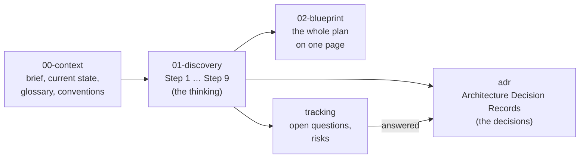

# MASTER-ERP

**A modular, configurable, multi-industry ERP / business operating platform.**

> One core platform → many industries → many organizations → many configurations.

## Current phase: DISCOVERY & ARCHITECTURE (no code yet)

This repository currently contains **only documentation**. We are designing the product,
the business architecture and the technical architecture *before* writing production code.

| If you want to…                                  | Read                                                                 |
| ------------------------------------------------ | -------------------------------------------------------------------- |
| See the whole architecture on one page            | [`docs/02-blueprint/BLUEPRINT.md`](docs/02-blueprint/BLUEPRINT.md)       |
| Understand the project in 5 minutes              | [`docs/00-context/PROJECT-BRIEF.md`](docs/00-context/PROJECT-BRIEF.md) |
| Explain the project to someone else              | [`docs/00-context/STORY-SO-FAR.md`](docs/00-context/STORY-SO-FAR.md)   |
| See every question and decision (sheet)          | [`docs/tracking/DECISION-LOG.csv`](docs/tracking/DECISION-LOG.csv)     |
| Know where we are right now and what's next      | [`docs/00-context/CURRENT-STATE.md`](docs/00-context/CURRENT-STATE.md) |
| Look up an ERP word you don't know               | [`docs/00-context/GLOSSARY.md`](docs/00-context/GLOSSARY.md)           |
| See every document in reading order              | [`docs/INDEX.md`](docs/INDEX.md)                                       |
| See decisions we have made (and why)             | [`docs/adr/README.md`](docs/adr/README.md)                             |
| See questions waiting for an answer              | [`docs/tracking/OPEN-QUESTIONS.md`](docs/tracking/OPEN-QUESTIONS.md)   |

## How the documentation is organised

Diagrams are written in **Mermaid** (text-based diagrams). GitHub renders them automatically,
so they stay versioned and editable alongside the text.
