# Current State — session hand-off

> **Read this first in every session.** · **Last updated:** 2026-10-03 (after Step 3)

## Phase

**Discovery & Architecture.** No code. Deliverables are documents, diagrams and ADRs.

## Progress

```mermaid
flowchart LR
    S1["1 Platform<br/>definition"]:::done --> S2["2 Domain<br/>model"]:::done --> S3["3 Module<br/>boundaries"]:::review --> S4["4 Process<br/>architecture"]:::todo --> S5["5 Configuration<br/>architecture"]:::todo
    S5 --> S6["6 Security"]:::todo --> S7["7 Events +<br/>workflow"]:::todo --> S8["8 Data<br/>architecture"]:::todo --> S9["9 Technical<br/>architecture"]:::todo --> S10["10 Master<br/>blueprint"]:::todo
    classDef done fill:#d9f2d9,stroke:#2e7d32
    classDef review fill:#fff3cd,stroke:#b8860b
    classDef todo fill:#eeeeee,stroke:#999999
```

| Step | Status | Document |
| --- | --- | --- |
| 1 Platform definition | **Accepted** | [STEP-01](../01-discovery/STEP-01-PLATFORM-DEFINITION.md) |
| 2 Domain model | **Accepted** | [STEP-02](../01-discovery/STEP-02-DOMAIN-MODEL.md) |
| Roadmap direction (brief §37) | **Accepted** (vertical slices) | [PRELIM-ROADMAP-CRITIQUE](../01-discovery/PRELIM-ROADMAP-CRITIQUE.md) |
| 3 Module boundaries | In review | [STEP-03](../01-discovery/STEP-03-MODULE-BOUNDARIES.md) |
| 4–10 | Not started | — |

Plain-language explanation for others: [STORY-SO-FAR](STORY-SO-FAR.md).
Coverage of the founder's brief: [COVERAGE-MATRIX](../tracking/COVERAGE-MATRIX.md) — 16 covered, 20 partial, 8 scheduled.

## Decided (Accepted)

1. Seven-layer product model; downward-only dependencies; packages = configuration + code extensions. *(ADR-0002)*
2. Modular monolith direction. *(ADR-0003, in principle)*
3. Organization: separate legal/physical/people/financial structures + grouping tree; Tenant = Organization; multi-company in the model. *(ADR-0004)*
4. Fixed core lifecycle + configurable sub-statuses and approvals. *(ADR-0005)*
5. Process = document flow with typed links + anchors (Job). *(ADR-0006)*
6. Immutable posted documents; masters referenced, contractual data snapshotted. *(ADR-0007, 0008)*
7. Printing & Packaging first, India first, pharma as design test; position on industry depth + fast go-live. *(ADR-0009)*
8. GST-correct invoicing + Tally export first; native GL later. *(ADR-0010)*
9. Year-1 configuration as version-controlled packages by the founder. *(ADR-0011)*
10. Vertical-slice roadmap: Foundation → Buy & store → Estimate & make → Ship & bill → Control. *(ADR-0012)*
11. One Party master with roles. *(ADR-0013)*

## Proposed in Step 3 (waiting for review)

- Modules drawn by ownership; Inventory is the only writer of stock; invoices in Sales/Purchase; Job in the Printing package; masters = shared core + module facets. *(ADR-0014)*
- Four communication patterns; contracts only, no cross-module table access. *(ADR-0015)*
- Hard/optional/commercial dependencies; without-modes; module manifests; activation never deletes data. *(ADR-0016)*
- Year 1 sells one edition, "Printing Essentials". *(ADR-0017)*

## Waiting on the founder

- Review of Step 3 and ADR-0014 … 0017.
- New questions: **Q-12** (Estimation inside Sales?), **Q-13** (job work in MVP?), **Q-14** (where receipts/payments are entered), **Q-15** (one edition in year 1?).
- **Action open (Q-10):** find at least one real printing/packaging company before Step 4. Q-09 (Job as anchor) also needs validating with them.

## Next step

**Step 4 — Process architecture:** map the end-to-end flows of the first vertical, mostly across documents and modules:

- Enquiry → Estimate → Quotation → Sales Order → Job → Production → Dispatch → Invoice → Receipt
- Requisition → PO → GRN → Inspection → Stock
- Job work out and back
- Returns, cancellations and corrections

Best done with input from a real printing company (Q-10).
