# Current State — session hand-off

> **Read this first in every session.** · **Last updated:** 2026-10-04 (after Step 10)

## Phase

**Discovery & Architecture — complete, waiting for founder review.** No code. Implementation starts **only when the founder explicitly says so** (CLAUDE.md).

## Progress

```mermaid
flowchart LR
    S1["1 Platform<br/>definition"]:::done --> S2["2 Domain<br/>model"]:::done --> S3["3 Module<br/>boundaries"]:::done --> S4["4 Process<br/>architecture"]:::done --> S5["5 Configuration<br/>architecture"]:::done
    S5 --> S6["6 Security"]:::done --> S7["7 Events +<br/>workflow"]:::done --> S8["8 Data<br/>architecture"]:::done --> S9["9 Technical<br/>architecture"]:::review --> S10["10 Master<br/>blueprint"]:::review
    S10 --> IMP["Implementation<br/>(Phase 1: spikes,<br/>Slice 0)"]:::todo
    classDef done fill:#d9f2d9,stroke:#2e7d32
    classDef review fill:#fff3cd,stroke:#b8860b
    classDef todo fill:#eeeeee,stroke:#999999
```

| Step | Status | Document |
| --- | --- | --- |
| 1–3 | **Accepted** | [STEP-01](../01-discovery/STEP-01-PLATFORM-DEFINITION.md) · [STEP-02](../01-discovery/STEP-02-DOMAIN-MODEL.md) · [STEP-03](../01-discovery/STEP-03-MODULE-BOUNDARIES.md) |
| 4 Process architecture | **Accepted as the standard-practice baseline** ([ADR-0061](../adr/ADR-0061-STANDARD-PRACTICE-BASELINE.md)); customised with the first customer | [STEP-04](../01-discovery/STEP-04-PROCESS-ARCHITECTURE.md) + 04A–04E |
| 5–8 | **Accepted** | [STEP-05](../01-discovery/STEP-05-CONFIGURATION-ARCHITECTURE.md) · [STEP-06](../01-discovery/STEP-06-SECURITY-ARCHITECTURE.md) · [STEP-07](../01-discovery/STEP-07-EVENTS-AND-AUTOMATION.md) · [STEP-08](../01-discovery/STEP-08-DATA-ARCHITECTURE.md) (+ A files) |
| 9 Technical architecture | In review | [STEP-09](../01-discovery/STEP-09-TECHNICAL-ARCHITECTURE.md) + [09A](../01-discovery/STEP-09A-INFRASTRUCTURE-DEVOPS-AND-COSTS.md) |
| 10 Master blueprint | In review | [BLUEPRINT](../02-blueprint/BLUEPRINT.md) + 5 documents in `docs/02-blueprint/` |

- **The sheet:** [DECISION-LOG.csv](../tracking/DECISION-LOG.csv) — 81 rows.
- **Standards:** [STANDARDS.md](STANDARDS.md).
- **Plain language:** [STORY-SO-FAR](STORY-SO-FAR.md).
- **Brief coverage:** [COVERAGE-MATRIX](../tracking/COVERAGE-MATRIX.md) — all 44 sections covered.
- **Deliberate shortcuts:** [TECH-DEBT-REGISTER](../tracking/TECH-DEBT-REGISTER.md) — TD-01 … TD-09.

## Decided (Accepted)

ADR-0001 … ADR-0052 and ADR-0061 accepted (ADR-0003 accepted in principle, final confirmation in Q-51). Summary:

- **Steps 1–2:** layers, organization, lifecycle/workflow, document flow, immutability, snapshots.
- **Founder decisions:** Printing/India, Tally-first, packages, vertical slices, Party roles.
- **Step 3:** modules, contracts, manifests, one edition.
- **Step 4:** product spec, WIP, tolerance, valuation, Tally export.
- **Step 5:** configuration layers, packages, extension fields, hybrid UI, CEL, numbering, upgrades, go-live.
- **Step 6:** security. **Step 7:** events, outbox, automation, approvals, notifications, integrations.
- **Step 8:** PostgreSQL, pool/silo tenancy, conventions, ledgers, reporting, search, lifecycle.
- **ADR-0061 (2026-10-04):** follow common standard industry procedures now; customise with the first customer (replaces the printer visit as a precondition, Q-10).

## Proposed (waiting for review)

| ADR | Decision | Question |
| --- | --- | --- |
| 0003 | Modular monolith — final confirmation | Q-51 |
| 0053 | TypeScript end to end on Node.js LTS; decimal rule | Q-52 |
| 0054 | NestJS edges; framework-free domain; pnpm monorepo; enforced boundaries | Q-53 |
| 0055 | Kysely + SQL migrations; tenant context per transaction; Graphile Worker | Q-54 |
| 0056 | React + Vite SPA/PWA; Tailwind + shadcn/ui; TanStack; i18next | Q-55 |
| 0057 | JSON Schema contracts; OpenAPI 3.1; CEL library after spike; LiquidJS; Chromium PDF | Q-56 |
| 0058 | Better Auth after spike; fallback composed libraries | Q-57 |
| 0059 | AWS Mumbai (Lightsail first) + Hyderabad backups; portable image; Cloudflare | Q-58 |
| 0060 | Environments, testing, CI/CD, observability | Q-59 |
| 0062 | REST API conventions, versioning, scopes, connector catalogue | Q-60 |
| 0063 | Tenant lifecycle (read-only suspension); manual billing first, e-mandates later | Q-61 |
| 0064 | AI as an opt-in, permission-scoped, drafts-only assistant from Phase 5 | Q-62 |
| 0065 | Roadmap: Phase 1 + Slices 0–4, slice-by-slice go-live, MVP scope | Q-63 |
| 0066 | Technical-debt policy (allowed / forbidden shortcuts, ~20% budget) | Q-64 |
| 0067 | UX architecture: archetypes, role dashboards, performance budgets | Q-65 |
| — | Founder time budget and target dates | Q-66 |

## Waiting on the founder

- Review Steps 9–10; answer **Q-51 … Q-66** (Q-66: hours per week and target dates).
- **Explicitly declare that the implementation phase has started.**
- Non-blocking recommendation (ADR-0061): an informal conversation with any printer before Slice 2 (estimating and production).

## Implementation readiness (from the [Blueprint](../02-blueprint/BLUEPRINT.md))

- [x] All 27 blueprint parts designed and linked
- [x] MVP scope, slices and exit criteria written
- [ ] Steps 9–10 accepted (Q-51 … Q-65)
- [ ] Time budget and dates agreed (Q-66)
- [ ] Founder declares implementation start

## Next step

**Phase 1** (after the founder's go-ahead): spikes S1–S5 (CEL library, Better Auth, RLS + Graphile Worker, decimal handling, PDF speed), then **Slice 0 — Foundation**. Each spike result is recorded in an ADR update and the decision log.
