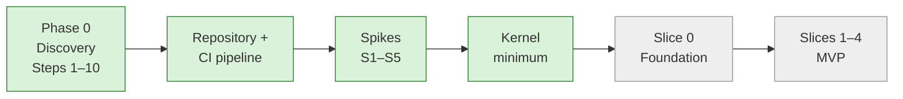

# Current State — session hand-off

> **Read this first in every session.** · **Last updated:** 2026-10-04 (kernel minimum built)

## Phase

**IMPLEMENTATION — Phase 1 (foundations and spikes): complete.** Spikes S1–S5 and the kernel minimum are built and tested. **Slice 0 starts when the founder says so.** Build only what the [roadmap](../02-blueprint/ROADMAP-AND-MVP.md) lists for the current phase or slice.

## Progress

| Item | Status | Where |
| --- | --- | --- |
| Steps 1–10 | **Accepted** | [BLUEPRINT](../02-blueprint/BLUEPRINT.md) |
| Repository + CI | ✅ pnpm monorepo, strict TypeScript, lint (decimal rule), boundary rules, Vitest, GitHub Actions (tests on PostgreSQL 16, gitleaks, dependency audit) | [Developer Guide](../03-implementation/DEVELOPER-GUIDE.md) |
| Spikes S1–S5 | ✅ All passed | [Spike results](../03-implementation/PHASE-1-SPIKE-RESULTS.md) |
| **Kernel minimum** | ✅ Tenancy, identity, authorization, audit, numbering, documents, events/jobs, rules, metadata, configuration, files, PDF, server | [Kernel Minimum](../03-implementation/KERNEL-MINIMUM.md) |
| Slice 0 | ⏳ Waiting for the founder's go-ahead | [Roadmap §4](../02-blueprint/ROADMAP-AND-MVP.md#4-phase-wise-feature-breakdown-slices-with-exit-criteria) |

**Test status (2026-10-04):**

- `pnpm check` is green: **211 tests** (kernel + server: 154).
- Lint, typecheck and boundaries pass; `pnpm audit` is clean.
- CI on GitHub is green (run 10).

**Code map:**

- `platform/kernel/src/*`: decimal, ids, db, tenancy, audit, documents, events, rules, authz, metadata, config, identity, files, pdf, testing.
- `platform/kernel/migrations/0001–0008`.
- `apps/server` provides the web, worker and migrate commands.

**Trackers:**

- The sheet: [DECISION-LOG.csv](../tracking/DECISION-LOG.csv), 94 rows.
- Shortcuts: [TECH-DEBT-REGISTER](../tracking/TECH-DEBT-REGISTER.md), TD-01 … TD-15.
- Story: [STORY-SO-FAR](STORY-SO-FAR.md).

## Decided

- **Accepted ADRs:** ADR-0001 … ADR-0068. ADR-0068 is the CEL library (`@marcbachmann/cel-js` with an exact decimal type).
- **Implementation decisions within accepted ADRs** (decision log KERNEL-01…05):
  - RLS for the app role plus a start-up guard
  - audit chain sealed by the worker
  - approval-limit semantics
  - 6-digit PIN with lockout
  - no public sign-up

## Proposed (waiting for the founder)

| ADR | Decision | Question |
| --- | --- | --- |
| [0069](../adr/ADR-0069-IDENTITY-AND-TENANT-MEMBERSHIP.md) | One login per person; membership per tenant; session bound to one tenant. **Already built this way.** Changing it later means reworking identity. | [Q-68](../tracking/OPEN-QUESTIONS.md#q-68) |
| — | Weekly hours and target dates (plan still in effort ranges) | [Q-66](../tracking/OPEN-QUESTIONS.md#q-66) |

## Next step: Slice 0 — Foundation (after the founder's go-ahead)

Per [Roadmap §4](../02-blueprint/ROADMAP-AND-MVP.md#4-phase-wise-feature-breakdown-slices-with-exit-criteria), plus the kernel items deliberately left for it ([Kernel Minimum §5](../03-implementation/KERNEL-MINIMUM.md#5-deliberately-not-built-yet-and-when)):

1. **Foundation layer** (`platform/foundation`): party (customer/vendor roles, GSTIN/PAN, addresses), item (+ printing attribute sets), UOM + conversions, currency, tax categories.
2. **Packages v0.1:** `packages-config/india` (GSTIN validation, HSN/UQC lists, GST rounding from spike S4, numbering locks) and `packages-config/printing-packaging`.
3. **Kernel additions:** approval workflow engine (K7), notification engine (K10, in-app + e-mail), list scope filtering, OpenAPI generation.
4. **Web app shell** (`apps/web`): React + Vite PWA, login (including tablet + PIN), role home page.
5. **Docker image** (Node + Chromium) and a **demo tenant** created from the packages.
6. Slice 0 exit criteria:
   - a demo tenant is created from the packages
   - masters are imported from Excel
   - MFA works for the owner
   - a store keeper on a registered tablet sees only their screens
   - cross-tenant and authorization tests are green

## How to run things

- `pnpm install && pnpm check`
- PostgreSQL tests need `DATABASE_URL` (`docker compose up -d`).
- PDF tests need `PLAYWRIGHT_BROWSERS_PATH`.
- For the server, see [Developer Guide §2](../03-implementation/DEVELOPER-GUIDE.md#2-getting-started).
