# Current State — session hand-off

> **Read this first in every session.** · **Last updated:** 2026-10-03 (after Step 5)

## Phase

**Discovery & Architecture.** No code. Deliverables are documents, diagrams, ADRs and the decision log sheet.

## Progress

```mermaid
flowchart LR
    S1["1 Platform<br/>definition"]:::done --> S2["2 Domain<br/>model"]:::done --> S3["3 Module<br/>boundaries"]:::done --> S4["4 Process<br/>architecture"]:::done --> S5["5 Configuration<br/>architecture"]:::review
    S5 --> S6["6 Security"]:::todo --> S7["7 Events +<br/>workflow"]:::todo --> S8["8 Data<br/>architecture"]:::todo --> S9["9 Technical<br/>architecture"]:::todo --> S10["10 Master<br/>blueprint"]:::todo
    classDef done fill:#d9f2d9,stroke:#2e7d32
    classDef review fill:#fff3cd,stroke:#b8860b
    classDef todo fill:#eeeeee,stroke:#999999
```

| Step | Status | Document |
| --- | --- | --- |
| 1 Platform definition | **Accepted** | [STEP-01](../01-discovery/STEP-01-PLATFORM-DEFINITION.md) |
| 2 Domain model | **Accepted** | [STEP-02](../01-discovery/STEP-02-DOMAIN-MODEL.md) |
| Roadmap direction | **Accepted** (vertical slices) | [PRELIM-ROADMAP-CRITIQUE](../01-discovery/PRELIM-ROADMAP-CRITIQUE.md) |
| 3 Module boundaries | **Accepted** | [STEP-03](../01-discovery/STEP-03-MODULE-BOUNDARIES.md) |
| 4 Process architecture | **Accepted, pending pilot validation** | [STEP-04](../01-discovery/STEP-04-PROCESS-ARCHITECTURE.md) + 04A–04E |
| 5 Configuration architecture | In review | [STEP-05](../01-discovery/STEP-05-CONFIGURATION-ARCHITECTURE.md) + [05A](../01-discovery/STEP-05A-PACKAGES-UPGRADES-AND-ONBOARDING.md) |
| 6–10 | Not started | — |

- **The sheet:** [DECISION-LOG.csv](../tracking/DECISION-LOG.csv) — every question and decision (42 rows).
- **Standards:** [STANDARDS.md](STANDARDS.md) — standards-first principle (ADR-0023).
- **Plain language:** [STORY-SO-FAR](STORY-SO-FAR.md).
- **Brief coverage:** [COVERAGE-MATRIX](../tracking/COVERAGE-MATRIX.md) — 23 covered, 14 partial, 7 scheduled.

## Decided (Accepted) — one line each

1. Seven-layer product model; packages = configuration + code extensions. *(ADR-0002)*
2. Modular monolith direction. *(ADR-0003, in principle)*
3. Organization model; Tenant = Organization; multi-company model. *(ADR-0004)*
4. Fixed core lifecycle + configurable sub-statuses and approvals. *(ADR-0005)*
5. Process = document flow + anchors (Job). *(ADR-0006)*
6. Immutable posted documents; snapshot vs reference. *(ADR-0007, 0008)*
7. Printing & Packaging, India first; pharma design test; pharma-packaging printers first if the pilot fits. *(ADR-0009, Q-21)*
8. GST invoicing + Tally export of ledger-level vouchers; receipts/payments entered in ERP. *(ADR-0010, 0022, Q-14)*
9. Configuration as version-controlled packages in year 1. *(ADR-0011)*
10. Vertical-slice roadmap. *(ADR-0012)*
11. One Party with roles. *(ADR-0013)*
12. Modules by ownership; four communication patterns; manifests; one edition in year 1; job work in MVP. *(ADR-0014 … 0017, Q-13)*
13. Customer product spec; WIP per job operation; tolerance and short-close; weighted-average valuation; stock ownership dimension; gate entry optional. *(ADR-0018 … 0021, Q-16, Q-20)*
14. **Standards-first.** *(ADR-0023)*

## Proposed in Step 5 (waiting for review)

| ADR | Decision | Question |
| --- | --- | --- |
| 0024 | Layered configuration (override/extend/lock); Git packages + audited runtime settings | Q-22 |
| 0025 | Package format: YAML + JSON Schema, manifest, SemVer, migrations, tests | Q-22 |
| 0026 | Extension fields as metadata-validated JSON data | Q-23 |
| 0027 | Hybrid UI + configurable terminology | Q-24 |
| 0028 | CEL + decision tables; no scripting in MVP | Q-25 |
| 0029 | Numbering series; statutory gapless at posting | Q-26 |
| 0030 | Pinned package versions; staging dry-run; three-way merge | Q-27 |
| 0031 | Go live with opening balances and open items | Q-28 |

## Waiting on the founder

- Review Step 5; answer **Q-22 … Q-28**.
- **Action open (Q-10):** visit a real printing company with the [Pilot Interview Guide](../tracking/PILOT-INTERVIEW-GUIDE.md). Validation pending for Q-09, Q-13, Q-18, Q-19, Q-21.

## Next step

**Step 6 — Security:**

- authentication (OIDC, MFA per NIST 800-63B)
- RBAC with org scopes, plus ABAC where needed
- record-level and field-level security
- approval authority and segregation of duties
- tenant isolation
- audit (statutory audit trail)
- data privacy (DPDP Act)
- secrets and encryption
- OWASP ASVS Level 2 as the requirements baseline
