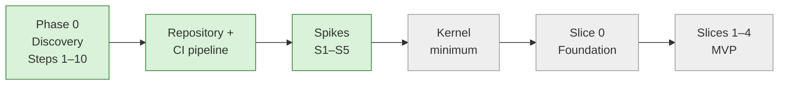

# Current State — session hand-off

> **Read this first in every session.** · **Last updated:** 2026-10-04 (Phase 1: repository + spikes done)

## Phase

**IMPLEMENTATION — Phase 1 (foundations and spikes)**, declared by the founder on 2026-10-04. Discovery Steps 1–10 are accepted. Build only what the [roadmap](../02-blueprint/ROADMAP-AND-MVP.md) lists for the current phase or slice.

## Progress

| Item | Status | Where |
| --- | --- | --- |
| Steps 1–10 | **Accepted** (Steps 9–10 on 2026-10-04) | [BLUEPRINT](../02-blueprint/BLUEPRINT.md) |
| Repository foundation | ✅ pnpm monorepo, strict TypeScript, ESLint (decimal rule), dependency-cruiser boundaries (verified), Vitest, GitHub Actions CI, docker-compose | [Developer Guide](../03-implementation/DEVELOPER-GUIDE.md) |
| Kernel: exact decimals | ✅ `platform/kernel/src/decimal` — production code | [Spike results §2](../03-implementation/PHASE-1-SPIKE-RESULTS.md#2-s4--exact-money-and-quantities-mandatory) |
| Spikes S1–S5 | ✅ All passed (CEL library choice open: Q-67) | [Spike results](../03-implementation/PHASE-1-SPIKE-RESULTS.md) |
| Kernel minimum | ⏳ Next | [Roadmap §2](../02-blueprint/ROADMAP-AND-MVP.md#2-phase-1--foundations-and-spikes) |

**Test status (2026-10-04):** `pnpm check` green — **101 tests** (unit, property-based, PostgreSQL 16 integration, Chromium PDF), 0 lint errors, 0 boundary violations, `pnpm audit` clean.

- **The sheet:** [DECISION-LOG.csv](../tracking/DECISION-LOG.csv) — 87 rows.
- **Plain language:** [STORY-SO-FAR](STORY-SO-FAR.md).
- **Deliberate shortcuts:** [TECH-DEBT-REGISTER](../tracking/TECH-DEBT-REGISTER.md) — TD-01 … TD-11.

## Decided (Accepted)

- ADR-0001 … ADR-0067 accepted (Steps 9–10 accepted 2026-10-04: ADR-0003, 0053–0060, 0062–0067).
- Spikes confirmed ADR-0053 (decimals), 0055 (RLS + jobs), 0057 (PDF), 0058 (Better Auth) and 0059 (hosting: worker needs ~1 GB). Implementation notes were added to each.

## Proposed (waiting for the founder)

| ADR | Decision | Question |
| --- | --- | --- |
| [0068](../adr/ADR-0068-CEL-LIBRARY.md) | CEL library: `@marcbachmann/cel-js` with an exact `decimal` type behind a `RuleEngine` port; fallback `@bufbuild/cel` | [Q-67](../tracking/OPEN-QUESTIONS.md#q-67) |
| — | Weekly hours and target dates (plan currently in effort ranges) | [Q-66](../tracking/OPEN-QUESTIONS.md#q-66) |

## Next step: kernel minimum (Phase 1, part 3)

In this order, each with tests and a short doc:

1. **Server app skeleton** (`apps/server`): NestJS on Fastify, web and worker start commands, health check, configuration from environment, structured logs.
2. **Tenancy:** tenant table, `withTenant` (from S3), unprivileged app role, RLS conventions, migration runner (SQL files, expand/contract), cross-tenant test suite.
3. **Identity:** Better Auth with the S2 plugins (device-PIN, step-up), wired to tenants and users.
4. **Authorization:** roles, scopes, field groups, CEL record conditions (after Q-67), authorization-matrix tests.
5. **Audit trail** (hash-chained), **numbering** (gapless statutory series), **document registry + links + lifecycle**.
6. **Events/outbox/jobs** (S3 pattern), **configuration loader** (packages + runtime settings), **files**, **PDF output** (S5 renderer).

## How to run things

- `pnpm install && pnpm check`
- PostgreSQL tests need `DATABASE_URL` (`docker compose up -d`).
- PDF tests need `PLAYWRIGHT_BROWSERS_PATH`.
