# Current State — session hand-off

> **Read this first in every session.** · **Last updated:** 2026-10-03 (after Step 4)

## Phase

**Discovery & Architecture.** No code. Deliverables are documents, diagrams and ADRs.

## Progress

```mermaid
flowchart LR
    S1["1 Platform<br/>definition"]:::done --> S2["2 Domain<br/>model"]:::done --> S3["3 Module<br/>boundaries"]:::done --> S4["4 Process<br/>architecture"]:::review --> S5["5 Configuration<br/>architecture"]:::todo
    S5 --> S6["6 Security"]:::todo --> S7["7 Events +<br/>workflow"]:::todo --> S8["8 Data<br/>architecture"]:::todo --> S9["9 Technical<br/>architecture"]:::todo --> S10["10 Master<br/>blueprint"]:::todo
    classDef done fill:#d9f2d9,stroke:#2e7d32
    classDef review fill:#fff3cd,stroke:#b8860b
    classDef todo fill:#eeeeee,stroke:#999999
```

| Step | Status | Document |
| --- | --- | --- |
| 1 Platform definition | **Accepted** | [STEP-01](../01-discovery/STEP-01-PLATFORM-DEFINITION.md) |
| 2 Domain model | **Accepted** | [STEP-02](../01-discovery/STEP-02-DOMAIN-MODEL.md) |
| Roadmap direction | **Accepted** (vertical slices) | [PRELIM-ROADMAP-CRITIQUE](../01-discovery/PRELIM-ROADMAP-CRITIQUE.md) |
| 3 Module boundaries | **Accepted** | [STEP-03](../01-discovery/STEP-03-MODULE-BOUNDARIES.md) |
| 4 Process architecture | In review — **hypothesis, not validated with a real company** | [STEP-04](../01-discovery/STEP-04-PROCESS-ARCHITECTURE.md) + [04A](../01-discovery/STEP-04A-ORDER-TO-CASH.md) [04B](../01-discovery/STEP-04B-PROCURE-TO-PAY.md) [04C](../01-discovery/STEP-04C-PLAN-TO-PRODUCE.md) [04D](../01-discovery/STEP-04D-INVENTORY-AND-QUALITY.md) [04E](../01-discovery/STEP-04E-RETURNS-CORRECTIONS-AND-ACCOUNTING.md) |
| 5–10 | Not started | — |

Plain-language explanation: [STORY-SO-FAR](STORY-SO-FAR.md) · Brief coverage: [COVERAGE-MATRIX](../tracking/COVERAGE-MATRIX.md) (17 covered, 19 partial, 8 scheduled).

## Decided (Accepted) — one line each

1. Seven-layer product model; packages = configuration + code extensions. *(ADR-0002)*
2. Modular monolith direction. *(ADR-0003, in principle)*
3. Organization: separate structures + grouping tree; Tenant = Organization; multi-company model. *(ADR-0004)*
4. Fixed core lifecycle + configurable sub-statuses and approvals. *(ADR-0005)*
5. Process = document flow + anchors (Job). *(ADR-0006)*
6. Immutable posted documents; snapshot vs reference. *(ADR-0007, 0008)*
7. Printing & Packaging, India first; pharma as design test. *(ADR-0009)*
8. GST invoicing + Tally export first. *(ADR-0010)*
9. Configuration as version-controlled packages in year 1. *(ADR-0011)*
10. Vertical-slice roadmap. *(ADR-0012)*
11. One Party with roles. *(ADR-0013)*
12. Modules by ownership: Inventory sole stock writer; invoices in Sales/Purchase; Job in Printing pkg; master facets; Estimation inside Sales. *(ADR-0014)*
13. Four communication patterns; contracts only. *(ADR-0015)*
14. Hard/optional/commercial dependencies; manifests; without-modes. *(ADR-0016)*
15. One edition "Printing Essentials" in year 1; job work in MVP; receipts/payments entered in ERP → Tally. *(ADR-0017, Q-13, Q-14)*

## Proposed in Step 4 (waiting for review)

- Customer product specification reused for repeat orders. *(ADR-0018)*
- WIP tracked per job operation. *(ADR-0019)*
- Tolerance and short-close in the core lifecycle. *(ADR-0020)*
- Moving weighted-average valuation. *(ADR-0021)*
- Voucher-level Tally export, export locks, books-locked date. *(ADR-0022)*

## Waiting on the founder

- Review Step 4 and ADR-0018 … 0022.
- Answer **Q-16** (customer-supplied material), **Q-17** (valuation), **Q-18** (Tally export level), **Q-19** (WIP), **Q-20** (gate entry), **Q-21** (pharma-packaging printers as first segment).
- **Action open (Q-10):** visit a real printing company using the [Pilot Interview Guide](../tracking/PILOT-INTERVIEW-GUIDE.md). Record findings in `docs/tracking/PILOT-FINDINGS-<company>.md`.

## Next step

**Step 5 — Configuration architecture.** How the Printing package, India pack and tenant settings are structured as version-controlled packages ([ADR-0011](../adr/ADR-0011-CONFIGURATION-AS-PACKAGES.md)):

- metadata and custom fields
- process definitions
- approval rules
- rate tables
- print templates
- numbering
- extension points
- package versioning and upgrades
- tenant onboarding ("select industry → structure → modules")

Step 5 can start before the pilot visit; Step 4 corrections can follow.
