# Current State — session hand-off

> **Read this first in every session.** · **Last updated:** 2026-10-04 (after Step 8)

## Phase

**Discovery & Architecture.** No code. Deliverables are documents, diagrams, ADRs and the decision log sheet.

## Progress

```mermaid
flowchart LR
    S1["1 Platform<br/>definition"]:::done --> S2["2 Domain<br/>model"]:::done --> S3["3 Module<br/>boundaries"]:::done --> S4["4 Process<br/>architecture"]:::done --> S5["5 Configuration<br/>architecture"]:::done
    S5 --> S6["6 Security"]:::done --> S7["7 Events +<br/>workflow"]:::done --> S8["8 Data<br/>architecture"]:::review --> S9["9 Technical<br/>architecture"]:::todo --> S10["10 Master<br/>blueprint"]:::todo
    classDef done fill:#d9f2d9,stroke:#2e7d32
    classDef review fill:#fff3cd,stroke:#b8860b
    classDef todo fill:#eeeeee,stroke:#999999
```

| Step | Status | Document |
| --- | --- | --- |
| 1–3 | **Accepted** | [STEP-01](../01-discovery/STEP-01-PLATFORM-DEFINITION.md) · [STEP-02](../01-discovery/STEP-02-DOMAIN-MODEL.md) · [STEP-03](../01-discovery/STEP-03-MODULE-BOUNDARIES.md) |
| 4 Process architecture | **Accepted, pending pilot validation** | [STEP-04](../01-discovery/STEP-04-PROCESS-ARCHITECTURE.md) + 04A–04E |
| 5 Configuration | **Accepted** | [STEP-05](../01-discovery/STEP-05-CONFIGURATION-ARCHITECTURE.md) + 05A |
| 6 Security | **Accepted** | [STEP-06](../01-discovery/STEP-06-SECURITY-ARCHITECTURE.md) + 06A |
| 7 Events and workflow | **Accepted** | [STEP-07](../01-discovery/STEP-07-EVENTS-AND-AUTOMATION.md) + 07A |
| 8 Data architecture | In review | [STEP-08](../01-discovery/STEP-08-DATA-ARCHITECTURE.md) + [08A](../01-discovery/STEP-08A-REPORTING-SEARCH-AND-DATA-LIFECYCLE.md) |
| 9–10 | Not started | — |

- **The sheet:** [DECISION-LOG.csv](../tracking/DECISION-LOG.csv) — 64 rows.
- **Standards:** [STANDARDS.md](STANDARDS.md).
- **Plain language:** [STORY-SO-FAR](STORY-SO-FAR.md).
- **Brief coverage:** [COVERAGE-MATRIX](../tracking/COVERAGE-MATRIX.md) — 34 covered, 7 partial, 3 scheduled.

## Decided (Accepted) — summary

ADR-0001 … ADR-0046 accepted. In short:

1. **Product:** layers, modular monolith, organization, lifecycle/workflow, document flow, immutability, snapshots.
2. **Market and approach:** Printing/India, Tally-first, configuration packages, vertical slices, Party roles.
3. **Modules:** ownership, contracts, manifests, one edition, job work.
4. **Processes:** product spec, WIP, tolerance, valuation, Tally export; standards-first.
5. **Configuration:** layers, packages, extension fields, hybrid UI, CEL, numbering, upgrades, go-live.
6. **Security:** authentication, authorization, SoD, isolation, audit, privacy, baseline, support access.
7. **Events:** event model, outbox, no event sourcing, automation, approval engine, notifications, integration jobs.

Paid managed database starts when the first customer enters real data.

## Proposed in Step 8 (waiting for review)

| ADR | Decision | Question |
| --- | --- | --- |
| 0047 | PostgreSQL as the single system of record | Q-45 |
| 0048 | Pool by default; silo/on-premise option with same schema; tenant directory; per-tenant restore | Q-46 |
| 0049 | Module schemas, downward-only FKs, UUIDv7, exact decimals, UTC, version, ext JSONB, document registry + typed tables | Q-47 |
| 0050 | Append-only ledgers (status + owner), derived balances, negative stock off, moving average without retro-recalc, locking | Q-48 |
| 0051 | Report datasets, read models, permission-filtered PostgreSQL search | Q-49 |
| 0052 | Retention, archiving, tenant exit, stored statutory PDFs, master-data quality, migrations, staged imports | Q-50 |

## Waiting on the founder

- Review Step 8; answer **Q-45 … Q-50**.
- **Action open (Q-10):** visit a real printing company with the [Pilot Interview Guide](../tracking/PILOT-INTERVIEW-GUIDE.md).

## Next step

**Step 9 — Technical architecture.** Choose the concrete stack against all decisions so far:

- language and framework (frontend and backend)
- how module boundaries are enforced in code
- PostgreSQL hosting in India (managed, with point-in-time recovery)
- job-queue and outbox library
- CEL library
- authentication library
- PDF and template engine
- object storage
- email provider
- observability (OpenTelemetry)
- CI/CD and testing strategy
- environments
- deployment (C4 diagrams)
- cost per stage (₹0 → pilot → growth)
