# Current State — session hand-off

> **Read this first in every session.** · **Last updated:** 2026-10-03

## Phase

**Discovery & Architecture.** No code. Deliverables are documents, diagrams and ADRs.

## Progress

```mermaid
flowchart LR
    S1["1 Platform<br/>definition"]:::review --> S2["2 Domain<br/>model"]:::review --> S3["3 Module<br/>boundaries"]:::todo --> S4["4 Process<br/>architecture"]:::todo --> S5["5 Configuration<br/>architecture"]:::todo
    S5 --> S6["6 Security"]:::todo --> S7["7 Events +<br/>workflow"]:::todo --> S8["8 Data<br/>architecture"]:::todo --> S9["9 Technical<br/>architecture"]:::todo --> S10["10 Master<br/>blueprint"]:::todo
    classDef done fill:#d9f2d9,stroke:#2e7d32
    classDef review fill:#fff3cd,stroke:#b8860b
    classDef todo fill:#eeeeee,stroke:#999999
```

| Step | Status | Document |
| --- | --- | --- |
| 1 Platform definition | In review | [STEP-01](../01-discovery/STEP-01-PLATFORM-DEFINITION.md) |
| 2 Domain model | In review | [STEP-02](../01-discovery/STEP-02-DOMAIN-MODEL.md) |
| 3–10 | Not started | — |

## Key conclusions so far (one line each)

1. Seven-layer product model: Kernel → Business Foundation → Modules → Localization → Industry → Tenant Config → Tenant Customization, + Integrations axis. *(ADR-0002, proposed)*
2. Industry packages = configuration **+ code extensions** through extension points; pure configuration is not enough.
3. Document framework is the heart of the kernel (numbering, lifecycle, links, cancel/amend, print).
4. Organization = separate legal/physical/people/financial structures + configurable grouping tree. *(ADR-0004, proposed)*
5. Process = document flow with typed links (created-from, fulfils, settles, references) + optional anchor (Job/Batch/Project). *(ADR-0006, proposed)*
6. Core lifecycle fixed; sub-statuses and approval workflows configurable. *(ADR-0005, proposed)*
7. Posted documents and ledger entries are immutable; masters referenced, contractual data snapshotted. *(ADR-0007/0008, proposed)*
8. Modular monolith direction. *(ADR-0003, accepted in principle)*

## Waiting on the founder

Answers to [OPEN-QUESTIONS](../tracking/OPEN-QUESTIONS.md), especially **Q-02** (first vertical / pharma),
**Q-03** (Finance vs Tally), **Q-04** (who configures), **Q-05** (market), **Q-10** (real pilot company).
Review of Steps 1–2 and the Proposed ADRs.

## Next step

**Step 3 — Module boundaries:** core vs optional vs dependent modules, shared services, industry
extensions; technical vs business dependency vs optional integration; sellable editions/bundles;
what happens to Sales when Inventory or Finance is not active.
Answers to Q-02/Q-03 affect Step 3 but do not block starting it.
