# Current State — session hand-off

> **Read this first in every session.** · **Last updated:** 2026-10-04 (after Step 7)

## Phase

**Discovery & Architecture.** No code. Deliverables are documents, diagrams, ADRs and the decision log sheet.

## Progress

```mermaid
flowchart LR
    S1["1 Platform<br/>definition"]:::done --> S2["2 Domain<br/>model"]:::done --> S3["3 Module<br/>boundaries"]:::done --> S4["4 Process<br/>architecture"]:::done --> S5["5 Configuration<br/>architecture"]:::done
    S5 --> S6["6 Security"]:::done --> S7["7 Events +<br/>workflow"]:::review --> S8["8 Data<br/>architecture"]:::todo --> S9["9 Technical<br/>architecture"]:::todo --> S10["10 Master<br/>blueprint"]:::todo
    classDef done fill:#d9f2d9,stroke:#2e7d32
    classDef review fill:#fff3cd,stroke:#b8860b
    classDef todo fill:#eeeeee,stroke:#999999
```

| Step | Status | Document |
| --- | --- | --- |
| 1 Platform definition | **Accepted** | [STEP-01](../01-discovery/STEP-01-PLATFORM-DEFINITION.md) |
| 2 Domain model | **Accepted** | [STEP-02](../01-discovery/STEP-02-DOMAIN-MODEL.md) |
| Roadmap direction | **Accepted** (vertical slices) | [PRELIM-ROADMAP-CRITIQUE](../01-discovery/PRELIM-ROADMAP-CRITIQUE.md) |
| 3 Module boundaries | **Accepted** | [STEP-03](../01-discovery/STEP-03-MODULE-BOUNDARIES.md) |
| 4 Process architecture | **Accepted, pending pilot validation** | [STEP-04](../01-discovery/STEP-04-PROCESS-ARCHITECTURE.md) + 04A–04E |
| 5 Configuration architecture | **Accepted** | [STEP-05](../01-discovery/STEP-05-CONFIGURATION-ARCHITECTURE.md) + 05A |
| 6 Security | **Accepted** | [STEP-06](../01-discovery/STEP-06-SECURITY-ARCHITECTURE.md) + 06A |
| 7 Events and workflow | In review | [STEP-07](../01-discovery/STEP-07-EVENTS-AND-AUTOMATION.md) + [07A](../01-discovery/STEP-07A-WORKFLOW-AND-NOTIFICATIONS.md) |
| 8–10 | Not started | — |

- **The sheet:** [DECISION-LOG.csv](../tracking/DECISION-LOG.csv) — 58 rows.
- **Standards:** [STANDARDS.md](STANDARDS.md).
- **Plain language:** [STORY-SO-FAR](STORY-SO-FAR.md).
- **Brief coverage:** [COVERAGE-MATRIX](../tracking/COVERAGE-MATRIX.md) — 29 covered, 11 partial, 4 scheduled.

## Decided (Accepted) — one line each

1. Product model, modular monolith, organization model, lifecycle + workflow split, document flow, immutability, snapshot rule. *(ADR-0002 … 0008)*
2. Printing & Packaging, India first; Tally-first accounting; configuration packages; vertical slices; Party with roles. *(ADR-0009 … 0013)*
3. Module ownership, contracts, manifests, one edition, job work in MVP. *(ADR-0014 … 0017)*
4. Product spec, WIP per job operation, tolerance/short-close, weighted average, ledger-level Tally export. *(ADR-0018 … 0022)*
5. Standards-first. *(ADR-0023)*
6. Configuration layers and stores, package format, extension fields, hybrid UI, CEL + decision tables, numbering, upgrades, go-live data. *(ADR-0024 … 0031)*
7. Security: authentication, authorization, authority + SoD, tenant isolation, audit, privacy, security baseline, support access. *(ADR-0032 … 0039)*
8. Paid managed database starts when the first customer enters real data. *(ADR-0038 note)*

## Proposed in Step 7 (waiting for review)

| ADR | Decision | Question |
| --- | --- | --- |
| 0040 | Event model: domain vs integration events; CloudEvents; trace/causation ids | Q-38 |
| 0041 | Transactional outbox + Postgres job queue; idempotent consumers; no broker until triggers | Q-39 |
| 0042 | No event sourcing | Q-40 |
| 0043 | Automation rules: trigger + CEL + fixed actions; loop protection | Q-41 |
| 0044 | Own small approval engine; SLA, escalation, delegation; fallback approver; re-approval on change | Q-42 |
| 0045 | Notification engine; MVP in-app + email; WhatsApp/SMS later (Meta templates, TRAI DLT) | Q-43 |
| 0046 | Integration jobs, circuit breaker, Standard Webhooks | Q-44 |

## Waiting on the founder

- Review Step 7; answer **Q-38 … Q-44**.
- **Action open (Q-10):** visit a real printing company with the [Pilot Interview Guide](../tracking/PILOT-INTERVIEW-GUIDE.md).

## Next step

**Step 8 — Data architecture:**

- multi-tenancy layout (shared database with RLS vs schema vs database per tenant)
- core entities and relationships
- document/line/link tables
- stock ledger and voucher tables (including ownership dimension, reels, batches)
- extension fields (JSONB)
- audit trail storage and partitioning
- outbox and job tables
- concurrency (optimistic locking, counters)
- weighted-average recalculation rules
- archiving and retention
- reporting read models
- search (Postgres full-text first)
- migrations
