# Current State — session hand-off

> **Read this first in every session.** · **Last updated:** 2026-10-03 (after Step 6)

## Phase

**Discovery & Architecture.** No code. Deliverables are documents, diagrams, ADRs and the decision log sheet.

## Progress

```mermaid
flowchart LR
    S1["1 Platform<br/>definition"]:::done --> S2["2 Domain<br/>model"]:::done --> S3["3 Module<br/>boundaries"]:::done --> S4["4 Process<br/>architecture"]:::done --> S5["5 Configuration<br/>architecture"]:::done
    S5 --> S6["6 Security"]:::review --> S7["7 Events +<br/>workflow"]:::todo --> S8["8 Data<br/>architecture"]:::todo --> S9["9 Technical<br/>architecture"]:::todo --> S10["10 Master<br/>blueprint"]:::todo
    classDef done fill:#d9f2d9,stroke:#2e7d32
    classDef review fill:#fff3cd,stroke:#b8860b
    classDef todo fill:#eeeeee,stroke:#999999
```

| Step | Status | Document |
| --- | --- | --- |
| 1 Platform definition | **Accepted** | [STEP-01](../01-discovery/STEP-01-PLATFORM-DEFINITION.md) |
| 2 Domain model | **Accepted** | [STEP-02](../01-discovery/STEP-02-DOMAIN-MODEL.md) |
| Roadmap direction | **Accepted** (vertical slices) | [PRELIM-ROADMAP-CRITIQUE](../01-discovery/PRELIM-ROADMAP-CRITIQUE.md) |
| 3 Module boundaries | **Accepted** | [STEP-03](../01-discovery/STEP-03-MODULE-BOUNDARIES.md) |
| 4 Process architecture | **Accepted, pending pilot validation** | [STEP-04](../01-discovery/STEP-04-PROCESS-ARCHITECTURE.md) + 04A–04E |
| 5 Configuration architecture | **Accepted** | [STEP-05](../01-discovery/STEP-05-CONFIGURATION-ARCHITECTURE.md) + [05A](../01-discovery/STEP-05A-PACKAGES-UPGRADES-AND-ONBOARDING.md) |
| 6 Security | In review | [STEP-06](../01-discovery/STEP-06-SECURITY-ARCHITECTURE.md) + [06A](../01-discovery/STEP-06A-ISOLATION-AUDIT-PRIVACY-AND-OPERATIONS.md) |
| 7–10 | Not started | — |

- **The sheet:** [DECISION-LOG.csv](../tracking/DECISION-LOG.csv) — 51 rows, every question and decision.
- **Standards:** [STANDARDS.md](STANDARDS.md).
- **Plain language:** [STORY-SO-FAR](STORY-SO-FAR.md).
- **Brief coverage:** [COVERAGE-MATRIX](../tracking/COVERAGE-MATRIX.md) — 26 covered, 14 partial, 4 scheduled.

## Decided (Accepted) — one line each

1. Seven-layer product model; packages = configuration + code extensions. *(ADR-0002)*
2. Modular monolith direction. *(ADR-0003, in principle)*
3. Organization model; Tenant = Organization; multi-company model. *(ADR-0004)*
4. Fixed core lifecycle + configurable sub-statuses and approvals. *(ADR-0005)*
5. Process = document flow + anchors (Job). *(ADR-0006)*
6. Immutable posted documents; snapshot vs reference. *(ADR-0007, 0008)*
7. Printing & Packaging, India first; pharma-packaging printers first if the pilot fits. *(ADR-0009, Q-21)*
8. GST invoicing + ledger-level Tally export; receipts/payments entered in ERP. *(ADR-0010, 0022)*
9. Configuration as version-controlled packages; vertical-slice roadmap; one Party with roles. *(ADR-0011 … 0013)*
10. Modules by ownership; contracts; manifests; one edition in year 1; job work in MVP. *(ADR-0014 … 0017)*
11. Product spec; WIP per job operation; tolerance/short-close; weighted average; stock ownership; gate entry optional. *(ADR-0018 … 0021)*
12. Standards-first. *(ADR-0023)*
13. Configuration layers + two stores; YAML/JSON Schema packages; JSON extension fields; hybrid UI; CEL + decision tables; gapless statutory numbering; package upgrades via staging; go-live with opening balances. *(ADR-0024 … 0031)*

## Proposed in Step 6 (waiting for review)

| ADR | Decision | Question |
| --- | --- | --- |
| 0032 | Authentication: library, OIDC-compatible, NIST passwords, MFA for privileged roles, step-up, API keys | Q-29 |
| 0032 | Shop-floor: registered device + personal PIN | Q-30 |
| 0033 | Authorization: scoped RBAC + CEL conditions + field security; 8 checks; deny by default | Q-31 |
| 0034 | Approval authority, delegation, SoD modes | Q-32 |
| 0035 | Tenant isolation: context + Row-Level Security + tests | Q-33 |
| 0036 | Audit trail (cannot disable, hash-chained, ≥ 8 y) + security log (≥ 180 d in India) | Q-34 |
| 0037 | DPDP roles, classification, no Aadhaar, India hosting, encryption, secrets | Q-35 |
| 0039 | No standing operator access; approved support sessions | Q-36 |
| 0038 | OWASP ASVS L2; 3-2-1 backups; RPO ≤ 15 min, RTO ≤ 4 h; CERT-In 6 h | Q-37 |

## Waiting on the founder

- Review Step 6; answer **Q-29 … Q-37**.
- **Action open (Q-10):** visit a real printing company with the [Pilot Interview Guide](../tracking/PILOT-INTERVIEW-GUIDE.md). Validation pending for Q-09, Q-13, Q-18, Q-19, Q-21.

## Next step

**Step 7 — Event and workflow architecture:**

- domain events vs integration events
- outbox and reliable delivery
- in-transaction vs after-commit handlers
- idempotency and retries
- the approval workflow engine: sequential and parallel steps, escalation, timeouts, SLAs, delegation, resubmission
- the notification engine: channels, templates, retries, WhatsApp template approval
- automation rules and scheduled jobs
- webhooks (CloudEvents, Standard Webhooks)
- GST portal retry queue
- where event sourcing does and doesn't make sense
