# Current State — session hand-off

> **Read this first in every session.** · **Last updated:** 2026-10-04 (after Step 9)

## Phase

**Discovery & Architecture.** No code. Deliverables are documents, diagrams, ADRs and the decision log sheet.

## Progress

```mermaid
flowchart LR
    S1["1 Platform<br/>definition"]:::done --> S2["2 Domain<br/>model"]:::done --> S3["3 Module<br/>boundaries"]:::done --> S4["4 Process<br/>architecture"]:::done --> S5["5 Configuration<br/>architecture"]:::done
    S5 --> S6["6 Security"]:::done --> S7["7 Events +<br/>workflow"]:::done --> S8["8 Data<br/>architecture"]:::done --> S9["9 Technical<br/>architecture"]:::review --> S10["10 Master<br/>blueprint"]:::todo
    classDef done fill:#d9f2d9,stroke:#2e7d32
    classDef review fill:#fff3cd,stroke:#b8860b
    classDef todo fill:#eeeeee,stroke:#999999
```

| Step | Status | Document |
| --- | --- | --- |
| 1–3 | **Accepted** | [STEP-01](../01-discovery/STEP-01-PLATFORM-DEFINITION.md) · [STEP-02](../01-discovery/STEP-02-DOMAIN-MODEL.md) · [STEP-03](../01-discovery/STEP-03-MODULE-BOUNDARIES.md) |
| 4 Process architecture | **Accepted, pending pilot validation** | [STEP-04](../01-discovery/STEP-04-PROCESS-ARCHITECTURE.md) + 04A–04E |
| 5–8 | **Accepted** | [STEP-05](../01-discovery/STEP-05-CONFIGURATION-ARCHITECTURE.md) · [STEP-06](../01-discovery/STEP-06-SECURITY-ARCHITECTURE.md) · [STEP-07](../01-discovery/STEP-07-EVENTS-AND-AUTOMATION.md) · [STEP-08](../01-discovery/STEP-08-DATA-ARCHITECTURE.md) (+ A files) |
| 9 Technical architecture | In review | [STEP-09](../01-discovery/STEP-09-TECHNICAL-ARCHITECTURE.md) + [09A](../01-discovery/STEP-09A-INFRASTRUCTURE-DEVOPS-AND-COSTS.md) |
| 10 Master blueprint | Not started | — |

- **The sheet:** [DECISION-LOG.csv](../tracking/DECISION-LOG.csv) — 73 rows.
- **Standards:** [STANDARDS.md](STANDARDS.md).
- **Plain language:** [STORY-SO-FAR](STORY-SO-FAR.md).
- **Brief coverage:** [COVERAGE-MATRIX](../tracking/COVERAGE-MATRIX.md) — 37 covered, 6 partial, 1 scheduled (AI layer → blueprint).

## Decided (Accepted)

ADR-0001 … ADR-0052 accepted (ADR-0003 accepted in principle, final confirmation in Q-51). Summary by step:

- **Steps 1–2:** layers, organization, lifecycle/workflow, document flow, immutability, snapshots.
- **Founder decisions:** Printing/India, Tally-first, packages, vertical slices, Party roles.
- **Step 3:** modules, contracts, manifests, one edition.
- **Step 4:** product spec, WIP, tolerance, valuation, Tally export.
- **Step 5:** configuration layers, packages, extension fields, hybrid UI, CEL, numbering, upgrades, go-live.
- **Step 6:** security.
- **Step 7:** events, outbox, automation, approvals, notifications, integrations.
- **Step 8:** PostgreSQL, pool/silo tenancy, conventions, ledgers, reporting, search, lifecycle.

## Proposed in Step 9 (waiting for review)

| ADR | Decision | Question |
| --- | --- | --- |
| 0003 | Modular monolith — final confirmation | Q-51 |
| 0053 | TypeScript end to end on Node.js LTS; decimal rule | Q-52 |
| 0054 | NestJS edges; framework-free domain; pnpm monorepo; enforced boundaries | Q-53 |
| 0055 | Kysely + SQL migrations; tenant context per transaction; Graphile Worker | Q-54 |
| 0056 | React + Vite SPA/PWA; Tailwind + shadcn/ui; TanStack; i18next | Q-55 |
| 0057 | JSON Schema contracts; OpenAPI 3.1; CEL library after spike; LiquidJS; Chromium PDF | Q-56 |
| 0058 | Better Auth after spike; fallback composed libraries | Q-57 |
| 0059 | AWS Mumbai (Lightsail first) + Hyderabad backups; portable image; Cloudflare | Q-58 |
| 0060 | Environments, testing, CI/CD, observability | Q-59 |

## Waiting on the founder

- Review Step 9; answer **Q-51 … Q-59**.
- **Action open (Q-10):** visit a real printing company with the [Pilot Interview Guide](../tracking/PILOT-INTERVIEW-GUIDE.md).

## Next step

**Step 10 — Master blueprint:**

- the 27 parts listed in brief §43 Step 10, consolidated as a navigable blueprint that links to the steps and ADRs
- final roadmap and **MVP definition** (vertical slices with feature lists and exit criteria)
- spikes S1–S5
- API architecture and AI architecture (the remaining gaps)
- billing/SaaS architecture
- major risks and the technical-debt strategy

After Step 10: run the spikes, then start slice 0 (implementation phase, when the founder says so).
