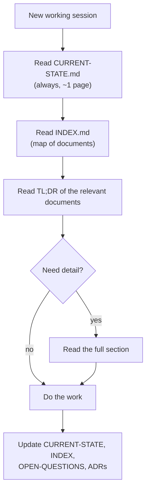

# Documentation Conventions

> **Status:** Accepted · **Last updated:** 2026-10-03

## TL;DR

Markdown + Mermaid, one topic per file, a TL;DR at the top of every file, decisions as ADRs,
unanswered questions in one tracking file, and `CURRENT-STATE.md` updated at the end of every
session. The goal is that any person (or AI session) can pick up the project by reading two
short files instead of everything.

## 1. Why so much structure?

Two reasons:

1. **The founder will explain this product to others** — customers, investors, future developers.
   Each concept needs a definition, an example and a picture.
2. **AI assistants have limited working memory ("context").** If each session must re-read
   everything, it gets slower and more expensive and starts forgetting. Small, focused files
   with summaries let a session load only what it needs.



## 2. Folder layout

| Folder              | Contains                                                         |
| ------------------- | ---------------------------------------------------------------- |
| `docs/00-context/`  | Brief, current state, glossary, these conventions                |
| `docs/01-discovery/`| One file per discovery step (the analysis)                        |
| `docs/adr/`         | Architecture Decision Records (the decisions)                    |
| `docs/tracking/`    | Open questions, risk register, decision log, tech-debt register  |
| `docs/02-blueprint/` | The master blueprint (27 parts), roadmap, MVP                   |
| `docs/03-implementation/` | Implementation phase: spike results, developer guide, slice notes |

## 3. Standard document shape

```text
# Title
> Status: Draft | In review | Accepted · Last updated: YYYY-MM-DD

## TL;DR            ← 3–8 bullets. Someone who reads only this should get the point.
## 1. …             ← numbered sections
## Open questions raised   ← links to OPEN-QUESTIONS.md entries
## Related documents
```

## 4. Statuses

| Status       | Meaning                                                         |
| ------------ | --------------------------------------------------------------- |
| Draft        | Being written; may be incomplete                                |
| In review    | Complete; waiting for the founder's comments                    |
| Accepted     | The founder agreed; changes now need a new ADR or a revision note |
| Superseded   | Replaced by a newer document/ADR (link to it)                  |

## 5. Diagrams

- Use **Mermaid** code blocks (` ```mermaid `). GitHub renders them. Types we use:
  `flowchart` (structures, flows), `stateDiagram-v2` (lifecycles), `sequenceDiagram`
  (interactions over time), `erDiagram` / `classDiagram` (concepts and relationships).
- Put labels containing symbols (`/`, `(`, `&`, `₹`, `>`) in double quotes.
- Use `<br/>` for line breaks inside a node.
- Prefer several small diagrams over one giant one.

## 6. Examples

When explaining a concept, use the two reference industries:
**Printing/Packaging** and **Pharma**. Indian context (GST, ₹, lakh/crore) is the default
unless stated otherwise.

## 7. Architecture Decision Records (ADRs)

An ADR is a one-page record of one important decision: the context, the options considered,
the choice, and its consequences. Template and index: [`docs/adr/README.md`](../adr/README.md).
ADRs are never deleted; a changed decision gets a new ADR that *supersedes* the old one.
