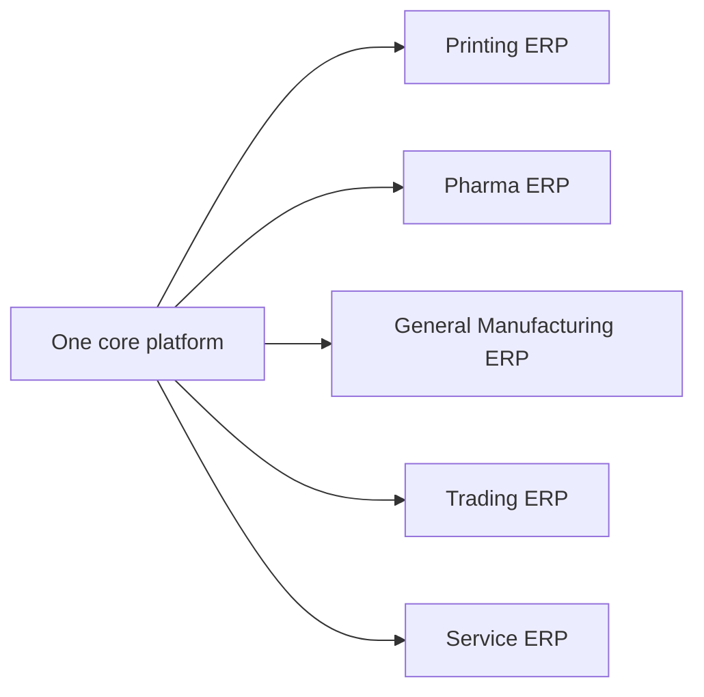
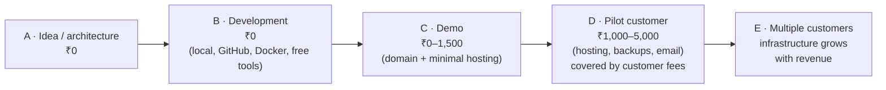

# Project Brief — the vision in one place

> **Status:** Living document · **Last updated:** 2026-10-03
> **Source:** the founder's original discovery brief (44 sections) plus the "solo developer, near-zero cost" guidance. This file is the condensed, authoritative summary so that future sessions do not need the original long text.

## TL;DR

- We are designing a **modular, configurable ERP platform** that can be configured into a *Printing ERP*, a *Pharma ERP*, a *Trading ERP*, etc. **without separate codebases**.
- Formula: **CORE PLATFORM + CONFIGURATION + MODULES + INDUSTRY PACKAGES + INTEGRATIONS.**
- Long-term ambition: a cheaper, more flexible, easier-to-implement alternative to Odoo-class products.
- Reality constraint: **one solo developer, near-zero budget.** Build for 100 customers, deploy for 1.
- Strategy: **platform core + ONE industry vertical end-to-end**, get a paying pilot customer, let revenue fund the next stage.
- Current phase: **discovery and architecture. No code.** Every major decision is recorded as an ADR.

---

## 1. Vision

"Build your company's operating system." A company signs up, picks
**Industry → Company structure → Modules → Processes → Roles → Workflows → Integrations**,
and the platform configures itself into the right environment.

It must support (eventually): multiple industries, organizations, companies, business units,
plants, warehouses, branches, departments, users, roles, workflows, currencies, tax structures,
regulatory environments and business processes.

## 2. Reference industries

| Printing / Packaging / Cutting                                  | Pharmaceutical manufacturing                                       |
| --------------------------------------------------------------- | ------------------------------------------------------------------ |
| Paper/board, GSM, reel & sheet sizes, ink, plates               | APIs (active ingredients), excipients, packaging materials         |
| Printing, cutting, folding, lamination processes                | Batch manufacturing, expiry, stability studies                     |
| Job cards, BOM, routing, WIP, production costing                | QC, QA, sampling, CAPA, traceability, regulatory compliance        |
| Quality, finished goods, dispatch                               | Warehousing, quarantine/release                                    |

Both share: Sales, Purchase, Inventory, Production, Quality, Finance.

## 3. Requested capabilities (condensed from the original 44 sections)

| Area                         | What the founder asked for                                                                                                         |
| ---------------------------- | ---------------------------------------------------------------------------------------------------------------------------------- |
| Modules                      | CRM, Sales, Purchase, Inventory, Manufacturing, Quality, Finance, HR, Projects, Service, Assets, Maintenance, Documents, BI, Admin |
| Commercial model             | Buy single modules, bundles, or the complete ERP                                                                                   |
| Module architecture          | Independent activation, licensing, dependencies, permissions, navigation; distinguish technical vs business dependency vs optional integration |
| Process objects              | Model Lead→Opportunity→Quotation→SO→Delivery→Invoice→Payment and PR→RFQ→Quote→PO→ASN→Inbound→QC→GRN→Invoice→Payment as structured objects + events, not linked screens |
| Workflow engine              | Configurable approvals: levels, hierarchy, conditions, parallel/sequential, delegation, escalation, timeouts, SLA                    |
| Rules engine                 | Configurable IF/THEN business rules without a developer                                                                             |
| Notification engine          | Event-driven; in-app, email, WhatsApp, SMS, push, webhooks, Teams, Slack; configurable recipients, templates, timing, escalation    |
| Event architecture           | Domain events, outbox, queues, webhooks — evaluate; **do not assume event sourcing everywhere**                                    |
| RBAC                         | Custom roles; module / object / action / field / record / org-level / approval-value permissions                                   |
| Organization structure       | Separate legal, operational, security and reporting structures; configurable per customer                                          |
| Multi-tenancy                | SaaS-ready; evaluate shared DB vs schema vs DB per tenant vs hybrid                                                                |
| Industry configuration       | Metadata-driven UI, configurable forms, custom fields/objects/statuses/workflows, template inheritance, configuration packages      |
| Custom objects               | Admin-defined objects with fields, relations, validation, permissions, workflow, forms, reports, events                             |
| Integrations & API           | Banks, payment gateways, email, WhatsApp, M365, Google, e-commerce, shipping, tax/government APIs, machines/IoT, other ERPs         |
| UI/UX                        | Modern, fast, information-dense, role-aware navigation                                                                             |
| Documents                    | Common document framework; configurable templates, logos, numbering, PDF layouts                                                   |
| Audit                        | Who/what/when/old value/new value/which workflow or system; immutable for important transactions                                   |
| Search, Reporting            | Global search across related objects; standard + custom reports, dashboards, scheduled reports                                     |
| AI                           | **Not the foundation.** Deterministic core; AI later for NL search, OCR, forecasting, assistants                                   |
| Config vs customization      | Clear tiers: configuration → customization → extension → core modification (minimise the last)                                   |
| Billing / SaaS               | Trials, per-user, per-module, bundles, usage, enterprise; licensing, feature flags, suspension                                     |
| Deployment                   | SaaS, private cloud, on-premise, hybrid — don't prevent any of them                                                                |
| Consistency & ledgers        | ACID where money and stock move; proper stock and financial ledgers; know what is source of truth vs derived                        |
| Master data                  | Ownership, versioning, approval, duplicate detection, lifecycle, org-specific data                                                 |
| Numbering                    | Configurable per company / branch / plant / financial year / document type                                                         |
| Localization                 | Modular — India (GST, TDS, e-invoice, e-way bill) is one pack, not hard-coded core                                                 |
| Security                     | AuthN, AuthZ, MFA, encryption, secrets, rate limiting, tenant isolation, backup/DR, OWASP                                          |

## 4. Constraints (these override ambition)

| Constraint                     | Consequence                                                                                       |
| ------------------------------ | ------------------------------------------------------------------------------------------------- |
| Solo developer                 | Modular monolith, one language end-to-end, few moving parts, no microservices/Kafka/Kubernetes    |
| Near-zero budget               | Develop locally; free/cheap tiers; infrastructure grows only with revenue                         |
| No validated customer yet      | One vertical end-to-end before breadth; first customer partially funds the next version           |
| Founder is learning ERP/arch   | Documentation must teach, not just record; diagrams everywhere                                    |

Guiding principles:

1. **Build for 100 customers, deploy for 1.**
2. **Simple enough to build, strong enough to scale.**
3. **Configuration-first:** don't build a different ERP for every customer.
4. **Model real business processes**, not tables → CRUD screens:
   *business event → object → state → process → approval → transaction → ledger → event → notification → reporting → audit.*
5. **Cloud-agnostic abstractions** (storage, email, WhatsApp providers behind interfaces).
6. **Charge for implementation**, not only subscriptions.
7. **Responsive web / PWA first**, native mobile later.

### 4.1 Solo-developer operating guidance (from the founder's cost guidance, 20 points)

| # | Guidance | Captured as |
| --- | --- | --- |
| 1 | Modular monolith; extract services only where justified | [ADR-0003](../adr/ADR-0003-MODULAR-MONOLITH-DIRECTION.md) |
| 2 | Free/cheap infrastructure: frontend host, backend host, Postgres, storage, GitHub, Actions, free monitoring | Step 9 (with the free-tier data-loss warning, Step 1 C10) |
| 3 | **WhatsApp is not a day-one cost.** Notification engine with providers; start with in-app + email; WhatsApp provider added later | Step 1 §9 (notification port); Step 7 |
| 4 | **Don't build every module.** Platform + one excellent vertical (e.g., Manufacturing/Printing: CRM → Sales → Purchase → Inventory → Production → Quality → Finance) | [Q-02](../tracking/OPEN-QUESTIONS.md#q-02); roadmap |
| 5 | Industry configuration is data-driven; never `if industry === "printing"` in code | Step 1 §2.2 dependency rule |
| 6 | **80% standardized, 20% configurable** — no "define-literally-anything" framework first | Step 1 C4; Step 5 |
| 7 | PostgreSQL as first database (ERP data is relational) | Step 9 candidate |
| 8 | **Develop locally** as long as possible (localhost; later docker-compose: frontend, backend, postgres, optional redis) | Step 9 |
| 9 | Redis optional; Postgres can handle jobs, config, notifications, scheduling at first | Step 9 |
| 10 | No Kubernetes; 1 app server + 1 Postgres + object storage is enough for a long time | Step 9 |
| 11 | **Avoid paid SaaS subscriptions** (PM, analytics, monitoring, DB GUI, API testing, docs): free/open-source tools | Operating rule |
| 12 | Cloud-agnostic abstractions (FileStorage, EmailProvider, WhatsAppProvider with swappable implementations) | Step 1 §9 |
| 13 | **First customer partially funds the next version**: build locally → demo → pilot pays implementation → revenue funds hosting/WhatsApp/backups → second customer on same core | Business model; roadmap |
| 14 | Charge for implementation + configuration + migration + training + support + subscription | [Q-01](../tracking/OPEN-QUESTIONS.md#q-01); Step 10 billing |
| 15 | Configuration package system (`@industry/printing`, `@industry/pharma` …) loading objects, fields, workflows, reports, forms, roles, rules, processes | Step 1 §7; Step 5 |
| 16 | No native mobile app initially; responsive web / PWA, API-first so mobile can follow | Principle 7 |
| 17 | First deployment: Cloudflare → one ERP application → PostgreSQL + object storage | Step 9 |
| 18 | The one early purchase: **a domain**, once there is a convincing demo | Cost stages below |
| 19 | Cost stages (below) | Below |
| 20 | Reframe: "a configurable ERP platform *capable of becoming* an Odoo competitor" — core + one industry + one complete business flow first | Step 1 §1.4 |

**Cost stages (target fixed cost per month):**

**Paid database trigger:** the day a customer starts entering **real** data (even a free pilot). Before that (development, demos with demo data), free/local databases are fine. See [ADR-0038](../adr/ADR-0038-SECURITY-BASELINE-AND-OPERATIONS.md).

Rule: **revenue → infrastructure → support → development → more customers**, never
**savings → big cloud bill → hope customers arrive**.

## 5. Candidate technology (NOT yet decided — evaluated in Step 9)

> **Evaluated in [Step 9](../01-discovery/STEP-09-TECHNICAL-ARCHITECTURE.md):** TypeScript/Node.js, NestJS, React + Vite (not Next.js), Tailwind, PostgreSQL confirmed; Redis not needed; S3-compatible storage; PostgreSQL search first; OIDC-compatible auth; Docker + GitHub Actions. See ADR-0053 … 0060.

React + TypeScript, Vite or Next.js, Tailwind · Node.js + TypeScript, NestJS or Express ·
PostgreSQL · Redis only if needed · S3-compatible storage · Postgres full-text search first ·
OIDC-compatible auth · Docker, GitHub Actions.

## 6. Discovery steps (the agreed method)

| Step | Topic                       | Document                                                                   |
| ---- | --------------------------- | -------------------------------------------------------------------------- |
| 1    | Define the platform         | [STEP-01](../01-discovery/STEP-01-PLATFORM-DEFINITION.md)                  |
| 2    | Domain model                | [STEP-02](../01-discovery/STEP-02-DOMAIN-MODEL.md)                         |
| 3    | Module boundaries           | [STEP-03](../01-discovery/STEP-03-MODULE-BOUNDARIES.md)                    |
| 4    | Process architecture        | [STEP-04](../01-discovery/STEP-04-PROCESS-ARCHITECTURE.md) (+ 04A–04E)     |
| 5    | Configuration architecture  | [STEP-05](../01-discovery/STEP-05-CONFIGURATION-ARCHITECTURE.md) (+ 05A)   |
| 6    | Security                    | [STEP-06](../01-discovery/STEP-06-SECURITY-ARCHITECTURE.md) (+ 06A)        |
| 7    | Event + workflow            | [STEP-07](../01-discovery/STEP-07-EVENTS-AND-AUTOMATION.md) (+ 07A)        |
| 8    | Data architecture           | [STEP-08](../01-discovery/STEP-08-DATA-ARCHITECTURE.md) (+ 08A)            |
| 9    | Technical architecture      | [STEP-09](../01-discovery/STEP-09-TECHNICAL-ARCHITECTURE.md) (+ 09A)       |
| 10   | Master blueprint (27 parts) | *not started*                                                              |

For each domain: problem → approaches → trade-offs → recommendation → dependencies → risks →
scalability → what is configurable → what stays fixed → ADR.
