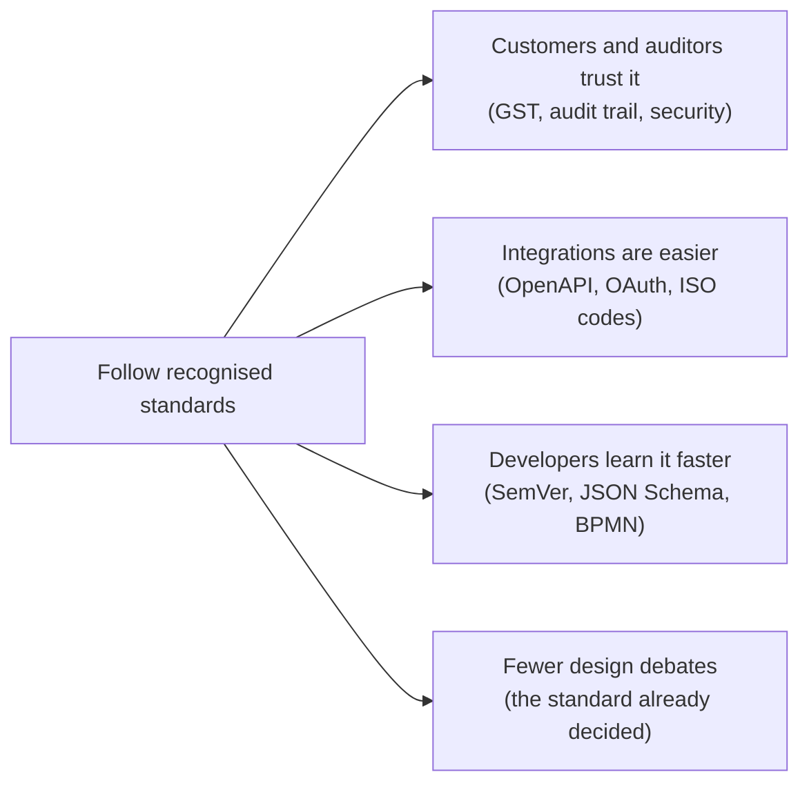

# Industry Standards Register

> **Status:** Living document · **Last updated:** 2026-10-03
> **Principle:** [ADR-0023](../adr/ADR-0023-STANDARDS-FIRST.md) — *where a recognised industry standard exists, we follow it instead of inventing our own* (founder's instruction, 2026-10-03).

## TL;DR

- This register lists every external standard, law or widely accepted convention the platform follows, **where** we use it, and its status.
- **Adopted** = we already follow it in the design. **Planned** = it will apply when we reach that area. **Reference** = we align with it, but don't claim compliance.
- When a design decision touches an area with a standard, the ADR must cite it. If we deliberately deviate, the ADR must say why.

---

## 1. Why standards matter for us

## 2. Legal and statutory (India first)

| Standard / law | Area | How we use it | Status |
| --- | --- | --- | --- |
| **GST law and rules** (CGST/SGST/IGST, place of supply, invoice contents, credit/debit notes) | India pack | Tax calculation, invoice content, note time limits | Adopted |
| **GST invoice numbering rule** (unique per financial year, max 16 characters, letters, digits, `-` and `/`) | Numbering | Statutory numbering series ([Step 5 §9](../01-discovery/STEP-05-CONFIGURATION-ARCHITECTURE.md#9-numbering)) | Adopted |
| **GST e-invoice schema** (IRN, signed QR) and **e-way bill** | India pack, integrations | Registration of invoices; movement documents | Adopted |
| **GST UQC** (Unit Quantity Codes) and **HSN/SAC** codes | Foundation (UOM, Item) | Every UOM maps to a UQC; every item to an HSN/SAC | Adopted |
| **Companies (Accounts) Rules — audit trail ("edit log") that cannot be disabled** (applicable from 1 April 2023) | Kernel audit | Immutable audit of every change to books-relevant records | Adopted |
| **Accounting Standard AS 2 / Ind AS 2** (inventory valuation: FIFO or weighted average) | Inventory valuation | Weighted average ([ADR-0021](../adr/ADR-0021-WEIGHTED-AVERAGE-VALUATION.md)) | Adopted |
| **Income-tax TDS/TCS provisions** | India pack | Deductions on receipts/payments | Planned |
| **TRAI TCCCPR 2018 — DLT registration** (sender entity, header, templates) for commercial SMS | SMS channel | Planned (when SMS is enabled) |
| **WhatsApp Business Platform policies** (pre-approved templates, opt-in) | WhatsApp channel | Planned (add-on) |
| **RBI framework for recurring payments (e-mandates)** | Automated subscription billing (later) ([ADR-0063](../adr/ADR-0063-SAAS-LIFECYCLE-AND-BILLING.md)) | Planned |
| **MSMED Act payment terms + Income-tax s.43B(h)** (45-day payment to micro/small vendors) | Payables | MSME due-date alerts | Adopted |
| **Digital Personal Data Protection Act, 2023** (and its Rules) | Security, privacy | Fiduciary/processor roles, minimisation, rights, breach path ([Step 6A §4](../01-discovery/STEP-06A-ISOLATION-AUDIT-PRIVACY-AND-OPERATIONS.md#4-privacy-and-data-protection-dpdp-act-2023)) | Adopted |
| **Companies Act — books of account retention (8 years)** | Audit trail and books retention | ≥ 8-year retention of documents, ledgers and audit ([ADR-0052](../adr/ADR-0052-DATA-LIFECYCLE-MDM-AND-MIGRATIONS.md)) | Adopted |
| **CGST Act record retention** (accounts kept for the statutory period after the annual return due date) | GST records | Covered by the 8-year retention | Adopted |
| **CERT-In Directions (April 2022)** — report incidents within 6 hours; keep ICT logs 180 days in India; synchronise clocks | Security operations | Incident runbook, log retention in India, NTP | Adopted |
| **Aadhaar Act restrictions** on storing Aadhaar numbers | Privacy | We do not collect Aadhaar numbers | Adopted |

## 3. Architecture, documentation and process modelling

| Standard | How we use it | Status |
| --- | --- | --- |
| **ADR** (Architecture Decision Records, Nygard / MADR style) | Every major decision | Adopted |
| **C4 model** (context, container, component, code diagrams) | Technical architecture diagrams ([Step 9 §9](../01-discovery/STEP-09-TECHNICAL-ARCHITECTURE.md#9-architecture-diagrams-c4-model)) | Adopted |
| **arc42** (architecture documentation template) | The Master Blueprint follows the brief's 27 parts; arc42 used as a completeness reference | Reference |
| **BPMN 2.0** (OMG) | Process semantics; approval engine concepts aligned (user task, gateways, timers — [ADR-0044](../adr/ADR-0044-APPROVAL-WORKFLOW-ENGINE.md)) | Reference |
| **DMN** (OMG Decision Model and Notation) — decision tables | Approval matrices, rate lookups ([Step 5 §8](../01-discovery/STEP-05-CONFIGURATION-ARCHITECTURE.md#8-rules-and-the-condition-language)) | Adopted |
| **ISO/IEC 25010** (software quality model) | MVP non-functional requirements ([Roadmap & MVP §3.3](../02-blueprint/ROADMAP-AND-MVP.md#33-non-functional-requirements-for-the-mvp-isoiec-25010-checklist)) | Adopted |

## 4. Data, formats and APIs

| Standard | How we use it | Status |
| --- | --- | --- |
| **ISO 8601** dates/times; UTC storage with tenant time zone | All dates | Adopted |
| **ISO 4217** currency codes | Currency master | Adopted |
| **ISO 3166** country / subdivision codes (and GST state codes) | Addresses, place of supply | Adopted |
| **ISO 639 / BCP 47** language tags | Translations | Adopted |
| **Unicode CLDR** number/date formats (incl. Indian lakh/crore grouping) | UI formatting | Adopted |
| **UN/ECE Recommendation 20** unit codes | UOM master (alongside GST UQC) | Adopted |
| **UTF-8** | All text | Adopted |
| **UUIDv7 (RFC 9562)** | Primary keys: globally unique, time-ordered ([ADR-0049](../adr/ADR-0049-DATA-MODEL-CONVENTIONS.md)) | Adopted |
| **CSV (RFC 4180)** and **Office Open XML (xlsx)** | Data exports and import templates | Adopted |
| **SQL** (ISO/IEC 9075) via PostgreSQL | System of record ([ADR-0047](../adr/ADR-0047-POSTGRESQL-SYSTEM-OF-RECORD.md)) | Adopted |
| **YAML 1.2** (authoring) + **JSON Schema 2020-12** (validation) | Configuration packages ([Step 5A](../01-discovery/STEP-05A-PACKAGES-UPGRADES-AND-ONBOARDING.md)) | Adopted |
| **CEL** (Common Expression Language) | Condition expressions in rules ([Step 5 §8](../01-discovery/STEP-05-CONFIGURATION-ARCHITECTURE.md#8-rules-and-the-condition-language)) | Adopted |
| **OpenAPI 3.1** | Public and internal REST API contracts, generated from JSON Schemas ([ADR-0057](../adr/ADR-0057-CONTRACTS-RULES-TEMPLATES-PDF.md)) | Adopted |
| **RFC 9457** Problem Details | API error format | Adopted |
| **CloudEvents** (CNCF) | Event envelope for domain and integration events ([ADR-0040](../adr/ADR-0040-EVENT-MODEL.md)) | Adopted |
| **W3C Trace Context** (`traceparent`) | Correlating a user action with all events, jobs and notifications it causes | Adopted |
| **IETF HTTP Idempotency-Key** header (draft) | Safe retries of create/post API calls | Adopted (reference to draft) |
| **Transactional outbox pattern** | Reliable after-commit delivery ([ADR-0041](../adr/ADR-0041-OUTBOX-AND-DELIVERY.md)) | Adopted |
| **Standard Webhooks** | Webhook signing and retries ([ADR-0046](../adr/ADR-0046-INTEGRATION-JOBS-AND-WEBHOOKS.md)) | Adopted |
| **SPF (RFC 7208), DKIM (RFC 6376), DMARC (RFC 7489)** | Email deliverability and anti-spoofing | Adopted |
| **Web Push (RFC 8030)** | PWA push notifications | Planned |
| **QR code (ISO/IEC 18004)**, **GS1** barcodes | Labels, reel tags, e-invoice QR | Planned |

## 5. Security and identity

| Standard | How we use it | Status |
| --- | --- | --- |
| **OWASP ASVS** (Application Security Verification Standard), target **Level 2** | Security requirements and testing checklist | Adopted (Step 6) |
| **STRIDE** threat modelling | Threat model per module / integration | Adopted |
| **NIST RBAC model** (ANSI/INCITS 359) | Role-based access foundation, extended with scopes and conditions | Adopted |
| **RFC 6238 (TOTP)**, **WebAuthn / FIDO2 passkeys** | MFA now; passkeys later | Adopted / Planned |
| **Argon2id (RFC 9106)** | Password hashing | Adopted |
| **TLS 1.3 (RFC 8446)**, minimum TLS 1.2; **HSTS** | Transport security | Adopted |
| **RFC 9116 security.txt** | Responsible disclosure | Planned |
| **3-2-1 backup rule** | Backups | Adopted |
| **OWASP Top 10** | Developer awareness and review checklist | Planned |
| **OAuth 2.x / OpenID Connect** | Login, SSO, API access | Adopted (Step 6) |
| **NIST SP 800-63B** (digital identity: passwords, MFA) | Password and MFA rules ([ADR-0032](../adr/ADR-0032-AUTHENTICATION.md)) | Adopted |
| **ISO/IEC 27001 / 27002** | Control framework for operations; certification later | Reference |
| **CIS Benchmarks** | Server, container and database hardening | Planned (implementation) |

## 6. Engineering and operations

| Standard | How we use it | Status |
| --- | --- | --- |
| **Semantic Versioning 2.0** | Platform, modules, packages | Adopted |
| **Conventional Commits** + **Keep a Changelog** | Commit messages and release notes ([ADR-0060](../adr/ADR-0060-ENGINEERING-PRACTICE.md)) | Adopted |
| **Twelve-Factor App** | One image, environment config, web + worker processes, logs as streams ([ADR-0059](../adr/ADR-0059-HOSTING-AND-DEPLOYMENT.md)) | Adopted |
| **OCI container images** (Docker) | Portable deployment to any cloud or on-premise | Adopted |
| **OpenTelemetry** | Logs, metrics, traces ([ADR-0060](../adr/ADR-0060-ENGINEERING-PRACTICE.md)) | Adopted |
| **WCAG 2.2 Level AA** | Accessibility target of the UI (accessible component primitives, [ADR-0056](../adr/ADR-0056-FRONTEND-STACK.md)) | Adopted (target) |

## 7. Industry references (for later)

| Standard | Area | Status |
| --- | --- | --- |
| **ISO 12647** / Fogra (process control for colour printing) | Printing quality (colour targets) | Reference |
| **21 CFR Part 11**, **EU GMP Annex 11**, **GAMP 5** | Pharma (design test only, [ADR-0009](../adr/ADR-0009-MARKET-AND-FIRST-VERTICAL.md)) | Reference |

## 8. How to use this register

- **New decision:** check this register first. Cite the standard in the ADR.
- **New standard:** add a row here with status *Planned* or *Reference*, and add a row to the [decision log](../tracking/DECISION-LOG.csv) if it is a choice.
- **Deviation:** allowed only with an ADR explaining why.
