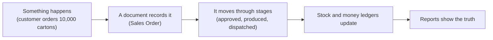
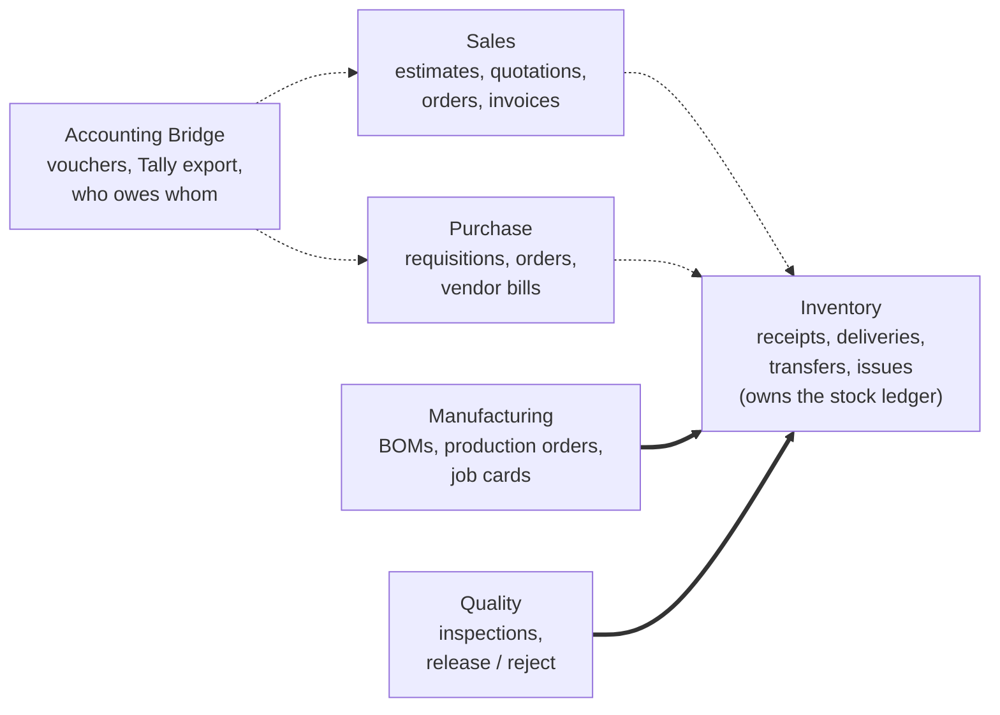
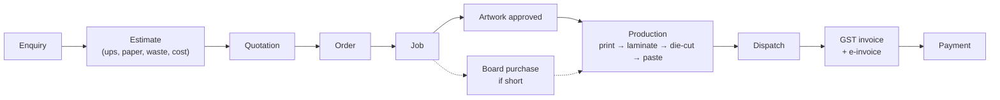

# The Story So Far — plain-language explanation

> **Status:** Living document · **Last updated:** 2026-10-03 (after Step 4)
> **Use this** when you need to explain the project to someone else: a partner, a customer, a developer. No jargon without an explanation.

## TL;DR

We are designing one ERP platform that can be configured into a Printing ERP, a Pharma ERP and so on, starting with **Printing & Packaging companies in India**. Steps 1–3 decided **what the platform is**, **what its building blocks mean**, and **how it is split into modules**. Step 4 described **how a printing company's work flows through the system** (still to be validated with a real printer). No code has been written yet, on purpose.

---

## Step 1 — What are we building?

**In one sentence:** a system where every business event (an order, a delivery, a payment) becomes a numbered **document**. Documents move through controlled stages (Draft → Approved → Done) and update **ledgers**, the permanent records of stock and money. Industry and country differences come from **configuration**, not from separate software.

**Key ideas:**

1. **Seven layers.** From bottom to top:
   - Platform engine (kernel)
   - Shared business data: customers, items, units
   - Modules: Sales, Purchase, …
   - Country rules: Indian GST
   - Industry packages: Printing
   - One customer's settings
   - One customer's custom additions

   Lower layers never know about higher ones. That is what lets one engine serve many industries and countries.
2. **Industry packages are mostly configuration, plus a little code** for real calculations, such as "how many cartons fit on one sheet".
3. **Five levels of change**, from safe to dangerous: settings → configuration → customization → extension → changing the core. Changing the core for one customer is forbidden; it would make every upgrade painful.
4. **Decisions taken:**
   - Win on industry depth and fast go-live, not on price (Odoo and ERPNext are free).
   - Printing & Packaging first, India first.
   - Pharma only as a design test.
   - Invoices are GST-correct, and accounts go to Tally (no own accounting ledger yet).
   - The founder configures customers in year 1.
   - Build in complete "slices" that can be demonstrated.

## Step 2 — What do the words mean, and how do the pieces fit?

1. **A company is described by several structures, not one tree:**
   - **Legal:** company, GSTIN
   - **Physical:** site, warehouse, rack
   - **People:** department, team
   - **Money:** cost and profit centers
   - **Grouping:** a flexible tree for regions and business units

   Example: one printing plant can serve both the Cartons and the Labels business units.
2. **Access is always "role + where".** "Store Manager *at the Bhiwandi plant*" cannot touch stock in Vapi. "Can approve" and "up to how much" are kept separate.
3. **Six kinds of things in the system:**
   - **Masters:** customers, items
   - **Documents:** orders, invoices
   - **Document lines**
   - **Ledger entries:** stock and money movements
   - **Anchors:** a printing **Job** that groups everything about one order
   - **Configuration**
4. **A business process is a chain of linked documents.** Real life is messy: one order goes out in three deliveries, and one invoice covers two orders. Links with quantities handle that.
5. **Two levels of status.** Fixed core stages keep the system correct, for example "you can only receive goods against an approved order". Each customer adds their own sub-statuses and approval chains on top.
6. **Nothing confirmed is ever edited.** Mistakes are fixed by cancelling, reversing or amending, which is what auditors and tax law expect.

## Step 3 — How is the system split into modules?

**A module is defined by what it owns.** Every document type has exactly one owner module.

**Key ideas:**

1. **Only Inventory changes stock.** Other modules ask it to. One place, one set of rules.
2. **Invoices belong to Sales and Purchase.** Invoicing therefore works even while the books are kept in Tally.
3. **The printing Job belongs to the Printing package.** The general modules don't need to know what a Job is.
4. **Three kinds of dependency:**
   - **"Can't work without":** Manufacturing needs Inventory.
   - **"Works better with":** Sales and Inventory.
   - **"Sold together":** editions.

   Every module says what it does when a partner module is switched off.
5. **Modules talk only through published "contracts"**, never by reading each other's data directly. Anything that moves stock or money happens all-or-nothing.
6. **Each module carries a manifest**, a declaration of what it needs and offers. The system uses it to switch modules on and off and to show each user only the menus they need.
7. **Year 1 sells one tested bundle, "Printing Essentials":** Sales, Purchase, Inventory, Manufacturing, Quality, Accounting Bridge, the India rules and the Printing package.

## Step 4 — How does a printing company's work flow through the system?

We mapped seven processes. They are our best understanding of Indian printers, **still to be checked with a real company** using the interview guide.

**What we learned:**

1. **Repeat orders dominate.** Each customer product is saved once as a "product specification" (artwork, die, plates, board, recipe) and reused.
2. **The unit changes as work moves.** Board is bought in kg, printed in sheets and delivered in pieces (sheets × how many fit on a sheet).
3. **Delivered quantity is rarely exactly the ordered quantity.** Small over- or under-deliveries are normal, so "close this order with a small balance" is a standard action.
4. **Waste is the printer's biggest controllable cost.** Every operation records input, good and waste, which makes waste visible.
5. **The killer report is "estimate vs actual" for every job:** did we make money on it?
6. **Some work goes to outside job workers** (lamination, die-cutting). The material stays ours and is tracked while it is away.
7. **Customers sometimes supply their own board.** That is someone else's stock in our store, and the design now allows for it.
8. **Mistakes are fixed with correction documents** (credit notes, returns, adjustments). Approved accounting entries go to Tally in batches and are then locked.

## What's next

- **Validate Step 4** with one or two real printing companies, using the Pilot Interview Guide.
- **Step 5:** configuration architecture. How the Printing package, India pack and each customer's settings are written, loaded and upgraded.
