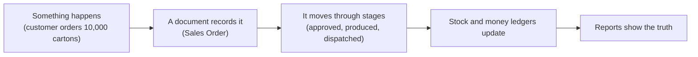
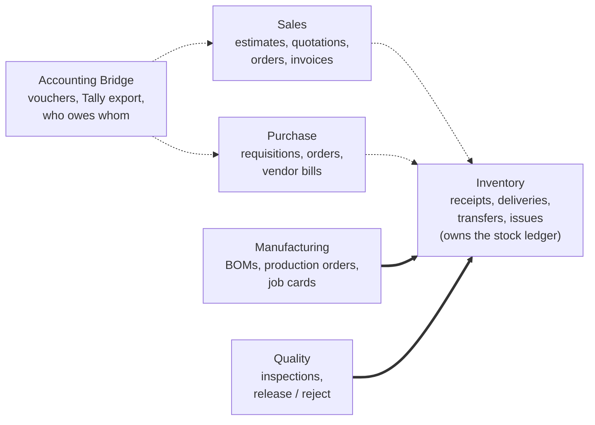
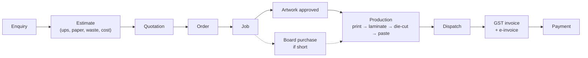
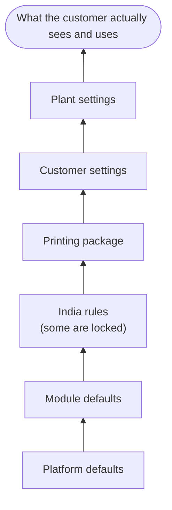
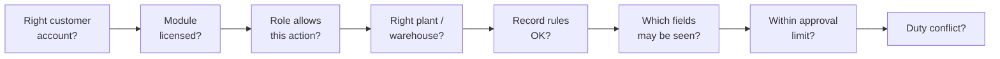
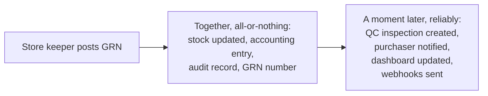
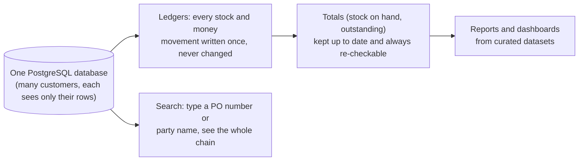
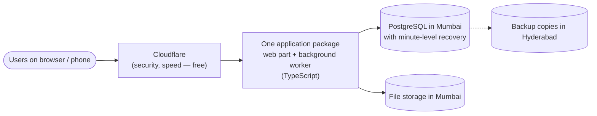

# The Story So Far — plain-language explanation

> **Status:** Living document · **Last updated:** 2026-10-03 (after Step 9)
> **Use this** when you need to explain the project to someone else: a partner, a customer, a developer. No jargon without an explanation.

## TL;DR

We are designing one ERP platform that can be configured into a Printing ERP, a Pharma ERP and so on, starting with **Printing & Packaging companies in India**. Steps 1–3 decided **what the platform is**, **what its building blocks mean**, and **how it is split into modules**. Step 4 described **how a printing company's work flows through the system** (still to be validated with a real printer). Step 5 described **how one platform is configured into a Printing ERP** and how customers are set up and upgraded. Step 6 described **how the system is kept secure and trustworthy**. Step 7 described **how one action reliably triggers everything that should follow**: approvals, notifications, automations and integrations. Step 8 described **how all the data is stored, kept correct, reported, searched and eventually archived**. Step 9 chose **the actual technologies, where the system runs, and what it costs**. No code has been written yet, on purpose.

---

## Step 1 — What are we building?

**In one sentence:** a system where every business event (an order, a delivery, a payment) becomes a numbered **document**. Documents move through controlled stages (Draft → Approved → Done) and update **ledgers**, the permanent records of stock and money. Industry and country differences come from **configuration**, not from separate software.

**Key ideas:**

1. **Seven layers.** From bottom to top:
   - Platform engine (kernel)
   - Shared business data: customers, items, units
   - Modules: Sales, Purchase, …
   - Country rules: Indian GST
   - Industry packages: Printing
   - One customer's settings
   - One customer's custom additions

   Lower layers never know about higher ones. That is what lets one engine serve many industries and countries.
2. **Industry packages are mostly configuration, plus a little code** for real calculations, such as "how many cartons fit on one sheet".
3. **Five levels of change**, from safe to dangerous: settings → configuration → customization → extension → changing the core. Changing the core for one customer is forbidden; it would make every upgrade painful.
4. **Decisions taken:**
   - Win on industry depth and fast go-live, not on price (Odoo and ERPNext are free).
   - Printing & Packaging first, India first.
   - Pharma only as a design test.
   - Invoices are GST-correct, and accounts go to Tally (no own accounting ledger yet).
   - The founder configures customers in year 1.
   - Build in complete "slices" that can be demonstrated.

## Step 2 — What do the words mean, and how do the pieces fit?

1. **A company is described by several structures, not one tree:**
   - **Legal:** company, GSTIN
   - **Physical:** site, warehouse, rack
   - **People:** department, team
   - **Money:** cost and profit centers
   - **Grouping:** a flexible tree for regions and business units

   Example: one printing plant can serve both the Cartons and the Labels business units.
2. **Access is always "role + where".** "Store Manager *at the Bhiwandi plant*" cannot touch stock in Vapi. "Can approve" and "up to how much" are kept separate.
3. **Six kinds of things in the system:**
   - **Masters:** customers, items
   - **Documents:** orders, invoices
   - **Document lines**
   - **Ledger entries:** stock and money movements
   - **Anchors:** a printing **Job** that groups everything about one order
   - **Configuration**
4. **A business process is a chain of linked documents.** Real life is messy: one order goes out in three deliveries, and one invoice covers two orders. Links with quantities handle that.
5. **Two levels of status.** Fixed core stages keep the system correct, for example "you can only receive goods against an approved order". Each customer adds their own sub-statuses and approval chains on top.
6. **Nothing confirmed is ever edited.** Mistakes are fixed by cancelling, reversing or amending, which is what auditors and tax law expect.

## Step 3 — How is the system split into modules?

**A module is defined by what it owns.** Every document type has exactly one owner module.

**Key ideas:**

1. **Only Inventory changes stock.** Other modules ask it to. One place, one set of rules.
2. **Invoices belong to Sales and Purchase.** Invoicing therefore works even while the books are kept in Tally.
3. **The printing Job belongs to the Printing package.** The general modules don't need to know what a Job is.
4. **Three kinds of dependency:**
   - **"Can't work without":** Manufacturing needs Inventory.
   - **"Works better with":** Sales and Inventory.
   - **"Sold together":** editions.

   Every module says what it does when a partner module is switched off.
5. **Modules talk only through published "contracts"**, never by reading each other's data directly. Anything that moves stock or money happens all-or-nothing.
6. **Each module carries a manifest**, a declaration of what it needs and offers. The system uses it to switch modules on and off and to show each user only the menus they need.
7. **Year 1 sells one tested bundle, "Printing Essentials":** Sales, Purchase, Inventory, Manufacturing, Quality, Accounting Bridge, the India rules and the Printing package.

## Step 4 — How does a printing company's work flow through the system?

We mapped seven processes. They are our best understanding of Indian printers, **still to be checked with a real company** using the interview guide.

**What we learned:**

1. **Repeat orders dominate.** Each customer product is saved once as a "product specification" (artwork, die, plates, board, recipe) and reused.
2. **The unit changes as work moves.** Board is bought in kg, printed in sheets and delivered in pieces (sheets × how many fit on a sheet).
3. **Delivered quantity is rarely exactly the ordered quantity.** Small over- or under-deliveries are normal, so "close this order with a small balance" is a standard action.
4. **Waste is the printer's biggest controllable cost.** Every operation records input, good and waste, which makes waste visible.
5. **The killer report is "estimate vs actual" for every job:** did we make money on it?
6. **Some work goes to outside job workers** (lamination, die-cutting). The material stays ours and is tracked while it is away.
7. **Customers sometimes supply their own board.** That is someone else's stock in our store, and the design now allows for it.
8. **Mistakes are fixed with correction documents** (credit notes, returns, adjustments). Approved accounting entries go to Tally in batches and are then locked.

## Step 5 — How does one platform become a Printing ERP?

Think of the system as a stack of transparent sheets laid on top of each other. The bottom sheet is the platform's defaults. Above it come the module defaults, then the country rules (India), then the industry package (Printing), then the customer's own settings, and finally a specific plant's settings. Looking down through the stack, you see the **effective configuration**.

**Key ideas:**

1. **Three ways layers combine:** a higher sheet can *replace* a value, *add* things (like a new field), or be *locked out* by a lower one. Indian GST invoice rules are locked; no one can break them.
2. **Two places configuration lives:**
   - **packages**, version-controlled and tested files written by us, such as the Printing package
   - **admin screens** for things customers change often: approval limits, numbering, roles, logo
3. **Configuration, master data and transactions are different things.** Paper rates are master data, maintained by the business. A package only provides starting values.
4. **Custom fields** like GSM are added without changing the database structure.
5. **Screens are a mix.** Important screens (estimate, job card on phone) are designed by hand with space for extra fields. Simple screens (die list, waste reasons) are generated automatically.
6. **Each industry uses its own words.** Printing says "Job", pharma says "Batch". This is just configuration.
7. **Rules are written in a small, safe formula language (CEL) and in tables** (for example, "PO above ₹5 lakh → owner approves"). There is no free programming inside the system.
8. **Invoice numbers follow GST law:** no gaps, unique per year, at most 16 characters, assigned only when the invoice is posted.
9. **Upgrades:**
   - Each customer stays on a fixed package version.
   - Upgrades are tried on a copy first.
   - The customer's own changes are kept.
   - We can always roll back.
10. **Go-live brings in only what is needed to start:** customers, items, product specs, counted stock, open orders and unpaid invoices. Old history stays in the old system.
11. **Every package comes with a demo company**, so the product can be shown on day one.

We also adopted two working rules. We **follow recognised industry standards** wherever they exist (see the Standards Register). Every question and decision is kept in one **decision log sheet**.

## Step 6 — How is the system kept secure and trustworthy?

**What we protect:** prices and margins, customer lists, money (bank details), stock, customers' artwork, personal data, and the ability to dispatch and invoice.

**Logging in:**

- Office users use a password (long rather than complicated) and can use "Login with Google/Microsoft".
- The owner, admin, accountant and approvers **must** use a second factor (an authenticator app).
- Machine operators tap their name on a **registered tablet** and enter a personal PIN. They only get shop-floor functions.
- Sensitive actions (changing bank details, big approvals, bulk exports) ask for the password again.

**Every request passes eight checks:**

**Key ideas:**

1. **Hidden fields are really hidden.** Shop-floor users never receive prices or margins, not even in exports or prints.
2. **Approval limits are separate from permissions.** "Can approve POs" and "up to ₹10 lakh" are two things. Approvers can delegate while on leave.
3. **Fraud checks:** risky combinations (create a vendor and pay it; change bank details and pay) are blocked or flagged in an owner/auditor report.
4. **Customers can never see each other's data.** There are two independent locks (application and database), plus automatic tests in every build.
5. **Two audit logs:**
   - a business log of every change, which **cannot be switched off** and is tamper-evident, as Indian law requires
   - a security log of logins, exports and permission changes, kept in India
6. **Personal data:**
   - We collect the minimum and never store Aadhaar numbers.
   - Data is hosted in India.
   - The customer controls the data; we process it for them.
7. **We cannot look at a customer's data** unless they approve a time-limited support session, and they can see everything we did.
8. **Backups:**
   - At most 15 minutes of data can be lost.
   - Service is back within 4 hours.
   - Restores are tested every month.
9. **Incidents** are reported to CERT-In within 6 hours, as the law requires.

## Step 7 — How does one action trigger everything that should follow?

When the store keeper posts a GRN, some things **must happen together** and some **can follow a moment later**:

**Key ideas:**

1. **Nothing is lost and nothing happens twice.** Follow-up work is written down in the same save as the business change, then delivered by a background worker. If delivery fails it retries. Each receiver remembers what it already handled, so a repeat is ignored.
2. **No extra servers.** The database itself holds the queue. Big messaging systems like Kafka are not needed at our size, and we know when we would add one.
3. **No "event sourcing".** Our stock and accounting ledgers, plus the audit log, already keep full history.
4. **Automations** follow the pattern "when X happens, and condition Y is true, do Z", where Z comes from a fixed list of safe actions. They run as a system user, can't loop endlessly and are always audited.
5. **When the GST portal is down**, invoices queue up with a visible banner ("3 invoices waiting for IRN"). They retry automatically, and an IRN generated on the portal by hand can be recorded.
6. **Approvals:**
   - Each document type has configurable steps, for example "PO above ₹50,000 → Purchase head; above ₹5 lakh → Owner".
   - Steps can need one approver or all of them, can have time limits, reminders and escalation to the next person, and can be delegated during leave.
   - If an approver has left, a fallback person gets the task. Nothing is ever auto-approved by mistake.
   - Changing the amount after approval means approving again.
7. **Approving from your phone:** the message contains a link that opens the approval screen after login. You can't approve just by replying "YES", for security.
8. **Notifications** go to the right people, in their language, without showing them fields they may not see. The first channels are in-app and email. WhatsApp and SMS come later as paid add-ons, following Meta's and TRAI's rules.

## Step 8 — How is the data stored and kept correct?

**Key ideas:**

1. **One proven, free database: PostgreSQL.** It has the features we decided we need: per-customer locks, flexible extra fields, search and very large tables.
2. **Customers share one database by default** (cheapest). Each row is labelled with its customer and locked to them. A big customer, or one that wants it on their own server, can get a separate database with exactly the same structure.
3. **Each module has its own section of the database.** Modules only link "downwards" to shared basics, never sideways to each other, so modules stay independent.
4. **Every record follows the same rules:**
   - a unique id
   - a customer and company label
   - exact money values (never rounded floating-point numbers)
   - times stored in UTC
   - a version number to catch two people editing at once
   - room for custom fields
5. **Every document is also registered in one shared list.** That is what lets search find "PO/25-26/0042" and show the whole chain of related documents.
6. **Stock and money are recorded as permanent movements.** Totals are calculated from them, updated instantly and checked every night. Stock can't go below zero unless a customer explicitly allows it.
7. **Late bills don't rewrite history.** If a goods receipt dated last week is entered today, the average cost changes from today, and any small difference is shown as a "variance" for the accountant.
8. **Two people can't use the same last 500 kg of board.** The system briefly locks that stock while one posting completes. If two people edit the same draft, the second is asked to reload.
9. **Reports read curated "datasets"** that already know the business meaning (for example, what "pending order" means) and never show fields the viewer may not see. Heavy dashboards use pre-calculated summaries.
10. **Clean master data:** duplicate warnings for customers and vendors (same GSTIN or a similar name), optional approval for new vendors and bank changes, and merging duplicates without rewriting history.
11. **Retention:**
    - Books and audit are kept at least 8 years, as the law requires.
    - Logs are kept as long as the law requires.
    - Personal data no longer needed is anonymised.
    - When a customer leaves, they get a full export and their data is deleted.
12. **Going live:** opening stock and unpaid invoices are posted as proper documents, never typed straight into the database. That keeps them audited like everything else.

## Step 9 — Which technologies, where does it run, and what does it cost?

**Key ideas:**

1. **One language everywhere: TypeScript**, for screens, server, tools and tests. That makes one developer, helped by AI, far more productive.
   - The one weakness of this language for an ERP is exact money arithmetic. It is solved by strict rules: a special money type, amounts sent as text, and automatic checks.
2. **One application, not many small services.** We compared both approaches carefully. One application keeps stock and accounting saved together, costs least and suits a small team.
3. **Proven, free building blocks:**
   - **Server:** NestJS.
   - **Screens:** React, with a modern accessible component kit.
   - **Database access:** Kysely.
   - **Background jobs inside PostgreSQL:** Graphile Worker.
   - **One schema language** (JSON Schema) for configuration, APIs and events.
   - **Templates and PDFs:** safe templates (LiquidJS), turned into PDF by a browser engine.
4. **Module walls are enforced by the build.** If one module reaches into another's internals, the build fails.
5. **Five short experiments ("spikes")** before building, each with a backup plan:
   - the rules language library
   - the login library
   - database security plus background jobs
   - exact money handling
   - PDF speed
6. **Hosting:**
   - India region (AWS Mumbai), starting with the simple "Lightsail" service, with backups copied to Hyderabad.
   - DigitalOcean Bangalore is the alternative.
   - The same package can later run on any cloud or on a customer's own server.
7. **Quality on autopilot.** Every change runs automatic checks:
   - module walls
   - money rules (vouchers always balance, stock never negative)
   - "customer A can never see customer B"
   - "each role can do exactly what it should"
   - security scans
8. **Cost:**

   | Stage | Cost |
   | --- | --- |
   | Development | **₹0** |
   | Demo | **under ₹1,000/month** plus a domain |
   | Pilot | **about ₹3,000–6,000/month**, covered by the pilot's setup fee |
   | 10–30 customers | **₹12,000–25,000/month**, well under 15% of revenue |

## What's next

- **Validate Step 4** with one or two real printing companies, using the Pilot Interview Guide.
- **Step 10:** the master blueprint: all 27 parts the brief asked for in one place, the final roadmap and MVP definition, the phase-wise feature breakdown, the major risks and the technical-debt strategy. After that, the spikes and the first vertical slice.
