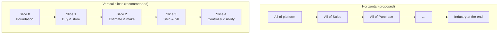

# Preliminary Roadmap Critique (brief §37)

> **Status:** Direction accepted ([ADR-0012](../adr/ADR-0012-VERTICAL-SLICE-ROADMAP.md)); the full roadmap is part of Step 10 · **Last updated:** 2026-10-03
> **Answers:** Brief §37 asks to "critically evaluate and redesign the roadmap" (Phase 0 → Phase 20).

## TL;DR

- The proposed roadmap is **horizontal**: it builds the platform layer by layer (core, identity, master data, workflow, notifications), then module by module, and adds industry packages only at **Phase 17**.
- For a solo developer looking for a first customer, that order has serious problems. There is **nothing to demo for many months**. Industry needs are discovered **too late**: paper bought in kg but used in sheets changes the Inventory design. And invoicing (Phase 13) comes after Sales (Phase 8), even though every dispatch needs a GST invoice.
- Proposed alternative: **vertical slices**. Each slice delivers one complete, demonstrable business flow for the first vertical. It builds only the minimum platform features that flow needs.
- This is a **draft for discussion** ([Q-11](../tracking/OPEN-QUESTIONS.md#q-11)). The order of the slices should follow the pilot customer's biggest pain ([Q-10](../tracking/OPEN-QUESTIONS.md#q-10)).

## 1. The roadmap as proposed

## 2. Problems found

| # | Problem | Why it hurts | Suggestion |
| --- | --- | --- | --- |
| 1 | **Industry packages at Phase 17** | Contradicts "platform + one vertical first". Generic modules built without the vertical will miss things the vertical needs: kg↔sheet conversion, reel tracking, job costing, wastage. Inventory and Production would then need redesign. | Build the printing package **together with** the modules from the first slice |
| 2 | **Phases 2–6 are all platform, no business value** | Months of "engine" work with nothing a printing owner can see. It also risks building platform features nobody ends up needing. | Build the **minimum kernel** each slice needs, just in time ([Step 1 §3](STEP-01-PLATFORM-DEFINITION.md#3-the-smallest-definition-of-the-platform-l0-kernel) marks what MVP needs) |
| 3 | **Finance at 13, after Sales at 8** | Every dispatch needs a GST-correct invoice (and e-invoice/e-way bill above thresholds). Sales can't go live without it. | GST invoicing + Tally export inside the "ship & bill" slice; native GL later ([Q-03](../tracking/OPEN-QUESTIONS.md#q-03)) |
| 4 | **CRM first (Phase 7)** | For a printing SME, CRM is the lowest-pain area. Their daily pain is estimation, job tracking, paper stock, production and dispatch. | Start with Estimate → Order → Job. Lightweight enquiries now, full CRM later |
| 5 | **Quality at 12, after Production** | Incoming inspection and quarantine have to exist when Purchase/Inventory go live. Inventory statuses (quarantine, rejected) are part of its **core design** and can't be added on later. | Basic receipt QC + inventory statuses inside the "buy & store" slice |
| 6 | **Integrations at 18** | GST e-invoice, e-way bill and Tally export are MVP needs for an Indian customer. | Minimum integration ports early; the broad integration catalogue later |
| 7 | **Reporting/BI at 19** | Users judge an ERP by its reports: pending orders, stock, WIP, job status. | Each slice ships its operational reports. BI and custom report builder come later |
| 8 | **Projects, HR, Service (14–16) in the main line** | Outside the first vertical. Indian HR/payroll (PF, ESI, PT, TDS on salary) is a separate market with heavy statutory work. | Move them after product-market fit. For HR/payroll, consider integrating rather than building |
| 9 | AI at 20 | — | Agree: last, on top of a deterministic core |

## 3. Proposed alternative: vertical slices (draft)

| Slice | Delivers (printing example) | Minimum platform built in this slice |
| --- | --- | --- |
| **0 Foundation** | Login, company/site/warehouse setup, users and roles, Item and Party masters with printing attributes (GSM, size, reel) | Tenancy, identity, org scopes, simple authorization, metadata/custom fields, audit, config loader, printing package skeleton |
| **1 Buy & store** | PO → GRN → stock ledger; reels/batches; kg↔sheet; quarantine and receipt QC; stock reports | Document framework (numbering, lifecycle, links, cancel), simple approvals, PDF output, email notification |
| **2 Estimate & make** | Estimate (ups, wastage) → Quotation → Sales Order → **Job** → production order, job cards, material issue, finished goods, wastage and job costing | Anchor objects, extension points (estimation calculator), events + outbox |
| **3 Ship & bill** | Delivery → GST invoice → e-invoice / e-way bill → Tally export; receivables tracking | Localization pack (India), integration ports, settlement links |
| **4 Control & visibility** | Approval matrices, dashboards, WhatsApp alerts, more reports | Richer workflow, notification rules, WhatsApp adapter |

After slice 4, the second customer drives the next step. That could be hardening configuration, native Finance or CRM.
The **order of slices 1–3 should follow the pilot customer's biggest pain.** If paper stock is their chaos, start with slice 1. If estimation is losing them money, start with slice 2.

## Open questions raised

[Q-11](../tracking/OPEN-QUESTIONS.md#q-11) vertical slices instead of horizontal phases? ·
[Q-10](../tracking/OPEN-QUESTIONS.md#q-10) access to a real printing company

## Related documents

- [Step 1 — Platform Definition](STEP-01-PLATFORM-DEFINITION.md)
- [Project Brief §4.1 — solo-developer guidance](../00-context/PROJECT-BRIEF.md#41-solo-developer-operating-guidance-from-the-founders-cost-guidance-20-points)
- [Risk register R-01, R-03](../tracking/RISK-REGISTER.md)
