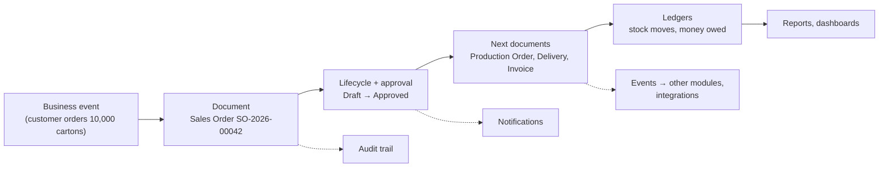
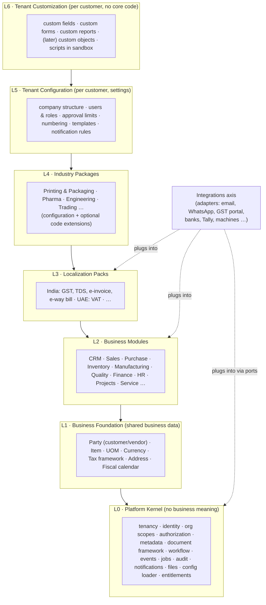
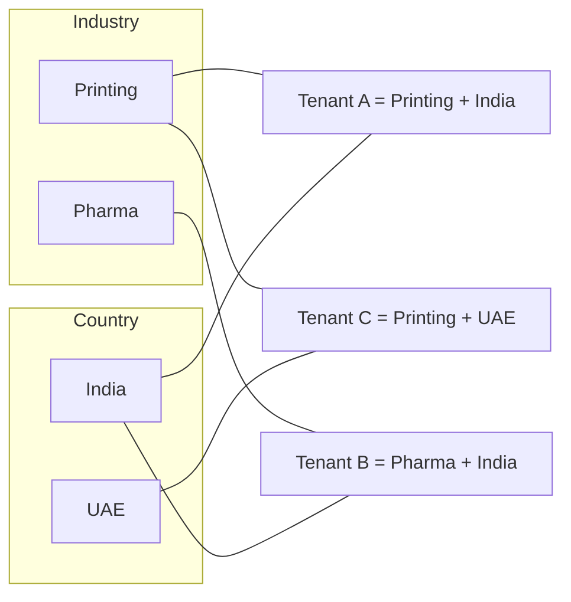
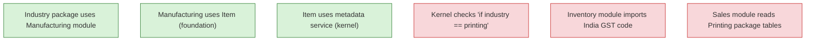
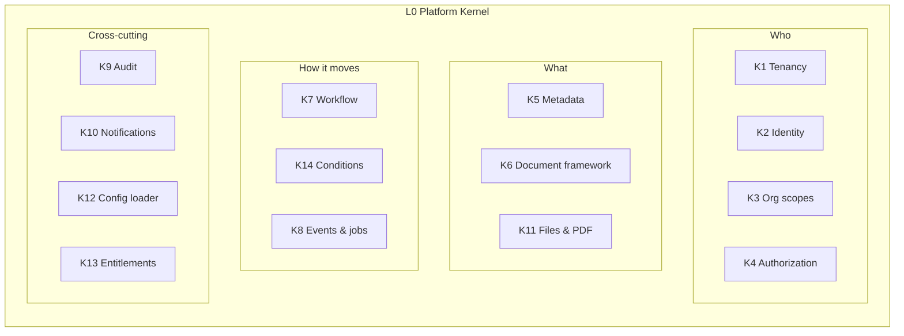
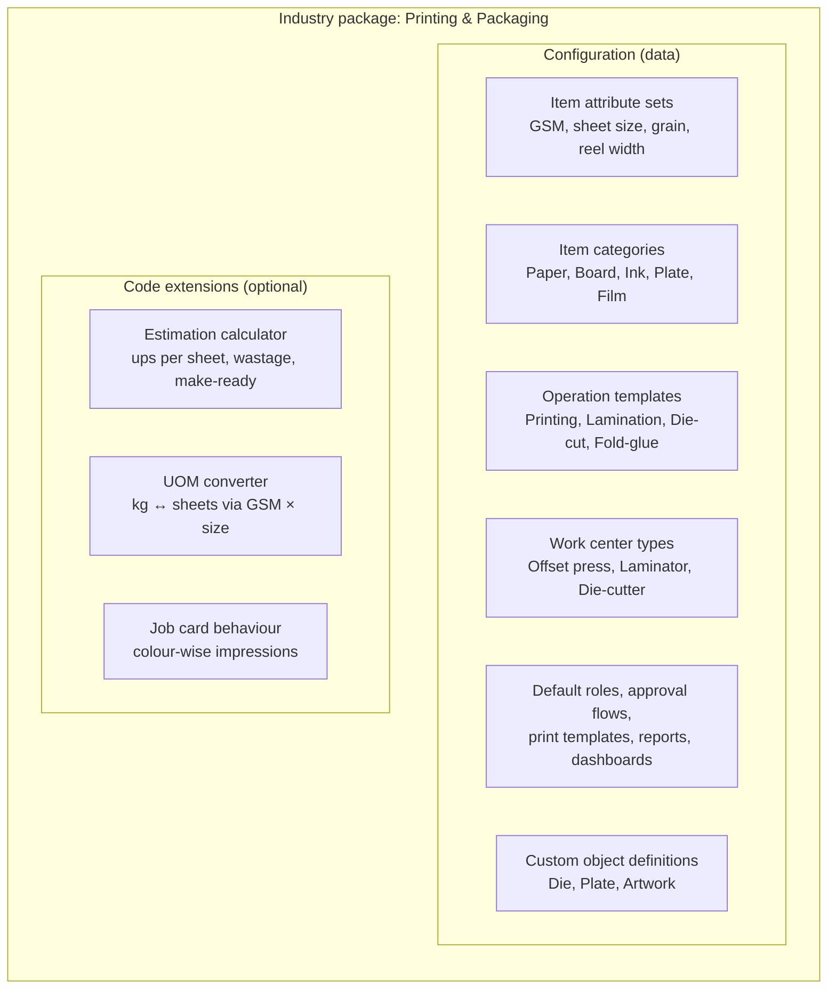
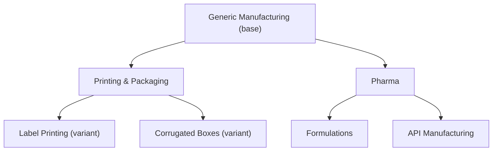
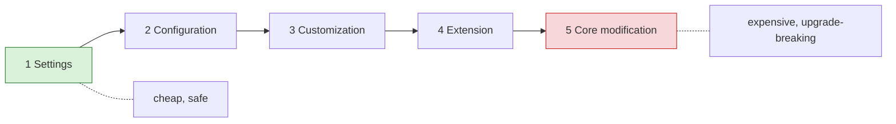
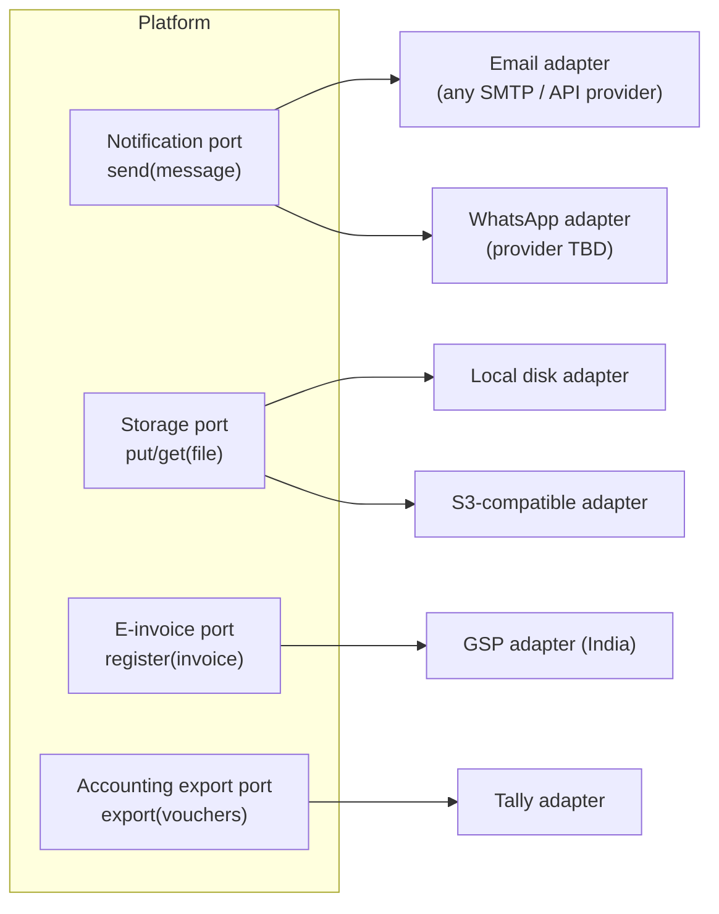
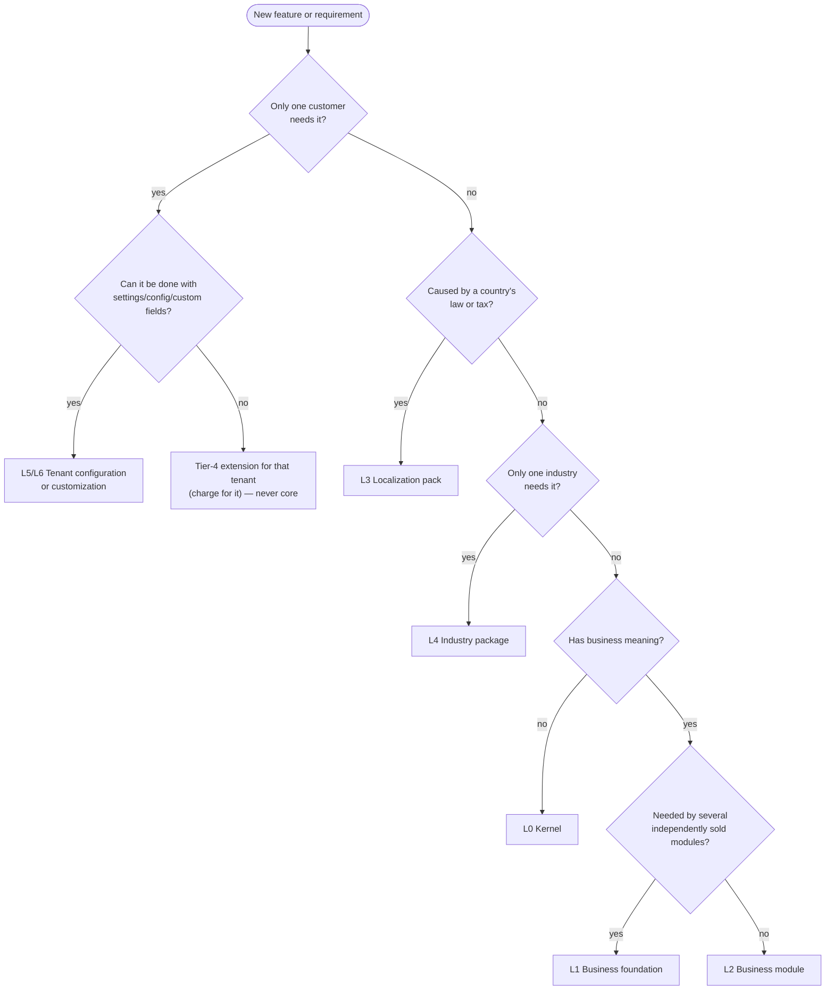

# Step 1 — Define the Platform

> **Status:** Accepted (founder agreed with all recommendations, 2026-10-03) · **Last updated:** 2026-10-03
> **Answers:** What are we building? What is the smallest platform? What belongs in core, modules, industry packages, customer configuration and integrations?

## TL;DR

- **What we build:** a *business operating platform* that records business transactions as **documents**, moves them through **lifecycles and approvals**, posts their effects into **ledgers** (stock, money), and lets each customer's **industry, country and structure be expressed as configuration** on top of one codebase.
- **The original 4-part formula is missing two layers.** We propose **seven layers**: Platform Kernel → Business Foundation → Business Modules → **Localization Packs** → Industry Packages → Tenant Configuration → Tenant Customization, plus **Integrations** as a separate side-axis. Localization (India GST) is *not* industry, and shared business masters (Item, Party, UOM) are *not* "core platform" nor any one module.
- **Dependencies only point downward.** Core never knows about printing or GST. Industry packages may depend on modules; modules never depend on industry packages.
- **Industry packages cannot be "configuration only".** Data shapes (fields, statuses, approvals) are configuration, but industry *calculations* (printing "ups per sheet" estimation, pharma potency-adjusted dispensing) need code. Packages therefore = **configuration + optional code extensions through defined extension points**.
- **Smallest useful platform ("kernel")** = 14 technical services, of which ~11 are needed in a minimal form for the MVP.
- **Biggest assumptions challenged:** "cheaper than Odoo" is not a positioning (Odoo Community and ERPNext are free); pharma is the hardest possible second industry; a no-code rule/form/object builder before the first customer is the *inner-platform trap*; native Finance/GL in the MVP fights Tally — see §12.

---

## 1. What exactly are we building?

### 1.1 One-sentence definition

> **A configurable platform on which a business's operations — selling, buying, stocking, making, checking quality and accounting — are recorded as documents that move through controlled lifecycles and post their effects into ledgers, where the industry, country and company structure are configuration, not separate software.**

Each phrase is deliberate:

| Phrase | Why it matters |
| --- | --- |
| *recorded as documents* | An ERP is first a **system of record**. Every business event leaves a numbered, auditable document. |
| *controlled lifecycles* | Documents are not freely editable rows. They have states (Draft → Approved → Posted) and rules about who moves them. |
| *post their effects into ledgers* | Stock and money are not "fields on a form"; they are **ledgers** — append-only, balanced, auditable. This is what separates an ERP from a CRUD app. |
| *industry, country, structure are configuration* | The commercial idea: one product, many markets. |

### 1.2 The mental model in one picture

### 1.3 What it is NOT

| It is not… | Because… |
| --- | --- |
| A database with CRUD screens | CRUD lets anyone change anything; ERP data must follow lifecycles and ledger rules. |
| A no-code app builder (like Airtable) | Generic builders don't know what stock or a debit is. Our value is **business semantics built in**. |
| A separate product per industry | That multiplies maintenance by the number of industries — the very thing we want to avoid. |
| An AI product | AI is a later assistant layer; the transactional core is deterministic. |
| Microservices | Architecture style is decided in Step 9; the direction is a modular monolith (see [ADR-0003](../adr/ADR-0003-MODULAR-MONOLITH-DIRECTION.md)). |

### 1.4 Positioning — challenge to "a cheaper Odoo"

"Cheaper than Odoo" is not a winning position: **Odoo Community and ERPNext are free and open-source.** You cannot undercut free. What SMEs actually struggle with is not licence cost — it is:

1. **Implementation cost and time** (months of consultants to bend a generic ERP to their industry).
2. **Missing industry depth** (a generic ERP doesn't know what GSM, ups, make-ready wastage or die numbers are).
3. **Local compliance friction** (GST, e-invoice, e-way bill working out of the box).
4. **Usability** (shop-floor and store users won't use complex screens).

Proposed positioning (for discussion, see [Q-01](../tracking/OPEN-QUESTIONS.md#q-01)):

> **"An ERP that already speaks your industry — live in weeks, not months."**
> First: *Printing & Packaging ERP for Indian SMEs*, built on a platform that later becomes other industry ERPs.

The platform is the *engine*; the **industry package is the product the customer buys.**

---

## 2. The layered product model

The founder's formula was **CORE + CONFIGURATION + MODULES + INDUSTRY PACKAGES + INTEGRATIONS.**
We propose refining it into seven layers plus an integration axis.

**Arrows mean "depends on".** A layer may use anything below it, never above it.

### 2.1 Why two new layers?

| New layer | Problem it solves |
| --- | --- |
| **L1 Business Foundation** | *Item*, *Customer/Vendor*, *UOM*, *Currency* are needed by almost every module. If they live inside "Inventory", then a customer who buys only CRM+Sales must also get Inventory. If they live in the "core platform", the core gets business meaning and stops being reusable. A thin shared foundation solves both. |
| **L3 Localization Packs** | GST applies to a printing company *and* a pharma company in India; neither applies in Dubai. Country rules and industry rules vary **independently**. Mixing them means building "Printing-India", "Printing-UAE", "Pharma-India"… — a combinatorial explosion. |

Two independent axes: 2 industries × 2 countries = 4 combinations, but only **4 packages** to maintain (2 + 2), not 4 products.

### 2.2 The dependency rule (fixed, non-negotiable)

When a lower layer needs behaviour from a higher one (Sales needs a tax amount, but tax is in localization), the lower layer **defines an extension point** ("a tax calculator") and the higher layer **plugs in** an implementation. The lower layer never names the higher one.

---

## 3. The smallest definition of the platform (L0 Kernel)

**Test for "is it kernel?":** *Every module needs it, AND it has no business meaning of its own.*

| # | Kernel service | What it does | Needed in MVP? |
| --- | --- | --- | --- |
| K1 | **Tenancy** | Isolates each customer's data, config and users | Yes |
| K2 | **Identity** | Users, login, sessions, password reset; MFA later | Yes |
| K3 | **Organization scopes** | Generic framework for companies, sites, units that permissions and data attach to (business attributes in L1) | Yes |
| K4 | **Authorization** | Roles, permissions, scope-limited access, field visibility | Yes (simple form) |
| K5 | **Metadata registry** | Describes object types, fields, custom fields, statuses; drives forms and validation | Yes (minimal) |
| K6 | **Document framework** | Numbering series, lifecycle state machine, document links ("created from"), cancel/amend/reverse, print templates | **Yes — the heart** |
| K7 | **Workflow / approvals** | Configurable approval steps attached to document transitions | Yes (sequential, amount-based) |
| K8 | **Events + background jobs** | In-process event bus, outbox for reliable delivery, scheduler | Yes |
| K9 | **Audit trail** | Immutable who/what/when/old/new log | Yes |
| K10 | **Notifications** | Event → recipients → channel → template | Yes (in-app + email) |
| K11 | **Files & rendering** | Attachments, object storage abstraction, PDF generation | Yes |
| K12 | **Configuration & package loader** | Applies industry/localization packages and tenant settings | Yes (file-based) |
| K13 | **Module registry & entitlements** | Which modules/features a tenant has; module navigation | Yes (flags) |
| K14 | **Expression / condition language** | One small language for conditions used by workflow, rules, notifications | Yes (minimal) |
| K15 | Search, report engine, public API gateway, integration framework, i18n | | Partial / later |

**Why the Document framework (K6) is the heart:** Quotation, Sales Order, PO, GRN, Job Card, Invoice — all share numbering, states, approvals, links to previous documents, printing, cancellation and audit. Building this **once** is what makes adding the 30th document type cheap. Building each document type by hand is how ERPs become unmaintainable.

---

## 4. L1 Business Foundation — shared business data

**Test:** *Needed by two or more modules that can be sold independently, AND has business meaning.*

| Foundation object | Used by | Note |
| --- | --- | --- |
| **Party** (customer, vendor, transporter, employee-as-payee…) | CRM, Sales, Purchase, Finance, Service | One legal party can be both customer and vendor (see Step 2) |
| **Item** (product, material, service) + item categories + attribute sets | Sales, Purchase, Inventory, Manufacturing, Quality | Industry packages add attributes (GSM, potency) |
| **UOM** + conversions | Everything with quantities | Paper: kg ↔ sheets via GSM and size — needs an extension point for formula-based conversion |
| **Currency** + exchange rates | Sales, Purchase, Finance | |
| **Tax framework** (tax categories, slots for tax calculation) | Sales, Purchase, Finance | *Framework* only; actual GST rules come from the India localization pack |
| **Address, contact** | Party, Sites | |
| **Fiscal calendar** | Numbering, Finance, reports | India FY Apr–Mar |
| **Payment terms** | Sales, Purchase, Finance | |

What is deliberately **not** foundation: Warehouse/Location (owned by Inventory), BOM (Manufacturing), Chart of Accounts (Finance), Employee HR details (HR).

---

## 5. L2 Business Modules

A module is **a sellable, activatable area of business capability** that:

1. Owns its own documents and data (e.g., Purchase owns PR, RFQ, PO).
2. Exposes defined interfaces and events to other modules.
3. Can be switched on/off per tenant (subject to dependencies).
4. Is industry-neutral and country-neutral.

The exact module boundaries are **Step 3**. This step only fixes what a module *is*. Note the founder's list contains things that are **not modules**:

| Listed as module | Actually is | Why |
| --- | --- | --- |
| Administration (users, roles, workflows, notifications, audit) | Kernel UI | Every tenant has it; not sellable separately |
| Document Management (attachments, templates, versioning) | Kernel (K11 + K6) | Every document needs it |
| Analytics / BI | Partly kernel (report engine), partly each module (its reports) | |
| Asset Management vs Maintenance | Probably one module or tightly coupled pair | Decide in Step 3 |
| Customer portal | A *channel* (external UI) over Sales/Service | Not a module of its own data |

---

## 6. L3 Localization Packs

Everything that changes **because of the country (or state) of the legal entity**, not because of the industry.

| India pack would contain | Mechanism |
| --- | --- |
| GST rates, HSN/SAC codes, CGST/SGST/IGST split by place of supply | Plugs into Tax framework extension point |
| GSTIN per state registration, place-of-supply rules | Adds fields to Company/Party via metadata |
| E-invoice (IRN, QR) and e-way bill generation | Integration adapter to a GSP/government API |
| TDS/TCS | Finance extension point |
| GSTR-1/3B return data | Report definitions |
| Indian number format (lakh/crore), FY Apr–Mar | Configuration |
| Statutory invoice layout requirements | Print templates |

A tenant has **one or more** localization packs (a group with an Indian and a UAE company uses both — the pack applies per **company**, not per tenant).

---

## 7. L4 Industry Packages

### 7.1 What a package contains

### 7.2 Uncomfortable truth: configuration alone is not enough

The brief says industry functionality comes "primarily through configuration". That is true for **data shapes** and **process shapes**, false for **industry calculations**:

| Industry need | Pure configuration? | Why / why not |
| --- | --- | --- |
| Add GSM field to paper items | ✅ Yes | A field definition |
| Printing job states: Pre-press → Plate → Print → Finish | ✅ Yes | Sub-statuses + operation templates |
| Approval for estimates > ₹2 lakh | ✅ Yes | Workflow configuration |
| **Ups per sheet** (how many cartons fit on one sheet, given die layout, gripper, bleed) | ❌ No | Geometric calculation; needs code |
| **Paper requirement** = qty ÷ ups × (1 + wastage%) + make-ready sheets per colour | ⚠️ Borderline | A formula field could do it, but it varies by machine and process; code is safer |
| **Pharma potency adjustment** (if API assay is 98%, issue 100/0.98 kg) | ❌ No (as config) | Batch-specific calculation at dispensing time |
| Pharma: QC release required before material use | ✅ Yes | A rule + inventory status — but the *inventory status capability* (quarantine) must exist in the module |

If we insist on pure configuration, we end up building a programming language inside a settings screen — the **inner-platform effect**, the most common way "configurable ERP" projects die.

**Proposal ([ADR-0002](../adr/ADR-0002-LAYERED-PRODUCT-MODEL.md)):** an industry package = **configuration + optional code extensions**, where code extensions may only plug into **published extension points** of modules (calculators, validators, converters, document behaviours). They never modify module internals.

### 7.3 Package inheritance (later, not MVP)

Useful later. For MVP: **one package, no inheritance.** Inheritance is complex (what happens when the parent changes?) and we have zero packages today.

---

## 8. L5 & L6 — Customer configuration and customization

The brief asks to distinguish four tiers. We propose five, with **who** does it and **upgrade safety**:

| Tier | Example | Who does it | Code? | Survives platform upgrade? |
| --- | --- | --- | --- | --- |
| **1. Settings** | Approval limit = ₹5 lakh; numbering prefix "PO/24-25/" | Customer admin | No | ✅ Always |
| **2. Configuration** | Approval chain Purchase Head → Finance; roles; notification rules; print layout | Customer admin or implementer | No | ✅ Always |
| **3. Customization** | Custom field "Plate rack no."; custom report; extra sub-status | Implementer (later: power admin) | No | ✅ If built on metadata |
| **4. Extension** | New calculator, new integration, custom object with behaviour | Developer (us or partner) | Yes, against extension points | ✅ If extension points are stable |
| **5. Core modification** | Changing platform source for one customer | — | Yes | ❌ **Forbidden.** Turns every upgrade into a merge project. |

**Key scope question ([Q-04](../tracking/OPEN-QUESTIONS.md#q-04)): who configures in year 1?**
If the answer is "*I (the founder) configure each customer during implementation*", then tiers 2–3 can be done by editing **version-controlled configuration files** rather than building drag-and-drop admin builders. This removes months of work from the MVP. Admin UIs are then built only for things customers change often (users, roles, approval limits, numbering, templates).

---

## 9. Integrations (the side axis)

Integrations are **adapters** that connect the platform to the outside world through **ports** (interfaces) defined by the kernel or a module. The core never talks to a vendor's API directly.

| Integration category | Port defined in | Examples |
| --- | --- | --- |
| Communication | Kernel (notifications) | Email, WhatsApp, SMS, push, Slack, Teams |
| Storage | Kernel (files) | Local disk, S3-compatible |
| Identity | Kernel (identity) | Google / Microsoft login (OIDC) |
| Statutory | Localization pack | GST e-invoice, e-way bill |
| Financial | Finance / Sales | Banks, payment gateways, Tally |
| Commerce & logistics | Sales / Inventory | E-commerce stores, shipping providers |
| Shop floor | Manufacturing | Machine counters, IoT, OEE |
| Data | Kernel (events, API) | Webhooks, public REST API, data warehouse export |

Generic mechanisms (webhooks, public API, import/export) belong to the kernel; specific connectors are separately versioned adapters and can be sold as add-ons.

---

## 10. Decision rule: "where does this feature belong?"

A useful extra test: **"Would a second, different industry use this if it were switched on?"**
If yes, it is a module capability that the industry package *enables*, not an industry feature.
Batch & expiry tracking is the classic example: pharma needs it, but so do food, chemicals and adhesives — so it belongs in **Inventory**, and the pharma package simply makes it mandatory.

## 11. Worked examples

| Feature | Layer | Reasoning |
| --- | --- | --- |
| Document numbering engine | L0 Kernel | Every document; no business meaning |
| Numbering format `PO/24-25/0001` | L5 Config | Customer preference |
| Batch & expiry tracking | L2 Inventory (capability) | Many industries; pharma package switches it to mandatory |
| Quarantine until QC release | L2 Inventory + Quality | Generic capability; pharma enables by default |
| GSM, sheet size, grain direction on items | L4 Printing (config: attribute set) | Printing-specific data shape |
| Ups-per-sheet estimation | L4 Printing (code extension) | Industry calculation |
| kg ↔ sheet conversion | L1 UOM extension point + L4 Printing formula | Foundation offers formula-based conversion hook; printing supplies the formula |
| GST calculation, HSN codes | L3 India pack | Country law |
| E-invoice IRN | L3 India pack + integration adapter | Country law + external API |
| PO > ₹5 lakh needs Finance approval | L5 Config (workflow) | Customer policy |
| WhatsApp on PO approval | L5 notification rule + WhatsApp adapter | Policy + channel |
| Electronic signatures on approvals (21 CFR Part 11) | L0 Kernel capability (signature on transition), enabled by pharma package | Cross-cutting: touches identity, workflow and audit; can't be bolted on later |
| Stability study | L4 Pharma (custom object + small extension) | Pharma-only |
| "Plate rack number" field for one customer | L6 Customization | One tenant |
| Export vouchers to Tally | Integration adapter (accounting export port) | External system |
| Machine impression counter feed | Integration adapter → Manufacturing | External device |
| Customer portal | Channel over Sales/Service (later) | No data of its own |

---

## 12. Assumptions challenged

These are deliberate disagreements with parts of the brief. Each needs the founder's response.

| # | Assumption in the brief | Challenge | Proposal |
| --- | --- | --- | --- |
| C1 | "A cheaper alternative to Odoo" | Odoo Community and ERPNext are **free**. Price is not a moat. | Compete on **industry depth + speed of go-live + Indian compliance + usability**. See §1.4. [Q-01](../tracking/OPEN-QUESTIONS.md#q-01) |
| C2 | Pharma as a reference industry alongside printing | Pharma is the **hardest** vertical: GMP, electronic records/signatures (Part 11/Annex 11), computer system validation, audits. A solo developer cannot sell validated pharma software early. | Keep pharma as a **design test** ("could the model support it?"), not a near-term market. Second vertical should be adjacent: packaging/corrugation, labels, or food (batch + expiry without validation burden). [Q-02](../tracking/OPEN-QUESTIONS.md#q-02) |
| C3 | Industry functionality "primarily through configuration" | Industry **calculations** need code (§7.2). Pure config leads to the inner-platform effect. | Packages = config + code extensions via extension points. [ADR-0002](../adr/ADR-0002-LAYERED-PRODUCT-MODEL.md) |
| C4 | Customer-defined custom objects, rules engine, form builder | These are each multi-month projects and only pay off after many customers. Built early, they shape the whole system around guesses. | MVP: custom **fields** + configurable approvals + sub-statuses. Custom objects and visual builders after ≥3 customers show the pattern. |
| C5 | Customer self-configuration from day one | In year 1 the founder will implement every customer personally. | Configuration as **version-controlled files/packages** loaded by K12; admin UIs only for frequently changed settings. [Q-04](../tracking/OPEN-QUESTIONS.md#q-04) |
| C6 | Buy any module individually, any combination | Every optional dependency doubles test paths (Sales *with* or *without* Inventory, *with* or *without* Finance…). 10 modules ⇒ hundreds of combinations. | Sell a **few editions/bundles** first; design modules so à-la-carte is *possible* later. Detailed in Step 3. |
| C7 | Finance module built natively (Phase 13) | Indian SME accountants live in **Tally**; replacing it is the hardest sale and full GL + GST returns + TDS + bank reconciliation is the riskiest code to get wrong. But GST-correct **invoices** are needed from day one. | MVP: operational ERP + GST-correct sales/purchase invoices + **Tally export/sync**; native GL later. [Q-03](../tracking/OPEN-QUESTIONS.md#q-03) |
| C8 | Localization inside core/industry | Country and industry vary independently (§2.1). | Separate L3 localization packs, applied **per company**. |
| C9 | One org hierarchy Org→Company→BU→…→Team→User | Mixes legal, physical, people and financial structures; real companies don't fit one tree. | Separate structures linked by references. Detailed in [Step 2 §2](STEP-02-DOMAIN-MODEL.md#2-organization-model). |
| C10 | Free-tier hosting for the pilot | Free Postgres tiers can expire, sleep, or lack point-in-time backups. **Losing a customer's stock and invoice data ends the business.** Free app tiers that sleep cause 30–60 s first loads — fatal in a demo. | Free for development/demo; for the pilot, pay for **managed Postgres with automated backups** — the one infrastructure cost worth paying early (with the domain). Step 9. |

---

## 13. Proposed decisions from this step

| ADR | Decision | Status |
| --- | --- | --- |
| [ADR-0001](../adr/ADR-0001-DOCUMENTATION-FIRST.md) | Documentation-first in repo, Markdown + Mermaid, ADRs | Accepted (founder's request) |
| [ADR-0002](../adr/ADR-0002-LAYERED-PRODUCT-MODEL.md) | Seven-layer product model + integration axis; downward-only dependencies; packages = config + extensions | Accepted |
| [ADR-0003](../adr/ADR-0003-MODULAR-MONOLITH-DIRECTION.md) | Modular monolith as architectural direction (revalidated in Step 9) | Accepted in principle (from brief) |

## Open questions raised

All answered on 2026-10-03 (recommendations agreed); see ADR-0009 … ADR-0012.

[Q-01](../tracking/OPEN-QUESTIONS.md#q-01) positioning ·
[Q-02](../tracking/OPEN-QUESTIONS.md#q-02) first and second vertical ·
[Q-03](../tracking/OPEN-QUESTIONS.md#q-03) Finance vs Tally ·
[Q-04](../tracking/OPEN-QUESTIONS.md#q-04) who configures in year 1 ·
[Q-05](../tracking/OPEN-QUESTIONS.md#q-05) target country/market

## Related documents

- [Step 2 — Domain Model](STEP-02-DOMAIN-MODEL.md)
- [Project Brief](../00-context/PROJECT-BRIEF.md)
- [Glossary](../00-context/GLOSSARY.md)
