# Step 2 — Define the Domain Model

> **Status:** In review (waiting for founder's comments) · **Last updated:** 2026-10-03
> **Answers:** What are Tenant, Organization, Company, Business Unit, Branch, Plant, Warehouse, Department, User, Role, Permission, Master Object, Process Object, Transaction, Workflow, Event, Rule, Notification, Document, Ledger — and how do they relate? Also answers the "process object" questions from brief §7.

## TL;DR

- The vocabulary falls into **four families**: *Where/Who-owns* (organization), *Who-may* (identity & access), *What* (business objects), *How-it-moves* (lifecycle, workflow, events, rules, notifications, ledgers).
- **Organization:** not one tree. We propose **separate structures** — Legal (Company, Tax registration), Physical (Site → Warehouse → Location), People (Department → Team), Financial (Cost/Profit center) — plus a **configurable grouping tree** (Region, Division, BU) for reporting and security. A few relationships are **fixed invariants** (e.g., a warehouse belongs to exactly one company, because stock is legally owned).
- **Business objects** come in six kinds: Master, Document (transaction), Document line, Ledger entry, Anchor (case), Configuration. Each kind has fixed rules about numbering, lifecycle, immutability and versioning.
- **"Process objects":** we recommend **not** a separate generic process object. A process is a **document flow** — documents linked by typed links (*created-from, fulfils, settles, references*) — because real flows are **many-to-many** (1 SO → 3 deliveries → 2 invoices). For long-running work an optional **anchor object** (Job, Batch, Project) groups the flow.
- **Two-level states:** each document type has a **core lifecycle** (fixed in code, protects invariants like "only a released PO can be received") and **configurable sub-statuses + approval workflows** that run *inside* a core state. This is how customers get "custom statuses" without breaking the system.
- **Events** are facts (past tense). **Rules** decide (condition → action). **Workflows** coordinate human decisions. **Notifications** are one kind of action. **Ledgers** are the append-only truth for stock and money; balances are derived.
- **Documents snapshot, masters reference.** Confirmed documents are **immutable**; corrections are new documents (cancel/reverse/amend).

---

## 1. Four families of concepts

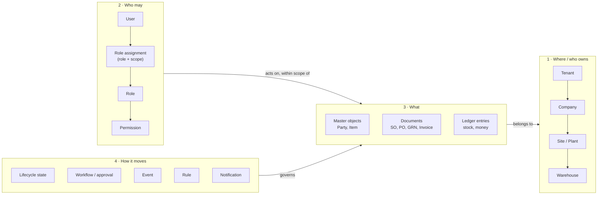

---

## 2. Organization model

### 2.1 The problem

The brief proposes one hierarchy: *Organization → Company → Business Unit → Division → Department → Plant → Warehouse → Location → Team → User.* Real companies break it immediately:

> **Example — "Sharma Packaging Pvt Ltd"**
> - One legal company, factories in **Maharashtra** (Bhiwandi) and **Gujarat** (Vapi) → two GSTINs.
> - Two business units: **Cartons** and **Labels**. The Bhiwandi plant makes **both**.
> - The **Maintenance department** serves both plants. The **Accounts department** sits at head office in Mumbai.
> - The Bhiwandi plant has three warehouses: Paper store, Ink & chemicals store, Finished goods.
> - Management reports by **Region** (West) and by **Business unit**.

Is the Bhiwandi plant *under* Cartons or *under* Labels? Is Maintenance *under* a plant? There is no single correct tree, because the brief's list mixes **four different structures**:

| Structure | Answers | Driven by |
| --- | --- | --- |
| **Legal** | Who owns the stock and money? Who files tax? | Law |
| **Physical / operational** | Where is the material? Where is work done? | Buildings, machines |
| **People** | Who reports to whom? | HR |
| **Financial / reporting** | Where are costs and profits measured? | Management accounting |
| **Security** | What may this user see? | Derived from the four above |

### 2.2 Approaches considered

| Approach | Description | Pros | Cons |
| --- | --- | --- | --- |
| **A. Fixed hierarchy** | Hard-coded levels Company → BU → Plant → … | Simple to build and query | Doesn't fit most real companies; constant special cases |
| **B. One generic configurable tree** | Any node types, any depth (like a folder tree) | Very flexible | One tree still can't express "plant serves two BUs"; code can't rely on what a node *means* (is this node allowed to hold stock?) |
| **C. Separate typed structures + configurable grouping** | Fixed core types where code needs meaning (Company, Site, Warehouse, Location, Department); separate structures linked by references; a configurable grouping tree for reporting/security | Fits reality; code can enforce legal/stock invariants; still configurable where it matters | More concepts to learn; permissions must work across several structures |
| **D. Fully generic graph** | Everything is a node with arbitrary typed edges | Maximum flexibility | Inner-platform effect; hard to query, secure and explain |

**Recommendation: C** ([ADR-0004](../adr/ADR-0004-ORGANIZATION-MODEL.md)).

### 2.3 The proposed organization model

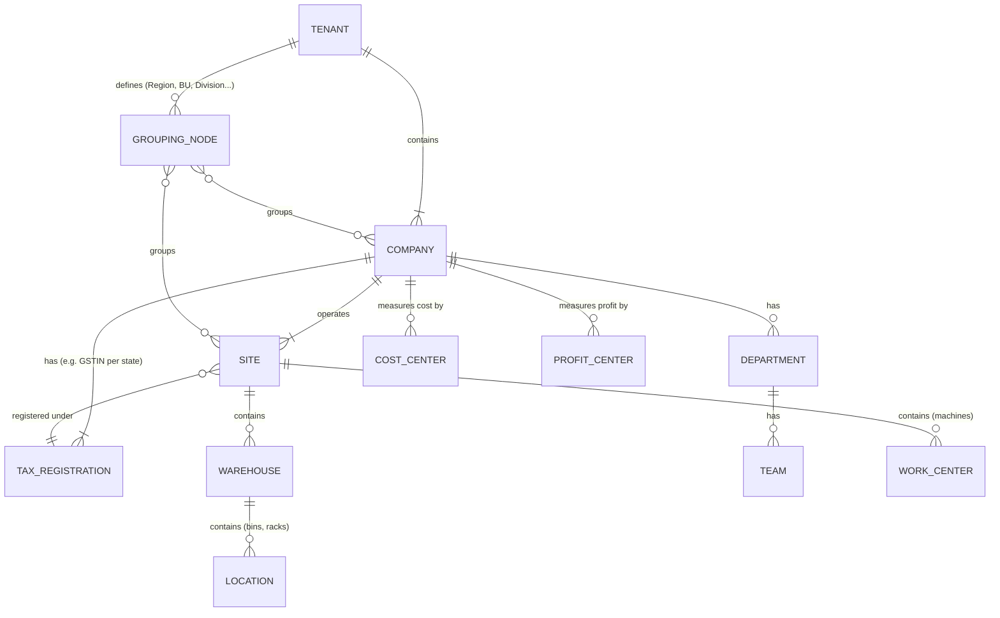

### 2.4 Definitions

| Concept | Definition | Example | Core-fixed or configurable |
| --- | --- | --- | --- |
| **Tenant** | One subscribing customer account: the isolation and billing boundary. Owns users, configuration, modules, data. | "Sharma Group" account | Fixed concept |
| **Organization** | The business group the tenant represents. **Recommendation: not a separate object** — Tenant = Organization (1:1) to avoid two nearly identical concepts. Revisit only if one account must manage several unrelated groups (e.g., an accountant serving many clients). | Sharma Group | [Q-06](../tracking/OPEN-QUESTIONS.md#q-06) |
| **Company** (Legal entity) | A legally registered entity with its own books of accounts, tax identity (PAN), and legal ownership of stock and money. Every document belongs to **exactly one** company. | Sharma Packaging Pvt Ltd; Sharma Labels LLP | Fixed concept |
| **Tax registration** | A company's registration in a tax jurisdiction. In India: one GSTIN per state. Determines tax on documents. | GSTIN 27… (Maharashtra), 24… (Gujarat) | Concept fixed; content from localization pack |
| **Site** | A physical place where the company operates. Has a **site type** (Plant, Branch, Office, Depot). "Plant" is a site that manufactures; "Branch" is a site that sells/serves. | Bhiwandi Plant, Mumbai HO | Concept fixed; site types configurable |
| **Warehouse** | A stock-holding area at a site, with its own stock balances. Belongs to **exactly one site and one company**. | Bhiwandi Paper Store | Fixed concept |
| **Location** | A sub-division of a warehouse (zone, rack, bin) for precise placement. Optional per warehouse. | Rack B-04 | Fixed concept; depth configurable |
| **Work center** | A machine or group of machines/people at a site where operations run. | Heidelberg SM-74 | Fixed concept (Manufacturing) |
| **Department** | A people/function unit for HR and responsibility. **Not** a physical place; may span sites. | Maintenance, Accounts, Production | Concept fixed; list configurable |
| **Team** | A small group within a department (shift, crew). | Press crew – Shift A | Configurable |
| **Cost center / Profit center** | Financial dimensions for measuring cost/profit. Often mapped *from* sites, departments or BUs, but are separate objects. | CC-MAINT, PC-CARTONS | Configurable |
| **Grouping node** | A configurable tree for reporting and security: Region, Zone, Division, Business Unit — whatever the customer uses. | West Region; Cartons BU | **Fully configurable** |
| **Business Unit** | In this model, a **grouping node type** (and usually a profit center), not a fixed level. | Cartons, Labels | Configurable |
| **Branch** | A **site type**, not a separate concept. | Pune sales branch | Configurable |

### 2.5 Worked example — Sharma Packaging

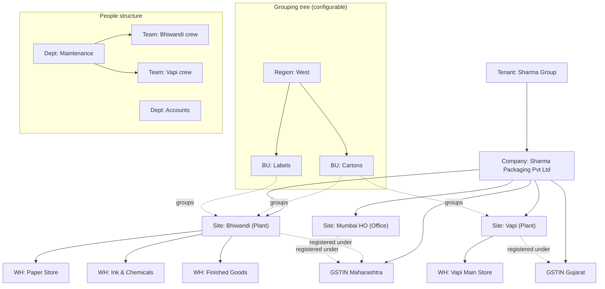

Bhiwandi belongs to **both** BUs in the grouping tree — impossible in a single hierarchy, natural here.

### 2.6 Fixed invariants (the core enforces these, configuration cannot change them)

1. Every **document** belongs to exactly **one company**.
2. Every **warehouse** belongs to exactly one **site** and therefore one **company**. Stock is legally owned.
3. Moving stock **between companies** is a **sale + purchase** (inter-company), never a plain transfer.
4. Moving stock between sites of the **same company** is a transfer — but a localization pack may add obligations (in India, inter-state transfer between two GSTINs is a taxable supply with an invoice and e-way bill).
5. A **ledger entry** always carries company (and, for stock, warehouse).
6. Organization structures are **effective-dated**: when a site moves to another region, historical reports must still show the old grouping. *(Implementation detail for Step 8.)*

### 2.7 Configurable vs fixed (organization)

| Fixed in core | Configurable per tenant |
| --- | --- |
| Concepts: Tenant, Company, Tax registration, Site, Warehouse, Location, Work center, Department | Site types, grouping node types and the grouping tree |
| The invariants in §2.6 | Which departments, teams, cost/profit centers exist |
| Every document has a company | Default mappings (site → cost center, department → cost center) |
| | Whether locations (bins) are used per warehouse |

---

## 3. Identity and access concepts

(Full security design is Step 6. Here: the concepts and their relationships.)

| Concept | Definition | Example |
| --- | --- | --- |
| **User** | A login identity that can act in the system. | ramesh@sharmapack.in |
| **Employee** | A person employed by a company (HR record). **Not the same as User**: many shop-floor employees never log in; some users are not employees (auditor, consultant, vendor-portal user). Linked optionally. | Ramesh Patil, Store Keeper |
| **Role** | A named bundle of permissions describing a job. Custom roles allowed; industry packages ship default roles. | Store Manager |
| **Permission** | Ability to perform an **action** on an **object type** (optionally a field). | `PurchaseOrder: approve`, `PurchaseOrder.unitPrice: view` |
| **Scope** | The part of the organization a permission applies to: a company, site, warehouse, grouping node, or "own records". | Site = Bhiwandi |
| **Role assignment** | User + Role + Scope. A user can have several. | Ramesh = Store Manager @ Bhiwandi; Viewer @ Vapi |
| **Approval authority** | A value limit attached to a role assignment for a document type. Separate from permission ("can approve") — it answers "up to how much". | Purchase Head: approve PO ≤ ₹10 lakh |
| **Delegation** | Temporary transfer of a user's tasks/authority to another user for a period. | Approvals delegated during leave |

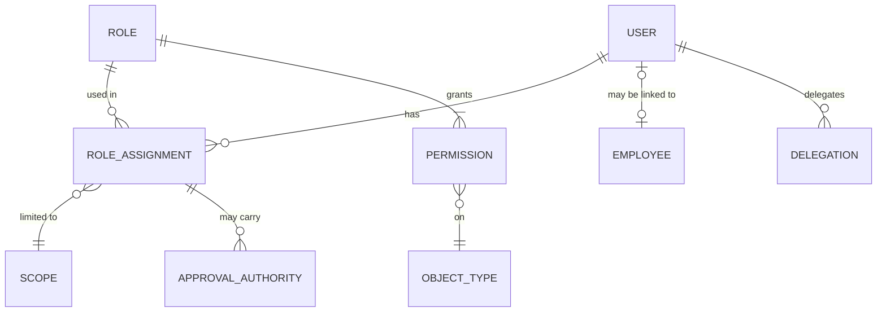

The key idea: **a permission without a scope is meaningless in a multi-site company.** "Store Manager" at Bhiwandi must not issue stock from Vapi.

---

## 4. Business objects

### 4.1 Object type vs instance

| Term | Meaning | Analogy |
| --- | --- | --- |
| **Object type** | The *definition*: fields, lifecycle, permissions, numbering. Lives in code + metadata. | A blank printed form design |
| **Instance / record** | One concrete occurrence of a type. | One filled-in form |

"Purchase Order" is an object type. "PO/24-25/0042 to ABC Paper Mills" is an instance.

### 4.2 Six kinds of objects

| Kind | What it is | Examples | Number? | Lifecycle? | Editable after confirmation? | Versioned? |
| --- | --- | --- | --- | --- | --- | --- |
| **Master** | Long-lived reference data | Party, Item, Warehouse, BOM, Price list, Machine | Code (often) | Simple: Draft → Active → Blocked → Archived | Yes, with audit; some fields locked once used | Some (BOM, routing, price lists: **effective-dated versions**) |
| **Document** (transaction) | Record of a business event | Quotation, SO, PO, GRN, Job card, Invoice, Payment | **Yes** (series) | **Yes**, rich | **No** — cancel/reverse/amend | Amendments create revisions (PO rev 1, rev 2) |
| **Document line** | Item rows inside a document | SO line: 10,000 cartons @ ₹4.20 | Line no. | Usually follows header; may have own status (line closed) | No | With document |
| **Ledger entry** | One immutable change of quantity or value | Stock +500 kg paper in Paper Store; Dr Purchases ₹42,000 | Ledger seq. | None — only exists | **Never** | Never |
| **Anchor (case)** | Optional object grouping a long-running flow | Printing Job, Pharma Batch, Project | Yes | Yes | Partly | — |
| **Configuration** | Definitions that shape behaviour | Workflow definition, numbering series, print template, custom field | Code | Draft → Published | New version instead of edit | **Yes** — running documents keep the version they started with |

### 4.3 Anatomy of a document

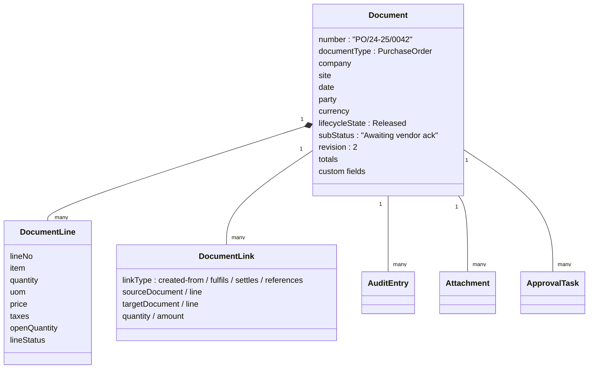

Every document type shares this anatomy — which is why the **document framework (K6)** is built once in the kernel.

### 4.4 Transaction vs Document vs Posting vs Ledger entry

These four words are often used interchangeably. In this project they are different:

| Term | Meaning | GRN example |
| --- | --- | --- |
| **Transaction** (business) | The real-world event | Truck delivers 2,000 kg of paper |
| **Document** | The record of it | GRN/24-25/0101 |
| **Posting** | The act of applying the document's effects to ledgers | "Post GRN" |
| **Ledger entries** | The immutable results | Stock ledger: +2,000 kg, Paper Store, batch R-778. GL: Dr Inventory / Cr GRN-clearing ₹1,30,000 |

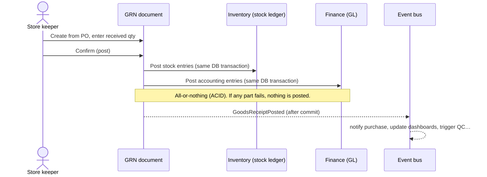

### 4.5 Customer and Vendor — one Party with roles

A printing company buys paper from a mill **and** sells its trimmed waste back to the same mill. A pharma company buys from and sells to the same distributor. If Customer and Vendor are separate masters, the same legal entity exists twice — with two GSTINs to maintain, two addresses that drift apart, and no single view of "net position with ABC".

| Approach | Pros | Cons |
| --- | --- | --- |
| Separate Customer and Vendor masters | Simple; matches many small ERPs | Duplicates; no combined view; GSTIN maintained twice |
| **One Party with roles** (customer role, vendor role, transporter role…) | One identity, one GSTIN, one address book; role-specific data (credit limit, payment terms) kept per role | Slightly more complex screens and permissions ("Sales can see the customer role but not vendor bank details") |

**Recommendation:** one **Party** master with **roles**; role-specific fields live on the role. ([Q-07](../tracking/OPEN-QUESTIONS.md#q-07))

---

## 5. Processes and "process objects"

### 5.1 The question

The brief asks how to model flows such as
*Lead → Opportunity → Quotation → SO → Delivery → Invoice → Payment* and
*PR → RFQ → Vendor quote → PO → ASN → Inbound → QC → GRN → Invoice → Payment*.

### 5.2 Why a single linear "process object" fails

Real flows are **not linear and not one-to-one**:

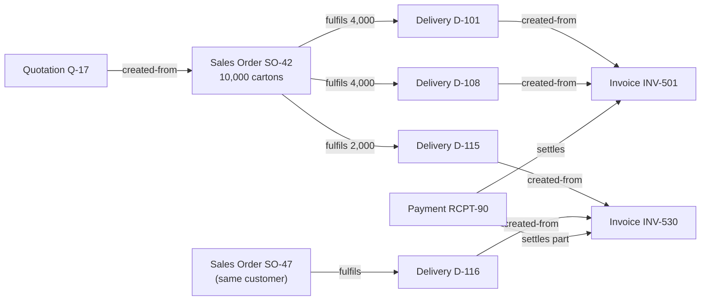

One SO → three deliveries; two deliveries → one invoice; one invoice combines two SOs; one payment settles two invoices. A single "process instance" with one state cannot represent this.

### 5.3 Approaches considered

| Approach | Description | Pros | Cons |
| --- | --- | --- | --- |
| **A. BPM process instance** | A generic process engine (BPMN-style) creates a process instance that owns the flow and spawns documents | Visual process models; explicit | Breaks on many-to-many; two sources of truth (process state vs document state); heavy engine; overkill for ERP document flows |
| **B. Document flow** | Each document has its own lifecycle; documents are linked by **typed links with quantities**; the "process" is the graph of links | Handles partial/merged/split flows naturally; proven in mature ERPs (SAP "document flow"); simple to query "what happened to this SO?" | No single place to see "the process" unless we build a view; long-running work needs grouping |
| **C. Hybrid** | B + **process definitions** as metadata (which document may be created from which, which steps are optional) + optional **anchor objects** for long-running work | Keeps B's correctness, adds configurability and a "case" view where useful | Slightly more concepts |

**Recommendation: C** ([ADR-0006](../adr/ADR-0006-PROCESS-AS-DOCUMENT-FLOW.md)).

### 5.4 Link types

| Link type | Meaning | Copies data? | Tracks quantity/amount? | Example |
| --- | --- | --- | --- | --- |
| **created-from** | Target was created using source as a starting point | Yes (snapshot at creation) | Optional | SO created from Quotation |
| **fulfils** | Target executes (part of) the source's commitment | Yes | **Yes** — reduces source's open quantity | Delivery fulfils SO lines; GRN fulfils PO lines |
| **settles** | Target clears (part of) a financial obligation | No | **Yes** — reduces open amount | Payment settles Invoice |
| **references** | Informational link only | No | No | Complaint references Invoice |

**Open quantities** come from links: SO-42 line open qty = 10,000 − Σ(fulfilling deliveries). This is how "pending orders", "pending GRN against PO", "outstanding invoices" reports are produced — from structure, not guesswork.

### 5.5 Process definitions (configurable)

A **process definition** lists the allowed paths between document types for a tenant:

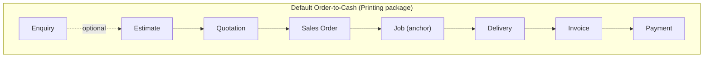

Tenant A may skip Enquiry and Estimate (repeat orders go straight to SO); tenant B requires Estimate approval before a Quotation. Same document types, different allowed paths — **configuration, not code**.

### 5.6 Anchor objects

Some work is long-running and needs a "folder" that gathers everything:

| Industry | Anchor | Gathers |
| --- | --- | --- |
| Printing (make-to-order) | **Job** | Estimate, SO line, artwork approval, plates, production order, job cards, material issues, QC, deliveries; job costing |
| Pharma | **Batch** | Batch manufacturing record, dispensing, in-process QC, release, stability samples |
| Projects/Service | **Project / Ticket** | Tasks, timesheets, purchases, invoices |

An anchor is an ordinary object type with its own lifecycle; documents point to it. Its "process status" view is **derived** from the linked documents.

### 5.7 Answers to the brief's §7 questions

| Question | Answer in this model |
| --- | --- |
| What is an object? | An **object type** — a definition (fields, lifecycle, permissions) of a kind of business thing. |
| What is an instance? | One record of an object type (PO/24-25/0042). |
| What is a document? | An instance of a transaction object type: numbered, dated, belongs to one company, has a lifecycle, immutable once confirmed. |
| What is a process? | A **document flow**: the graph of documents linked by typed links, constrained by a **process definition**. |
| What is a transaction? | The real-world business event; recorded by a document; its effects posted to ledgers. |
| What is a state? | A document's position in its lifecycle (core state + optional sub-status). |
| What is a transition? | An allowed move between states, triggered by an action, guarded by permissions, rules and approvals. |
| What is an event? | An immutable, past-tense fact emitted after a change commits (`PurchaseOrderReleased`). |
| What is an activity? | **Ambiguous in the brief.** We split it: **Task** = a work item assigned to a person by a workflow (approve, inspect). **Activity** = a CRM interaction (call, meeting, email). |
| What is a workflow? | A configurable coordination of human tasks (mostly approvals) that decides when a guarded transition may happen. |
| What is a relationship? | A typed connection between instances: master **references** (SO → Customer) or document **links** (§5.4). |
| What creates another object? | A user action or automation performing *create-from* (Quotation → SO), or a posting that generates ledger entries. |
| What merely references? | Masters on documents (customer, item, warehouse), anchor references, *references*-type links. |
| What is copied? | Data that must not change later: prices, terms, addresses, tax computation, item descriptions → **snapshot** onto the new document (§9). |
| What is inherited? | Defaults flow downward at creation time (company → site → document defaults; item → line defaults; process definition → allowed next steps). Inheritance is resolved **once, at creation**, then stored. |
| What is immutable? | Confirmed/posted documents, ledger entries, audit entries, published configuration versions (§10). |
| What is versioned? | BOMs, routings, price lists (effective dates); configuration (published versions); documents via amendments (revisions). |

---

## 6. State, transition, workflow — the two-level model

### 6.1 The conflict in the brief

The brief wants **custom statuses and workflows per customer**. But the system's correctness depends on states: inventory may only receive against a **released** PO; finance may only post a **confirmed** invoice. If a customer can rename, delete or reorder states freely, those guarantees break.

### 6.2 Resolution: core lifecycle + configurable layers

| Layer | Owned by | Can customer change? | Purpose |
| --- | --- | --- | --- |
| **Core lifecycle state** | Module code | No | Protects invariants other modules rely on |
| **Sub-status** | Configuration | Yes — add/rename sub-statuses *within* a core state | Customer-specific tracking ("Awaiting vendor ack") |
| **Approval workflow** | Configuration | Yes — levels, conditions, approvers | Decides *when* a guarded transition happens |
| **Transition guards/rules** | Configuration (on top of fixed core guards) | Add extra conditions; can't remove core guards | "Can't release PO without vendor GSTIN" |

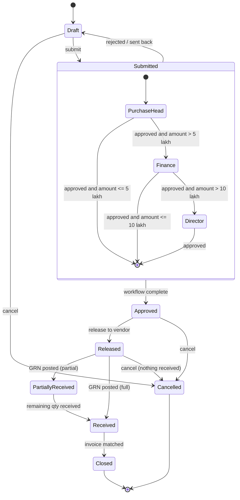

The **outer** states (Draft, Submitted, Approved, Released, …) are the **core lifecycle** — fixed. The **inner** approval chain is the **configured workflow** — another tenant could have only "Purchase Head" or a parallel approval. Recommended in [ADR-0005](../adr/ADR-0005-LIFECYCLE-VS-WORKFLOW.md).

### 6.3 Definitions

| Concept | Definition |
| --- | --- |
| **State** | Where an instance is in its core lifecycle. Exactly one at a time. |
| **Sub-status** | A configurable label refining a core state. Optional. |
| **Transition** | An allowed state change with: name (action), from-state, to-state, required permission, guards. |
| **Guard** | A condition that must be true for a transition (core or configured). |
| **Action** | What a user/system *does* to cause a transition (Submit, Approve, Release). |
| **Workflow definition** | Configured, versioned description of approval steps, conditions, approvers, escalations, SLAs. |
| **Workflow instance** | One running execution for one document. Keeps the definition **version** it started with. |
| **Task** | A unit of work assigned to a user/role by a workflow instance (approve, review). Has due date, can be delegated/escalated. |

---

## 7. Events, rules, notifications

### 7.1 Definitions

| Concept | Definition | Example |
| --- | --- | --- |
| **Event** | An immutable fact that something happened, emitted **after** the change is committed. Past tense. Carries what changed and who did it. | `PurchaseOrderApproved {po, amount, approvedBy}` |
| **Rule** | A condition + an outcome, evaluated at a defined point. | IF PO amount > ₹10 lakh THEN require Director approval |
| **Notification** | A message to recipient(s) via a channel, rendered from a template, triggered by an event (via a notification rule) or a task. | Email vendor the PO PDF |
| **Subscription / handler** | Something that reacts to an event: another module, a notification rule, an automation rule, a webhook. | Inventory reacts to `ProductionOrderReleased` by reserving material |

### 7.2 Kinds of rules (they are not all the same)

The brief's rule examples are actually **five different kinds**, evaluated at different moments:

| Kind | When evaluated | Brief's example | Effect |
| --- | --- | --- | --- |
| **Validation** | Before save / before transition | "Can't release PO without vendor GSTIN" | Blocks the action |
| **Default / derivation** | On create / field change | Default warehouse from site | Fills values |
| **Approval routing** | On submit | SO > ₹10 lakh → extra approval | Shapes the workflow |
| **Automation** | After an event | Production completed → create FG receipt; stock < reorder → replenishment suggestion | Creates/changes documents (as a system user, audited) |
| **Notification / escalation** | After an event or on a timer | Invoice overdue > 30 days → notify | Sends messages |

QC failed → block material release is **not** a configurable rule — it's a **core inventory status** (Quarantine/Rejected) that the QC result sets. Some "rules" are actually invariants and belong in code.

All kinds share **one condition language** (kernel K14) so users learn one syntax.

### 7.3 How they connect

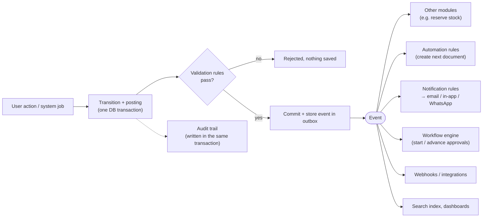

Important: the **audit entry is written inside the same transaction** as the change (it must never be lost); events are **delivered after** commit (an email must never be sent for a change that was rolled back). Detailed in Step 7.

---

## 8. "Document" — three meanings, three words

The brief uses "document" for three different things. We fix the vocabulary:

| Word | Meaning | Example |
| --- | --- | --- |
| **Document** | The business record (data) | Invoice INV/24-25/0501 |
| **Output** (rendered document) | A generated representation of a document from a template | The invoice PDF, an email body |
| **Attachment / File** | An uploaded or generated file linked to any object | Vendor's scanned invoice, artwork PDF, COA certificate |

The "Document Management" module in the brief is mostly **Outputs + Attachments**, which belong to the kernel (K6, K11).

---

## 9. Reference vs snapshot (copy) — the rule

> **Masters are referenced. Documents snapshot what they promised.**

| On a document, this data is… | Referenced | Snapshotted (copied) | Why |
| --- | --- | --- | --- |
| Customer / vendor identity | ✅ | | Need to report "all sales to ABC" |
| Billing / shipping address, GSTIN | ✅ (link) | ✅ (copy) | Invoice must show the address *as it was*; customer may move |
| Item identity | ✅ | | Stock and reports by item |
| Item description, HSN, tax rate | | ✅ | Legal document must not change if master changes |
| Price, discount, payment terms | | ✅ | Contractual |
| Exchange rate | | ✅ | Valuation must be reproducible |
| BOM used for a production order | ✅ (version id) | ✅ (exploded components on the order) | Later BOM edits must not alter running orders |
| Workflow definition | ✅ (version id) | | Running approvals keep their rules |

([ADR-0008](../adr/ADR-0008-REFERENCE-VS-SNAPSHOT.md))

---

## 10. Immutability, correction and versioning

| Object | Mutable? | How to correct |
| --- | --- | --- |
| Draft document | Yes | Edit |
| Confirmed/posted document | **No** | **Cancel** (if no follow-on documents) → creates reversing ledger entries; or **Amend** (PO revision) → new revision, old kept; or **Corrective document** (credit note, return, stock adjustment) |
| Ledger entry | **Never** | Reversal entry |
| Audit entry | **Never** | — |
| Master | Yes (audited); key fields locked once used | Block/archive instead of delete |
| Published configuration | No | Publish a new version |
| Closed accounting period | No postings | Post in open period; reopen only with special permission (audited) |

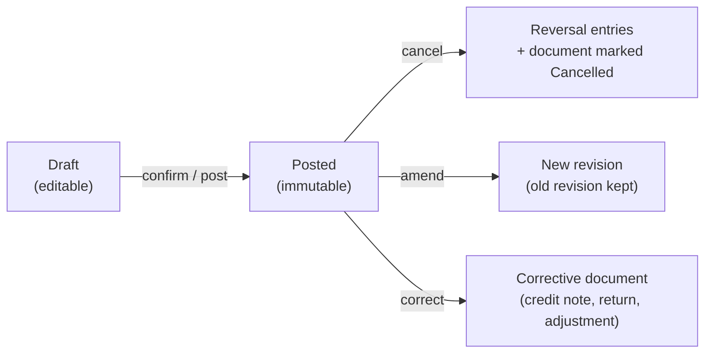

This is standard accounting practice, not a design preference — auditors and tax law expect it. ([ADR-0007](../adr/ADR-0007-IMMUTABLE-POSTED-DOCUMENTS.md))

---

## 11. Ledgers — what is the source of truth?

| Ledger | Records | Source of truth for | Owned by |
| --- | --- | --- | --- |
| **Stock ledger** | Every quantity (and value) movement per item, warehouse, location, batch | Stock on hand, stock valuation, batch traceability | Inventory |
| **General ledger** | Debit/credit lines per account | Financial statements | Finance (or exported to Tally — [Q-03](../tracking/OPEN-QUESTIONS.md#q-03)) |
| **Receivables / Payables** (sub-ledgers) | Open items per party (invoices, payments, settlements) | Who owes whom | Finance / Sales / Purchase |
| **Reservation ledger** | Quantities promised but not yet moved | Available-to-promise | Inventory |
| **Audit log** | Who changed what, when, old/new | Accountability (not a business balance) | Kernel |

**Derived (never edited directly):** stock-on-hand balances, account balances, open quantities, dashboards, search index. They can always be **rebuilt** from the ledgers and links. If a balance and its ledger disagree, the ledger wins.

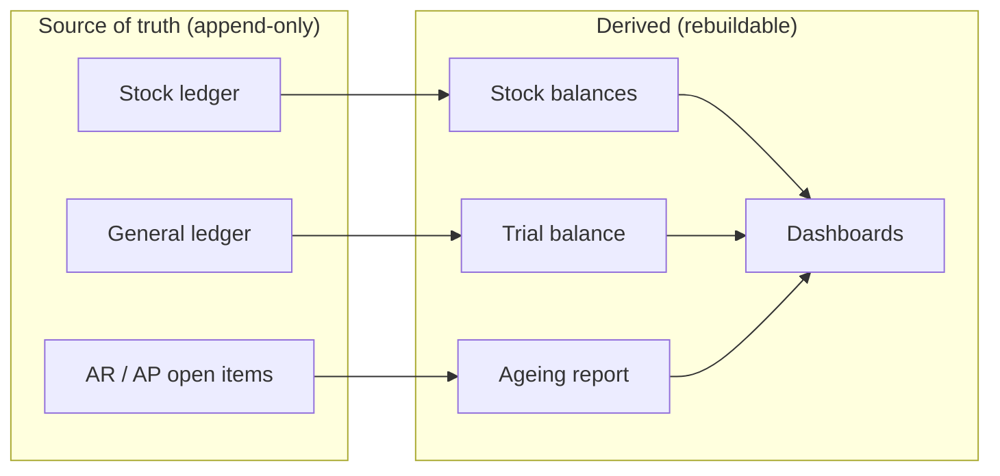

On event sourcing: ledgers give us the auditability benefit of event sourcing **only where it matters** (stock and money) without making the whole system event-sourced. Full evaluation in Step 7/8.

---

## 12. The complete concept map

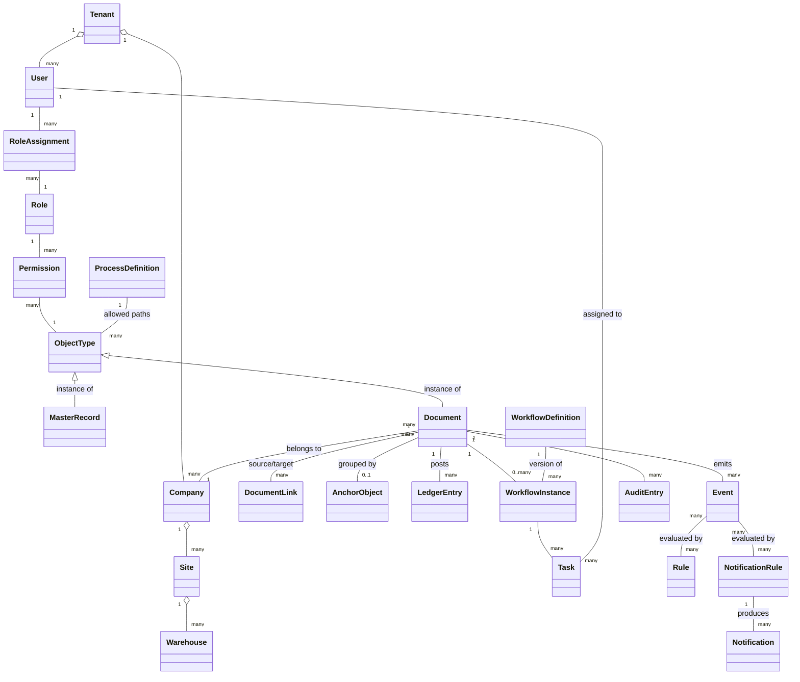

---

## 13. Proposed decisions from this step

| ADR | Decision | Status |
| --- | --- | --- |
| [ADR-0004](../adr/ADR-0004-ORGANIZATION-MODEL.md) | Separate legal / physical / people / financial structures + configurable grouping tree; fixed invariants | **Proposed** |
| [ADR-0005](../adr/ADR-0005-LIFECYCLE-VS-WORKFLOW.md) | Core lifecycle (fixed) + configurable sub-status, workflow and guards | **Proposed** |
| [ADR-0006](../adr/ADR-0006-PROCESS-AS-DOCUMENT-FLOW.md) | Process = document flow with typed links + process definitions + optional anchors | **Proposed** |
| [ADR-0007](../adr/ADR-0007-IMMUTABLE-POSTED-DOCUMENTS.md) | Posted documents and ledger entries immutable; correction by cancel/reverse/amend | **Proposed** |
| [ADR-0008](../adr/ADR-0008-REFERENCE-VS-SNAPSHOT.md) | Masters referenced, contractual/legal data snapshotted | **Proposed** |

## Open questions raised

[Q-06](../tracking/OPEN-QUESTIONS.md#q-06) Tenant = Organization 1:1? ·
[Q-07](../tracking/OPEN-QUESTIONS.md#q-07) one Party with customer/vendor roles? ·
[Q-08](../tracking/OPEN-QUESTIONS.md#q-08) multi-company in the MVP? ·
[Q-09](../tracking/OPEN-QUESTIONS.md#q-09) is "Job" the right anchor for printing?

## Related documents

- [Step 1 — Platform Definition](STEP-01-PLATFORM-DEFINITION.md)
- [Glossary](../00-context/GLOSSARY.md)
- [Open questions](../tracking/OPEN-QUESTIONS.md)
