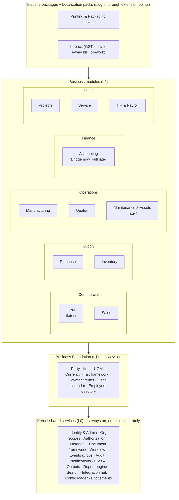
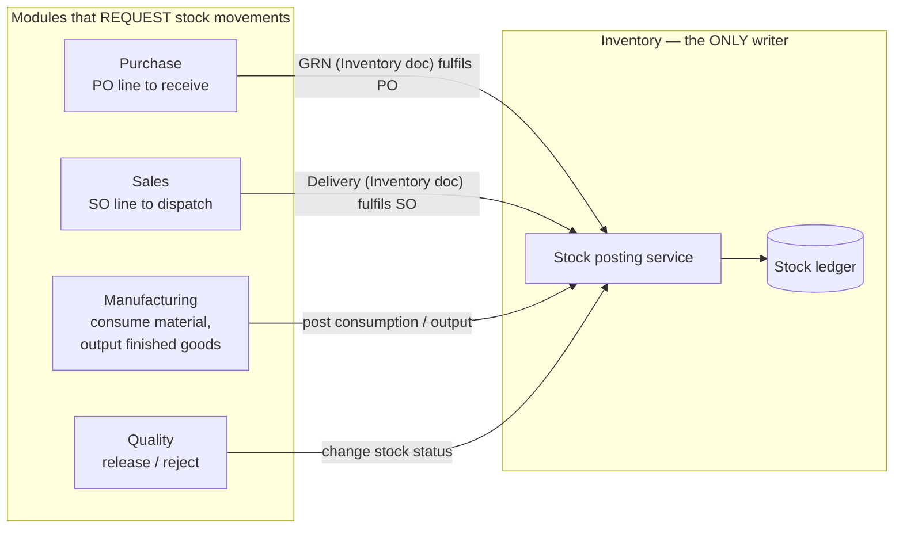
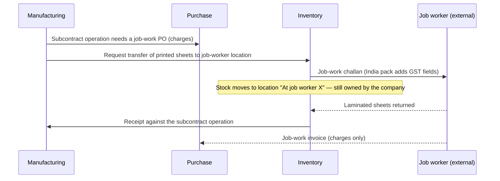
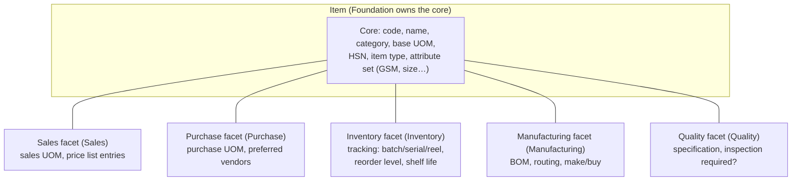
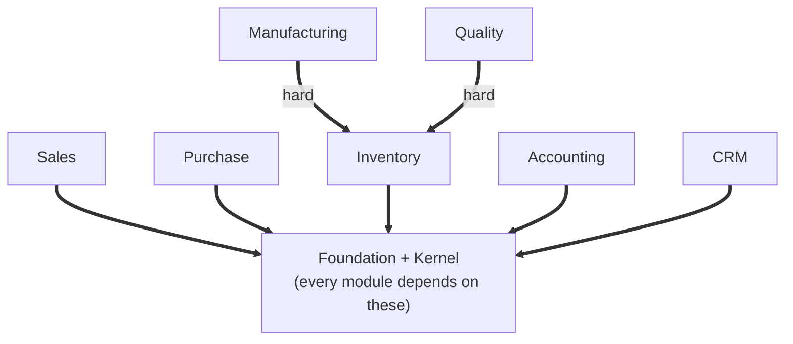
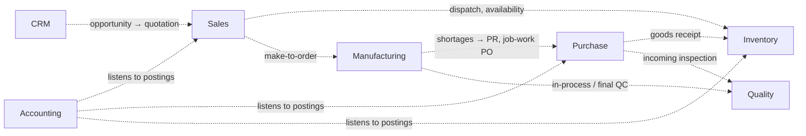
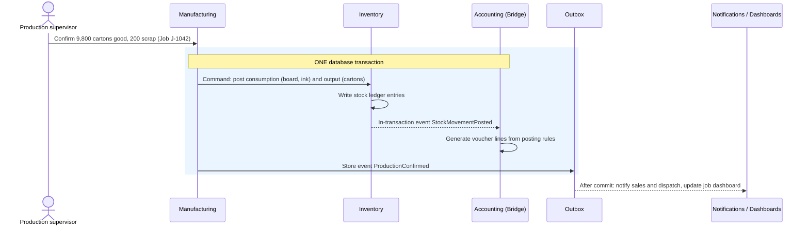
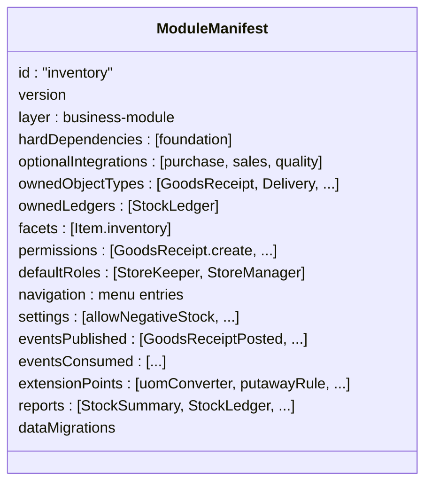
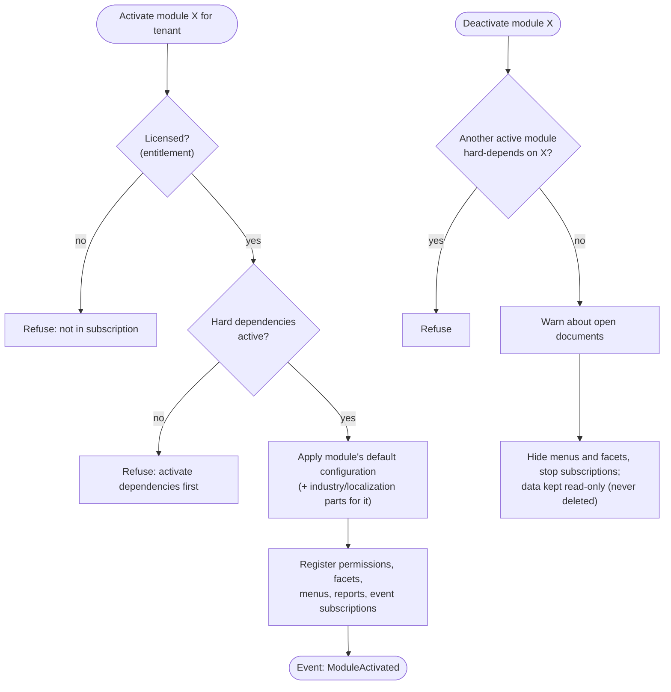
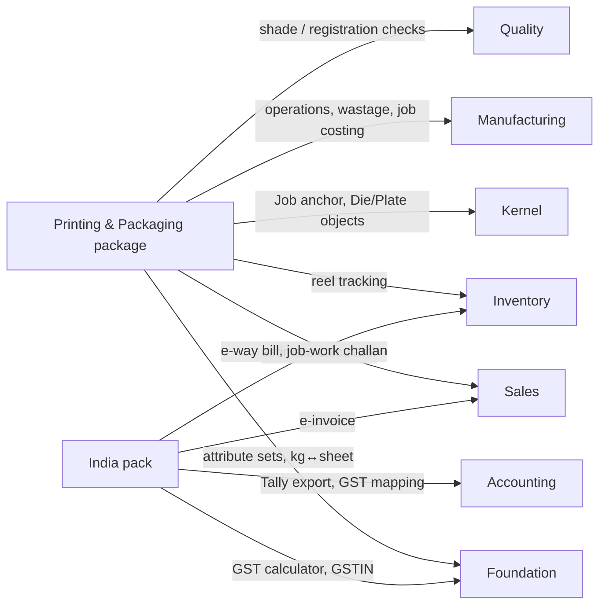

# Step 3 — Define Module Boundaries

> **Status:** In review (waiting for founder's comments) · **Last updated:** 2026-10-03
> **Answers:** What are the right modules? What does each own? What is core, optional or dependent, and what are the shared services and industry extensions? How do modules depend on and talk to each other? How are modules activated, licensed and sold?

## TL;DR

- **A module is drawn around what it owns**: its documents, its part of the master data, and at most one ledger. It is not drawn around a department name or a menu. Every document type has **exactly one owner module**.
- **Three hard boundary calls:**
  1. **Inventory owns every stock movement.** GRN, delivery/dispatch, transfer, material issue and adjustment all belong to Inventory. Only Inventory writes the stock ledger. Other modules *request* movements.
  2. **Invoices belong to Sales and Purchase, not Accounting.** Invoicing therefore works with the Tally-first decision.
  3. **The printing "Job" belongs to the Printing package**, built on the kernel's generic anchor framework. No module depends on it.
- **Three kinds of dependency:** **hard** (can't run without it: Manufacturing → Inventory), **optional integration** (works better with it: Sales ↔ Inventory), and **commercial bundling** (sold together, technically separate). Each module documents its **"without mode"**: what it does when an optional partner is switched off.
- **Four ways modules talk:** query, command, in-transaction event (for stock/money consistency) and after-commit event (for everything else). **No module reads another module's tables.**
- Each module declares a **manifest**: its dependencies, owned objects, permissions, menus, events, extension points and settings. Activation, licensing and role-aware navigation are driven by these manifests.
- The brief's dependency statements were too strong. Sales does **not** depend on CRM, Inventory or Finance; Purchase does **not** depend on Inventory or Finance. Those are optional integrations.
- **Year 1 sells one edition**, "Printing Essentials": Sales + Purchase + Inventory + Manufacturing + Quality (basic) + Accounting Bridge + India pack + Printing package. Module switches exist from day one; other combinations are sold only once they are tested.

---

## 1. What this step decides

| Brief asked (§4, §5, §6, §43 Step 3) | Answered in |
| --- | --- |
| Correct module boundaries (don't blindly follow the list) | §2–§5 |
| Core modules, optional modules, dependent modules | §3, §7 |
| Shared services | §3 (kernel services) |
| Industry extensions | §10 |
| Technical vs business dependency vs optional integration | §7 |
| Independent activation, licensing, permissions, configuration, navigation | §9 |
| Module-specific data, cross-module communication | §5, §6, §8 |
| Bundles and the module-purchasing model | §11 |

---

## 2. How to draw a module boundary

### 2.1 Approaches considered

| Approach | Description | Pros | Cons |
| --- | --- | --- | --- |
| **A. By department / menu** | Sales, Purchase, Stores, Accounts… as the company's departments see them | Familiar to users | Departments share documents (who owns the GRN: Purchase or Stores?). Ownership disputes show up as hidden coupling. |
| **B. By end-to-end process** | "Order-to-Cash" module, "Procure-to-Pay" module | Matches how flows are explained | Inventory and accounting are cut in half across processes. A stock ledger split across two modules is a disaster. |
| **C. By business capability and ownership** (a "bounded context") | Each module owns a coherent set of documents and data, and at most one ledger. It exposes contracts to others. | Clear ownership; one place for each rule; modules can be activated and sold | Requires careful decisions on the boundary cases (§5) |

**Recommendation: C.** It mostly produces the familiar module names (Sales, Purchase, Inventory…). The difference is that every boundary dispute is settled by an **ownership rule** instead of by whichever screen came first.

### 2.2 The boundary tests

A candidate is a good module if it passes these tests:

| # | Test | Example |
| --- | --- | --- |
| 1 | **Single owner:** every document type, master facet and ledger it contains is owned *only* by it | Only Inventory writes the stock ledger |
| 2 | **Single responsible person:** one business role is accountable for its data | Store manager for Inventory, Purchase head for Purchase |
| 3 | **Changes together:** its rules change for the same reasons | Costing rules and BOMs change with production practice |
| 4 | **Meaningful alone or with a clear "without mode":** it can run or degrade gracefully when partners are off | Sales without Inventory still invoices services |
| 5 | **Small public surface:** others need only a few queries, commands and events from it | Inventory: availability, reserve, move, change status |

---

## 3. The module map

### 3.1 Classification

| Category | Members | Sold? |
| --- | --- | --- |
| **Shared services (kernel)** | Identity & admin, org scopes, authorization, metadata, document framework, workflow, events & jobs, audit, notifications, files & outputs, report engine, search, integration hub, config loader, entitlements | No, always included |
| **Foundation (always on)** | Party, Item, UOM, Currency, Tax framework, Payment terms, Fiscal calendar, Employee directory (minimal) | No, always included |
| **Core business modules** (the MVP edition) | Sales, Purchase, Inventory, Manufacturing, Quality (basic), Accounting Bridge | Yes, as an edition |
| **Optional modules (later)** | CRM, Full Accounting, Maintenance & Assets, Projects, Service, HR & Payroll, Planning (MRP) | Yes, as add-ons |
| **Dependent modules** | Manufacturing (needs Inventory), Quality (needs Inventory) | Only with their hard dependency |
| **Channels (not modules)** | Customer portal, vendor portal, mobile/PWA screens | Add-ons over existing modules |
| **Industry extensions** | Printing & Packaging package (later: Corrugation, Labels; Pharma as a design test) | Yes, as the product |
| **Localization** | India pack | Included for Indian companies |

Items from the brief that are **not** modules, and where they went:
- **Administration** → kernel.
- **Document Management** → kernel (files, outputs, templates).
- **Analytics/BI** → kernel report engine, plus each module's reports.
- **Customer portal** → a channel.
- **Asset Management + Maintenance** → one later module (§4).

---

## 4. Module catalogue

| Module | Purpose | Owns (documents) | Owns (masters / facets) | Ledger it owns | MVP? |
| --- | --- | --- | --- | --- | --- |
| **Sales** | Win and fulfil customer demand, bill it | Enquiry, **Estimate** (capability), Quotation, Sales Order, **Sales Invoice**, Credit/Debit Note, Sales Return Request | Customer role data, sales price lists, discount schemes | — (posts through Accounting) | ✅ |
| **Purchase** | Source and buy | Purchase Requisition, RFQ, Vendor Quotation, Comparison, Purchase Order (incl. advance PO, job-work PO), **Purchase Invoice** (vendor bill), Debit Note | Vendor role data, purchase price agreements, vendor rating | — | ✅ |
| **Inventory** | Hold, move and value stock | **Goods Receipt (GRN)**, **Delivery/Dispatch**, Stock Transfer, **Material Issue / Return**, Stock Adjustment, Cycle Count, Job-work Challan (with India pack), Inbound Notice (ASN, later) | Warehouses & locations, item inventory facet (tracking type, reorder level), batches / serials / reels, stock statuses | **Stock ledger**, reservation ledger | ✅ |
| **Manufacturing** | Plan and execute production, cost it | Production Order, Material Requisition, Job Card / Operation Confirmation, Production Confirmation, Scrap & Rework records, Subcontract Operation | BOM (versioned), Routing, Work Centers, Operation templates, item manufacturing facet | WIP & production cost records (via Inventory and Accounting) | ✅ |
| **Quality** | Decide whether material and products are acceptable | Inspection Lot (incoming, in-process, final), Inspection Result, Release/Reject Decision, NCR, CAPA, Certificate (COA) | Specifications, inspection plans, sampling plans | — (changes stock **status** through Inventory) | ✅ basic (incoming + final inspection) |
| **Accounting — Bridge** | Turn business documents into accounting and track who owes whom | Receipt / Payment entry, Voucher (generated), Tally Export Batch | Account mapping (to Tally ledgers), posting rules, party bank details | **Receivables & payables open items** | ✅ |
| **Accounting — Full** (later) | Own the books | Journal, Bank Reconciliation, Period Close, GST return data, TDS, Fixed-asset depreciation | Chart of accounts, cost/profit center reports, budgets | **General ledger** | Later |
| **CRM** | Find and nurture demand before it is an order | Lead, Opportunity, Activity, Campaign | Lead sources, pipeline stages | — | Later (Sales has a light Enquiry) |
| **Maintenance & Assets** | Keep machines running; physical asset lifecycle | Maintenance Work Order, Breakdown Log, PM Schedule | Asset register (physical), spare-part lists | — | Later |
| **Projects / Service / HR** | Outside the first vertical | — | — | — | Later; HR & payroll probably integrate rather than build |
| **Planning (MRP)** | Suggest what to buy/make and when | Planned orders, replenishment suggestions | Planning parameters | — | Later (simple reorder suggestions live in Inventory) |

---

## 5. The hard boundary calls

These are the cases where reasonable people (and real ERPs) disagree. Each decision prevents a whole class of future bugs.

### 5.1 Who owns stock movements? → **Inventory, always**

**Rule:** every stock ledger entry is created by Inventory's posting service. **Physical-movement documents performed by stores staff** (GRN, delivery, transfer, issue, adjustment, challan) are **Inventory documents**. Other modules' documents (a production confirmation, for example) may **request** movements, and the ledger entries record which document caused them.

**Why:** valuation, batch traceability, negative-stock checks and reservations live in one place. If Purchase, Sales and Manufacturing each posted stock themselves, there would be three slightly different versions of "how stock works".

### 5.2 Who owns invoices? → **Sales (customer invoices) and Purchase (vendor bills)**

| Option | Problem |
| --- | --- |
| Invoices in Accounting | With the Tally-first decision ([ADR-0010](../adr/ADR-0010-ACCOUNTING-VIA-TALLY-FIRST.md)), a customer without full Accounting couldn't invoice. Invoicing is also a *commercial* act: it carries prices, terms and GST. |
| **Invoices in Sales / Purchase; accounting effect generated by Accounting from posting rules** | Invoicing works in every edition. Accounting stays the single place for "how a document becomes debits and credits". |

### 5.3 Who owns the estimate? → **Sales (as a capability), with the calculation from the industry package**

Estimation (configure–price–quote) is used by many make-to-order industries: printing, packaging, fabrication. The *document* (an Estimate with versions, approval, conversion to a Quotation) is generic and belongs to Sales. The *calculation* (ups per sheet, paper with wastage, make-ready, machine hours) comes from the Printing package through the **estimate-calculator extension point**. Whether Estimation should become its own module later: [Q-12](../tracking/OPEN-QUESTIONS.md#q-12).

### 5.4 Who owns the printing Job? → **The Printing package**

The kernel provides a generic **anchor framework** ([ADR-0006](../adr/ADR-0006-PROCESS-AS-DOCUMENT-FLOW.md)): any document can point to an anchor, and anchors show everything linked to them. The Printing package **defines** the Job anchor type, with its fields, sub-statuses and job-costing view. Modules only know "this document has an anchor", never "Job". This keeps the dependency rule intact: modules never depend on industry packages.

### 5.5 Quality vs Inventory — who decides a batch is usable?

- **Inventory** owns the **stock status** (Unrestricted, Quarantine, Blocked, Rejected) because it controls whether stock can be issued.
- **Quality** owns the **decision**: inspection results, release or reject. It asks Inventory to change the status.
- **Without Quality:** Inventory still supports quarantine with a simple manual release by an authorized user. This is enough for small printers. Quality adds specifications, sampling and records.

### 5.6 Material issue to production

In Indian factories, production raises a **material requisition** and stores **issues** against it. So:

| Document | Owner | Why |
| --- | --- | --- |
| Material Requisition | Manufacturing | Production decides what it needs |
| Material Issue | Inventory | Stores performs the physical movement |
| Production Confirmation (output + consumption actuals) | Manufacturing | Production reports what was made; Inventory posts the stock effect on request |

### 5.7 Job work (outsourced operations) — a printing reality

Printing SMEs routinely send printed sheets to **job workers** for lamination, UV coating, die-cutting or binding. Under Indian GST this needs **job-work challans** and periodic reporting, and **the stock still belongs to the company while it sits at the job worker.**

This spans three modules:

**Model refinement for Step 2:** a warehouse may be of type **third-party location** (stock held by a job worker or consignee). It is still owned by the company but not located at one of its sites. This refines [ADR-0004](../adr/ADR-0004-ORGANIZATION-MODEL.md) invariant 2 and will be detailed in Step 8. Whether job work is part of the MVP: [Q-13](../tracking/OPEN-QUESTIONS.md#q-13).

### 5.8 Payments

Receipts and payments are **settlement documents** owned by **Accounting**. They *settle* invoices through the document-link framework. In the MVP the Accounting Bridge tracks open items so that Sales can see overdue amounts and credit exposure. How payments are entered while Tally is the books: [Q-14](../tracking/OPEN-QUESTIONS.md#q-14).

---

## 6. Master data ownership — shared core, owned facets

A single **Item** or **Party** is needed by many modules, but each module needs different data about it. We use **facets** (SAP calls them "views"):

| Master | Core owned by | Facets owned by |
| --- | --- | --- |
| Item | Foundation | Sales, Purchase, Inventory, Manufacturing, Quality |
| Party | Foundation (identity, PAN, GSTINs, addresses) | Sales (customer role), Purchase (vendor role), Accounting (bank details, credit exposure), Inventory (transporter role) |
| Warehouse / location | Inventory | — |
| Work center | Manufacturing | Maintenance (asset link, later) |
| Employee | Foundation (minimal directory: name, department, user link) | HR (employment, payroll, later) |
| Machine | Manufacturing (as work center) / Maintenance & Assets (as physical asset, later) / Full Accounting (as fixed asset, later) | Same machine, three views linked by reference |

**Rule:** a facet appears only when its module is active. A customer without Manufacturing never sees BOM fields on the item screen.

---

## 7. Dependencies

### 7.1 Three kinds of dependency (the brief asked us to separate these)

| Kind | Meaning | Example | How it is enforced |
| --- | --- | --- | --- |
| **Hard (technical)** | The module cannot function without the other | Manufacturing → Inventory (production consumes stock) | Activation refused unless the dependency is active |
| **Optional integration** | Each works alone; together they offer more | Sales ↔ Inventory (dispatch, availability check) | Integration features appear only when both are active; each module has a **"without mode"** |
| **Commercial bundling** | Sold together because customers expect it, though technically separate | "Printing Essentials" edition | Entitlements / editions (§11), not code |

### 7.2 Dependency graph

**Hard dependencies** (the module cannot be activated without its target):

**Optional integrations** (each side works alone; together they do more):

The hard-dependency graph has **no cycles**, and must stay that way.

### 7.3 "Without modes" — what each module does when a partner is off

| Module | Partner off | Behaviour |
| --- | --- | --- |
| Sales | Inventory | No delivery document and no availability check. Invoice is created directly from the Sales Order. Suits service businesses. |
| Sales | Accounting | Invoices are still issued. No outstanding or credit-limit view. |
| Sales | Manufacturing | No make-to-order link. Orders are fulfilled from stock or as services. |
| Purchase | Inventory | No GRN. The purchase invoice is matched to the PO directly (services and expense purchases). |
| Purchase | Quality | No inspection lots. Receipts go to unrestricted stock, or to quarantine with manual release (Inventory setting). |
| Inventory | Purchase | Receipts are entered as stand-alone GRNs (no PO matching). |
| Inventory | Sales | Deliveries are stand-alone (samples, returns to vendor). |
| Manufacturing | Quality | No inspection gates. Manual quarantine release if configured. |
| Manufacturing | Purchase | Shortages are reported but no PR is created. |
| Accounting Bridge | Any | Generates vouchers only for the documents of active modules. |

Every "without mode" is a **test scenario**. That is why year 1 sells one edition (§11): we only promise combinations we have tested.

---

## 8. How modules talk to each other

### 8.1 Four communication patterns

| Pattern | What it is | Same DB transaction? | Use for | Example |
| --- | --- | --- | --- | --- |
| **1. Query** | Read data through the other module's published interface | Read only | Show information, validate | Sales asks Inventory "available qty of item X at Bhiwandi?" |
| **2. Command** | Ask the other module to do something, through its interface | **Yes** | Stock and money effects that must be all-or-nothing | Manufacturing asks Inventory to post consumption |
| **3. In-transaction event** | Publish a fact; subscribers run **inside** the same transaction | **Yes** | Consistency-critical reactions where the publisher must not know the subscriber | Sales Invoice posted → Accounting generates the voucher |
| **4. After-commit event** | Publish a fact; delivered **after** commit through the outbox | No (eventually consistent) | Notifications, dashboards, search, webhooks, non-critical automation | GRN posted → notify purchaser; update dashboard |

**Rules (fixed):**

1. **No module reads or writes another module's tables.** Only published contracts (queries, commands, events).
2. Anything that changes **stock or money** uses pattern 2 or 3. Anything else uses pattern 4.
3. Each module publishes a **contract**: its queries, commands and events. Modules depend on contracts, never on internals. (How this is enforced in code is Step 9.)
4. Events are named in the past tense and owned by the publisher (`GoodsReceiptPosted`, owned by Inventory).

### 8.2 Example — confirming a printing job's production

If any step inside the blue box fails, **nothing** is saved: no half-consumed stock and no orphan voucher.

---

## 9. Module manifest, activation and navigation

### 9.1 What every module declares

The manifest is the **single source** for activation checks, permission lists, role-aware menus and documentation of the module's contract.

### 9.2 Activation and deactivation

**Fixed rule:** deactivation **never deletes data**. Historical documents stay readable and auditable.

### 9.3 Role-aware navigation

**What a user sees = active modules ∩ the user's permissions in the current scope.**
A store keeper at Bhiwandi sees Inventory screens for Bhiwandi warehouses, and nothing from Accounting. This answers brief §19 ("a warehouse user should not see 50 finance menus") structurally, not by hand-made menus per customer.

---

## 10. Extension points — where industry and localization plug in

Modules publish **extension points**: named slots that packages fill. Packages never modify module code ([ADR-0002](../adr/ADR-0002-LAYERED-PRODUCT-MODEL.md)).

| Module / layer | Extension point | Printing package fills it with | India pack fills it with |
| --- | --- | --- | --- |
| Foundation — Item | Attribute sets | GSM, sheet size, grain, reel width, board type | HSN code rules |
| Foundation — UOM | Formula conversion | kg ↔ sheets (GSM × size), reams | — |
| Foundation — Tax | Tax calculator | — | GST (CGST/SGST/IGST, place of supply) |
| Foundation — Party | Identity validators | — | GSTIN / PAN validation |
| Kernel — Anchors | Anchor types | **Job** | — |
| Kernel — Metadata | Custom object types | Die, Plate, Artwork | — |
| Sales | Estimate calculator | Ups, paper with wastage, make-ready, machine hours, job cost | — |
| Sales | Invoice finalisers | — | E-invoice (IRN, QR) |
| Inventory | Tracking types | Reel (serialised with weight), pallet | — |
| Inventory | Movement document extensions | — | E-way bill, job-work challan |
| Manufacturing | Material requirement calculator | Wastage by process and colours | — |
| Manufacturing | Operation templates, work center types | Printing, lamination, die-cut, fold-glue; offset press, laminator | — |
| Manufacturing | Costing rule | Job costing (material + machine + make-ready + outsourced) | — |
| Quality | Specification evaluators | Colour/shade, registration, GSM check | — |
| Accounting | Posting rules, exporters | — | Tally exporter, GST ledgers mapping |

---

## 11. Editions and the module-purchasing model

### 11.1 The tension

The brief wants customers to buy single modules, bundles or everything. Technically each module *can* be switched on alone (§9). **Commercially**, each combination we sell is a combination we must test and support (§7.3). With 6 core modules there are 63 possible combinations.

### 11.2 Recommendation

| Period | What we sell | Why |
| --- | --- | --- |
| **Year 1** | **One edition: "Printing Essentials"** = Sales (with Estimation) + Purchase + Inventory + Manufacturing + Quality (basic) + Accounting Bridge + India pack + Printing package | One tested combination; matches the vertical-slice roadmap |
| Later | Add-ons: Full Accounting, CRM, Maintenance & Assets, WhatsApp/integrations, extra users, portals | Each add-on is tested against the base edition |
| Later still | Smaller editions, e.g. "Stores & Purchase" for traders, "Sales & CRM" | Only when a market for them is proven |

The **kernel entitlement mechanism is built from day one** because it is cheap (flags + manifests). Opening up combinations later is then a commercial decision, not a rewrite ([Q-15](../tracking/OPEN-QUESTIONS.md#q-15)). Pricing and billing are designed in the blueprint (brief §26).

---

## 12. MVP module scope mapped to the slices

| Slice ([ADR-0012](../adr/ADR-0012-VERTICAL-SLICE-ROADMAP.md)) | Modules touched | Key documents |
| --- | --- | --- |
| 0 Foundation | Kernel, Foundation | Party, Item (with printing attributes), org setup, users and roles |
| 1 Buy & store | Purchase, Inventory, Quality (basic) | PO, GRN, transfers, issues, adjustments, incoming inspection, reels |
| 2 Estimate & make | Sales, Manufacturing, Inventory, Printing package | Estimate, Quotation, Sales Order, Job, Production Order, Job Card, Material Requisition/Issue, Production Confirmation, (job work: Q-13) |
| 3 Ship & bill | Inventory, Sales, Accounting Bridge, India pack | Delivery, Sales Invoice, e-invoice, e-way bill, Purchase Invoice, receipts, Tally export |
| 4 Control & visibility | Kernel (workflow, notifications), all modules (reports) | Approval matrices, dashboards, WhatsApp alerts |

---

## 13. The brief's dependency statements, challenged

| Brief said | Our finding |
| --- | --- |
| "Production depends on Inventory + BOM + Item Master" | Mostly right. BOM is **part of** Manufacturing, not a dependency. Item is Foundation. Inventory is a true hard dependency. |
| "Sales may depend on CRM + Customer + Inventory + Finance" | Too strong. Sales depends only on Foundation (Party, Item). CRM, Inventory and Accounting are **optional integrations**. |
| "Purchase may depend on Vendor + Inventory + Finance" | Vendor is a Party role (Foundation). Inventory and Accounting are **optional integrations**. |
| Administration, Document Management, Analytics as modules | Kernel services, not modules (§3). |
| Asset Management and Maintenance as two modules | One later module. Fixed-asset *accounting* belongs to Full Accounting. |
| HR as a near-term module | Indian payroll (PF, ESI, PT, TDS on salary) is a separate, compliance-heavy market. Keep a minimal employee directory; HR & payroll later or by integration. |
| CRM first | Sales has a light Enquiry; full CRM later ([roadmap critique](PRELIM-ROADMAP-CRITIQUE.md)). |

---

## 14. Configurable vs fixed, risks, scalability

### 14.1 Configurable vs fixed

| Fixed in the core | Configurable per tenant |
| --- | --- |
| Which module owns which document, facet and ledger | Which modules are active (within the subscription) |
| Hard dependencies; no cycles | Which optional integrations are used (e.g., QC on receipt on/off) |
| Only Inventory writes the stock ledger | Process paths between documents across modules (process definitions) |
| The four communication patterns and their rules | Capabilities switched on: estimation, batch/reel tracking, quarantine, job work |
| Deactivation never deletes data | Role menus (derived from permissions) |

### 14.2 Risks

| Risk | Mitigation |
| --- | --- |
| A wrong ownership decision is expensive to change later | Ownership matrix (§4, §5) reviewed now; real-company validation before Step 4 ([Q-10](../tracking/OPEN-QUESTIONS.md#q-10)) |
| Hidden coupling through the shared database | Rule 8.1-1 enforced by tooling (Step 9) |
| "Without modes" multiply testing | Sell one edition in year 1 (§11) |
| Missing job work makes the product unusable for many printers | Decide [Q-13](../tracking/OPEN-QUESTIONS.md#q-13) early; design is ready (§5.7) |

### 14.3 Future scalability

Transactional modules (Sales, Purchase, Inventory, Manufacturing, Quality, Accounting) share ACID transactions and **stay together** in the modular monolith. If extraction is ever needed, the natural candidates are the **I/O-heavy or read-heavy shared services**: notifications and integrations (waiting on external APIs), report engine and search (read replicas), and PDF rendering (CPU). Clean contracts make that possible without touching the core.

---

## 15. Proposed decisions from this step

| ADR | Decision | Status |
| --- | --- | --- |
| [ADR-0014](../adr/ADR-0014-MODULE-OWNERSHIP.md) | Module boundaries by ownership; Inventory sole writer of stock; invoices in Sales/Purchase; Job in the Printing package; master facets | **Proposed** |
| [ADR-0015](../adr/ADR-0015-INTER-MODULE-COMMUNICATION.md) | Four communication patterns; no cross-module table access; contracts only | **Proposed** |
| [ADR-0016](../adr/ADR-0016-DEPENDENCY-TYPES-AND-MANIFESTS.md) | Hard / optional / commercial dependencies; without-modes; module manifests; activation rules | **Proposed** |
| [ADR-0017](../adr/ADR-0017-SINGLE-EDITION-YEAR-ONE.md) | Year 1 sells one edition ("Printing Essentials"); entitlements built from day one | **Proposed** |

## Open questions raised

[Q-12](../tracking/OPEN-QUESTIONS.md#q-12) Estimation inside Sales or its own module? ·
[Q-13](../tracking/OPEN-QUESTIONS.md#q-13) Job work in the MVP? ·
[Q-14](../tracking/OPEN-QUESTIONS.md#q-14) How are payments recorded while Tally holds the books? ·
[Q-15](../tracking/OPEN-QUESTIONS.md#q-15) One edition in year 1?

## Related documents

- [Step 1 — Platform Definition](STEP-01-PLATFORM-DEFINITION.md) (layers, kernel services)
- [Step 2 — Domain Model](STEP-02-DOMAIN-MODEL.md) (documents, links, anchors, ledgers)
- [Preliminary roadmap critique](PRELIM-ROADMAP-CRITIQUE.md) (vertical slices)
- [Glossary](../00-context/GLOSSARY.md)
