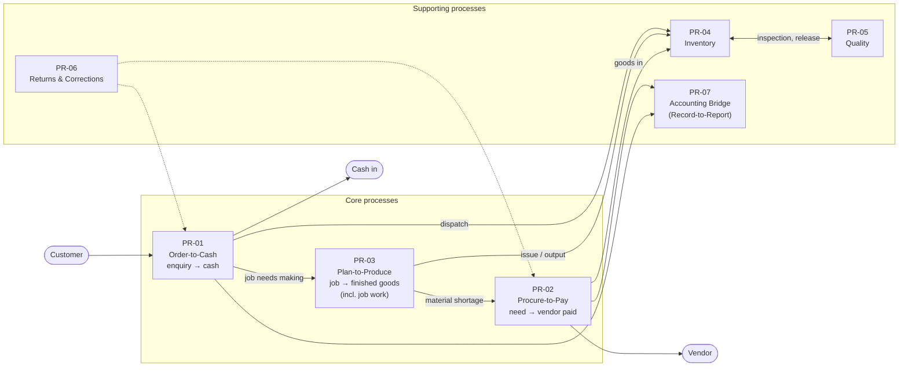
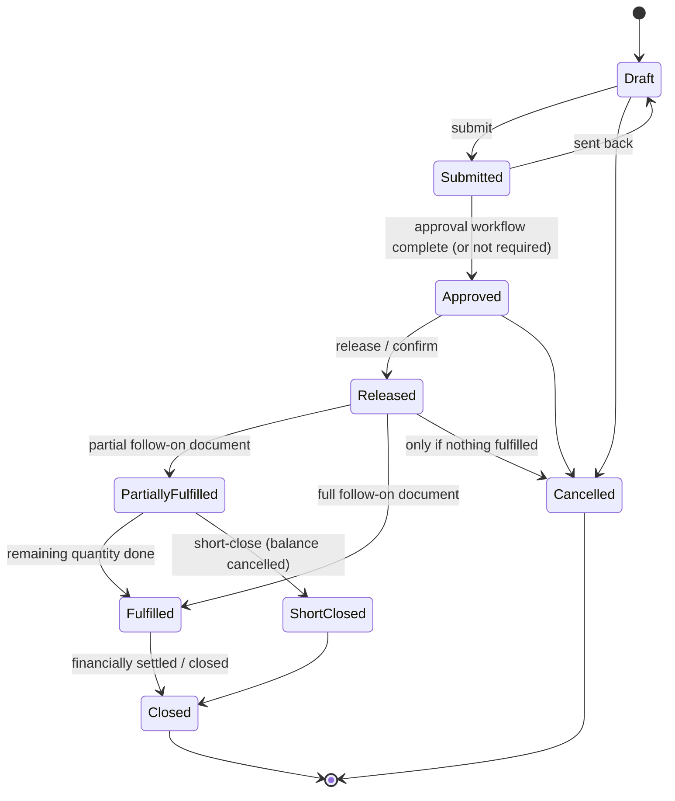
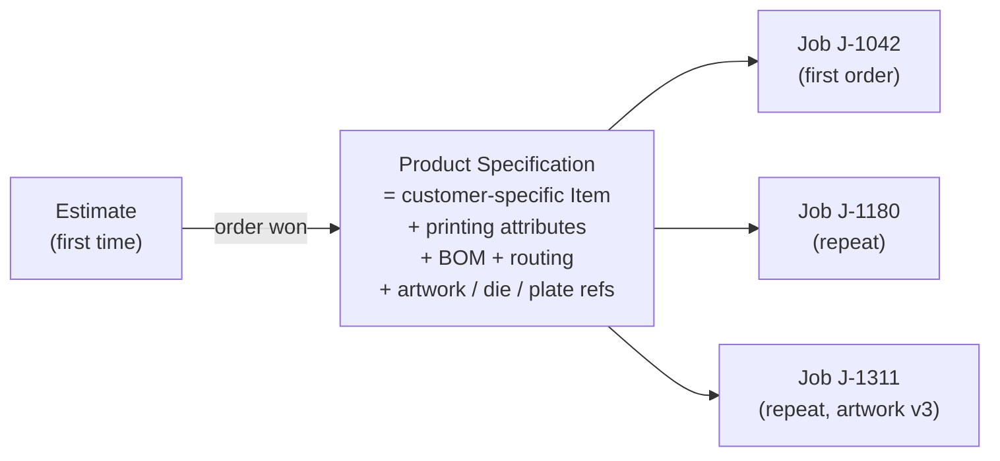

# Step 4 — Process Architecture (overview)

> **Status:** Accepted by founder (2026-10-03), pending pilot validation · **Validation:** ⚠️ *Hypothesis.* Built from general knowledge of Indian printing and packaging SMEs, **not yet validated with a real company** ([Q-10](../tracking/OPEN-QUESTIONS.md#q-10)). Use the [Pilot Interview Guide](../tracking/PILOT-INTERVIEW-GUIDE.md) to validate it.
> **Last updated:** 2026-10-03
> **Answers:** How do the business processes of the first vertical actually run, across documents, modules and people? Where are the approvals, events, ledger postings, exceptions and configuration points?

## TL;DR

- We map **seven processes** for a Printing & Packaging SME:
  1. **Order-to-Cash**
  2. **Procure-to-Pay**
  3. **Plan-to-Produce** (including job work)
  4. **Inventory**
  5. **Quality**
  6. **Returns & Corrections**
  7. **Accounting Bridge** (Record-to-Report)
- Each has its own file, so a session loads only what it needs.
- Every process uses the **Step 2 patterns**: documents linked by *created-from / fulfils / settles*, a fixed core lifecycle plus configurable approvals, and ledger postings only through the owner module.
- **Three printing realities shape the design:**
  1. **Repeat orders dominate.** A customer's carton is reordered many times with the same artwork, die and plates, so finished goods are **customer-specific product specifications**, created once (usually from an estimate) and reused.
  2. **Quantity changes unit mid-route.** Board is bought in kg, printed in sheets and delivered in pieces (sheets × ups).
  3. **Delivered quantity rarely equals ordered quantity.** Over- and under-runs within a **tolerance** are normal, so **short-close** is a core action, not an exception.
- Proposed decisions:
  - Customer product specification ([ADR-0018](../adr/ADR-0018-CUSTOMER-PRODUCT-SPECIFICATION.md))
  - WIP tracked per job operation, not as stocked semi-finished items ([ADR-0019](../adr/ADR-0019-WIP-BY-JOB-OPERATION.md))
  - Tolerances and short-close in the core lifecycle ([ADR-0020](../adr/ADR-0020-TOLERANCE-AND-SHORT-CLOSE.md))
  - Weighted-average stock valuation ([ADR-0021](../adr/ADR-0021-WEIGHTED-AVERAGE-VALUATION.md))
  - Voucher-level Tally export with export locks ([ADR-0022](../adr/ADR-0022-TALLY-EXPORT-GRANULARITY.md))
- **New risk found:** many printers do **conversion jobs on customer-supplied board**. That means *someone else's stock* in our warehouse, which breaks the Step 2 invariant "stock in our warehouse is ours" ([Q-16](../tracking/OPEN-QUESTIONS.md#q-16)).

---

## 1. Process landscape (level 0)

| ID | Process | File | Main modules | Slice |
| --- | --- | --- | --- | --- |
| PR-01 | Order-to-Cash | [STEP-04A](STEP-04A-ORDER-TO-CASH.md) | Sales, Inventory, Accounting, Printing pkg, India pack | 2, 3 |
| PR-02 | Procure-to-Pay | [STEP-04B](STEP-04B-PROCURE-TO-PAY.md) | Purchase, Inventory, Quality, Accounting | 1, 3 |
| PR-03 | Plan-to-Produce (incl. job work) | [STEP-04C](STEP-04C-PLAN-TO-PRODUCE.md) | Manufacturing, Inventory, Purchase, Printing pkg | 2 |
| PR-04 | Inventory | [STEP-04D](STEP-04D-INVENTORY-AND-QUALITY.md) | Inventory | 1 |
| PR-05 | Quality | [STEP-04D](STEP-04D-INVENTORY-AND-QUALITY.md) | Quality, Inventory | 1, 2 |
| PR-06 | Returns & Corrections | [STEP-04E](STEP-04E-RETURNS-CORRECTIONS-AND-ACCOUNTING.md) | All | 3 |
| PR-07 | Accounting Bridge | [STEP-04E](STEP-04E-RETURNS-CORRECTIONS-AND-ACCOUNTING.md) | Accounting, India pack | 3 |

---

## 2. How processes are described (notation)

Each process file uses the same structure:

| Section | Diagram type | Shows |
| --- | --- | --- |
| Happy path | `flowchart` grouped by role | Who does what, in order |
| Document flow | `flowchart` | Which documents create / fulfil / settle which |
| Lifecycles | `stateDiagram-v2` | Core states of the key documents |
| Interactions | `sequenceDiagram` | Cross-module calls for the tricky steps |
| Tables | — | Approvals, events, ledger postings, variants, exceptions, validation questions |

---

## 3. The people (personas) in a printing SME

Small printers are **not** large organizations. One person often holds several roles. The owner frequently estimates, approves and plans.

| Persona | Typical tasks | Device |
| --- | --- | --- |
| **Owner / MD** | Approves estimates, prices and big POs; watches cash, pending orders and job profitability | Phone + desktop |
| **Sales executive / CSR** | Enquiries, quotations, customer follow-up, order entry | Desktop + phone |
| **Estimator** (often the owner) | Costing, ups, paper calculation | Desktop |
| **Pre-press / designer** | Artwork, proofs, plate making (CTP) | Desktop |
| **Production planner / manager** | Job planning, machine loading, job work | Desktop |
| **Machine operator / supervisor** | Job card entries: good/waste, time, make-ready | **Shop-floor phone/tablet** |
| **Store keeper** | Receipts, issues, reels, stock counts | **Phone/tablet** |
| **QC inspector** | Incoming, OK-sheet, final inspection | Phone/tablet |
| **Dispatch** | Packing, delivery challan, e-way bill, vehicle | Desktop/phone |
| **Purchase** | Board and consumables buying, vendor follow-up | Desktop + phone |
| **Accountant** | Invoices, receipts, payments, Tally export | Desktop |

**Design consequences:**

- Roles must **combine** freely. One user can be sales, estimator and approver.
- **Self-approval** must be configurable: if the submitter already holds the approval authority, the approval step is skipped and recorded in the audit trail.
- Shop-floor and store screens must work on a **phone**.

---

## 4. Cross-cutting process patterns

These patterns repeat in every process. They are defined once here.

### 4.1 Standard document lifecycle

Most transaction documents follow this core lifecycle ([ADR-0005](../adr/ADR-0005-LIFECYCLE-VS-WORKFLOW.md)). Individual documents use a subset of it.

### 4.2 Partial fulfilment, tolerance and short-close (ADR-0020)

| Concept | Meaning | Printing example |
| --- | --- | --- |
| **Partial fulfilment** | A follow-on document covers part of the open quantity | 10,000 cartons ordered, 4,000 dispatched this week |
| **Tolerance** | Allowed over- or under-delivery, as a % per line (default per customer or vendor) | ±10% on carton orders is common; board POs ±5% by weight |
| **Over-delivery within tolerance** | Accepted; the line becomes Fulfilled and the invoice uses the actual quantity | 10,450 cartons delivered against 10,000 ordered |
| **Short-close** | Close a line with a balance still open; the balance is cancelled, with a reason | 9,700 delivered, customer accepts, line closed |
| **Outside tolerance** | Needs an authorized user (configurable approval) | 11,500 delivered against 10,000 |

### 4.3 Approval points (defaults in the Printing package; all configurable)

| Document | Typical rule | Approver |
| --- | --- | --- |
| Estimate | Margin below X% or value above ₹Y | Owner |
| Quotation | Price below the estimate's minimum price | Owner |
| Sales Order | Customer over credit limit or has overdue invoices | Owner / accounts |
| Purchase Order | Value above ₹Y | Owner / purchase head |
| Stock adjustment | Any write-off above ₹Y | Owner |
| Artwork | Customer approval of the proof (external) | Customer, recorded by pre-press |
| Over-tolerance delivery or receipt | Outside tolerance | Production / purchase head |
| Credit note | Any | Owner |

### 4.4 The ledger rule in processes

Only these steps change **stock** (through Inventory) or create **accounting vouchers** (through Accounting):

| Step | Stock ledger | Accounting voucher (exported to Tally) |
| --- | --- | --- |
| GRN posted | + material (often Quarantine first) | Purchase accrual *(optional — see [Q-18](../tracking/OPEN-QUESTIONS.md#q-18))* |
| QC release/reject | Status change only | — |
| Material issue / return | − / + material | — |
| Production confirmation | + finished goods, + scrap | — |
| Job-work dispatch / receipt | Move to / from third-party location | — |
| Delivery (dispatch) | − finished goods | — |
| Sales invoice | — | Sales voucher (customer Dr, sales Cr, GST Cr) |
| Purchase invoice | — | Purchase voucher |
| Receipt / payment | — | Receipt / payment voucher |
| Credit / debit note | — | Credit / debit note voucher |
| Stock adjustment | ± | *(optional)* |

### 4.5 Events and notifications (defaults)

| Event | Default notification / automation |
| --- | --- |
| `EnquiryReceived` | Notify estimator |
| `EstimateApprovalRequested` | Notify owner (in-app; WhatsApp later) |
| `QuotationSent` | Follow-up reminder after N days |
| `SalesOrderConfirmed` | **Create Job automatically**; notify planner and pre-press |
| `ArtworkApproved` | Notify pre-press/planner: plates can be made |
| `MaterialShortageDetected` | Create PR suggestion; notify purchase |
| `PurchaseOrderApproved` | Email PO PDF to vendor |
| `GoodsReceiptPosted` | Notify QC (if inspection needed) and the purchaser |
| `QualityRejected` | Notify purchase and owner |
| `ProductionConfirmed` (final operation) | Notify dispatch and sales |
| `JobWorkOverdue` | Notify planner (material at job worker too long) |
| `DeliveryPosted` | Notify accounts to invoice (if not auto) |
| `InvoiceOverdue` | Reminder to customer and sales |
| `VendorPaymentDue` (MSME vendor near 45 days) | Notify accounts (Indian MSME payment rule) |

### 4.6 Configurable process variants (process definitions)

| Variant | Default (Printing package) | Alternatives |
| --- | --- | --- |
| Estimate before quotation | Required for new products | Skip for repeat orders (quote from last price) |
| Quotation before order | Optional | Direct order entry from the customer's PO |
| Artwork approval gate before plates | Required for new or changed artwork | Off for plain/reprint jobs |
| Purchase requisition | Optional | Required above value X |
| RFQ / vendor comparison | Optional | Required above value X |
| Gate entry before GRN | Off | On for larger factories ([Q-20](../tracking/OPEN-QUESTIONS.md#q-20)) |
| Incoming QC | On for board/paper | Off, or manual quarantine release |
| Delivery before invoice | On (goods) | Direct invoice (services, scrap) |

---

## 5. Three modelling consequences found in Step 4

### 5.1 Customer product specification (ADR-0018)

A printer's finished goods are **not** a generic catalogue. Each is a specific customer's product, such as "ABC Pharma – Paracetamol 500 mg 10×10 carton". It has its own artwork, die, plates, board spec, BOM and routing. It is reordered for years.

**Proposal:** a finished product is an **Item** (Foundation) linked to a customer, with printing attributes (Printing package), a versioned BOM and routing (Manufacturing), and references to the Artwork, Die and Plate objects (Printing package). Repeat orders reference the spec. The estimate for a repeat order starts from the spec, not from scratch.

### 5.2 WIP is tracked by job operation (ADR-0019)

Printed-but-not-finished sheets could be modelled as stocked semi-finished items, with an item code and a stock balance. For an SME that means hundreds of throwaway item codes.

| Option | Pros | Cons |
| --- | --- | --- |
| Semi-finished items in stock | Exact WIP stock per stage; standard ERP way | Item explosion; store-keeping steps between every operation |
| **WIP = quantities per job operation** (in, good, waste, out) | Matches how printers think ("job is at lamination, 9,800 sheets"); no item explosion | Job-work challans and WIP valuation must be derived from job data |

**Proposal:** WIP is tracked per **job operation**. When WIP leaves the factory for job work, the challan describes it from the job ("Printed sheets — Job J-1042, 9,800 sheets") and Inventory holds it at the job worker's third-party location as **job-bound WIP**. Validate with the pilot ([Q-19](../tracking/OPEN-QUESTIONS.md#q-19)).

### 5.3 Customer-supplied material — a new ownership case (Q-16)

Many printers also do **conversion** work: the customer supplies the board and the printer charges only for printing and conversion. Here *we* are the job worker. The board in our warehouse **belongs to the customer**.

This breaks the Step 2 invariant ("stock in a company's warehouse is owned by that company").

| Option | Description |
| --- | --- |
| A. Don't support in MVP | Simple. Excludes conversion-heavy printers. |
| **B. Stock ownership dimension** | Every stock ledger entry carries an **owner** (own company, or a named party). Customer-owned stock is received, issued to jobs and returned in kind, but it is never valued in our books and never sold. |
| C. Track outside the stock ledger | Hidden spreadsheets again — defeats the ERP. |

**Recommendation:** design option B into the stock ledger now (cheap at design time, expensive to retrofit), and switch it on for the first pilot that needs it. Invoicing for conversion jobs is a **service** with a different GST treatment, handled by the India pack.

---

## 6. Design test: does pharma fit the same process architecture?

| Pharma need | Same mechanism? |
| --- | --- |
| Batch as the anchor (instead of Job) | ✅ Anchor framework |
| Mandatory QC release of every incoming lot | ✅ Quarantine + Quality decision ([04D](STEP-04D-INVENTORY-AND-QUALITY.md)) |
| Dispensing with potency adjustment | ✅ Material-requirement extension point |
| Batch manufacturing record | ✅ Job card / operation confirmation, plus e-signatures (kernel capability, later) |
| Expiry, FEFO picking | ✅ Inventory batch attributes + picking rule extension point |
| Stability studies | Custom object (pharma package) — later |

No process pattern needs a different design. Pharma adds **rules and records**, not new structures. The design test passes.

A real bridge between the two industries: **pharma-packaging printers** (cartons, leaflets, labels for pharma companies) are a large segment in India. They already need artwork version control and certificates of analysis, so they are a natural early market ([Q-21](../tracking/OPEN-QUESTIONS.md#q-21)).

---

## 7. Proposed decisions from this step

| ADR | Decision | Status |
| --- | --- | --- |
| [ADR-0018](../adr/ADR-0018-CUSTOMER-PRODUCT-SPECIFICATION.md) | Customer-specific product specification reused across repeat orders | Accepted |
| [ADR-0019](../adr/ADR-0019-WIP-BY-JOB-OPERATION.md) | WIP tracked per job operation, not as stocked semi-finished items | Accepted |
| [ADR-0020](../adr/ADR-0020-TOLERANCE-AND-SHORT-CLOSE.md) | Tolerance and short-close in the core document lifecycle | Accepted |
| [ADR-0021](../adr/ADR-0021-WEIGHTED-AVERAGE-VALUATION.md) | Moving weighted-average stock valuation for the MVP | Accepted |
| [ADR-0022](../adr/ADR-0022-TALLY-EXPORT-GRANULARITY.md) | Voucher-level Tally export; exported documents locked; corrections via new documents | Accepted |

## Open questions raised

[Q-16](../tracking/OPEN-QUESTIONS.md#q-16) customer-supplied material ·
[Q-17](../tracking/OPEN-QUESTIONS.md#q-17) valuation method ·
[Q-18](../tracking/OPEN-QUESTIONS.md#q-18) Tally export granularity ·
[Q-19](../tracking/OPEN-QUESTIONS.md#q-19) WIP per job operation ·
[Q-20](../tracking/OPEN-QUESTIONS.md#q-20) gate entry ·
[Q-21](../tracking/OPEN-QUESTIONS.md#q-21) pharma-packaging printers as the first segment

## Related documents

- Process files: [04A Order-to-Cash](STEP-04A-ORDER-TO-CASH.md) · [04B Procure-to-Pay](STEP-04B-PROCURE-TO-PAY.md) · [04C Plan-to-Produce](STEP-04C-PLAN-TO-PRODUCE.md) · [04D Inventory & Quality](STEP-04D-INVENTORY-AND-QUALITY.md) · [04E Returns, Corrections & Accounting](STEP-04E-RETURNS-CORRECTIONS-AND-ACCOUNTING.md)
- [Pilot Interview Guide](../tracking/PILOT-INTERVIEW-GUIDE.md)
- [Step 2 — Domain Model](STEP-02-DOMAIN-MODEL.md) · [Step 3 — Module Boundaries](STEP-03-MODULE-BOUNDARIES.md)
