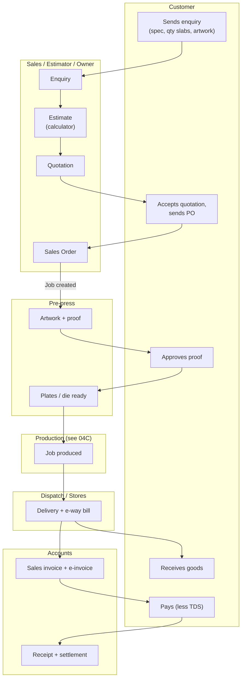
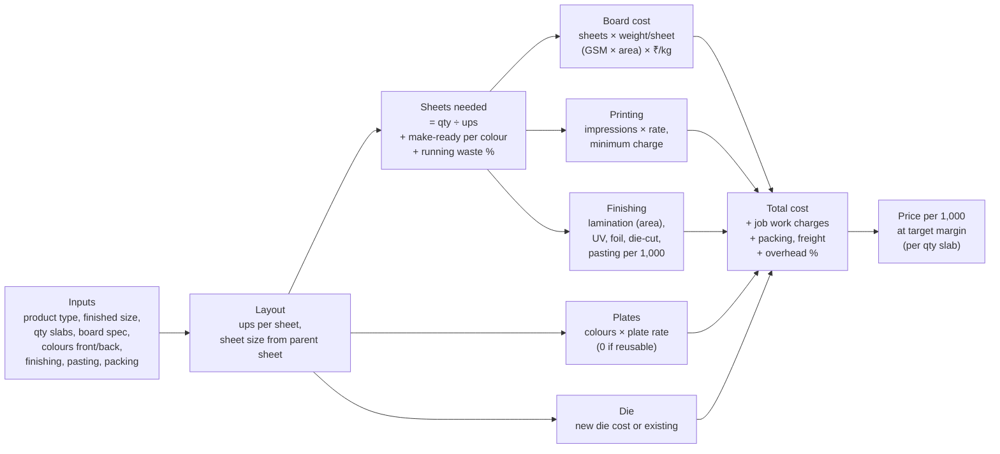
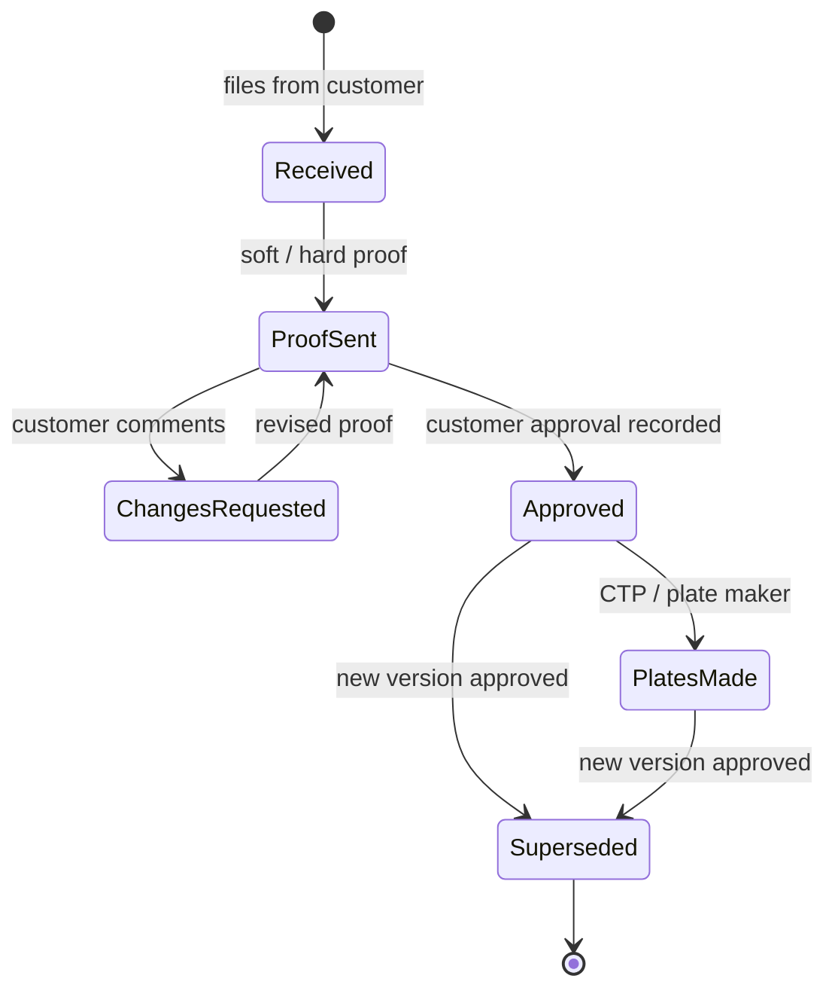
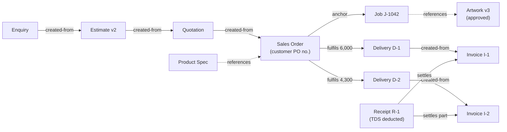
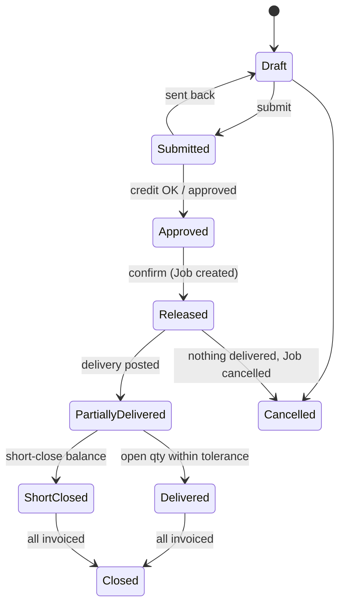
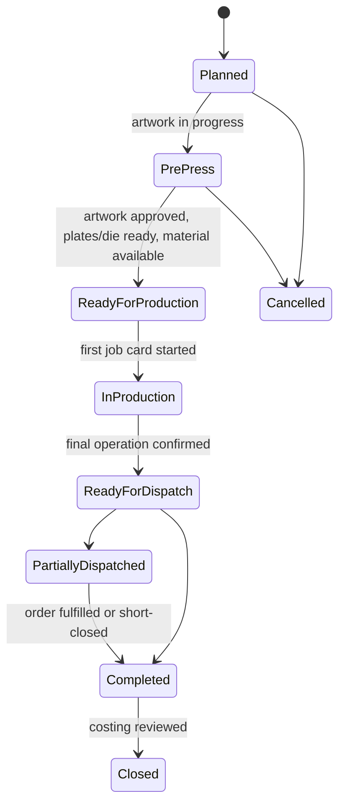
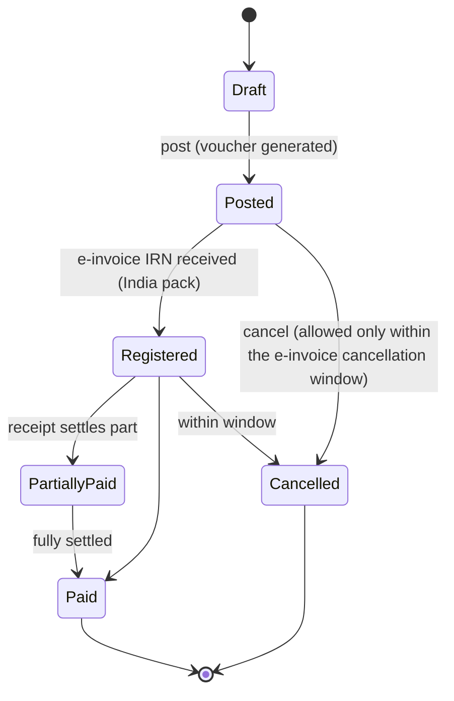
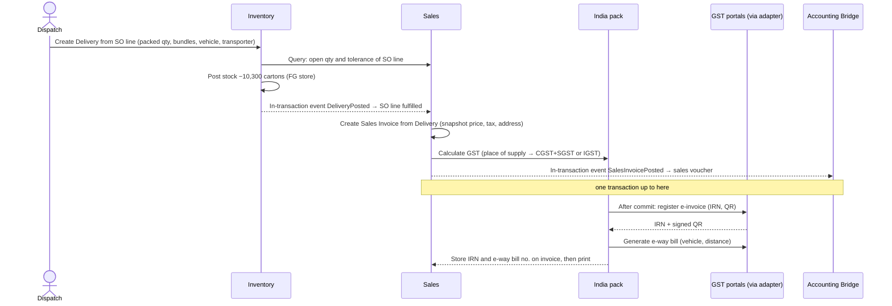

# Step 4A — PR-01 Order-to-Cash (Printing & Packaging)

> **Status:** Accepted by founder (2026-10-03), pending pilot validation · **Validation:** ⚠️ Hypothesis, not yet validated with a real company · **Last updated:** 2026-10-03
> **Part of:** [Step 4 — Process Architecture](STEP-04-PROCESS-ARCHITECTURE.md)

## TL;DR

- **Flow:** Enquiry → **Estimate** → Quotation → Sales Order → **Job** (+ artwork approval) → *[Plan-to-Produce]* → Delivery → Sales Invoice (+ e-invoice, e-way bill) → Receipt.
- The **estimate** is where printers win or lose money. It runs the Printing package's calculator (ups, paper with wastage, plates, machine time, finishing, job work) for several quantity slabs, and keeps versions.
- **Repeat orders** skip the estimate: a new Sales Order line references the existing **customer product specification**.
- **Artwork approval** is a gate before plates are made. Artwork is versioned; pharma-packaging customers change text often.
- Dispatch is **partial and within tolerance**. The invoice is created from the delivery, with the actual quantity.
- Receipts often arrive **short** because of customer TDS, discounts or disputes. Settlement must record the reason for the difference.

---

## 1. Happy path by role

## 2. Step by step

| # | Step | Actor | Document (owner module) | Core state change | Event |
| --- | --- | --- | --- | --- | --- |
| 1 | Record enquiry: product type, size, qty slabs, board, colours, finishing, artwork files | Sales | Enquiry (Sales) | Draft → Open | `EnquiryReceived` |
| 2 | Calculate cost for each qty slab | Estimator | Estimate (Sales; calculator from Printing pkg) | Draft → Submitted → Approved | `EstimateApproved` |
| 3 | Quote rates per 1,000 for each slab; send PDF | Sales | Quotation (Sales) | Draft → Sent → Won / Lost | `QuotationSent` |
| 4 | Enter the customer's PO as an order; credit check | Sales | Sales Order (Sales) | Draft → Approved → Released | `SalesOrderConfirmed` |
| 5 | Create **Job** per order line; create or reuse the **product specification** | System (automation) | Job (Printing pkg anchor); Product Spec | Job: Planned | `JobCreated` |
| 6 | Artwork proof → customer approval | Pre-press | Artwork version (Printing pkg) | Proof sent → Approved | `ArtworkApproved` |
| 7 | Produce | Production | see [04C](STEP-04C-PLAN-TO-PRODUCE.md) | Job: In production | `ProductionConfirmed` |
| 8 | Pack and dispatch (partial allowed); e-way bill | Dispatch | Delivery (Inventory) fulfils SO line | SO line: Partially fulfilled / Fulfilled | `DeliveryPosted` |
| 9 | Invoice from delivery; e-invoice IRN | Accounts | Sales Invoice (Sales) created-from Delivery | Draft → Posted | `SalesInvoicePosted` |
| 10 | Record receipt; settle invoices; record TDS/short reasons | Accounts | Receipt (Accounting) settles Invoice | Invoice: Partially paid / Paid | `ReceiptPosted` |
| 11 | Close job (costing complete) | Planner/Owner | Job | Completed → Closed | `JobClosed` |

## 3. The estimate — where the money is made

### 3.1 What the calculator does (Printing package extension point)

### 3.2 Estimate rules

| Rule | Why |
| --- | --- |
| Several **quantity slabs** in one estimate (5k / 10k / 25k) | Customers ask "what if"; the price per 1,000 drops with quantity |
| **Versions**: a revised estimate creates a new version; the quotation references a version | Negotiation history; the margin at the time of quoting is preserved |
| Rates (board ₹/kg, machine rates, finishing rates) come from **rate tables** with effective dates | Paper prices change often; old estimates stay reproducible (snapshot, [ADR-0008](../adr/ADR-0008-REFERENCE-VS-SNAPSHOT.md)) |
| Approval if margin < X% or value > ₹Y | The owner controls pricing |
| On order, the estimate's layout, BOM and operations **seed the product spec** | The same numbers drive planning, material issue and costing — estimate vs actual is then meaningful |

## 4. Artwork and pre-press

- Each artwork **version** is an attachment with its own approval record: who approved, when, and how (email or signature). A Job references **exactly one approved version**.
- A plate or die is linked to the artwork version and product spec, so the system can answer "can we reuse plates for this repeat order?"
- Pharma-packaging customers: a text change is a new version, and the old plates are **blocked** from use.

## 5. Document flow

## 6. Lifecycles

### 6.1 Sales Order (header follows its lines)

### 6.2 Job (anchor, defined by the Printing package)

These Job states are **sub-statuses defined by the Printing package**. The kernel anchor framework only knows open / completed / closed / cancelled.

### 6.3 Sales Invoice

After the e-invoice cancellation window (currently 24 hours on the government portal), an invoice **cannot be cancelled**; it is corrected with a **credit note** ([04E](STEP-04E-RETURNS-CORRECTIONS-AND-ACCOUNTING.md)).

## 7. Dispatch and invoicing (cross-module)

**Failure handling:** if the government portal is down, the invoice stays *Posted, not Registered*. The system retries, and the invoice cannot be printed as final until registered. That is configurable, and it is a **real operating risk at dispatch time** (Step 7 designs the retries).

## 8. Receipt and settlement

| Situation | How it is recorded |
| --- | --- |
| Full payment | Receipt settles invoice(s) |
| Customer deducted **TDS** | Receipt amount + TDS receivable line = invoice amount; the TDS certificate is tracked later |
| Cash discount / rate dispute | Settlement difference with a **reason**; credit note if agreed |
| **Advance** before production | Receipt with no invoice → open advance; settled against a later invoice |
| One payment for many invoices | One receipt settles many invoices (oldest first by default, editable) |

Receipts are entered in the ERP and exported to Tally ([Q-14](../tracking/OPEN-QUESTIONS.md#q-14), agreed).

## 9. Credit control

On Sales Order submit, the system queries Accounting for **exposure** = open invoices + uninvoiced deliveries + this order. If exposure exceeds the credit limit or overdue invoices exist, an **approval** step is added (configurable: block or approve). Without the Accounting Bridge active, no credit check runs ([Step 3 §7.3](STEP-03-MODULE-BOUNDARIES.md#73-without-modes--what-each-module-does-when-a-partner-is-off)).

## 10. Variants

| Variant | How |
| --- | --- |
| **Repeat order** | SO line picks the existing product spec; price from the last order or price list; Job reuses plates/die if the artwork version is unchanged |
| Direct order without quotation | SO created directly (process definition allows it) |
| Rate contract with a customer | Price list per customer with validity; SO lines take the price from it |
| Scrap sale (waste paper) | Sales invoice for the scrap item from scrap stock; no Job |
| **Conversion job** (customer-supplied board) | Board received as customer-owned stock; invoice is for the service ([Q-16](../tracking/OPEN-QUESTIONS.md#q-16)) |
| Sample / proof delivery | Delivery without invoice (non-returnable sample), with a reason |

## 11. Exceptions

| Exception | Handling |
| --- | --- |
| Customer changes quantity after the order | Amend SO (new revision); Job and plans updated; re-approval if the value increases |
| Customer cancels | Cancel SO line if nothing produced; otherwise short-close and decide what to do with produced stock (hold for customer / scrap) |
| Artwork changes after plates are made | New artwork version; old plates blocked; plate cost recorded on the job (chargeable or not) |
| Over-run beyond tolerance | Approval to deliver/invoice the extra, or keep it as stock for a future repeat order |
| Customer rejects goods | Returns process ([04E](STEP-04E-RETURNS-CORRECTIONS-AND-ACCOUNTING.md)) |

## 12. Reports this process needs (MVP)

Enquiry and quotation conversion · **Pending orders (open qty per line, due date)** · **Job status board** · Dispatch register · Sales register (GST) · **Outstanding and ageing** · **Estimate vs actual per job** (from 04C) · Customer-wise sales.

## Related documents

[Step 4 overview](STEP-04-PROCESS-ARCHITECTURE.md) · [04C Plan-to-Produce](STEP-04C-PLAN-TO-PRODUCE.md) · [04E Returns & Accounting](STEP-04E-RETURNS-CORRECTIONS-AND-ACCOUNTING.md) · [Pilot Interview Guide §A](../tracking/PILOT-INTERVIEW-GUIDE.md#a-order-to-cash)
