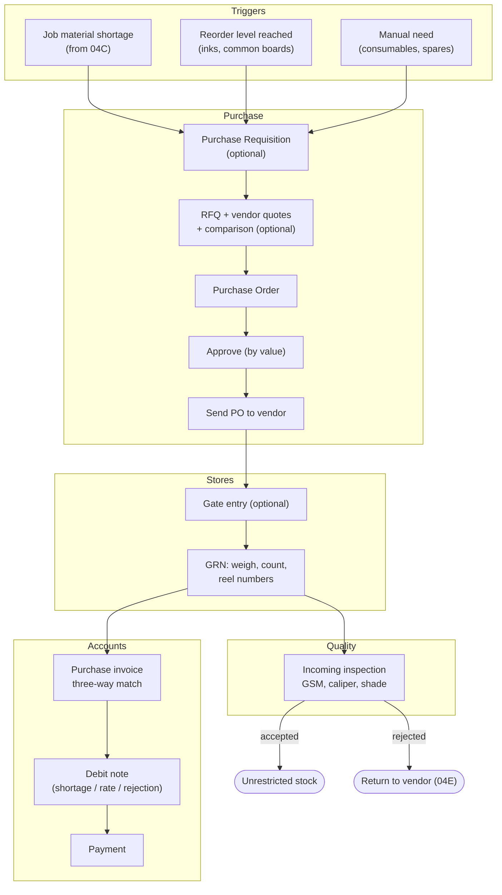
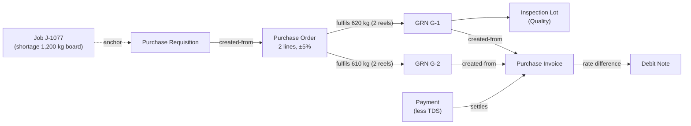
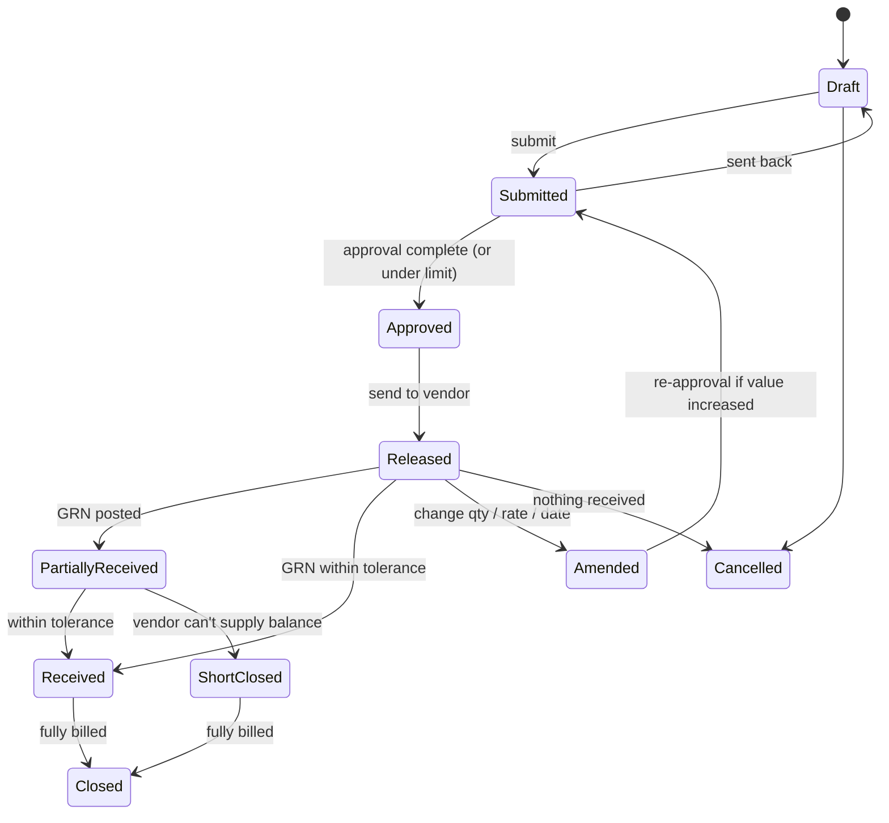
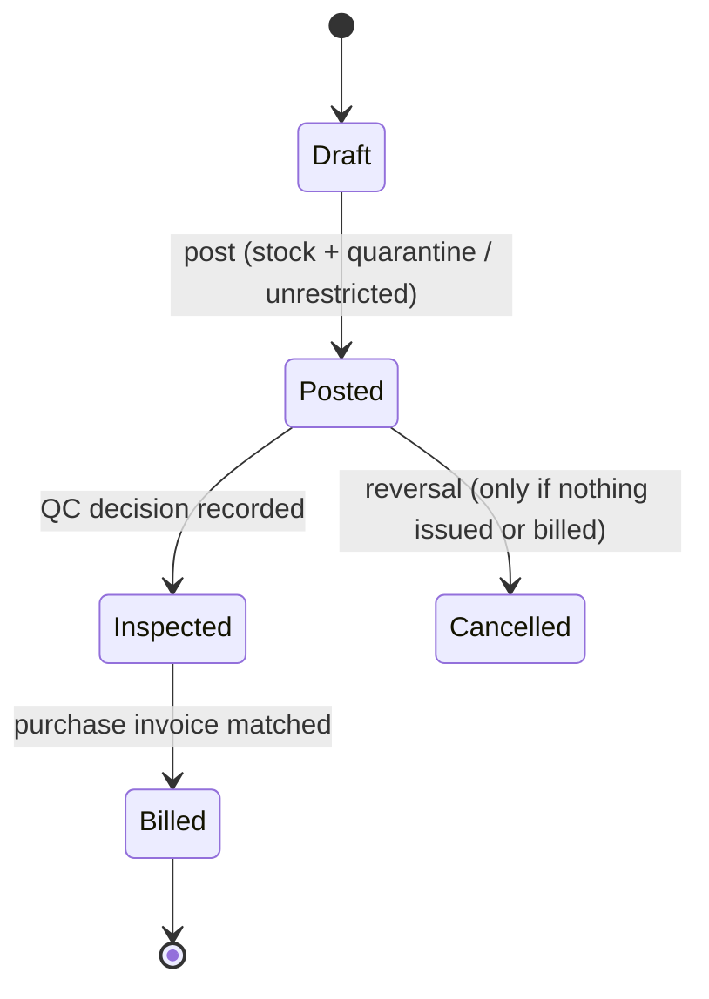
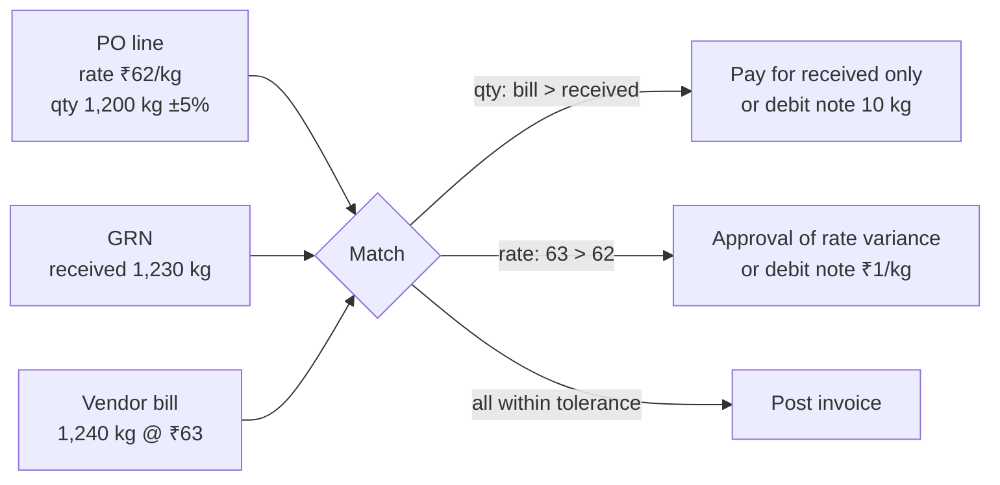

# Step 4B — PR-02 Procure-to-Pay

> **Status:** Accepted by founder (2026-10-03), pending pilot validation · **Validation:** ⚠️ Hypothesis, not yet validated with a real company · **Last updated:** 2026-10-03
> **Part of:** [Step 4 — Process Architecture](STEP-04-PROCESS-ARCHITECTURE.md)

## TL;DR

- **Flow:** Need (job shortage / reorder / manual) → *Purchase Requisition (optional)* → *RFQ & comparison (optional)* → **Purchase Order** (approval by value) → vendor dispatch → *Gate entry (optional)* → **GRN** (weigh, count reels) → **Incoming QC** → release to stock → **Purchase Invoice** (three-way match) → Debit note if needed → **Payment** → Tally export.
- Board and paper are often bought **for a specific job** (make-to-order procurement). PO lines can carry the **Job** anchor, so job costing gets the actual board rate.
- Paper arrives as **reels with individual weights**. The GRN records each reel's number and weight. The invoice weight and the received weight often differ, and the tolerance decides what happens.
- The **vendor invoice often arrives with the truck**. The process allows the bill to be recorded at the GRN or later.
- Indian specifics (India pack):
  - Vendor GSTIN validation.
  - Input GST.
  - TDS on purchases above thresholds.
  - **MSME vendors must be paid within 45 days.** The system tracks the due date and alerts accounts.

---

## 1. Happy path by role

## 2. Step by step

| # | Step | Actor | Document (owner) | State change | Event |
| --- | --- | --- | --- | --- | --- |
| 1 | Raise need | System / planner / store | Purchase Requisition (Purchase) — optional | Draft → Approved | `PurchaseRequisitionApproved` |
| 2 | Ask vendors for rates; compare | Purchase | RFQ, Vendor Quotation, Comparison (Purchase) — optional | Open → Awarded | `VendorAwarded` |
| 3 | Create PO: item, GSM, size, qty (kg / sheets / reels), rate, tolerance, delivery date, freight terms, optional Job | Purchase | Purchase Order (Purchase) | Draft → Submitted | `PurchaseOrderSubmitted` |
| 4 | Approve by value; release; email/WhatsApp PDF | Owner / system | PO | Approved → Released | `PurchaseOrderApproved` |
| 5 | Vehicle arrives; record vendor invoice no., e-way bill, vehicle | Security / stores | Gate Entry (Inventory) — optional | Recorded | `GateEntryRecorded` |
| 6 | Receive: weigh reels, count sheets, record reel no. + weight | Store keeper | **GRN (Inventory)** fulfils PO lines | PO: Partially received / Received | `GoodsReceiptPosted` |
| 7 | Inspect; accept / reject / accept with deviation | QC | Inspection Lot + Decision (Quality) | Stock: Quarantine → Unrestricted / Rejected | `QualityReleased` / `QualityRejected` |
| 8 | Book vendor bill; match PO rate, GRN qty, bill | Accounts | **Purchase Invoice (Purchase)** created-from GRN | Draft → Posted | `PurchaseInvoicePosted` |
| 9 | Debit note for shortage / rate difference / rejection | Accounts | Debit Note (Purchase) | Posted | `DebitNotePosted` |
| 10 | Pay vendor (less TDS if applicable) | Accounts | Payment (Accounting) settles invoice | Invoice: Paid | `PaymentPosted` |

## 3. Document flow

## 4. Lifecycles

### 4.1 Purchase Order

**Amendment** creates a new **revision** of the PO (rev 1, rev 2). The old revision is kept, as [ADR-0007](../adr/ADR-0007-IMMUTABLE-POSTED-DOCUMENTS.md) requires.

### 4.2 GRN (Inventory)

## 5. Receiving paper and board — the details that matter

| Detail | Design |
| --- | --- |
| Reels have individual numbers and weights | GRN line → one **reel record** per reel (serialised tracking with weight). Weight decreases as the reel is consumed (partial issues) |
| Sheets come in reams/packets | UOM conversion: packets → sheets; and sheets ↔ kg via GSM × size (Printing package formula) |
| Weighbridge weight ≠ invoice weight | GRN records the **received** weight. Difference within tolerance → accept; outside → debit note for the shortage or approval |
| Received GSM ≠ ordered GSM | Incoming QC records actual GSM. Accept with deviation (rate renegotiation) or reject |
| Vendor invoice comes with the goods | GRN may record vendor invoice no. and date; Purchase Invoice can be created immediately from the GRN |
| Freight paid separately | Freight as a separate service line or landed-cost charge added to the material's value (landed cost: [Q-17](../tracking/OPEN-QUESTIONS.md#q-17) context) |

## 6. Three-way match

Match tolerances (quantity %, rate %, absolute ₹) are configurable per company.

## 7. Variants

| Variant | How |
| --- | --- |
| Small firm: owner orders by phone | PO entered after the fact (approval auto-skipped for the owner — self-approval rule) |
| Job-specific board purchase | PO line carries the Job anchor; receipt can be **reserved for that Job** automatically |
| Advance payment to vendor | Payment with no invoice → open advance; settled against the invoice later |
| Services / expenses (no stock) | PO (optional) → Purchase Invoice directly; no GRN (Purchase *without Inventory* mode, per line type) |
| Job work charges | Job-work PO (from 04C) → service bill from the job worker |
| Rate contract with a mill | Purchase price agreement with validity; PO takes the rate from it |

## 8. Exceptions

| Exception | Handling |
| --- | --- |
| Partial delivery | PO stays Partially received; balance short-closed if the vendor can't supply |
| Excess delivery beyond tolerance | Approval to accept, or return the excess (vendor return) |
| Material rejected at QC | Stock → Rejected; vendor return delivery + debit note ([04E](STEP-04E-RETURNS-CORRECTIONS-AND-ACCOUNTING.md)) |
| Bill arrives before goods | Purchase Invoice held as *Awaiting receipt*; matched when the GRN posts |
| Wrong item supplied | GRN against the PO refused; record a non-PO receipt with approval, or reject at the gate |

## 9. Indian compliance hooks (India pack)

| Hook | Where |
| --- | --- |
| Vendor GSTIN / PAN validation | Party (vendor role) |
| Input GST split (CGST/SGST/IGST), reverse charge for specific services | Purchase Invoice tax calculator |
| TDS on purchase of goods / job work above thresholds | Payment (deduction) and Purchase Invoice (provision) |
| **MSME vendor flag + 45-day payment due date** | Vendor role + `VendorPaymentDue` alert |
| E-way bill number from the vendor | Gate entry / GRN reference |

## 10. Reports this process needs (MVP)

Pending POs (open qty, due date) · Pending GRNs to bill · **Rate history per item/vendor** · Vendor performance (on-time, rejection %) · Purchase register (GST) · **Payables ageing with MSME due dates**.

## Related documents

[Step 4 overview](STEP-04-PROCESS-ARCHITECTURE.md) · [04D Inventory & Quality](STEP-04D-INVENTORY-AND-QUALITY.md) · [04E Returns & Accounting](STEP-04E-RETURNS-CORRECTIONS-AND-ACCOUNTING.md) · [Pilot Interview Guide §B](../tracking/PILOT-INTERVIEW-GUIDE.md#b-procure-to-pay)
