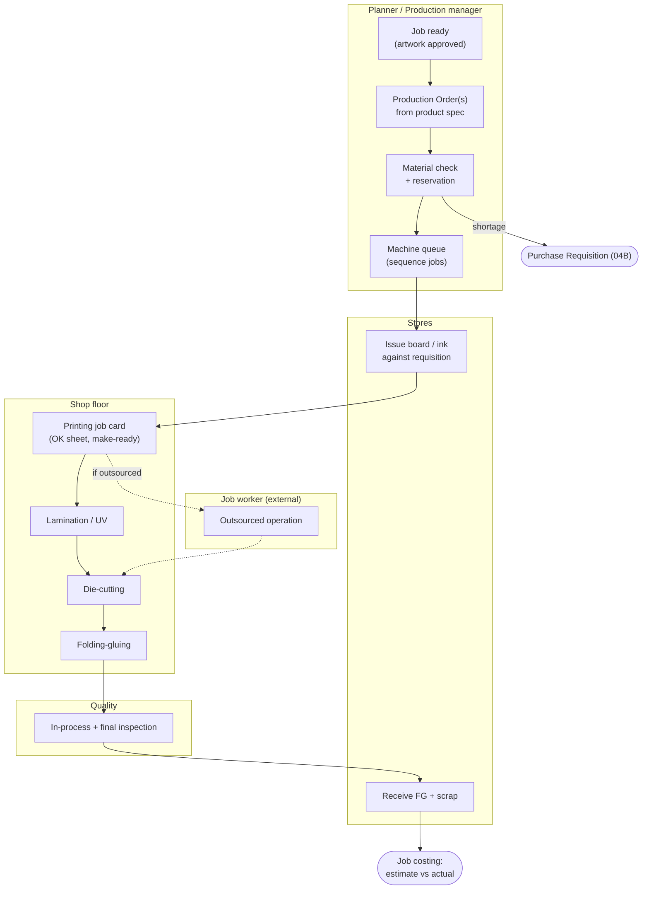
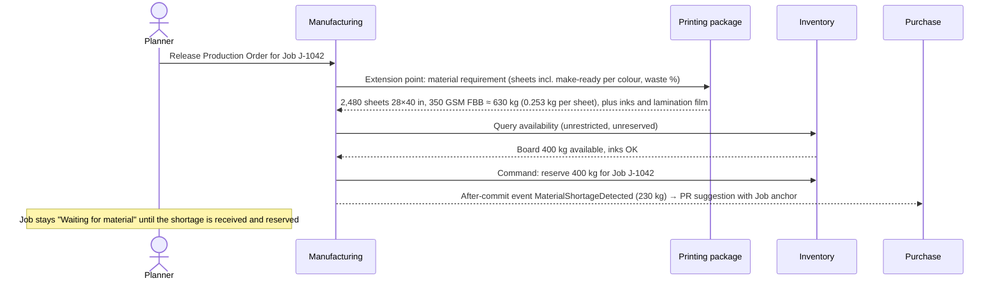
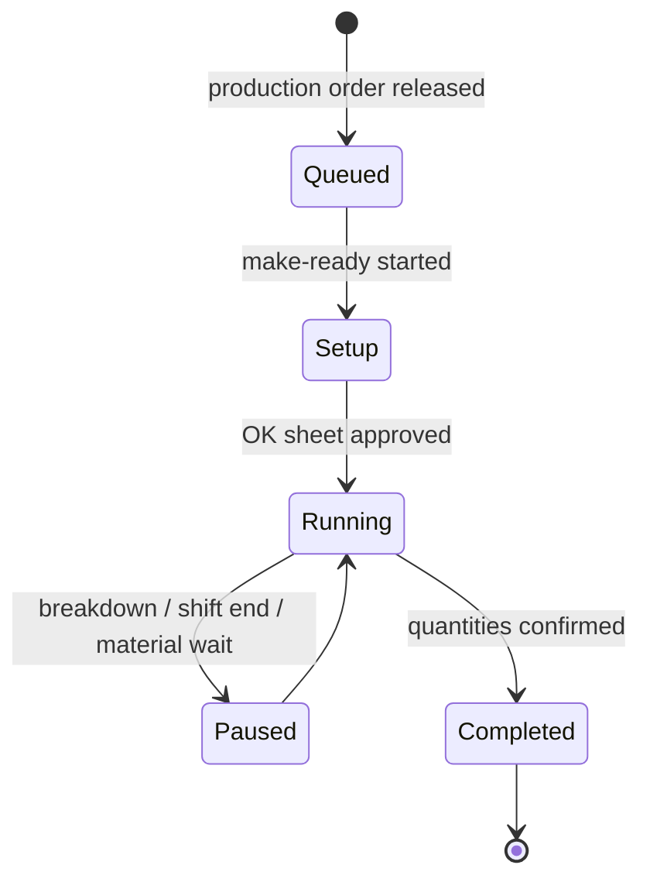
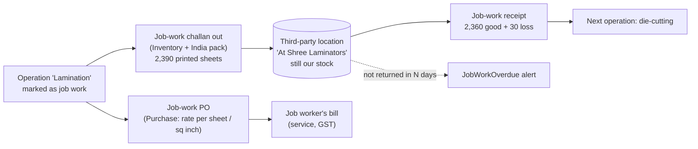
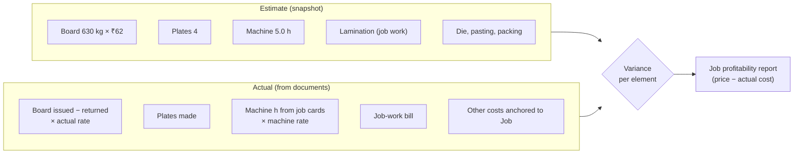
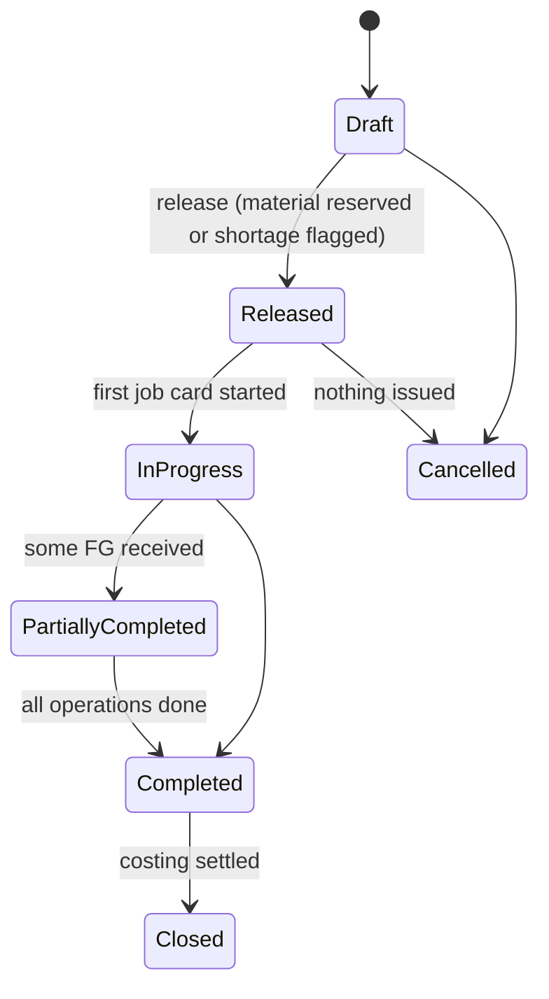

# Step 4C — PR-03 Plan-to-Produce (including job work)

> **Status:** Accepted by founder (2026-10-03) as the **standard-practice baseline** ([ADR-0061](../adr/ADR-0061-STANDARD-PRACTICE-BASELINE.md)); customised with the first customer · **Validation:** ⚠️ Hypothesis, not yet validated with a real company · **Last updated:** 2026-10-03
> **Part of:** [Step 4 — Process Architecture](STEP-04-PROCESS-ARCHITECTURE.md)

## TL;DR

- **Flow:** Job → Production Order(s) → material check & reservation (shortage → PR) → material requisition & issue → **operations with job cards** (printing, lamination, die-cut, folding-gluing…; some sent out as **job work**) → final production confirmation (finished goods + scrap into stock) → **job costing: estimate vs actual**.
- **Quantity changes unit along the route:** kg (board) → sheets (printing) → pieces (after die-cutting, × ups). Each operation records **in = good + waste**, and the next operation starts from the previous operation's good quantity.
- **WIP lives inside the job** as quantities per operation, not as stocked semi-finished items ([ADR-0019](../adr/ADR-0019-WIP-BY-JOB-OPERATION.md)).
- **Job work:** printed sheets go to a job worker with a challan, are held at a third-party location (still ours), and come back with an allowed loss. Overdue returns raise alerts.
- **Scheduling in the MVP is a simple machine queue board**, not an optimizer. Finite-capacity scheduling is a later product.
- **Gang runs** (several jobs printed on one sheet) are common in labels and commercial print. They are complex and **out of the MVP** unless the pilot needs them ([Q-19](../tracking/OPEN-QUESTIONS.md#q-19) context).

---

## 1. Happy path by role

## 2. From Job to Production Order

| Product type | Production orders per Job | Why |
| --- | --- | --- |
| Folding carton | 1 | Single component |
| Rigid box | 2–3 (base, lid, wrap) | Separate components assembled at the end |
| Book / catalogue | 2+ (cover, text sections) | Different paper, machine and process per component |
| Label roll | 1 | Single component, roll output |

The production order takes its **BOM** and **routing** from the product spec ([ADR-0018](../adr/ADR-0018-CUSTOMER-PRODUCT-SPECIFICATION.md)) and stores an **exploded copy** ([ADR-0008](../adr/ADR-0008-REFERENCE-VS-SNAPSHOT.md)). Planner edits on this order (a different machine, extra waste allowance) do not change the spec.

## 3. A typical carton route — and the changing unit

```mermaid
flowchart LR
    B["Board<br/>≈ 630 kg<br/>(reels / sheets)"] -->|"sheeting / cutting<br/>(if reels or parent sheets)"| S["Sheets 28×40<br/>2,480"]
    S -->|"printing 4C<br/>make-ready + waste"| P["Printed sheets<br/>2,390 good"]
    P -->|"UV / lamination<br/>(in-house or job work)"| L["Laminated sheets<br/>2,360 good"]
    L -->|"die-cutting<br/>× ups (6)"| D["Cartons (pieces)<br/>14,100 good"]
    D -->|"folding-gluing"| F["Pasted cartons<br/>13,900 good"]
    F -->|"inspection + packing"| FG["FG cartons<br/>13,800 → stock"]
```

**Quantity reconciliation per operation** (recorded on the job card):

| Operation | Input | Good | Waste | Unit | Note |
| --- | --- | --- | --- | --- | --- |
| Printing | 2,480 | 2,390 | 90 | sheets | Waste = make-ready + running |
| Lamination | 2,390 | 2,360 | 30 | sheets | |
| Die-cutting | 2,360 sheets | 14,100 | 60 (pcs) | sheets → **pieces** | Conversion factor = ups (6); 2,360 × 6 = 14,160 |
| Folding-gluing | 14,100 | 13,900 | 200 | pieces | |
| Final inspection | 13,900 | 13,800 | 100 | pieces | |

**Rule:** for every operation, input = good + waste (+ any balance still in process). A gap is flagged for supervisor review. This reconciliation is what makes **wastage visible**, and wastage is the printer's biggest controllable cost.

## 4. Material planning and reservation

**Reservation** prevents two jobs from planning the same board. It is a separate **reservation ledger** in Inventory ([Step 2 §11](STEP-02-DOMAIN-MODEL.md#11-ledgers--what-is-the-source-of-truth)).

## 5. Material requisition and issue

| Step | Document (owner) | Detail |
| --- | --- | --- |
| Production asks for material | Material Requisition (Manufacturing) | Lists the reserved material for the job/operation |
| Stores issues | **Material Issue (Inventory)** fulfils the requisition | Sheets counted; **reels issued by number**, with remaining weight recorded when a partial reel returns |
| Extra material needed (spoilage) | Additional requisition with a **reason** | Shows up as excess consumption in job costing |
| Unused material returned | Material Return (Inventory) | Reduces job consumption |

## 6. Job cards (operation confirmations)

A job card is the shop-floor record of **one operation of one production order**. It must be quick to fill on a phone.

| Field | Example | Why |
| --- | --- | --- |
| Machine / work center | Heidelberg SM-74 | Machine utilisation and costing |
| Operator(s), shift | Ramesh, Shift A | Accountability |
| Start / end, make-ready time | 10:05–10:50 make-ready; 10:50–14:20 run | Machine-hour costing; make-ready analysis |
| Input / good / waste qty + **waste reason** | 2,480 / 2,390 / 90 — colour variation | Wastage control |
| Impressions (counter) | 2,480 | Validation against the machine counter (later: IoT feed) |
| **OK sheet** approved by | Supervisor / QC | The first good sheet is signed off before the run |
| Remarks, photos | — | Problem evidence |

## 7. Job work (outsourced operations)

| Rule | Detail |
| --- | --- |
| Stock at the job worker remains **ours** | Third-party location type ([Step 3 §5.7](STEP-03-MODULE-BOUNDARIES.md#57-job-work-outsourced-operations--a-printing-reality)) |
| Allowed **process loss** per operation (e.g., 1–2%) | Beyond it → approval / recovery from the job worker |
| Challan carries GST job-work fields | India pack; legal time limits for return are tracked |
| Job worker's charges go to job costing | Via the job-work PO and bill, anchored to the Job |

## 8. Final confirmation: finished goods and scrap

- **Finished goods** are received into FG store against the production order (Inventory posts on Manufacturing's request), **reserved for the customer's SO line** (make-to-order).
- **Scrap** (waste paper, trimmings) is received by **weight** into a scrap item. It is sold periodically (scrap sale invoice, 04A variant). It is not costed back to individual jobs, except as an optional recovery credit.
- **Over-run** within tolerance goes to the order. Beyond tolerance it is kept as stock for a future repeat order, with approval.

## 9. Job costing — estimate vs actual

| Cost element | Actual source |
| --- | --- |
| Material | Material issues − returns, at **valuation rate** ([ADR-0021](../adr/ADR-0021-WEIGHTED-AVERAGE-VALUATION.md)), or the actual PO rate if bought for the job |
| Machine | Job-card hours × machine-hour rate (rate table) |
| Labour | Included in the machine rate in the MVP (no separate labour costing) |
| Job work | Job-work bills anchored to the Job |
| Plates, die | Purchase or internal plate-making records anchored to the Job |
| Overhead | % on the above (configurable) |

**Finished goods value** = actual job cost ÷ good quantity. It is used when FG is delivered (cost of sales in reports). Accounting entries for production costs are **not** exported to Tally in the MVP (Tally holds financial accounts only — [Q-18](../tracking/OPEN-QUESTIONS.md#q-18)).

## 10. Scheduling — deliberately simple

| MVP | Later (only if customers ask) |
| --- | --- |
| Machine queue board: jobs per machine, drag to reorder, expected start/end from standard speeds | Finite-capacity scheduling, setup-optimised sequencing (same colours / same board together) |
| Due-date and material-readiness flags | What-if planning |

Scheduling optimizers are a classic over-engineering trap. Most SME planners schedule from experience and a whiteboard. The MVP replaces the whiteboard, not the planner.

## 11. Production Order lifecycle

## 12. Variants and exceptions

| Case | Handling |
| --- | --- |
| **Reprint / rework** (quality failure) | New production order on the same Job, type *Rework*. Cost goes to the job as a non-chargeable cost unless agreed |
| Machine breakdown | Job card Paused with a reason; job re-queued on another machine; downtime recorded (feeds Maintenance later) |
| Material runs short mid-run | Additional requisition with a reason |
| OK sheet not approved | Job card stays in Setup; extra make-ready waste recorded |
| Job split across two machines | Two job cards for the same operation |
| **Gang run** (several jobs on one sheet) | **Not in the MVP.** Needs shared material and cost allocation across jobs. Validate the need with the pilot |
| Customer-supplied board (conversion) | Material issued from **customer-owned stock** ([Q-16](../tracking/OPEN-QUESTIONS.md#q-16)); no material cost in job costing |

## 13. Reports this process needs (MVP)

**Job status board** · Machine queue · **Wastage by job / operation / machine / reason** · Material consumption vs estimate · **Estimate vs actual (job profitability)** · Job work pending at job workers · Machine utilisation (hours) · Production register.

## Related documents

[Step 4 overview](STEP-04-PROCESS-ARCHITECTURE.md) · [04A Order-to-Cash](STEP-04A-ORDER-TO-CASH.md) · [04B Procure-to-Pay](STEP-04B-PROCURE-TO-PAY.md) · [04D Inventory & Quality](STEP-04D-INVENTORY-AND-QUALITY.md) · [Pilot Interview Guide §C](../tracking/PILOT-INTERVIEW-GUIDE.md#c-plan-to-produce)
