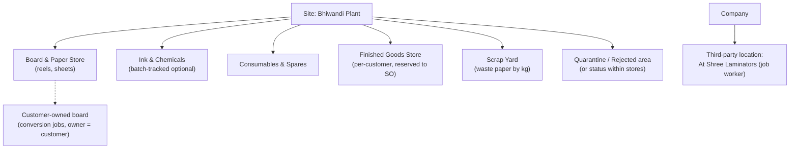
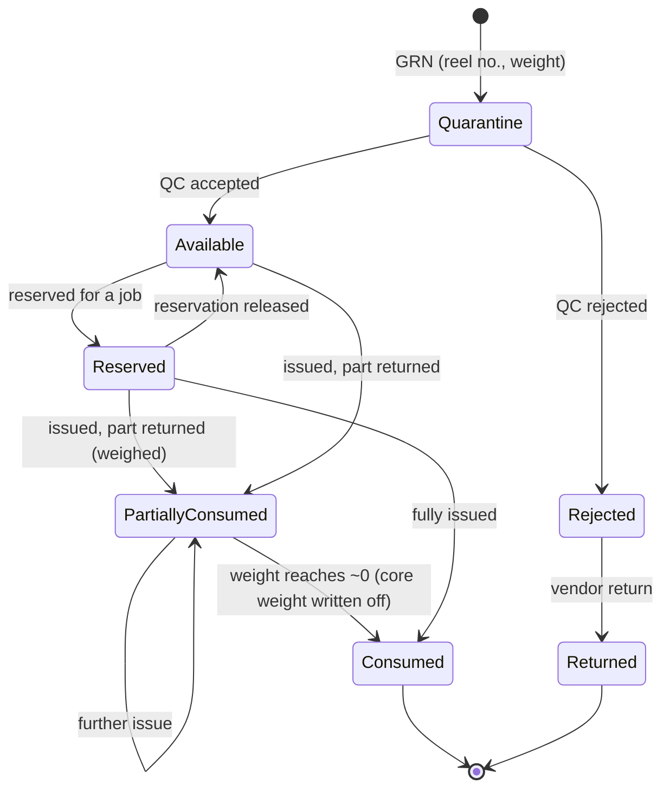
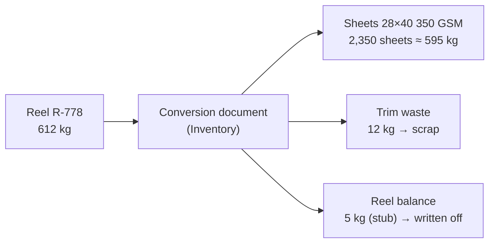
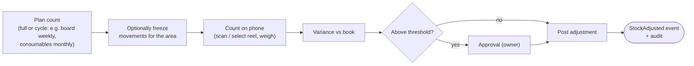
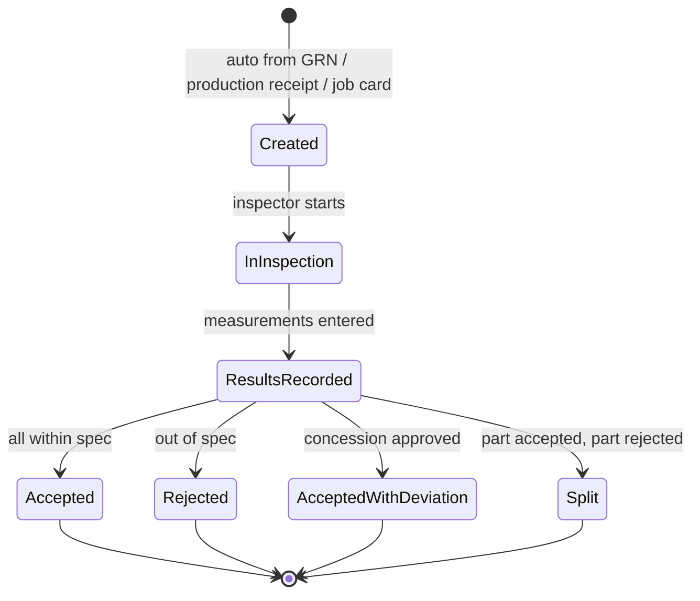
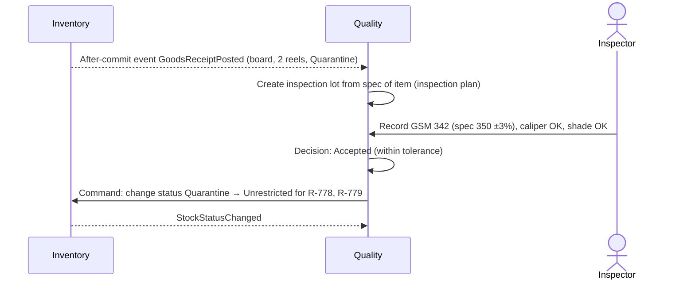

# Step 4D — PR-04 Inventory and PR-05 Quality

> **Status:** Accepted by founder (2026-10-03), pending pilot validation · **Validation:** ⚠️ Hypothesis, not yet validated with a real company · **Last updated:** 2026-10-03
> **Part of:** [Step 4 — Process Architecture](STEP-04-PROCESS-ARCHITECTURE.md)

## TL;DR

- **Inventory** is the only writer of stock ([ADR-0014](../adr/ADR-0014-MODULE-OWNERSHIP.md)). Every stock entry carries:
  - item
  - warehouse / location
  - tracking id (reel no. or batch, if tracked)
  - **status**: Quarantine / Unrestricted / Rejected
  - **owner**: own company or a customer ([Q-16](../tracking/OPEN-QUESTIONS.md#q-16))
  - quantity in base unit
  - value
- **Reels** are tracked one by one, with a decreasing weight. Inks can be batch-tracked. Consumables are untracked.
- **Conversion** (reel → sheets, parent sheet → cut sheets) is an Inventory document when done for stock, or a job operation when done for one job.
- **Valuation:** moving weighted average for purchased material ([ADR-0021](../adr/ADR-0021-WEIGHTED-AVERAGE-VALUATION.md)); finished goods at actual job cost.
- **Physical stock counts** produce variance → approval → adjustment. Adjustments are never silent edits.
- **Quality:** incoming inspection (board/paper), in-process (OK sheet, periodic checks), final (sampling). Decisions are accept / reject / **accept with deviation** / **split**. Quality decides; Inventory changes the status.
- Without the Quality module, Inventory still offers quarantine with **manual release**.

---

## Part 1 — Inventory

### 1. Stock structure of a typical printer

### 2. The stock "address" — what every stock entry records

| Dimension | Values | Why |
| --- | --- | --- |
| Item | Board 350 GSM FBB 28×40 | What |
| Warehouse / location | Board Store / Rack B-04 | Where |
| Tracking id | Reel R-778 / Ink batch 2309 / — | Traceability; reel weight balance |
| **Status** | Quarantine, Unrestricted, Rejected, Blocked | Can it be used? |
| **Owner** | Own company / Customer X | Whose is it? Customer-owned stock is never valued or sold |
| Reservation | Free / reserved for Job J-1042 | Who may use it? (reservation ledger) |
| Quantity | in base UOM (kg for board, sheets for cut board, pieces for FG) | How much |
| Value | ₹ at the moving average | Worth (own stock only) |

### 3. Movement types

| Movement | Document (Inventory) | Triggered from | Stock effect |
| --- | --- | --- | --- |
| Purchase receipt | GRN | PO (04B) | + (Quarantine or Unrestricted) |
| Customer material receipt | Customer Material Receipt | Conversion job (04A) | + owner = customer |
| Issue to job / return from job | Material Issue / Return | Requisition (04C) | − / + |
| Finished goods / scrap receipt | Production Receipt | Production confirmation (04C) | + FG, + scrap |
| Delivery | Delivery | SO (04A) | − FG |
| Transfer (same site, or between sites with the same GSTIN) | Stock Transfer | Manual / planner | − here, + there |
| Transfer between states (different GSTINs) | Stock Transfer **+ invoice/e-way bill** (India pack) | Manual | As above, plus a tax document |
| Job work out / in | Job-work Challan / Receipt | Job operation (04C) | Move to / from third-party location |
| Conversion | Conversion (Sheeting) | Manual / planner | − reel kg, + sheets, + waste kg |
| Status change | (from QC decision or manual release) | Quality (05) | Status only |
| Adjustment | Stock Adjustment | Stock count / damage | ± with reason and approval |
| Vendor return / customer return | Return Delivery / Return Receipt | 04E | − / + |

### 4. Reel lifecycle

The leftover **core** (the cardboard tube) and small stub weights are written off by a rule ("below X kg → consume"). Otherwise thousands of 0.3 kg "reels" accumulate.

### 5. Conversion (sheeting)

- **For stock** (generic sheets): an Inventory conversion document.
- **For one job** (cut to job size): a sheeting **operation** in the job's routing (04C).
- Value is carried over: the value of the reel kg consumed = the value of the sheets produced + the scrap value.

### 6. Valuation — moving weighted average

| Event | Qty (kg) | Rate | Stock value | Average rate |
| --- | --- | --- | --- | --- |
| Opening | 1,000 | 60.00 | 60,000 | 60.00 |
| GRN | 1,230 | 62.00 (+ freight ₹1/kg landed) = 63.00 | 77,490 | — |
| After GRN | 2,230 | — | 137,490 | **61.65** |
| Issue to J-1042 | −630 | 61.65 | −38,840 | 61.65 |
| After issue | 1,600 | — | 98,650 | 61.65 |

- **Why moving average:** simple to explain, matches Tally's default practice, and is stable for job costing. FIFO adds layer tracking with little benefit for an SME ([Q-17](../tracking/OPEN-QUESTIONS.md#q-17)).
- **Landed cost:** freight and unloading can be added to the receipt value (at GRN, or later via a landed-cost document).
- **FG** is valued at the **actual job cost per unit** (04C §9). Scrap is valued at a configurable realisable rate, or zero.
- **Customer-owned stock** has **no value** in our books.

### 7. Physical stock count

### 8. Reorder suggestions

Simple **min / reorder level / max** per item and warehouse (the item's Inventory facet). When free stock (on hand − reserved) falls below the reorder level, a **PR suggestion** is created. Job-specific needs come from material planning (04C), not from reorder levels. Full MRP is later ([Step 3 §4](STEP-03-MODULE-BOUNDARIES.md#4-module-catalogue)).

---

## Part 2 — Quality

### 9. Inspection types for a printer

| Type | When | Typical checks | Result drives |
| --- | --- | --- | --- |
| **Incoming** | After GRN of board/paper (and inks optionally) | GSM, caliper, shade/brightness, moisture, size, reel condition | Stock status: release / reject |
| **In-process: OK sheet** | Start of the print run | Colour vs approved proof, registration, text | Job card can move Setup → Running |
| **In-process: periodic** | Every N sheets / per shift | Colour drift, registration, lamination bubbles, die-cut accuracy | Waste recording; stop/adjust |
| **Final** | Before packing / dispatch | Sampling (AQL plan): print defects, die-cut, glue strength, count per bundle | FG release to dispatch |
| **Customer complaint** | After delivery | Investigation | Return / credit / rework ([04E](STEP-04E-RETURNS-CORRECTIONS-AND-ACCOUNTING.md)) |

### 10. Inspection lot lifecycle and decisions

| Decision | Inventory effect | Other effect |
| --- | --- | --- |
| Accepted | Quarantine → Unrestricted | — |
| Rejected | Quarantine → Rejected | Vendor return + debit note (incoming), or rework/scrap (final) |
| Accepted with deviation | → Unrestricted, flagged | Approval by an authorized person; possible rate renegotiation |
| Split (e.g., 2 of 4 reels bad) | Per reel / quantity | As above per part |

### 11. Without the Quality module

Inventory setting *"receipts of category Board go to Quarantine"* + a **Release** action for an authorized user. No specs, no sampling, no records. This is enough for many small printers, and an upgrade path to Quality.

### 12. Later (not MVP)

- **NCR / CAPA** workflows.
- Spectrophotometer integration for colour.
- Statistical process control.
- **Certificates of Analysis (COA)** per dispatch for pharma-packaging customers. This one may be needed early if the pilot is a pharma-packaging printer ([Q-21](../tracking/OPEN-QUESTIONS.md#q-21)).

## 13. Reports (MVP)

Stock summary (by warehouse / status / owner) · **Reel register with balance weights** · Stock ledger (movement history) · Reserved vs free stock · Ageing of stock · Stock count variance · Quarantine pending inspection · Rejection rate by vendor · Final inspection results by job.

## Related documents

[Step 4 overview](STEP-04-PROCESS-ARCHITECTURE.md) · [04B Procure-to-Pay](STEP-04B-PROCURE-TO-PAY.md) · [04C Plan-to-Produce](STEP-04C-PLAN-TO-PRODUCE.md) · [Pilot Interview Guide §D](../tracking/PILOT-INTERVIEW-GUIDE.md#d-inventory-and-quality)
