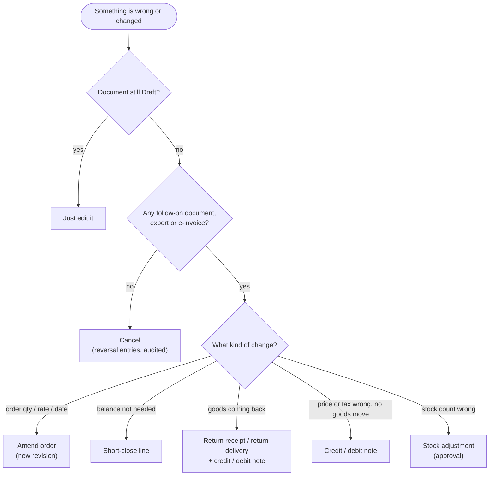
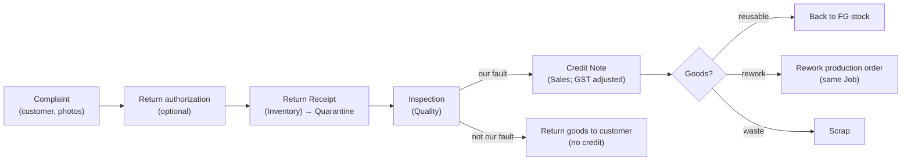
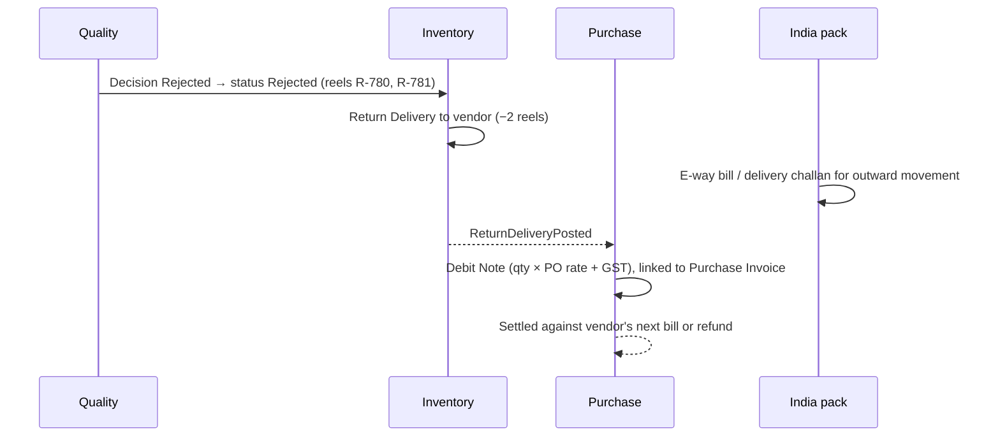
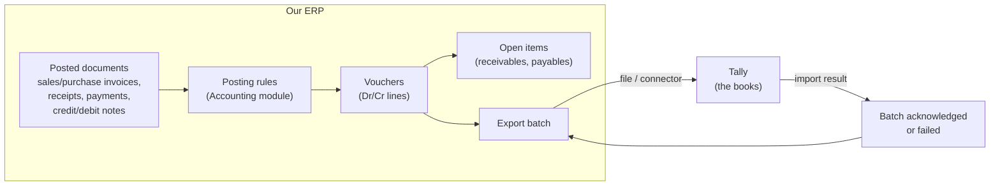
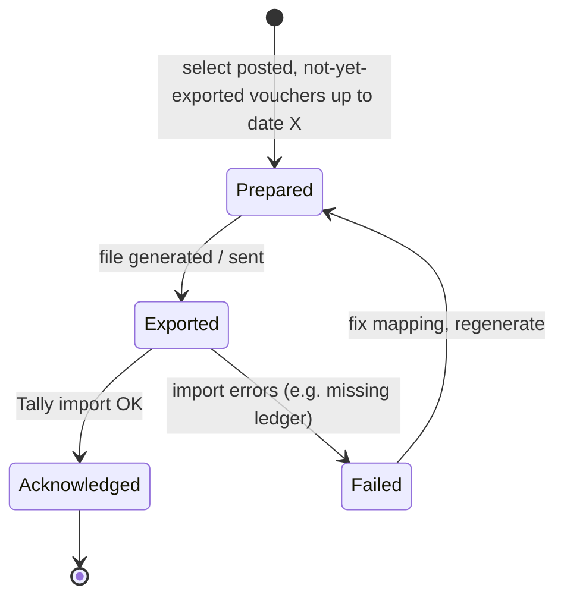

# Step 4E — PR-06 Returns & Corrections and PR-07 Accounting Bridge

> **Status:** In review · **Validation:** ⚠️ Hypothesis, not yet validated with a real company or its accountant · **Last updated:** 2026-10-03
> **Part of:** [Step 4 — Process Architecture](STEP-04-PROCESS-ARCHITECTURE.md)

## TL;DR

- **Nothing posted is edited** ([ADR-0007](../adr/ADR-0007-IMMUTABLE-POSTED-DOCUMENTS.md)). Every mistake or change has a **correction document**: cancel (only if nothing follows), amend (orders), short-close, credit note, debit note, return receipt / return delivery, stock adjustment.
- **Customer return:** return receipt (to Quarantine) → inspection → credit note → rework, scrap or reuse.
- **Vendor return:** return delivery (+ e-way bill) → debit note.
- **Accounting Bridge:**
  1. Posting rules turn invoices, receipts, payments and notes into **vouchers**.
  2. Vouchers are grouped into **export batches** and imported into **Tally**.
  3. Exported documents are **locked**; later corrections travel in a later batch.
  4. **Books are locked up to a date** to stop back-dated changes.
- The MVP exports **financial vouchers only** (ledger level), not stock or production costing. Tally keeps the books; the ERP keeps operations ([ADR-0022](../adr/ADR-0022-TALLY-EXPORT-GRANULARITY.md), [Q-18](../tracking/OPEN-QUESTIONS.md#q-18)).

---

## Part 1 — Returns and corrections

### 1. Which correction document?

### 2. Cancellation rules by document

| Document | Cancel allowed when | Otherwise |
| --- | --- | --- |
| Sales / Purchase Order | Nothing delivered or received | Short-close or amend |
| GRN | Nothing issued, billed or inspected-and-used from it | Vendor return or stock adjustment |
| Delivery | Not invoiced, goods not left (no e-way bill) | Customer return |
| Sales Invoice | Not exported to Tally **and** within the e-invoice cancellation window | Credit note |
| Purchase Invoice | Not exported, not paid | Debit note |
| Receipt / Payment | Not exported; settlement undone | Reversal entry (contra) |
| Production confirmation | Output not yet issued or delivered | Reversal confirmation (negative) with approval |

### 3. Customer return (rejected cartons)

- The credit note is **linked** to the original invoice (GST requires the reference). Indian GST sets a **time limit** for issuing credit notes against a financial year's invoices. The India pack enforces it.
- The cost of rework is charged to the **original Job**, so job profitability shows the true picture.

### 4. Vendor return (rejected board)

If the vendor's bill is **not yet booked**, the simpler path is: return delivery, then book the bill only for the accepted quantity.

### 5. Price and tax corrections (no goods movement)

| Situation | Document |
| --- | --- |
| We over-charged the customer | Credit note (rate difference) |
| We under-charged and the customer agrees | Debit note to the customer (supplementary invoice) |
| Vendor over-charged | Debit note to the vendor (or ask the vendor for a credit note) |
| Wrong GST rate on a posted invoice | Credit note for the whole invoice + new correct invoice |

---

## Part 2 — Accounting Bridge (Record-to-Report for the MVP)

### 6. What the bridge does

### 7. Posting rules (default examples, configurable per company)

| Document | Debit | Credit |
| --- | --- | --- |
| Sales invoice | Customer (party ledger) | Sales @ GST rate; Output CGST + SGST *or* Output IGST; Round-off |
| Purchase invoice | Purchases @ GST rate (or expense ledger); Input CGST + SGST *or* IGST | Vendor (party ledger); TDS payable (if deducted at booking) |
| Receipt | Bank / Cash; TDS receivable (if customer deducted) | Customer |
| Payment | Vendor | Bank; TDS payable (if deducted at payment) |
| Credit note (to customer) | Sales return / discount; Output GST reversal | Customer |
| Debit note (to vendor) | Vendor | Purchase return; Input GST reversal |
| Scrap sale | Customer | Scrap sales; Output GST |

**Ledger mapping:** each of our account codes maps to a **Tally ledger name** per company. Parties map to Tally party ledgers by name and GSTIN; new parties are exported as ledger masters before the vouchers that use them.

### 8. Export batch lifecycle

| Rule | Why |
| --- | --- |
| Each voucher is exported **exactly once** (idempotent: the voucher id travels to Tally) | Re-sending a batch never doubles entries |
| Documents in an acknowledged batch are **locked**: cancel is replaced by a correction document | Tally and the ERP never disagree silently |
| **Books locked up to date** (setting) | No back-dated postings after the accountant has closed a month in Tally |
| Monthly **reconciliation report**: ERP totals vs Tally totals (sales, purchases, GST, party balances) | Catches manual changes made directly in Tally |

### 9. What is not exported in the MVP

| Not exported | Why | Later |
| --- | --- | --- |
| Stock quantities and values | Tally would need item masters in sync. Most SME accountants use Tally for accounts, and the ERP is better at stock | Item-level export option if a customer insists ([Q-18](../tracking/OPEN-QUESTIONS.md#q-18)) |
| Production / WIP costing journals | Management information, not statutory books for an SME | Native GL (Full Accounting) |
| Closing stock value | Accountant enters the ERP's closing stock report value in Tally at period end | Automated journal later |

### 10. Open items: receivables and payables

The bridge keeps **open items** (unsettled invoices, advances, notes) per party. These are needed for credit control (04A §9), MSME payment alerts (04B §9) and ageing reports, **without** waiting for Tally.

## 11. Reports (MVP)

Credit/debit note register · Returns register · Export batch history and errors · **ERP vs Tally reconciliation** · Receivables ageing · Payables ageing (with MSME due dates) · GST summaries for the accountant (GSTR-1 data from sales; purchase register for 2B matching).

## Related documents

[Step 4 overview](STEP-04-PROCESS-ARCHITECTURE.md) · [04A Order-to-Cash](STEP-04A-ORDER-TO-CASH.md) · [04B Procure-to-Pay](STEP-04B-PROCURE-TO-PAY.md) · [ADR-0010 Tally first](../adr/ADR-0010-ACCOUNTING-VIA-TALLY-FIRST.md) · [Pilot Interview Guide §E](../tracking/PILOT-INTERVIEW-GUIDE.md#e-returns-corrections-and-accounting)
