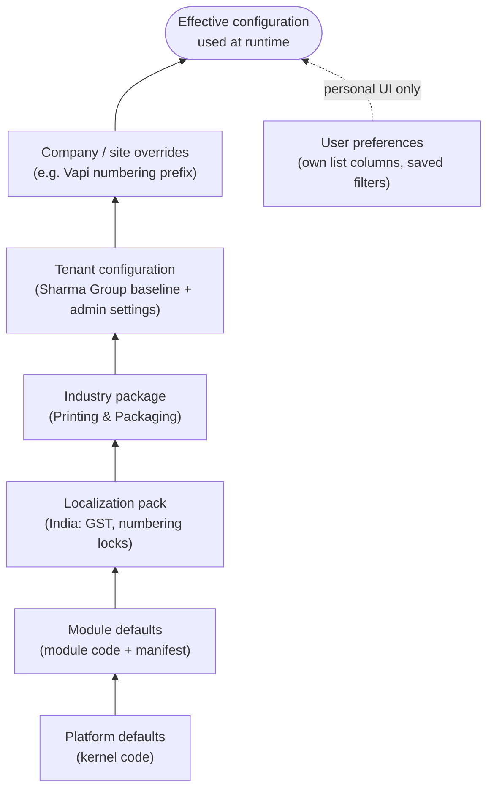
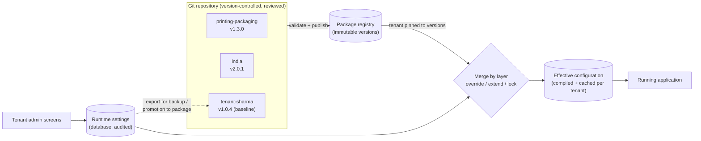
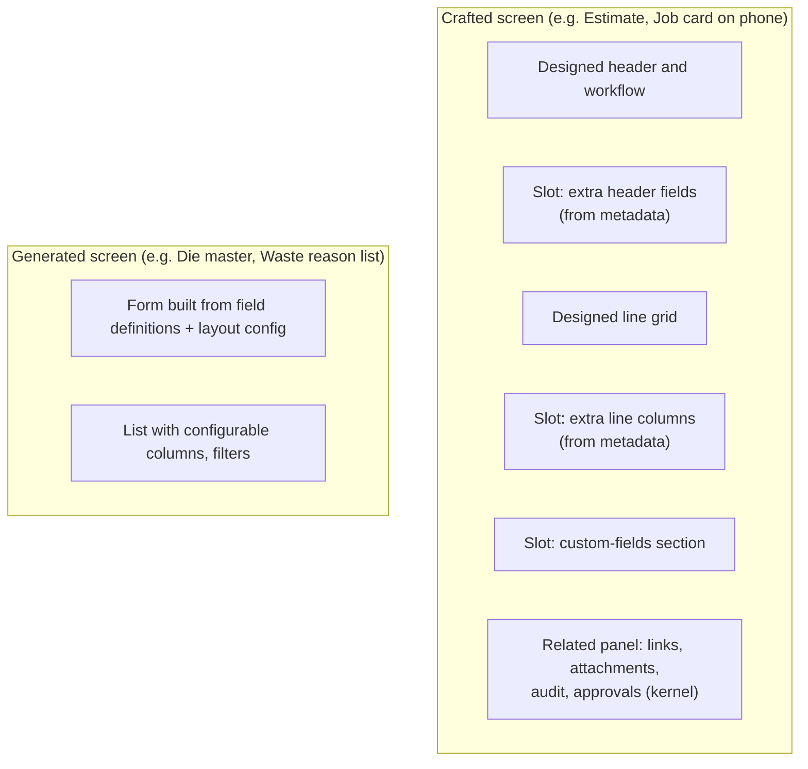
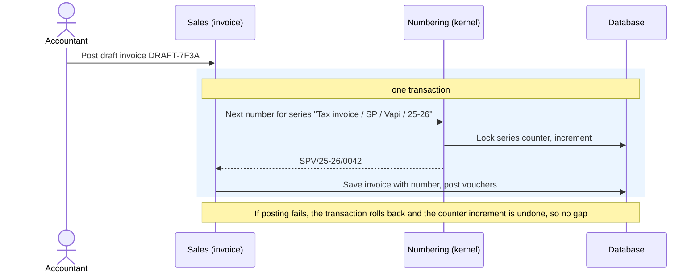
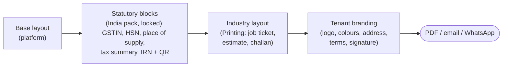
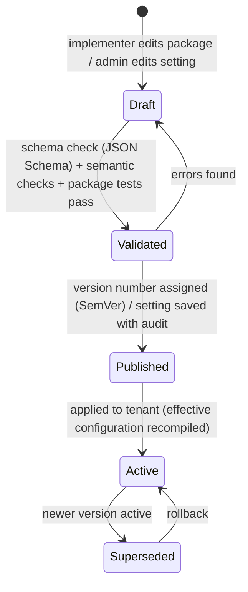

# Step 5 — Configuration Architecture

> **Status:** Accepted (founder agreed with all recommendations, 2026-10-03) · **Last updated:** 2026-10-03
> **Answers:** How does one platform become a Printing ERP (and later a Pharma or Trading ERP) without separate codebases? What is configurable, by whom, where is it stored, how is it validated, and what is never configurable? (Brief §15, §16, §25, §33, §36.) Packages, upgrades and onboarding are in the companion file [Step 5A](STEP-05A-PACKAGES-UPGRADES-AND-ONBOARDING.md).

## TL;DR

- **Configuration is layered:** platform → module → localization pack → industry package → tenant → company/site. The higher layer wins, using three merge rules: **override** (replace a value), **extend** (add items) and **lock** (a lower layer forbids changes, e.g. GST invoice rules).
- **Three kinds of data are kept apart:**
  - **configuration** (how the system behaves)
  - **master data** (customers, items, rate tables)
  - **transactions** (orders, invoices)

  Packages carry configuration and seed data, never transactions.
- **Two configuration stores:**
  - **Packages** in Git: industry, localization and each tenant's baseline. They are versioned and reviewed ([ADR-0011](../adr/ADR-0011-CONFIGURATION-AS-PACKAGES.md)).
  - **Runtime settings** in the database: what tenant admins change through screens (approval limits, numbering, roles, branding). Every change is audited.

  The system merges both into one **effective configuration** per tenant.
- **Custom fields:** stored as metadata-validated JSON extension data — no "EAV" tables and no per-tenant database changes.
- **Screens:** a **hybrid**. Hand-crafted screens for the critical jobs (estimate, job card, reel receiving), with slots for custom fields. Generated screens for simple masters and custom objects. This is the same pattern as SAP Fiori elements/freestyle and Salesforce layouts.
- **Rules:** conditions are written in **CEL** (Common Expression Language), and matrices (approval bands, rate lookups) are **DMN-style decision tables**. There is **no general-purpose scripting** in the MVP; complex logic goes in extension code.
- **Numbering:**
  - Series are configurable per document type, company, site and financial year.
  - **Statutory documents get gapless numbers at posting.** GST invoice numbers are unique per financial year and at most 16 characters.
  - Drafts carry temporary ids.
- **Industry vocabulary is configuration.** Printing says "Job", pharma says "Batch". Packages override labels through the translation mechanism.
- Eight proposed decisions: [ADR-0024 … ADR-0031](#17-proposed-decisions-from-this-step). Questions: [Q-22 … Q-27](#open-questions-raised).

---

## 1. What this step must answer

| Brief asked | Answered in |
| --- | --- |
| How one platform becomes Printing / Pharma / Trading / Service ERP (§15, §36) | §2, §5, [5A §3](STEP-05A-PACKAGES-UPGRADES-AND-ONBOARDING.md#3-the-printing--packaging-package--inventory) |
| Metadata-driven UI, configurable forms (§15, §19) | §6, §7 |
| Custom fields, objects, statuses, workflows, dynamic attributes (§15, §16) | §6, §11, §12 |
| Template inheritance, configuration packages (§15) | §2, [5A](STEP-05A-PACKAGES-UPGRADES-AND-ONBOARDING.md) |
| Configuration vs customization vs extension vs core modification (§25) | §3, §4 (and [Step 1 §8](STEP-01-PLATFORM-DEFINITION.md#8-l5--l6--customer-configuration-and-customization)) |
| Configurable numbering (§33) | §9 |
| Configurable document templates (§20) | §10 |
| Rules configurable without developers (§9) | §8 |
| "Select industry → structure → modules → … → ready" (§42) | [5A §8](STEP-05A-PACKAGES-UPGRADES-AND-ONBOARDING.md#8-tenant-onboarding) |

---

## 2. The configuration stack and how layers combine

Higher layers sit on top of lower layers. Every configuration item is combined using one of **three merge rules**:

| Merge rule | Meaning | Example |
| --- | --- | --- |
| **Override** | The higher layer replaces the value | Delivery tolerance: module default 0% → Printing package 10% → tenant 5% |
| **Extend** | The higher layer adds items; it cannot remove items a lower layer marked *required* | Printing adds GSM to items; the tenant adds "Plate rack no." |
| **Lock** | A lower layer forbids any change above it | India pack locks the statutory content of the tax invoice and the 16-character invoice number rule |

**Worked example — invoice numbering for Sharma Packaging's Vapi plant:**

| Layer | Contribution |
| --- | --- |
| Platform | Every posted document gets a unique number |
| India pack | **Lock:** tax invoices gapless, unique per FY, ≤ 16 characters, allowed characters only |
| Printing package | Default pattern `INV/{FY}/{SEQ:5}` |
| Tenant | Override: `SP/{FY}/{SEQ:5}` |
| Site Vapi | Override: `SPV/{FY}/{SEQ:4}` → renders `SPV/25-26/0042` (14 characters ✔) |

---

## 3. Configuration vs master data vs transactions

Everything in the system is one of three kinds of data. Mixing them up is a classic cause of failed upgrades.

| Kind | What it is | Examples | Who changes it | Travels in packages? |
| --- | --- | --- | --- | --- |
| **Configuration** | Defines *how the system behaves* | Fields, sub-statuses, approval rules, numbering series, templates, roles | Package author, implementer, tenant admin | ✅ Yes |
| **Master data** | Business reference data the business maintains | Customers, items, product specs, BOMs, **rate tables** (board ₹/kg, machine rates) | Business users | Only as **seed / demo** data, once |
| **Transactions** | Business events | Orders, GRNs, job cards, invoices | Business users | ❌ Never |

**Rate tables** (estimation rates) are master data, not configuration. Paper prices change weekly and the business must update them without the implementer. The Printing package only **seeds** initial rate tables.

### 3.1 Who changes what

| Role | Changes | Through |
| --- | --- | --- |
| **Platform developer** (us) | Kernel and module defaults, extension points | Code releases |
| **Package author** (us) | Industry and localization packages | Package releases (Git) |
| **Implementer** (the founder in year 1) | Tenant baseline: fields, layouts, processes, rules, templates | Tenant package (Git) |
| **Tenant admin** | Approval limits, numbering, roles and users, notification recipients, branding, module settings | Admin screens (runtime store) |
| **End user** | Own list columns, saved filters, dashboard layout | Personal preferences |

---

## 4. Two stores: packages and runtime settings

| Store | Holds | Why |
| --- | --- | --- |
| **Packages (Git)** | Structural configuration: fields, layouts, processes, rules, templates, roles, reports, extension bindings | Reviewed, diffable, testable, reproducible; rollback = previous version |
| **Runtime settings (database)** | Frequently changed tenant settings: approval limits, numbering series, users and role assignments, notification recipients, branding, module switches | Business can change them without a release; every change is audited (who, when, old, new) |

**Rule:** the same configuration item lives in **one** store only. Each item type declares which store owns it (§5), so the two stores can never disagree.

---

## 5. The configuration catalogue

| # | Configuration item | Typical layer | Store | Changed by (year 1) | Admin screen in MVP? |
| --- | --- | --- | --- | --- | --- |
| 1 | Custom fields and attribute sets | Industry, tenant | Package | Implementer | No |
| 2 | Picklists (board types, waste reasons) | Industry, tenant | Runtime | Admin | **Yes** (list editor) |
| 3 | Form layouts, list columns (defaults) | Module, industry, tenant | Package | Implementer | No (personal columns: yes) |
| 4 | Labels and terminology ("Job", "Batch") | Industry, tenant | Package | Implementer | No |
| 5 | Sub-statuses | Industry, tenant | Package | Implementer | No |
| 6 | Process definitions (allowed create-from paths, optional steps) | Industry, tenant | Package | Implementer | No |
| 7 | **Approval rules and limits** | Industry default, tenant | Runtime | Admin | **Yes** |
| 8 | Validation, default and automation rules | Industry, tenant | Package | Implementer | No |
| 9 | **Notification rules** (events, recipients, channels) | Industry default, tenant | Runtime | Admin | **Yes** (recipients, channels on/off) |
| 10 | **Numbering series** | Localization (locks), tenant, company/site | Runtime | Admin | **Yes** |
| 11 | Output templates (print, email, WhatsApp) | Localization, industry, tenant | Package (+ branding in runtime) | Implementer / admin | **Branding: yes** |
| 12 | **Roles and permissions** | Industry default roles, tenant | Runtime | Admin | **Yes** |
| 13 | **Module settings** (negative stock, tolerance defaults, quarantine on receipt) | Module, industry, tenant | Runtime | Admin | **Yes** |
| 14 | Reports and dashboards | Module, industry | Package | Implementer | No (personal filters: yes) |
| 15 | Integration connections (Tally, GSP, email, WhatsApp) | Tenant | Runtime + **secret store** | Admin / implementer | **Yes** |
| 16 | Extension bindings (which calculator fills which slot) | Industry | Package | Package author | No |
| 17 | Custom object types (Artwork, Die, Plate) | Industry | Package | Package author | No |

Admin screens in the MVP cover **only** items 2, 7, 9, 10, 11 (branding), 12, 13 and 15. Everything else is a package change. This is the scope reduction agreed in [ADR-0011](../adr/ADR-0011-CONFIGURATION-AS-PACKAGES.md).

---

## 6. Metadata: fields and custom fields

### 6.1 What a field definition contains

| Property | Example | Notes |
| --- | --- | --- |
| Key | `gsm` | Stable technical name; never changes |
| Label (translatable) | "GSM" / "जीएसएम" | Through the translation mechanism (BCP 47 language tags) |
| Type | decimal(6,1) | See §6.2 |
| Applies to | Item, when category ∈ {Paper, Board} | Conditional applicability |
| Required | Yes, when category = Board | Can be a CEL condition (§8) |
| Default | — | Constant or expression |
| Validation | 30 ≤ value ≤ 600 | Range, pattern or CEL expression |
| Editable in states | Draft, Active (locked once used in a posted document) | Ties to [ADR-0005](../adr/ADR-0005-LIFECYCLE-VS-WORKFLOW.md) / [ADR-0007](../adr/ADR-0007-IMMUTABLE-POSTED-DOCUMENTS.md) |
| Visibility / field security | Visible to all; editable by Purchase, Admin | Detailed in Step 6 |
| Data classification | Normal / Confidential / Personal | Drives masking, export and DPDP handling (Step 6) |
| Search / report / print flags | searchable ✔, reportable ✔, print on PO ✔ | |

### 6.2 Field types

Text, long text, integer, decimal (with precision), **quantity + UOM**, **money + currency**, percentage, date, date-time, boolean, picklist (single/multi), **reference to another object** (e.g. Die), file/attachment, computed (read-only CEL expression).

### 6.3 Where custom field values are stored

| Option | Description | Pros | Cons |
| --- | --- | --- | --- |
| A. Real columns via per-tenant schema changes (Odoo-style) | Each custom field becomes a database column | Fast, typed queries | Schema changes per tenant; hard with shared multi-tenant databases; risky upgrades |
| B. EAV (entity–attribute–value table) | One row per field value | Very flexible | Slow, complex queries; poor reporting |
| **C. JSON extension data validated by metadata** | One JSON document per record (PostgreSQL JSONB), validated against the field definitions; indexed where needed | One schema for all tenants; flexible; indexable; easy to export | Type safety must come from the metadata layer; heavy reporting needs indexes or read models |
| D. Pre-allocated generic columns (Salesforce-style) | Fixed pool of spare columns mapped by metadata | Typed | Complex mapping; hard limits; opaque |

**Recommendation: C** ([ADR-0026](../adr/ADR-0026-EXTENSION-FIELDS-STORAGE.md)). Core fields stay real, typed columns. Package and tenant fields go into validated extension data. If an extension field becomes universal, a platform release **promotes** it to a core column with a data migration. Physical details are in Step 8.

---

## 7. Forms, lists and navigation

### 7.1 Options

| Option | Pros | Cons |
| --- | --- | --- |
| Hand-coded screens only | Best UX | Every field change needs a developer; contradicts configuration-first |
| Fully generated from metadata | Zero UI code per object | Generic, clumsy screens for complex jobs (estimate, job card); poor mobile UX |
| **Hybrid** | Crafted UX where it matters, generated everywhere else | Two ways of building screens (both kept consistent by one design system) |

**Recommendation: Hybrid** ([ADR-0027](../adr/ADR-0027-HYBRID-UI-AND-TERMINOLOGY.md)). This is the established industry pattern: SAP Fiori uses "elements" (generated) plus "freestyle" (crafted) apps; Salesforce uses page layouts plus custom components.

| Crafted (MVP) | Generated (MVP) |
| --- | --- |
| Estimate · Sales Order · Job board · **Job card (phone)** · **GRN / reel receiving (phone)** · Material issue (phone) · Dispatch · Invoice · Approval inbox | Party, Item (with facets), Warehouse, Work center, Die, Plate, Artwork, picklists, settings lists, all custom objects |

### 7.2 Terminology is configuration

The same platform object needs different words in different industries. Packages override **labels** through the translation mechanism, without changing the object.

| Platform term | Printing package | Pharma package (design test) |
| --- | --- | --- |
| Anchor | Job | Batch |
| Production order | Work order | Batch manufacturing order |
| Operation confirmation | Job card | Batch record entry |
| Product specification | Product spec / "Job master" | Product master |

### 7.3 Navigation

Menus = active modules ∩ the user's permissions ([Step 3 §9.3](STEP-03-MODULE-BOUNDARIES.md#93-role-aware-navigation)). The industry package can **reorder and rename** menu groups and set a **home dashboard per role** (owner: cash and pending orders; planner: job board; store keeper: today's receipts and issues).

---

## 8. Rules and the condition language

### 8.1 Options

| Option | Pros | Cons |
| --- | --- | --- |
| Hard-coded rules only | Safe | Every policy change needs a developer |
| JSON logic trees | Machine-friendly | Unreadable for humans |
| **Expression language (CEL)** | Readable, typed, fast, **safe**: it cannot loop forever or touch the system. Widely used (Google APIs, Kubernetes) | Learning curve for non-technical admins (mitigated by templates, and a visual builder later) |
| **Decision tables (DMN-style)** | Ideal for matrices: approval bands, rate lookups; business people understand tables | Not for arbitrary logic |
| General scripting (JavaScript/Python sandbox) | Unlimited | Security risk, untestable customer code, upgrade breakage: the inner-platform trap |
| Visual rule builder | Friendly | A product in itself; build later on top of CEL |

**Recommendation** ([ADR-0028](../adr/ADR-0028-CEL-AND-DECISION-TABLES.md)): **CEL for conditions + decision tables for matrices + extension code for complex logic.** No general scripting in the MVP. A visual builder can come later, generating the same CEL.

### 8.2 Examples (illustrative)

| Rule kind ([Step 2 §7.2](STEP-02-DOMAIN-MODEL.md#72-kinds-of-rules-they-are-not-all-the-same)) | Example condition (CEL) |
| --- | --- |
| Validation | `doc.party.gstin != "" \|\| doc.party.role.customer.unregistered` |
| Default | `line.item.category == "Board" ? doc.site.defaultBoardStore : doc.site.defaultStore` |
| Approval routing | `doc.totals.net > 500000` |
| Automation | on `SalesOrderConfirmed`: `doc.lines.exists(l, l.item.makeToOrder)` → create Job |
| Notification | on `InvoiceOverdue`: `days_overdue >= 30` → notify sales owner + email customer |

**Decision table — PO approval matrix (illustrative):**

| PO value (₹) | Item category | Approver(s) |
| --- | --- | --- |
| ≤ 50,000 | any | none (auto-approve) |
| 50,001 – 5,00,000 | any | Purchase head |
| > 5,00,000 | Board, Paper | Purchase head → Owner |
| > 5,00,000 | Capital goods | Owner |

---

## 9. Numbering

### 9.1 Concepts

| Concept | Meaning | Example |
| --- | --- | --- |
| **Series** | A named counter for one document type in one scope | Tax invoices, Sharma Packaging, Vapi, FY 25-26 |
| **Scope** | Document type + company (+ site) (+ financial year) | |
| **Pattern** | Text with tokens: `{PREFIX}` `{FY}` `{YYYY}` `{MM}` `{SITE}` `{SEQ:n}` | `SPV/{FY}/{SEQ:4}` → `SPV/25-26/0042` |
| **Reset policy** | When the counter restarts: never, per FY, per month | Per FY (GST invoices) |
| **Allocation moment** | When the number is assigned: on create, or on post | On post (statutory) |
| **Gap policy** | Whether gaps are allowed | Gapless for statutory documents |

### 9.2 Statutory vs operational numbering

| | Statutory documents (tax invoice, credit/debit note, delivery challan) | Operational documents (PO, SO, GRN, job card) |
| --- | --- | --- |
| Rule source | India pack (**locked**) | Tenant configuration |
| Number assigned | **At posting**, inside the posting transaction | At creation (simpler for users who quote PO numbers early) |
| Gaps | **Not allowed.** Cancelled documents keep their number and are marked cancelled; numbers are never reused | Allowed |
| Format limits | Unique per FY; ≤ 16 characters; letters, digits, `-` and `/` | Free |
| Drafts | Show a temporary id (`DRAFT-7F3A`) | Show the final number |

**Migration:** the first numbers after go-live continue from the customer's last number in the old system (configurable starting value). Imported historical documents keep their original numbers.

---

## 10. Output templates (print, email, WhatsApp)

| Rule | Detail |
| --- | --- |
| Template data | Templates read the document's **snapshot** fields ([ADR-0008](../adr/ADR-0008-REFERENCE-VS-SNAPSHOT.md)), so a reprint years later shows exactly what was issued |
| Copies | GST goods invoices print as *Original for recipient / Duplicate for transporter / Triplicate for supplier* (India pack) |
| Branding vs layout | Tenant admin changes branding in a screen; layout changes are package changes (implementer) |
| Languages | Template text through translation keys; the document language can follow the customer's preference |
| WhatsApp templates | WhatsApp Business messaging requires **pre-approved templates**. The template registry stores each template's approval status per provider |
| Versioning | Templates are versioned. Each output records the template version used |

---

## 11. Process configuration

| Item | What is configured | Where defined |
| --- | --- | --- |
| **Process definitions** | Allowed create-from paths and optional steps (e.g. Estimate optional for repeat orders) | [Step 2 §5.5](STEP-02-DOMAIN-MODEL.md#55-process-definitions-configurable), [Step 4 §4.6](STEP-04-PROCESS-ARCHITECTURE.md#46-configurable-process-variants-process-definitions) |
| **Sub-statuses** | Labels inside core states (Job: Pre-press, Ready, In production…) | [ADR-0005](../adr/ADR-0005-LIFECYCLE-VS-WORKFLOW.md) |
| **Approval workflows** | Steps, conditions (CEL), decision tables, approver resolution (role + scope), self-approval rule | Engine design in Step 7 |
| **Transition guards** | Extra conditions on core transitions | CEL |
| **Tolerances** | Defaults per party / item category | [ADR-0020](../adr/ADR-0020-TOLERANCE-AND-SHORT-CLOSE.md) |

**Versioning rule:** a running document keeps the process and workflow **version** it started with. A new version applies only to new documents.

---

## 12. Custom objects

| Phase | Who defines custom objects | Examples |
| --- | --- | --- |
| **MVP** | **Packages** (package author) | Artwork (versioned), Die, Plate (Printing); later Stability Study (Pharma) |
| Later (after ≥ 3 customers) | Tenant implementer / power admin through a screen | Machine setup sheet, customer-specific checklists |

| Custom object capability | Included |
| --- | --- |
| Fields (all §6.2 types), relationships to other objects | ✅ |
| Simple lifecycle (states + sub-statuses), approvals | ✅ |
| Permissions, field security, audit trail, attachments | ✅ (kernel) |
| Generated form and list, search, reports | ✅ |
| Events (created / changed / state changed) → notifications and automation | ✅ |
| **Posting to stock or accounting ledgers** | ❌ Never. Only modules post, through their contracts ([ADR-0014](../adr/ADR-0014-MODULE-OWNERSHIP.md)) |
| Complex behaviour | Via extension code bound to the object |

---

## 13. Guardrails — what is never configurable

| Never configurable | Why |
| --- | --- |
| Tenant isolation | Security |
| Audit trail on/off | Law (audit trail must not be disabled) and trust |
| Immutability of posted documents and ledger entries | [ADR-0007](../adr/ADR-0007-IMMUTABLE-POSTED-DOCUMENTS.md), accounting practice |
| Core lifecycle states and core guards | [ADR-0005](../adr/ADR-0005-LIFECYCLE-VS-WORKFLOW.md) |
| Double-entry balance of vouchers | Accounting correctness (posting-rule *mapping* is configurable; balance is not) |
| Ledger ownership (only Inventory writes stock) | [ADR-0014](../adr/ADR-0014-MODULE-OWNERSHIP.md) |
| Statutory rules locked by a localization pack (GST numbering, invoice content) | Law |
| Running arbitrary customer code inside the platform | Security and upgradeability |

---

## 14. Governance: from change to active configuration

| Check | Example |
| --- | --- |
| **Schema validation** | Every package file validated against its JSON Schema |
| **Semantic validation** | A rule references an existing field; numbering patterns render ≤ 16 characters for GST series; no cycle in process definitions |
| **Package tests** | "Estimate for sample carton spec → 2,480 sheets, ₹X per 1,000"; "PO of ₹6 lakh routes to Purchase head → Owner" |
| **Impact analysis** | Which open documents and running workflows are affected by this change |
| **Audit** | Who changed what, when, old/new value, and which package version is active |

**Performance:** the effective configuration is compiled once per tenant and cached. Publishing a change invalidates the cache.

---

## 15. Assumptions challenged

| Brief assumption | Our position |
| --- | --- |
| Customers configure everything themselves, without developers | Year 1: the implementer configures through packages. Admin screens cover only frequently changed settings (§5) |
| Template inheritance chains (base → industry → sub-industry → customer) | MVP: one industry layer + localization + tenant. Package inheritance later ([Step 1 §7.3](STEP-01-PLATFORM-DEFINITION.md#73-package-inheritance-later-not-mvp)) |
| Metadata-driven UI everywhere | Hybrid: crafted screens for critical jobs, generated for the rest (§7) |
| A rules engine for non-developers | CEL + decision tables now; visual builder later; no scripting (§8) |
| Custom statuses | Sub-statuses inside core states ([ADR-0005](../adr/ADR-0005-LIFECYCLE-VS-WORKFLOW.md)) |
| Dynamic attributes / industry schemas | Metadata-validated extension fields (§6.3) |
| Customer-defined custom objects | Package-defined in the MVP; tenant-defined later (§12) |

---

## 16. Risks

| Risk | Mitigation |
| --- | --- |
| Inner-platform effect: configuration grows into a programming language | No scripting; CEL is deliberately limited; complex logic goes in versioned extension code |
| Package upgrades break tenant configuration | SemVer, three-way merge, dry-run on staging ([5A §6](STEP-05A-PACKAGES-UPGRADES-AND-ONBOARDING.md#6-upgrading-a-tenant-to-a-new-package-version)) |
| Configuration errors reach production | Validation + package tests + staging tenant before publish |
| Two stores disagree | Each item type has exactly one owning store (§4) |
| Reporting on extension fields is slow | Indexes and read models for heavily used fields; promotion to core columns (§6.3) |

## 17. Proposed decisions from this step

| ADR | Decision | Status |
| --- | --- | --- |
| [ADR-0024](../adr/ADR-0024-CONFIGURATION-LAYERS-AND-STORES.md) | Layered configuration with override / extend / lock; two stores (packages + runtime settings) merged into effective configuration | Accepted |
| [ADR-0025](../adr/ADR-0025-PACKAGE-FORMAT.md) | Package format: YAML authoring, JSON Schema validation, manifest, SemVer, migrations, tests | Accepted |
| [ADR-0026](../adr/ADR-0026-EXTENSION-FIELDS-STORAGE.md) | Custom/extension fields as metadata-validated JSON extension data; no EAV, no per-tenant DDL | Accepted |
| [ADR-0027](../adr/ADR-0027-HYBRID-UI-AND-TERMINOLOGY.md) | Hybrid UI (crafted + generated) and configurable terminology | Accepted |
| [ADR-0028](../adr/ADR-0028-CEL-AND-DECISION-TABLES.md) | CEL conditions + DMN-style decision tables; no general scripting in MVP | Accepted |
| [ADR-0029](../adr/ADR-0029-NUMBERING.md) | Numbering series with scope/pattern/reset; statutory numbers gapless at posting | Accepted |
| [ADR-0030](../adr/ADR-0030-PACKAGE-UPGRADES.md) | Tenants pinned to package versions; three-way merge; staging dry-run; rollback | Accepted |
| [ADR-0031](../adr/ADR-0031-GO-LIVE-WITH-OPENING-BALANCES.md) | Go live with opening balances and open items, not history | Accepted |

## Open questions raised

[Q-22](../tracking/OPEN-QUESTIONS.md#q-22) configuration layers, two stores and package format ·
[Q-23](../tracking/OPEN-QUESTIONS.md#q-23) custom field storage ·
[Q-24](../tracking/OPEN-QUESTIONS.md#q-24) hybrid UI ·
[Q-25](../tracking/OPEN-QUESTIONS.md#q-25) rules language ·
[Q-26](../tracking/OPEN-QUESTIONS.md#q-26) numbering ·
[Q-27](../tracking/OPEN-QUESTIONS.md#q-27) package upgrades ·
[Q-28](../tracking/OPEN-QUESTIONS.md#q-28) go-live data

## Related documents

- [Step 5A — Packages, Upgrades and Onboarding](STEP-05A-PACKAGES-UPGRADES-AND-ONBOARDING.md)
- [Step 1 — Platform Definition](STEP-01-PLATFORM-DEFINITION.md) (layers, tiers of change)
- [Step 3 — Module Boundaries](STEP-03-MODULE-BOUNDARIES.md) (extension points, manifests)
- [Industry Standards Register](../00-context/STANDARDS.md)
