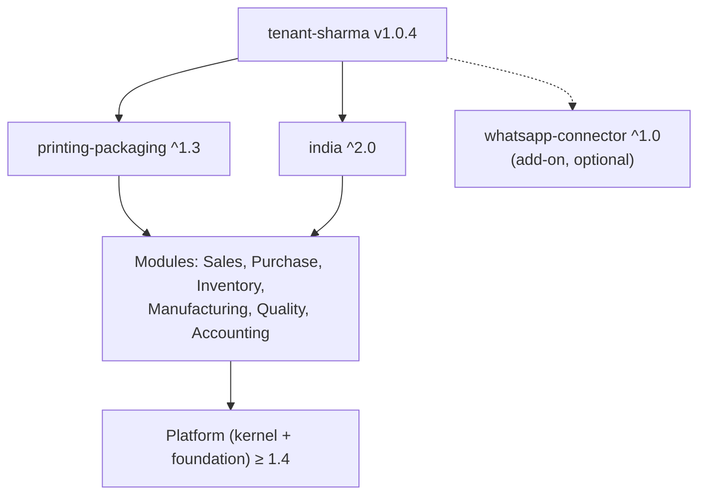
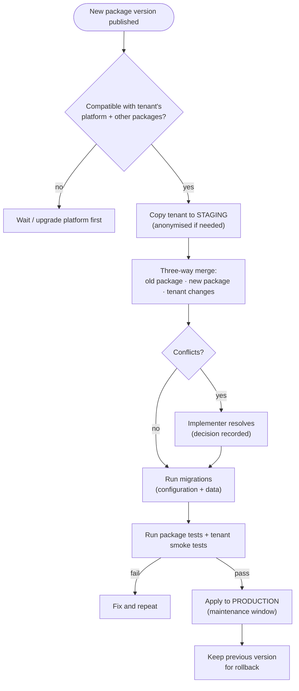
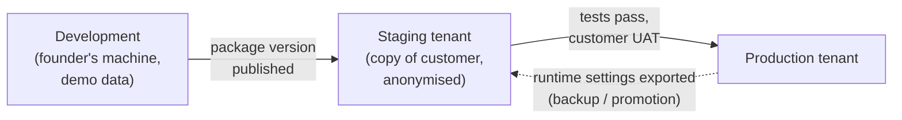

# Step 5A — Packages, Upgrades and Onboarding

> **Status:** In review · **Last updated:** 2026-10-03
> **Part of:** [Step 5 — Configuration Architecture](STEP-05-CONFIGURATION-ARCHITECTURE.md)
> **Answers:** What exactly is inside a package? What do the Printing package and India pack contain? How are packages versioned and upgraded without breaking customers? How does a new customer go from sign-up to go-live?

## TL;DR

- **Four package types:**
  - **Localization pack** (India)
  - **Industry package** (Printing & Packaging)
  - **Tenant package** (one customer's baseline)
  - **Add-on package** (e.g. a WhatsApp connector)

  Modules themselves are code releases.
- **What a package contains:**
  - a **manifest**: id, SemVer version, compatible platform range, required modules and packages
  - configuration files in **YAML**, validated by **JSON Schema**
  - optional **extension code**
  - **migrations**
  - **tests**
  - **seed and demo data**
- **Upgrades:** each tenant is **pinned** to package versions. An upgrade is a **dry-run on a staging tenant**, then a **three-way merge** with the tenant's own changes, then migrations, then tests, then production. The previous version is kept for rollback.
- **Onboarding** follows the brief's vision (country → industry → company structure → modules → masters → users → numbering → opening balances → go-live). In year 1 it is a **guided checklist run by the implementer**; a self-service wizard comes later.
- **Go-live with opening balances, not history:**
  - **Bring in:** masters, opening stock (per reel and batch, with value), open orders and POs, unpaid invoices.
  - **Leave out:** years of closed transactions.
- Every package ships **demo data** ("Demo Printers Pvt Ltd"), so the product can be demonstrated on day one.

---

## 1. Package types

| Type | Example | Authored by | Contains code? | Applied to |
| --- | --- | --- | --- | --- |
| **Localization pack** | `india` | Package author (us) | Yes (tax calculator, e-invoice adapter) | Each **company** in that country |
| **Industry package** | `printing-packaging` | Package author (us) | Yes (estimate calculator, kg ↔ sheet conversion, job costing) | The tenant |
| **Tenant package** | `tenant-sharma` | Implementer | **No** (configuration only; code requires an extension package) | One tenant |
| **Add-on package** | `whatsapp-connector`, `tally-connector` | Us / partners later | Yes (adapters) | Tenants that buy it |



## 2. Anatomy of a package

### 2.1 Manifest (illustrative — the final format is set at implementation)

| Field | Example | Purpose |
| --- | --- | --- |
| `id` | `printing-packaging` | Unique name |
| `type` | `industry` | Package type |
| `version` | `1.3.0` | **SemVer**: MAJOR = breaking, MINOR = additions, PATCH = fixes |
| `platform` | `>=1.4 <2.0` | Compatible platform versions |
| `requires.modules` | sales, purchase, inventory, manufacturing, quality | Hard dependencies ([ADR-0016](../adr/ADR-0016-DEPENDENCY-TYPES-AND-MANIFESTS.md)) |
| `requires.packages` | `india ^2.0` (optional), … | Other packages |
| `extensions` | `sales.estimateCalculator → PrintingEstimateCalculator` | Extension bindings |
| `locks` | e.g. "job sub-status *Ready for production* required" | Items higher layers may not remove |
| `migrations` | `1.2.0 → 1.3.0: rename field finishType → finishing` | Scripted changes for upgrades |
| `changelog` | Keep-a-Changelog file | Human-readable history |

### 2.2 Folder layout (illustrative)

```text
printing-packaging/
├── manifest.yaml
├── metadata/         # attribute sets, custom fields, picklists, custom objects (Artwork, Die, Plate)
├── terminology/      # label overrides per language (Job, Work order, Job card…)
├── processes/        # process definitions, sub-statuses, anchor type "Job"
├── workflows/        # default approval workflows and decision tables
├── rules/            # validation, default, automation and notification rules (CEL)
├── numbering/        # default series patterns
├── templates/        # estimate, quotation, job ticket, challan, invoice layout parts
├── reports/          # job board, wastage, estimate-vs-actual, …
├── roles/            # default roles and permission sets
├── seed-data/        # item categories, UOMs, operations, work-center types, starter rate tables
├── demo-data/        # "Demo Printers Pvt Ltd" with sample customers, jobs, stock
├── extensions/       # code: estimate calculator, kg↔sheet conversion, material requirement, job costing
├── migrations/       # version-to-version configuration and data migrations
└── tests/            # package tests (expected estimate results, approval routing, …)
```

Every YAML file is validated against a published **JSON Schema** before a version can be published ([ADR-0025](../adr/ADR-0025-PACKAGE-FORMAT.md)).

## 3. The Printing & Packaging package — inventory

| Area | Contents |
| --- | --- |
| **Item attribute sets** | Board/paper: GSM, size (L×W), grain, caliper, board type (FBB, SBS, Duplex, Kraft), reel width; Ink: colour, Pantone ref; Film: micron, type |
| **Item categories** | Board, Paper, Ink, Plate, Lamination film, Adhesive, Consumables, Spares, Finished goods (customer products), Scrap |
| **UOMs and conversions** | kg, sheet, ream, packet, reel, piece, 1,000 pieces; **formula conversion kg ↔ sheets** (GSM × area) |
| **Custom objects** | **Artwork** (versioned, approval), **Die** (number, ups, rack location), **Plate** (set per artwork version, status) |
| **Anchor type** | **Job**, with sub-statuses: Planned → Pre-press → Ready for production → In production → Ready for dispatch → Partially dispatched → Completed → Closed |
| **Product specification** | Customer product = item + printing attributes + BOM + routing + artwork/die/plate links ([ADR-0018](../adr/ADR-0018-CUSTOMER-PRODUCT-SPECIFICATION.md)) |
| **Operation templates** | Sheeting, Printing (n colours), Coating/UV, Lamination, Foil, Embossing, Die-cutting, Stripping, Folding-gluing, Inspection, Packing |
| **Work center types** | Sheeter, Offset press, Coater, Laminator, Die-cutter, Folder-gluer, Inspection table |
| **Process definitions** | Order-to-cash with optional estimate/quotation; repeat-order path; artwork gate; job work |
| **Default approvals** | Estimate margin/value, quotation below minimum price, SO credit check, PO value bands, adjustments, over-tolerance |
| **Default roles** | Owner, Sales, Estimator, Pre-press, Planner, Operator, Store keeper, QC, Dispatch, Purchase, Accountant |
| **Notifications** | Defaults from [Step 4 §4.5](STEP-04-PROCESS-ARCHITECTURE.md#45-events-and-notifications-defaults) |
| **Templates** | Estimate, Quotation, **Job ticket**, Material requisition, Job-work challan layout, Delivery challan, Packing slip |
| **Reports and dashboards** | Job board, pending orders, **wastage analysis**, **estimate vs actual**, machine utilisation, reel register |
| **Extensions (code)** | Estimate calculator (ups, sheets, costs per qty slab) · material requirement with make-ready/waste · kg ↔ sheet conversion · job costing |
| **Seed data** | Starter rate tables (machine-hour rates, finishing rates), waste reasons, inspection checklists |
| **Demo data** | Demo Printers Pvt Ltd: customers, product specs, open jobs, stock, invoices |

## 4. The India pack — inventory

| Area | Contents |
| --- | --- |
| Tax | GST calculator (CGST/SGST/IGST by place of supply), reverse charge, tax categories, HSN/SAC lists |
| Codes | **GST UQC** mapping for UOMs, state codes, GSTIN/PAN validation |
| Documents | E-invoice (IRN, QR), e-way bill, job-work challan fields, credit/debit note time limits |
| **Locks** | Statutory numbering (unique per FY, ≤ 16 characters), statutory invoice content, invoice copies (original/duplicate/triplicate) |
| Withholding | TDS/TCS rules on receipts and payments (thresholds as configuration) |
| Payables | MSME flag and 45-day due date rule |
| Calendar and formats | Financial year April–March; lakh/crore number formatting (CLDR `en-IN`) |
| Accounting bridge | Tally exporter, default ledger-mapping templates (GST ledgers) |
| Integrations | Adapter port for a GST Suvidha Provider (GSP) or direct portal APIs |

## 5. Versioning rules (SemVer applied to packages)

| Change | Version bump | Example |
| --- | --- | --- |
| Remove or change the meaning of a field, state, rule or extension contract | **MAJOR** (2.0.0) | Job sub-status removed; field type changed |
| Add fields, rules, templates, reports; new optional features | **MINOR** (1.4.0) | New "Foil stamping" operation template |
| Fix a wrong value, label or template bug | **PATCH** (1.3.1) | Wrong default waste % corrected |

Tenants are **pinned** to exact versions. A MINOR or PATCH upgrade is routine. A MAJOR upgrade needs a migration plan and the customer's agreement.

## 6. Upgrading a tenant to a new package version



**Three-way merge rules:**

| Old package | New package | Tenant changed it? | Result |
| --- | --- | --- | --- |
| A | A | No | A (nothing to do) |
| A | B | No | **B** (take the new value) |
| A | A | Yes (T) | **T** (keep the tenant's change) |
| A | B | Yes (T) | **Conflict**: implementer decides, decision recorded |
| A (locked) | B (locked) | Yes (T) | **B**, because locks win. The tenant override is flagged for review |

## 7. Environments and promotion



- Configuration moves **forward** only through published package versions.
- Runtime settings (approval limits, numbering) are changed in production by the admin and are audited. They can be exported and imported for backup or to copy between tenants.

## 8. Tenant onboarding

The brief's vision (§42): *"A company signs up, selects industry → company structure → modules → processes → roles → workflows → integrations, and the system configures itself."*


| Step | Year 1 (implementer-led) | Later (self-service) |
| --- | --- | --- |
| 1–3 | Implementer creates the tenant from packages | Sign-up wizard |
| 4 | Implementer enters the structure with the customer | Guided forms |
| 5 | Edition defaults ([ADR-0017](../adr/ADR-0017-SINGLE-EDITION-YEAR-ONE.md)) | Plan selection |
| 6 | **Excel/CSV import templates** filled by the customer, validated with an error report | Same, plus connectors to old systems |
| 7–9 | Admin screens (§5 of Step 5) | Same |
| 10 | Import + verification with the customer | Same |
| 11 | Go-live checklist signed off | Same |

## 9. Data migration and go-live

### 9.1 What we bring in

| Data | Bring in? | How |
| --- | --- | --- |
| Parties (customers, vendors, job workers) with GSTINs | ✅ | Import template; duplicate check on PAN/GSTIN |
| Items and **product specifications** (repeat products) | ✅ | Import template; product specs for active customers first |
| BOMs and routings for repeat products | ✅ (active ones) | Import or create from estimates |
| Dies, plates, artwork (current versions) | ✅ | Import list + attach files |
| **Opening stock** (per warehouse, reel/batch, status, owner, value) | ✅ | Physical count at cut-off + import |
| **Open** sales orders and POs (with remaining quantity) | ✅ | Import |
| **Unpaid** customer and vendor invoices (open items) | ✅ | Import from Tally outstanding reports |
| Closed historical transactions | ❌ | Stay in the old system / Tally; summary figures only if needed |
| Rate tables | ✅ | Seed from the package, then adjust |

### 9.2 Cut-over timeline (recommended)


**Rules:**

- Go live at the **start of a month** (ideally the financial year).
- Run a **full dress rehearsal on staging** first.
- **Count stock** physically at cut-off. The opening stock value must match the accountant's books.
- Tally continues as the books ([ADR-0010](../adr/ADR-0010-ACCOUNTING-VIA-TALLY-FIRST.md)).

([ADR-0031](../adr/ADR-0031-GO-LIVE-WITH-OPENING-BALANCES.md), [Q-28](../tracking/OPEN-QUESTIONS.md#q-28))

## 10. Demo tenant — a sales asset

Every industry package ships **demo data** so a fresh demo tenant shows a realistic printing business in minutes: customers, product specs, jobs in every state, stock with reels, invoices, a wastage report and estimate-vs-actual. This is the main tool for winning the first pilot.

## Open questions raised

[Q-22](../tracking/OPEN-QUESTIONS.md#q-22) package format · [Q-27](../tracking/OPEN-QUESTIONS.md#q-27) package upgrades · [Q-28](../tracking/OPEN-QUESTIONS.md#q-28) go-live data

## Related documents

- [Step 5 — Configuration Architecture](STEP-05-CONFIGURATION-ARCHITECTURE.md)
- [Step 4 — Process Architecture](STEP-04-PROCESS-ARCHITECTURE.md)
- [Industry Standards Register](../00-context/STANDARDS.md)
- [Decision Log (sheet)](../tracking/DECISION-LOG.csv)
