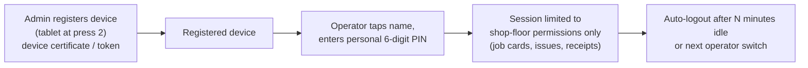
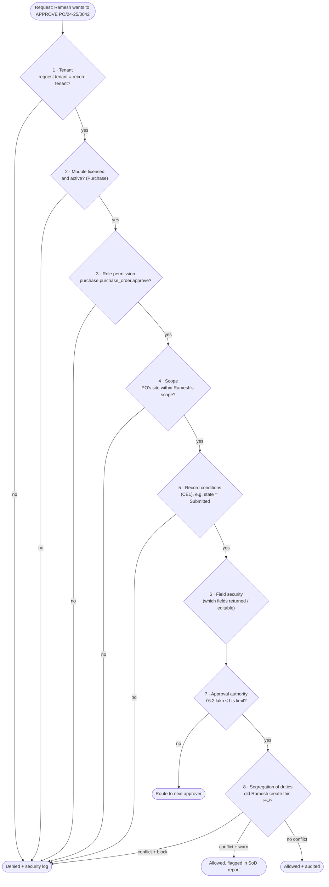
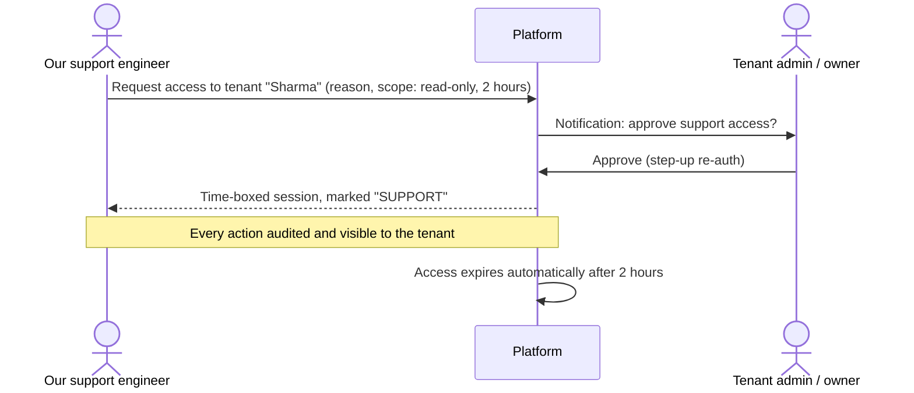

# Step 6 — Security Architecture: identity and access

> **Status:** In review · **Last updated:** 2026-10-03
> **Answers:** Who are we protecting against, and what? How do people and systems log in? How is "who may do what, where, on which record, and see which field" decided? How do approval limits and segregation of duties work? (Brief §12, §35; Step 6 list.) Tenant isolation, audit, privacy and operational security are in the companion file [Step 6A](STEP-06A-ISOLATION-AUDIT-PRIVACY-AND-OPERATIONS.md).

## TL;DR

- **Threat model first** (STRIDE). What attackers want from an SME ERP:
  - prices, margins and customer lists (competitors and departing employees)
  - money (fake vendors, changed bank details)
  - artwork (customers' intellectual property)
  - personal data
- **Authentication:**
  - The architecture is OIDC-compatible.
  - Passwords follow NIST SP 800-63B: length over complexity, breached-password check, no forced rotation.
  - **MFA is mandatory for privileged roles** (owner, admin, accountant, approvers), using an authenticator app or passkeys.
  - "Login with Google/Microsoft" is supported.
  - **Shop floor:** registered devices plus a personal PIN, limited to shop-floor tasks.
  - **Step-up re-authentication** is required for sensitive actions (approve, change bank details, bulk export).
- **Authorization is one central service that denies by default.** Each request passes eight checks: tenant → module licensed → role permission → **scope** (company/site/warehouse) → **record conditions** → **field security** → **approval authority** → **segregation of duties**. Everything is enforced on the server. Hiding a button is not security.
- **Approval authority is separate from permission.** Permission answers "can approve POs"; authority answers "up to ₹10 lakh".
- **Segregation of duties:** a conflict matrix (e.g. create vendor + pay vendor). Each conflict is set to *block*, *warn and log*, or *allow*. The SME default is warn and log, plus an owner/auditor report, because one person often holds several roles.
- **External and support users:**
  - Customer, vendor, job-worker and auditor users are scoped to **their own** records.
  - **We (the platform operator) have no standing access** to customer data. Support access is requested, approved by the tenant, time-boxed and audited.
- Proposed decisions: [ADR-0032 … ADR-0034, ADR-0039](#13-proposed-decisions-from-this-step). The rest are in 6A.

---

## 1. What this step must answer

| Brief asked (§12, §35, Step 6) | Answered in |
| --- | --- |
| Authentication, MFA, session management | §4 |
| RBAC, custom roles (no hard-coded roles) | §5, §9 |
| ABAC if necessary | §5.4 |
| Module / object / action / field / record / organization-level permissions | §5 |
| Approval permissions ("approve up to a value") | §6 |
| API security, rate limiting | §4.5, [6A §5](STEP-06A-ISOLATION-AUDIT-PRIVACY-AND-OPERATIONS.md#5-application-security-baseline-owasp-asvs-level-2) |
| Tenant isolation, encryption, secrets, backup, DR, monitoring, OWASP | [6A](STEP-06A-ISOLATION-AUDIT-PRIVACY-AND-OPERATIONS.md) |

---

## 2. Threat model (STRIDE)

### 2.1 What is valuable

| Asset | Why someone wants it | Example |
| --- | --- | --- |
| **Prices, costs, margins, estimates** | Competitors undercut; customers negotiate | Estimator's margin on a big pharma carton order |
| **Customer and vendor lists** | A departing salesperson takes accounts | Export of all customers with contacts |
| **Money flows** | Fraud | Vendor bank account changed to a fraudster's |
| **Stock** | Theft hidden by fake adjustments | 2 tonnes of board "written off" |
| **Artwork files** | Customers' intellectual property; counterfeit packaging | Pharma brand cartons |
| **Personal data** | Legal duty (DPDP Act) | Employee phone numbers, PAN of individuals |
| **Availability** | Dispatch and invoicing stop if the system is down | E-invoice generation at the gate |

### 2.2 Who might attack

| Actor | Typical goal |
| --- | --- |
| External attacker | Credential stuffing, ransomware, data theft |
| **Another tenant** | Accidental or deliberate access to a competitor's data, a SaaS-specific risk |
| Curious or malicious employee | See margins and salaries; export lists before leaving |
| Fraudulent insider | Fake vendor, bank detail change, stock write-off |
| Compromised integration or API key | Bulk data access |
| Platform operator (us) | Must also be constrained; customers must be able to trust us |

### 2.3 STRIDE summary

| Threat | Example in our ERP | Main control |
| --- | --- | --- |
| **S**poofing | Stolen password used to log in as the accountant | MFA, breached-password check, rate limiting (§4) |
| **T**ampering | Editing a posted invoice; changing the audit log | Immutability ([ADR-0007](../adr/ADR-0007-IMMUTABLE-POSTED-DOCUMENTS.md)), append-only hash-chained audit ([6A §3](STEP-06A-ISOLATION-AUDIT-PRIVACY-AND-OPERATIONS.md#3-audit-two-logs)) |
| **R**epudiation | "I never approved that PO" | Audit of every action; step-up re-auth for approvals |
| **I**nformation disclosure | Shop-floor user sees margins; tenant sees another tenant | Field security (§5.5), tenant isolation ([6A §2](STEP-06A-ISOLATION-AUDIT-PRIVACY-AND-OPERATIONS.md#2-tenant-isolation)) |
| **D**enial of service | Bulk report locks the database at dispatch time | Rate limits, query limits, background jobs |
| **E**levation of privilege | Store keeper edits own role; API bypasses UI checks | Central server-side authorization; admin actions audited; SoD (§7) |

Threat modelling is repeated for each new module or integration (standards register: STRIDE).

---

## 3. Security principles (fixed)

1. **Deny by default:** no permission means no access.
2. **Least privilege:** roles grant only what the job needs.
3. **Enforce on the server:** the UI hides what you can't use, but the server decides.
4. **Defence in depth:** tenant isolation in the application *and* in the database.
5. **Secure by default:** new tenants start with MFA for admins, strong session settings and audit on.
6. **Everything important is audited**, and the audit cannot be switched off.
7. **No shared accounts**, except the controlled shop-floor device mode (§4.3).
8. **Privacy by design:** collect the minimum personal data ([6A §4](STEP-06A-ISOLATION-AUDIT-PRIVACY-AND-OPERATIONS.md#4-privacy-and-data-protection-dpdp-act-2023)).

---

## 4. Authentication — proving who you are

### 4.1 Options

| Option | Pros | Cons |
| --- | --- | --- |
| Hand-written login system | Full control | Security mistakes are likely; reinventing standards |
| Hosted identity service (Auth0, Clerk, Cognito…) | Fast, feature-rich | Monthly cost per user grows; vendor lock-in; data outside our control |
| Self-hosted identity server (e.g. Keycloak) | Free, standards-complete | Heavy to operate for a solo developer |
| **Proven authentication library inside the platform, OIDC-compatible design** | Free; standards-based; no extra server; can switch to an identity server later | Must be configured carefully (ASVS checklist) |

**Recommendation** ([ADR-0032](../adr/ADR-0032-AUTHENTICATION.md)): use a **proven, maintained library**, not hand-written cryptography. Keep the architecture **OIDC-compatible**: the platform can act as an OIDC relying party for Google/Microsoft login now, and can move to a dedicated identity server later without changing the rest of the system. The concrete library is chosen in Step 9.

### 4.2 Login methods

| Method | Who | Rules |
| --- | --- | --- |
| Email + password | Office users | NIST SP 800-63B: **length, not complexity rules** (≥ 15 characters when the password is the only factor, ≥ 8 with MFA); check against breached-password lists; **no forced periodic change**; passwords stored with Argon2id |
| **MFA: authenticator app (TOTP)** | **Mandatory** for owner, admin, accountant, approvers; optional for others | RFC 6238; recovery codes |
| **Passkeys (WebAuthn/FIDO2)** | Later; strongest and phishing-resistant | Planned |
| "Login with Google / Microsoft" (OIDC) | Tenants on Google Workspace / Microsoft 365 | The tenant can enforce it for its domain |
| SMS / WhatsApp OTP | **Fallback only** (account recovery, low-privilege users without email) | Treated as weaker (NIST "restricted"); not accepted as MFA for privileged roles |
| **Shop-floor device + PIN** | Operators, store keepers on shared tablets/phones | See §4.3 |

### 4.3 Shop-floor login (the realistic case)

Operators often have no email, share a tablet at the machine, and change every shift. Forcing full password + MFA logins means people will share one account, which is worse.

| Control | Why |
| --- | --- |
| PIN works **only on registered devices** | A stolen PIN is useless elsewhere |
| PIN users get **only operator-level permissions** | No access to prices, approvals or exports from shop-floor mode |
| Each operator has their **own** PIN | Every job-card entry is attributable to a person |
| Lockout after failed PIN attempts; device can be revoked | Brute-force and lost-device protection |
| **Disabled in pharma (GMP) mode** | Part 11 requires full unique credentials for e-signatures |

### 4.4 Sessions

| Setting (default, configurable per tenant within limits) | Office | Shop-floor device |
| --- | --- | --- |
| Idle timeout | 30 minutes | 10 minutes / operator switch |
| Absolute session lifetime | 12 hours | Shift length |
| Cookie | Secure, HttpOnly, SameSite | Same |
| Concurrent sessions | Allowed; listed in profile; remote logout | One per device |

**Step-up re-authentication** (password or MFA again, even inside a session) is required for:

- approving above a threshold
- **changing bank details**
- changing roles and permissions
- bulk export
- support-access approval
- (pharma mode) electronic signatures

### 4.5 System-to-system authentication

| Caller | Method |
| --- | --- |
| Integrations (Tally connector, e-commerce, scripts) | OAuth 2 client credentials, or **scoped API keys**: stored hashed, shown once, with expiry, IP allow-list optional, rate-limited |
| Webhooks we send | Signed with HMAC (Standard Webhooks), timestamped to prevent replay |
| Webhooks we receive (payment gateway, GSP) | Signature verification per provider |
| Our own background jobs | Run as a named **system user** per tenant; every action is audited as "system on behalf of rule X" |

---

## 5. Authorization — deciding what you may do

### 5.1 The eight checks of every request

All eight checks run in **one central authorization service** (kernel K4), on the server, for UI and API calls alike.

### 5.2 Model options

| Option | Pros | Cons |
| --- | --- | --- |
| Pure RBAC (roles → permissions) | Simple, standard (NIST RBAC) | Can't say "only at Bhiwandi" or "only own customers" |
| **RBAC with scoped role assignments + attribute conditions** | Covers organization scope, record rules and field rules with few concepts | Needs careful design of scopes |
| Full policy engine (OPA / Cedar / XACML) | Very expressive | Another language and component to run; overkill for an SME MVP |
| Relationship-based (Google Zanzibar style) | Great for sharing-heavy apps | Not how ERPs grant access |

**Recommendation** ([ADR-0033](../adr/ADR-0033-AUTHORIZATION-MODEL.md)): **RBAC with scoped role assignments, plus limited attribute conditions written in CEL.** All checks go through one interface, so a policy engine could be plugged in later without touching modules.

### 5.3 Permissions

**Naming:** `module.object.action`, e.g. `purchase.purchase_order.approve`. Permissions are declared in each module's manifest ([ADR-0016](../adr/ADR-0016-DEPENDENCY-TYPES-AND-MANIFESTS.md)).

| Standard action | Meaning |
| --- | --- |
| `view` | See records (subject to scope and record rules) |
| `create`, `edit` | Create; edit while Draft |
| `delete` | Delete **drafts only** (posted documents are never deleted) |
| `submit`, `approve`, `reject` | Workflow actions |
| `post` / `release` / `confirm` | Lifecycle transitions with ledger effects |
| `cancel`, `amend`, `short_close` | Correction actions |
| `print`, `export` | Output; `export` is separately controlled and audited |
| `view_cost`, `view_margin`, `view_bank` | Special "sensitive view" permissions mapped to field groups |
| `admin.*` | Configuration and user management |

### 5.4 Scopes and record conditions

| Scope type | Meaning | Example |
| --- | --- | --- |
| Tenant | Everything in the tenant | Owner |
| Company | One legal entity (and everything under it) | Accountant of Sharma Packaging |
| Site | One plant/branch and its warehouses | Planner at Bhiwandi |
| Warehouse | Specific stores | Store keeper: Paper Store + FG Store |
| Grouping node | Region / business unit | Sales manager: West region |
| **Own** | Records the user created or owns | Sales executive: own quotations |
| **Assigned** | Records assigned to the user | Sales executive: customers assigned to them |
| **External party** | Records of their own company only | Customer portal user; job worker |

Scopes **inherit downwards**: company scope includes its sites and warehouses ([ADR-0004](../adr/ADR-0004-ORGANIZATION-MODEL.md)). A user may hold several role assignments with different scopes.

**Record conditions** (CEL), used sparingly:

- `record.state in ["Draft","Submitted"]` → edit only before approval.
- `record.party in user.assignedParties` → a sales executive sees only assigned customers.
- `record.site == device.site` → shop-floor device sees only its own plant.

### 5.5 Field-level security

| Field group | Contains | Default visibility |
| --- | --- | --- |
| **Cost and margin** | Estimate cost lines, margin %, valuation rates, job cost | Owner, estimator, accountant |
| **Purchase prices** | PO rates, vendor quotes, rate history | Owner, purchase, accountant |
| **Bank and payment details** | Party bank accounts, UPI ids | Accountant, owner (masked to last 4 digits elsewhere) |
| **Personal data** | Phone numbers, PAN of individuals, addresses of individuals | Roles that need it; masked in exports |
| **Selling prices** | SO/invoice rates | Sales, accounts, owner; **hidden from shop floor and stores** |

**Rules:**

- The server **never returns** a field the user may not see. This applies to screens, API, exports, search results, print templates and notifications alike.
- Field groups and their classification come from metadata ([Step 5 §6.1](STEP-05-CONFIGURATION-ARCHITECTURE.md#61-what-a-field-definition-contains)).
- A job ticket printed for the shop floor uses a template **without** prices and costs.

---

## 6. Approval authority and delegation

Permission says **whether** someone may approve; authority says **how much**.

| Concept | Example |
| --- | --- |
| **Authority limit** | Purchase head @ Bhiwandi: approve PO up to ₹10,00,000; credit notes up to ₹50,000 |
| Currency | Limits in company currency; foreign-currency documents converted at the document's rate |
| Conditions | Limit may differ by item category (capital goods: owner only) — decision table ([ADR-0028](../adr/ADR-0028-CEL-AND-DECISION-TABLES.md)) |
| **Delegation** | Owner on leave 10–20 Oct → delegates approval authority to the GM; delegation is time-boxed, visible and audited; the delegate cannot re-delegate |
| **Self-approval** | If the submitter already holds sufficient authority, the approval step is auto-completed and recorded ("self-approved within limit") — unless an SoD rule blocks it (§7) |

([ADR-0034](../adr/ADR-0034-APPROVAL-AUTHORITY-AND-SOD.md))

---

## 7. Segregation of duties (SoD)

SoD prevents one person from completing a risky chain alone. In SMEs, however, one person often *is* the whole purchase department. Strict blocking would make the system unusable, so each rule has a **mode**.

| Conflict pair | Risk | Default mode (SME) |
| --- | --- | --- |
| Create/edit vendor **and** approve payment to that vendor | Fake vendor fraud | **Warn + log** |
| **Change party bank details and make a payment** within N days | Bank detail fraud | **Block** (step-up + second person) |
| Create PO **and** approve the same PO above own limit | Self-dealing | Warn + log (self-approval within limit is allowed) |
| Post stock adjustment **and** approve the same adjustment | Hiding theft | **Block** |
| Create credit note **and** approve it | Revenue leakage | Warn + log |
| Edit user roles **and** use the new rights the same day | Privilege escalation | Warn + log |

| Mode | Behaviour |
| --- | --- |
| **Block** | Action refused; a second person must act |
| **Warn + log** | Action allowed with a warning; recorded in the **SoD exceptions report** for the owner / auditor |
| Allow | No check (tenant explicitly accepts the risk; recorded in configuration audit) |

---

## 8. External users and support access

| User type | Access | Controls |
| --- | --- | --- |
| **Customer portal** (later) | Own orders, dispatches, invoices, artwork approvals | External-party scope; no internal fields |
| **Vendor portal** (later) | Own POs, delivery schedules, payment status | External-party scope |
| **Job worker** | Own challans and pending material | External-party scope |
| **Auditor / CA** | Read-only, all companies or selected ones, **time-boxed** | Expires automatically; exports audited |
| **Implementer / support (us)** | See below | — |

**Support access — no standing access for the platform operator** ([ADR-0039](../adr/ADR-0039-SUPPORT-ACCESS.md)):

Emergency ("break-glass") access without tenant approval is allowed only for a platform-wide incident. It must be logged, reported to the tenant afterwards, and reviewed.

---

## 9. Default roles (Printing package) — permission summary

✅ full · 👁 view · ✏️ create/edit · ✔ approve (within authority) · — none · 🔒 sensitive fields hidden

| Area | Owner | Sales | Estimator | Planner | Operator (device) | Store keeper | QC | Dispatch | Purchase | Accountant | Admin |
| --- | --- | --- | --- | --- | --- | --- | --- | --- | --- | --- | --- |
| Estimates (incl. margin) | ✅ | ✏️ 🔒 | ✅ | 👁 🔒 | — | — | — | — | — | 👁 | — |
| Quotations / Sales orders | ✅ | ✏️ | 👁 | 👁 🔒 | — | — | — | 👁 🔒 | — | 👁 | — |
| Jobs / production orders | ✅ | 👁 | 👁 | ✅ | 👁 own site | 👁 | 👁 | 👁 | 👁 | 👁 | — |
| Job cards | 👁 | — | — | ✏️ | ✏️ own | — | 👁 | — | — | — | — |
| Purchase orders | ✔ | — | — | ✏️ PR only | — | ✏️ PR only | — | — | ✏️ ✔ | 👁 | — |
| GRN / issues / transfers | 👁 | — | — | 👁 | — | ✏️ (own stores) | 👁 | — | 👁 🔒 | 👁 | — |
| Stock adjustments | ✔ | — | — | — | — | ✏️ | — | — | — | 👁 | — |
| Inspections | 👁 | — | — | 👁 | — | — | ✏️ ✔ | — | 👁 | — | — |
| Deliveries | 👁 | 👁 | — | 👁 | — | ✏️ | — | ✏️ | — | 👁 | — |
| Invoices, notes | ✔ | 👁 | — | — | — | — | — | 👁 🔒 | ✏️ bills | ✅ | — |
| Receipts / payments / Tally export | ✔ | 👁 | — | — | — | — | — | — | 👁 | ✅ | — |
| Party bank details | 👁 | — | — | — | — | — | — | — | — | ✏️ (step-up) | — |
| Users, roles, settings | 👁 | — | — | — | — | — | — | — | — | — | ✅ |

Roles are **templates**. Tenants can copy and change them, and create new roles. The **Admin** role manages configuration but does **not** automatically see business data. In small firms the owner usually holds both roles.

---

## 10. Pharma design test

| Part 11 / Annex 11 need | Supported by |
| --- | --- |
| Unique user IDs, no shared accounts | §3 principle 7; shop-floor PIN mode disabled in GMP mode |
| Electronic signature = re-authentication + meaning ("Approved by QA") + link to record | Step-up re-auth (§4.4) + approval record + audit |
| Audit trail of GMP records | [6A §3](STEP-06A-ISOLATION-AUDIT-PRIVACY-AND-OPERATIONS.md#3-audit-two-logs) |
| Role-based access, periodic access review | §5, access review report ([6A §6](STEP-06A-ISOLATION-AUDIT-PRIVACY-AND-OPERATIONS.md#6-operations-backup-recovery-monitoring-and-incidents)) |

No structural change is needed. The design test passes.

## 11. Configurable vs fixed

| Fixed | Configurable per tenant |
| --- | --- |
| Eight-step authorization chain, deny by default, server-side enforcement | Roles, permissions, scopes, record conditions |
| MFA mandatory for owner, admin, accountant and approvers | MFA for other roles; Google/Microsoft login enforcement |
| Password rules (NIST baseline) | Session timeouts within allowed ranges |
| No standing operator access; support access needs approval | Support access duration (within limits) |
| Step-up for bank details, role changes, bulk export | Step-up thresholds for approvals |
| Posted documents can't be deleted (no `delete` beyond drafts) | SoD modes (block / warn / allow) per rule, except locked rules (bank-detail change + payment) |

## 12. Assumptions challenged

| Brief assumption | Our position |
| --- | --- |
| A fixed role list (Super Admin, Finance Manager…) | Roles are templates; custom roles everywhere (brief agrees: "don't hard-code") |
| "Organization-level" permission as a separate type | Covered by **scopes** on role assignments |
| "Approval level" as a permission | Separate **authority** concept (§6) |
| MFA everywhere | Mandatory where the risk is high; shop floor uses device + PIN — otherwise people share accounts |
| Security "first-class" | Yes, but sized for a solo developer: OWASP ASVS **Level 2**, not Level 3. No ISO 27001/SOC 2 certification in year 1. Automated scans now; a professional penetration test before or soon after the first paying customer, when revenue allows ([6A](STEP-06A-ISOLATION-AUDIT-PRIVACY-AND-OPERATIONS.md)) |

## 13. Proposed decisions from this step

| ADR | Decision | Status |
| --- | --- | --- |
| [ADR-0032](../adr/ADR-0032-AUTHENTICATION.md) | Authentication: proven library, OIDC-compatible, NIST passwords, MFA for privileged roles, shop-floor device + PIN, step-up re-auth, scoped API keys | **Proposed** |
| [ADR-0033](../adr/ADR-0033-AUTHORIZATION-MODEL.md) | Authorization: RBAC with scoped assignments + CEL record conditions + field security; one central deny-by-default service | **Proposed** |
| [ADR-0034](../adr/ADR-0034-APPROVAL-AUTHORITY-AND-SOD.md) | Approval authority separate from permission; delegation; SoD matrix with block / warn / allow | **Proposed** |
| [ADR-0039](../adr/ADR-0039-SUPPORT-ACCESS.md) | No standing operator access; tenant-approved, time-boxed, audited support access | **Proposed** |

ADR-0035 … 0038 are in [Step 6A](STEP-06A-ISOLATION-AUDIT-PRIVACY-AND-OPERATIONS.md#8-proposed-decisions).

## Open questions raised

[Q-29](../tracking/OPEN-QUESTIONS.md#q-29) authentication and MFA ·
[Q-30](../tracking/OPEN-QUESTIONS.md#q-30) shop-floor login ·
[Q-31](../tracking/OPEN-QUESTIONS.md#q-31) authorization model ·
[Q-32](../tracking/OPEN-QUESTIONS.md#q-32) segregation of duties ·
[Q-36](../tracking/OPEN-QUESTIONS.md#q-36) support access

## Related documents

- [Step 6A — Isolation, Audit, Privacy and Operations](STEP-06A-ISOLATION-AUDIT-PRIVACY-AND-OPERATIONS.md)
- [Step 2 §3 — Identity and access concepts](STEP-02-DOMAIN-MODEL.md#3-identity-and-access-concepts)
- [Industry Standards Register](../00-context/STANDARDS.md)
