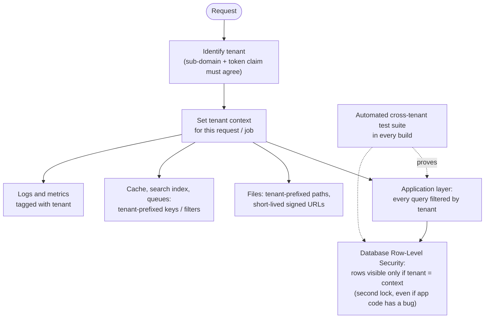
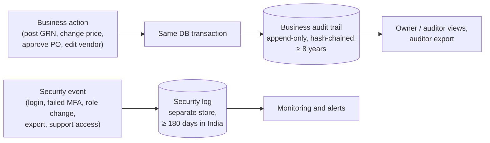
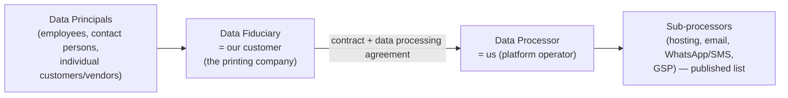
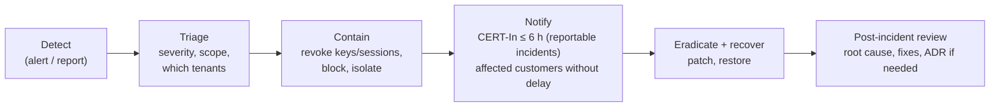

# Step 6A — Tenant Isolation, Audit, Privacy and Security Operations

> **Status:** In review · **Last updated:** 2026-10-03
> **Part of:** [Step 6 — Security Architecture](STEP-06-SECURITY-ARCHITECTURE.md)
> **Answers:** How do we guarantee one customer never sees another's data? What is audited, and how is the audit made trustworthy? What do Indian privacy and cyber-security laws require? Which application-security baseline do we follow? How do backup, recovery, monitoring and incident response work?

## TL;DR

- **Four data classes:** Public, Internal, Confidential (prices, costs, customer lists, artwork) and **Restricted** (credentials, bank details, personal identifiers). Handling rules get stricter with each level.
- **Tenant isolation in layers:** a tenant context on every request; **database Row-Level Security** as a second lock; tenant-prefixed files, caches, search and jobs; an **automated cross-tenant test suite**. The design must allow a large tenant to move to its own database, and one tenant to be restored without touching others.
- **Two audit logs:**
  1. the **business audit trail**, required by law: it cannot be disabled, is append-only and **hash-chained**, and is kept at least 8 years
  2. the **security log**: logins, permission changes, exports, support access. It is kept at least 180 days **in India** (CERT-In).
- **Privacy (DPDP Act 2023):**
  - The **customer is the Data Fiduciary; we are the Data Processor.**
  - Personal data is minimised: **no Aadhaar numbers, no biometrics**.
  - Data is hosted **in India**.
  - Every customer signs a data processing agreement, and the sub-processor list is published.
  - There is a breach-notification path.
- **Encryption:** TLS in transit; encryption at rest; **field-level encryption for Restricted data**; secrets in a secret manager, never in Git or packages.
- **Security baseline:** **OWASP ASVS Level 2**, automated scanning in CI, a responsible-disclosure page, and a professional penetration test when revenue allows.
- **Operations:**
  - Backups follow **3-2-1** with point-in-time recovery, and restores are **tested monthly**.
  - Targets: **RPO ≤ 15 minutes, RTO ≤ 4 hours**.
  - Incident runbook, with **CERT-In reporting within 6 hours**.
  - Quarterly access reviews; dormant accounts disabled after 90 days.

---

## 1. Data classification

| Class | Examples | Access | Storage | Export | Logging |
| --- | --- | --- | --- | --- | --- |
| **Public** | Company name on invoices, product names in catalogues | Anyone in the tenant | Normal | Allowed | Normal |
| **Internal** | Orders, stock levels, job status | Role + scope | Normal (encrypted at rest) | With `export` permission | Normal |
| **Confidential** | **Prices, costs, margins, estimates, vendor rates, customer lists, artwork files** | Field groups ([Step 6 §5.5](STEP-06-SECURITY-ARCHITECTURE.md#55-field-level-security)) | Encrypted at rest | Permission + **step-up** for bulk; watermarked; audited | Never written to logs |
| **Restricted** | **Passwords, API keys, GSP/e-invoice credentials, bank account numbers, PAN of individuals, phone numbers of individuals** | Minimal roles; masked elsewhere | **Field-level encryption**; credentials in secret manager | Masked or excluded by default | Never logged |

Every field carries its class in metadata ([Step 5 §6.1](STEP-05-CONFIGURATION-ARCHITECTURE.md#61-what-a-field-definition-contains)), so masking and export rules apply automatically.

---

## 2. Tenant isolation

A data leak between tenants (one printer seeing a competitor's prices) would end the business ([R-06](../tracking/RISK-REGISTER.md)). Isolation is therefore enforced in **several independent layers**.

| Control | Detail |
| --- | --- |
| Tenant id on **every** business row | No table without a tenant column (except global platform reference data such as currency codes) |
| **Row-Level Security** (PostgreSQL) | Policies enforce `tenant = current tenant` on every table; the application database user cannot bypass them |
| No cross-tenant queries in application code | Only separate platform-operations tooling, with its own audit |
| Files | Stored under a tenant prefix; served only via short-lived signed URLs after an authorization check |
| Background jobs and events | Carry the tenant id; the job runner sets the context before running |
| **Cross-tenant tests** | For every API endpoint: create data in tenant A, call as tenant B, expect "not found" |
| Per-tenant restore | Backups and tooling allow **restoring a single tenant** without affecting others |
| Path to dedicated database | A large or enterprise tenant can move to its own database or server, or be deployed on-premise. Same code, different deployment (Step 8/9) |

([ADR-0035](../adr/ADR-0035-TENANT-ISOLATION.md))

---

## 3. Audit: two logs

### 3.1 Business audit trail (statutory "edit log")

| Requirement | Design |
| --- | --- |
| Records **every** create, change, state transition and draft deletion of books-relevant records and masters | Kernel K9, written **inside the same transaction** as the change |
| What changed | Field-level old value → new value (including extension fields) |
| Who | User, plus *on behalf of*: delegation, automation rule, system job, **support access** |
| When | UTC timestamp from a synchronised clock (NTP) |
| Why | Reason for corrections, cancellations, short-closes and overrides |
| **Cannot be disabled** | Required by the Companies (Accounts) Rules for accounting software (from 1 April 2023); no setting exists to switch it off |
| **Tamper-evident** | Append-only (no update or delete rights, even for admins). Each entry includes a **hash of the previous entry** per tenant, so a deleted or altered entry breaks the chain and is detectable |
| Retention | At least **8 years** (books of account retention under the Companies Act); tenants may choose longer |
| Access | Owner and auditor roles; exportable for statutory audit |

### 3.2 Security log

| Event | Examples |
| --- | --- |
| Authentication | Login success/failure, MFA, password reset, new device, lockout |
| Authorization changes | Role or permission edits, role assignments, delegation |
| Sensitive actions | Step-up events, **bulk exports**, bank detail changes, API key creation/use |
| Support access | Request, approval, every action, expiry |
| Configuration | Package version changes, runtime setting changes |

Retention: **at least 180 days, stored in India.** This meets the CERT-In Directions (2022) requirement to keep ICT system logs. We recommend one year. The log goes to a store that application administrators cannot alter.

([ADR-0036](../adr/ADR-0036-AUDIT-AND-LOGGING.md))

---

## 4. Privacy and data protection (DPDP Act 2023)

### 4.1 Who is responsible for what

| Duty | Fiduciary (customer) | Processor (us) |
| --- | --- | --- |
| Lawful purpose and notice to individuals | ✅ | Provide features to record purposes and notices |
| Data minimisation | Decides what to collect | **Design minimises by default** |
| Access / correction / erasure requests | Receives and decides | **Tools:** export a person's data, correct, anonymise |
| Security safeguards | Uses them properly | **Implements them** (this document) |
| Breach notification to the Data Protection Board and affected people | ✅ | **Notify the customer without delay** with the facts needed |
| Retention and deletion | Sets the policy (within legal retention) | Enforces it; deletes or anonymises data on contract end (after export) |

### 4.2 Personal data in our ERP — and what we refuse to collect

| Collected (minimum) | Where |
| --- | --- |
| User accounts: name, email/phone, login history | Identity |
| Employee directory: name, department, user link | Foundation (minimal; no HR details in the MVP) |
| Party contact persons: name, phone, email, role | Party |
| Individuals as parties (proprietorships): PAN, address | Party (Restricted class) |
| Operator activity on job cards | Manufacturing (work records) |

| **Not collected** | Why |
| --- | --- |
| **Aadhaar numbers** | Legally restricted storage; not needed for ERP purposes |
| Biometrics, health data, caste/religion | Not needed; high legal risk |
| Salary and bank details of employees | Out of MVP scope (HR & payroll later, with its own design) |

**Retention conflict:** statutory retention wins for records inside the books. An invoice keeps the contact name as it was printed ([ADR-0008](../adr/ADR-0008-REFERENCE-VS-SNAPSHOT.md)). Personal data not tied to statutory records (old contact persons, departed users' profiles) is anonymised when no longer needed.

### 4.3 Hosting location

**India-region hosting** for all tenant data, backups and logs. Reasons:

- customer trust
- latency
- the CERT-In requirement to keep logs in India
- simpler DPDP compliance

A second region **within India** is used for backups.

### 4.4 Encryption and secrets

| Layer | Control |
| --- | --- |
| In transit | TLS 1.2 minimum, TLS 1.3 preferred; HSTS |
| At rest | Database and object storage encryption (provider-managed keys); encrypted backups |
| **Field level** | Restricted fields (bank account numbers, integration credentials) encrypted by the application with keys from a key management service |
| **Secrets** | API keys, GSP passwords, signing keys kept in a **secret manager**, never in Git, packages, logs or config exports; rotated; access audited |

([ADR-0037](../adr/ADR-0037-PRIVACY-AND-ENCRYPTION.md))

---

## 5. Application security baseline (OWASP ASVS Level 2)

| Area | Key controls |
| --- | --- |
| **Access control** (OWASP #1 risk) | Central authorization service ([Step 6 §5](STEP-06-SECURITY-ARCHITECTURE.md#5-authorization--deciding-what-you-may-do)); deny by default; **automated authorization tests for every endpoint** |
| Injection | Parameterised queries only; CEL evaluated in a sandbox with time and size limits; no dynamic code execution |
| Cross-site scripting | Framework auto-escaping; Content Security Policy; sanitised rich text |
| Cross-site request forgery | SameSite cookies + anti-CSRF tokens |
| Server-side request forgery | Outgoing webhooks and integrations: block private IP ranges; allow-lists where possible |
| **File uploads** (artwork, PDFs, scans) | Size limits; type checked by content, not extension; malware scan; stored outside the web root; served from a separate domain via signed URLs; never executed |
| Rate limiting and lockout | Login, OTP, PIN, password reset, API, report generation, exports |
| Bulk export protection | `export` permission + step-up above N rows + watermark (user and time) + audit + daily volume alert |
| Errors and logging | No stack traces to users (RFC 9457 problem responses); no passwords, tokens or Restricted data in logs |
| Dependencies | Dependency vulnerability scanning (SCA) and automatic update PRs; secret scanning on every commit |
| Security headers | HSTS, CSP, X-Content-Type-Options, frame protection |
| Testing | Security unit tests; automated dynamic scan (e.g., OWASP ZAP) against staging in CI; **professional penetration test** before or soon after the first paying customer |
| Disclosure | `security.txt` (RFC 9116) and a responsible-disclosure page |

([ADR-0038](../adr/ADR-0038-SECURITY-BASELINE-AND-OPERATIONS.md))

---

## 6. Operations: backup, recovery, monitoring and incidents

### 6.1 Backup and recovery

| Item | Target / practice |
| --- | --- |
| Rule | **3-2-1**: 3 copies, 2 different media/services, 1 in another location (second Indian region) |
| Database | Continuous backup with **point-in-time recovery**; daily snapshots kept 30 days; monthly kept 12 months |
| Files (artwork, PDFs) | Object storage with versioning; replicated copy |
| **RPO** (maximum data loss) | **≤ 15 minutes** |
| **RTO** (maximum downtime to restore) | **≤ 4 hours** |
| **Restore drills** | **Monthly**, documented. A backup is only real once a restore has been tested |
| Single-tenant restore | Supported (e.g., a customer deleted data by mistake) |

### 6.2 Monitoring and alerts

| Signal | Alert to |
| --- | --- |
| Uptime, error rate, slow responses | Us |
| Spike in failed logins / lockouts | Us (+ tenant admin if one tenant) |
| Login from a new device | The user |
| Role/permission change, support access, bank-detail change | Tenant owner |
| Unusual export volume | Tenant owner + us |
| GST portal / Tally export failures | Tenant accountant |

Logs, metrics and traces use **OpenTelemetry**. Logs are kept at least 180 days in India.

### 6.3 Incident response

The tenant (as Data Fiduciary) notifies the Data Protection Board and affected individuals for personal-data breaches. We support them with facts and timelines.

### 6.4 Hygiene routines

| Routine | Frequency |
| --- | --- |
| Dependency updates; critical vulnerabilities patched | Weekly; critical within 72 hours |
| **Access review report** for each tenant owner (users, roles, last login, SoD exceptions) | Quarterly |
| Dormant accounts disabled | After 90 days without login |
| Offboarding: disable user, revoke sessions and API keys, reassign open approvals | Immediately when an employee leaves |
| Restore drill | Monthly |
| Threat model review | Each new module or integration |

## 7. Shared responsibility

| Responsibility | Hosting provider | Us (platform) | Customer (tenant) |
| --- | --- | --- | --- |
| Physical and network security | ✅ | — | — |
| Database/storage encryption infrastructure, backup infrastructure | ✅ | Configure and test | — |
| Application security, tenant isolation, patching | — | ✅ | — |
| Monitoring, incident response, CERT-In reporting | — | ✅ | Report suspicious activity |
| Users, roles, MFA enrolment, offboarding, SoD settings | — | Provide tools | ✅ |
| Personal-data purposes, notices, rights requests (DPDP fiduciary) | — | Provide tools | ✅ |
| Devices used by staff (phones, shop-floor tablets) | — | Device registration feature | ✅ |

## 8. Proposed decisions

| ADR | Decision | Status |
| --- | --- | --- |
| [ADR-0035](../adr/ADR-0035-TENANT-ISOLATION.md) | Layered tenant isolation: tenant context + database RLS + tenant-keyed files/caches/jobs + cross-tenant tests; single-tenant restore; path to dedicated database | **Proposed** |
| [ADR-0036](../adr/ADR-0036-AUDIT-AND-LOGGING.md) | Business audit trail (cannot be disabled, append-only, hash-chained, ≥ 8 years) + security log (≥ 180 days in India) | **Proposed** |
| [ADR-0037](../adr/ADR-0037-PRIVACY-AND-ENCRYPTION.md) | DPDP roles; data classification; minimisation (no Aadhaar); India hosting; field-level encryption; secret manager | **Proposed** |
| [ADR-0038](../adr/ADR-0038-SECURITY-BASELINE-AND-OPERATIONS.md) | OWASP ASVS L2; 3-2-1 backups with PITR; RPO ≤ 15 min / RTO ≤ 4 h; monthly restore drills; incident response incl. CERT-In 6 h | **Proposed** |

## Open questions raised

[Q-33](../tracking/OPEN-QUESTIONS.md#q-33) tenant isolation ·
[Q-34](../tracking/OPEN-QUESTIONS.md#q-34) audit and retention ·
[Q-35](../tracking/OPEN-QUESTIONS.md#q-35) privacy and India hosting ·
[Q-37](../tracking/OPEN-QUESTIONS.md#q-37) security baseline and recovery targets

## Related documents

- [Step 6 — Security Architecture](STEP-06-SECURITY-ARCHITECTURE.md)
- [Industry Standards Register](../00-context/STANDARDS.md)
- [Risk Register](../tracking/RISK-REGISTER.md)
