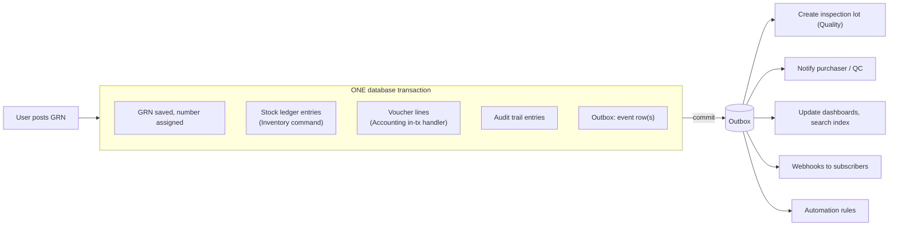
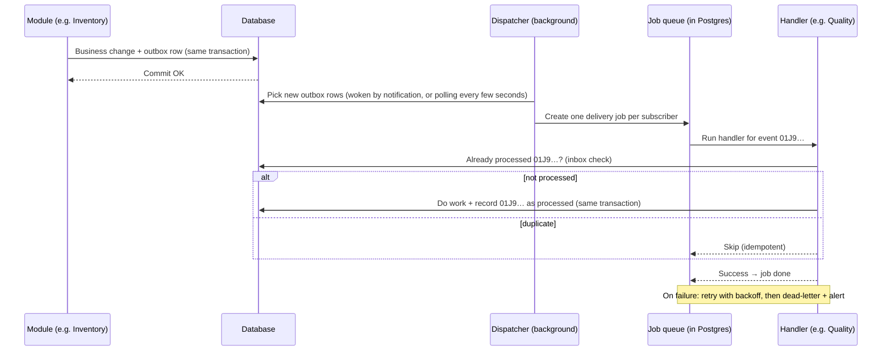
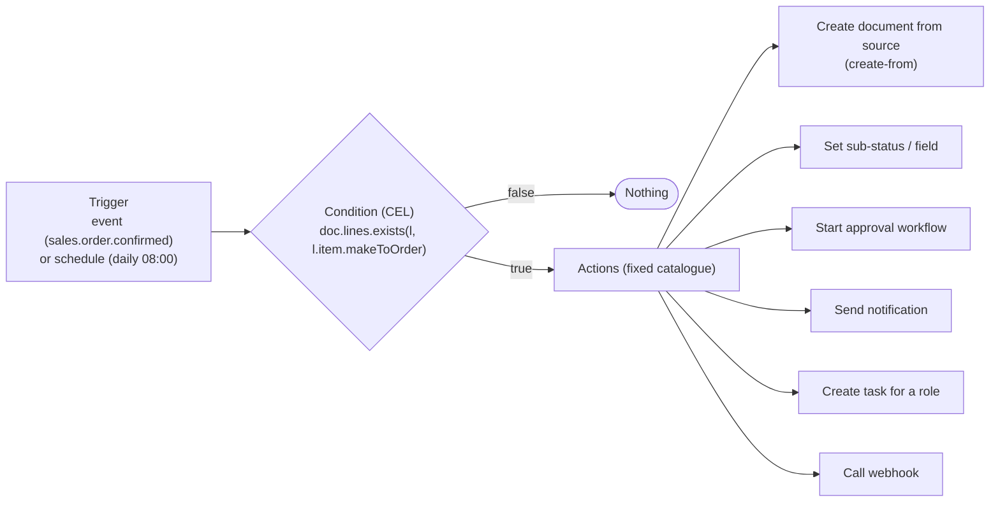
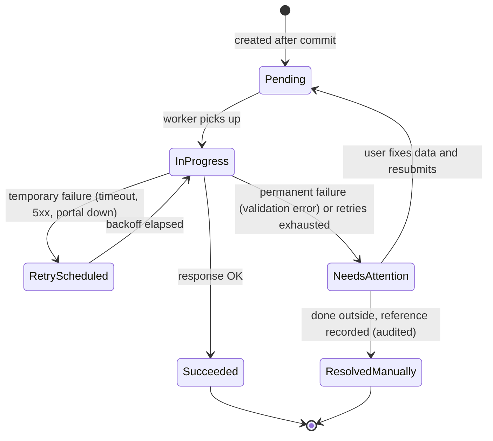

# Step 7 — Event Architecture and Automation

> **Status:** Accepted (founder agreed with all recommendations, 2026-10-04) · **Last updated:** 2026-10-04
> **Answers:** How does "something happened" (a PO approved, goods received, an invoice overdue) reliably trigger other modules, automations, integrations, notifications and audit, without losing or duplicating anything? Do we need a message broker, Kafka or event sourcing? (Brief §11, §30; Step 7.) The approval workflow engine and the notification engine are in the companion file [Step 7A](STEP-07A-WORKFLOW-AND-NOTIFICATIONS.md).

## TL;DR

- **Two kinds of reaction:**
  - **Must happen together with the change** (stock and voucher posted with the GRN): runs **inside the same database transaction**. All or nothing.
  - **Can follow shortly after** (notify QC, update dashboards, register the e-invoice, call a webhook): runs **after commit**, via the **transactional outbox**.
- **Delivery:**
  - The event is saved in the same transaction as the business change, then delivered by a background dispatcher.
  - Delivery is **at least once**. Every consumer is **idempotent**: it remembers which events it has processed, so duplicates are harmless.
  - Retries use exponential backoff. Failures that keep failing go to a **dead-letter list** with an alert.
- **No Kafka, no RabbitMQ, no Redis** in the MVP. **PostgreSQL holds the outbox and the job queue**, which is enough for thousands of events per minute. We will add a broker behind the same interface only when clear graduation triggers are met.
- **No event sourcing** for documents and masters. We already get its benefits where they matter, through **append-only ledgers** (stock, vouchers) and the **hash-chained audit trail**.
- **Event format:** names like `inventory.goods_receipt.posted` and the **CloudEvents** envelope. Payloads are versioned, with correlation and causation ids (W3C Trace Context).
- **Automation rules:** trigger (event or schedule) → condition (CEL) → actions from a **fixed catalogue**. They run as the tenant's system user, with **loop protection** and full audit.
- **External calls** (GST e-invoice / e-way bill, Tally, email, webhooks) go through **integration jobs** with a visible state, retries, idempotency and a "portal down" mode. A GST outage queues invoices instead of breaking dispatch.

---

## 1. What this step must answer

| Brief asked (§11, §30, Step 7) | Answered in |
| --- | --- |
| Domain events, event bus, message queue, webhooks, outbox, event sourcing where appropriate | §2–§6 |
| Events trigger workflows, notifications, integrations, automation, reports, audit, other modules | §3, §7 |
| ACID vs eventual consistency, idempotency, transaction boundaries | §3, §4 |
| Rules engine execution ("if production completed then create FG receipt") | §7 |
| Scheduled actions (overdue invoices, reminders) | §8 |
| Integrations and webhooks | §9 |
| Workflow engine, notification engine | [Step 7A](STEP-07A-WORKFLOW-AND-NOTIFICATIONS.md) |

---

## 2. What an event is (recap) and the two event types

An **event** is an immutable, past-tense fact, recorded after a change has been committed ([Step 2 §7](STEP-02-DOMAIN-MODEL.md#7-events-rules-notifications)).

| Type | Audience | Example | Contract stability |
| --- | --- | --- | --- |
| **Domain event** | Modules and kernel services **inside** the platform | `inventory.goods_receipt.posted` | Internal; may evolve with platform releases |
| **Integration event** | **Outside** the platform: webhooks, partners, connectors | `com.masterp.inventory.goods_receipt.posted.v1` | **Public and versioned** (v1, v2…); old versions supported for a deprecation period |

### 2.1 Naming

`<module>.<object>.<past-tense verb>`, for example:

| Event | Emitted when |
| --- | --- |
| `sales.order.confirmed` | Sales Order released |
| `inventory.goods_receipt.posted` | GRN posted |
| `quality.inspection.decided` | Accept / reject decision recorded |
| `manufacturing.production.confirmed` | Final production confirmation |
| `sales.invoice.posted` | Invoice posted (voucher generated) |
| `sales.invoice.overdue` | Scheduler finds an invoice past its due date |
| `india.einvoice.registered` | IRN received from the portal |

Each module's events are declared in its **manifest** ([ADR-0016](../adr/ADR-0016-DEPENDENCY-TYPES-AND-MANIFESTS.md)), forming an **event catalogue** that is generated documentation, not a hand-written list.

### 2.2 Envelope (CloudEvents)

| Field | Example | Purpose |
| --- | --- | --- |
| `id` | `01J9…` (unique) | Deduplication |
| `type` | `inventory.goods_receipt.posted` | What happened |
| `source` | `/tenants/sharma/inventory` | Where |
| `subject` | `GRN/25-26/0101` | Which document |
| `time` | `2026-10-04T09:15:02Z` (ISO 8601, UTC) | When |
| `tenantid` *(extension)* | `sharma` | Isolation ([ADR-0035](../adr/ADR-0035-TENANT-ISOLATION.md)) |
| `traceparent` *(extension, W3C Trace Context)* | `00-…` | **Correlation**: links everything caused by one user action |
| `causationid` *(extension)* | id of the event or command that caused this one | Loop detection, debugging |
| `actor` *(extension)* | user / system rule / support session | Audit |
| `dataschema` / version | `…/goods_receipt.posted/v1` | Payload version |
| `data` | Key facts: ids, totals, status, company, site | Payload |

**Payload size:** events carry the **key facts** (ids, status, totals, scope), not the whole document. Consumers that need more call the owner module's query contract ([ADR-0015](../adr/ADR-0015-INTER-MODULE-COMMUNICATION.md)). Integration events sent outside respect **field security** ([Step 6 §5.5](STEP-06-SECURITY-ARCHITECTURE.md#55-field-level-security)) for the subscription's service account.

---

## 3. In-transaction vs after-commit: the deciding rule

> **If the reaction is required for the business state to be valid, it runs inside the transaction. If it can lag behind or be retried, it runs after commit.**

| Reaction | Mode | Why |
| --- | --- | --- |
| Stock ledger posting for a GRN / issue / delivery | **In transaction** (command) | Stock must never disagree with documents |
| Voucher generation for invoices, receipts, notes | **In transaction** (in-tx handler) | Books must match documents |
| Audit trail | **In transaction** | Legal requirement; never lost ([ADR-0036](../adr/ADR-0036-AUDIT-AND-LOGGING.md)) |
| Statutory number assignment | **In transaction** | Gapless ([ADR-0029](../adr/ADR-0029-NUMBERING.md)) |
| **Job creation when a Sales Order is confirmed** | **In transaction** (automation marked *essential*) | An order without a job is an invalid state for make-to-order |
| Inspection lot creation after GRN | After commit | The GRN is valid with stock in Quarantine; the lot can follow seconds later |
| Notifications, dashboards, search index | After commit | Must never fire for rolled-back changes |
| E-invoice / e-way bill registration | After commit (integration job) | External system; may be slow or down |
| Webhooks, Tally export batches | After commit | External |

---

## 4. Reliable delivery: outbox, dispatcher, idempotent consumers

### 4.1 The mechanism

### 4.2 Guarantees

| Guarantee | How |
| --- | --- |
| **No lost events** | The event row is committed with the business change, or not at all |
| **No events for rolled-back changes** | Same reason |
| **At-least-once delivery** | The dispatcher retries until the handler confirms |
| **No double effects** | Every handler is **idempotent**. It records processed event ids (an "inbox") in the same transaction as its work |
| **Order per document** | Events about the same `subject` are delivered in order. There is no global order across documents, and none is needed |
| Retries | Exponential backoff (e.g. 1 min, 5 min, 30 min, 2 h, 12 h); limits per handler |
| **Dead-letter list** | After the final retry: job parked, alert raised, visible in an operations screen, can be **replayed** after a fix |
| Tenant context | Each job carries `tenantid`; the worker sets the context before running ([ADR-0035](../adr/ADR-0035-TENANT-ISOLATION.md)) |

### 4.3 API requests are idempotent too

Clients (mobile app on a weak shop-floor network, integrations) may resend the same request. Every **create / post** API accepts an **`Idempotency-Key`** header (an IETF draft convention widely used by payment APIs). The server stores the result for 24 hours and returns the same result for repeats. A job card is never saved twice because of a retry.

([ADR-0041](../adr/ADR-0041-OUTBOX-AND-DELIVERY.md))

---

## 5. Infrastructure: do we need a message broker?

| Option | Pros | Cons | Verdict for MVP |
| --- | --- | --- | --- |
| **PostgreSQL outbox + PostgreSQL job queue** (mature open-source libraries exist for this) | **Zero extra infrastructure**; outbox and business data in one transaction; easy backup; enough for thousands of events per minute | Not for very high throughput; workers poll the database | ✅ **Chosen** |
| Redis (Streams / queue libraries) | Fast | Extra server; not transactional with business data (outbox still needed) | Later, only if needed |
| RabbitMQ | Mature broker, routing | Extra server to run, monitor and back up | Later, if many external consumers |
| Kafka | Huge throughput, replayable log | Heavy to operate; designed for problems we don't have | ❌ Not justified |
| Cloud queues (SQS, Pub/Sub) | Managed | Cloud lock-in; still need the outbox | Possible later behind the same port |

**Graduation triggers** (revisit when any is true for weeks):

- sustained event volume makes database polling a measurable load (e.g. > 50 events/second);
- many external consumers need fan-out with their own replay;
- a module is extracted into a separate service ([ADR-0003](../adr/ADR-0003-MODULAR-MONOLITH-DIRECTION.md)).

Because publishing and consuming go through a kernel **event port**, swapping the transport later does not change module code. The concrete library is chosen in Step 9.

---

## 6. Event sourcing: where it fits, and where it doesn't

**Event sourcing** stores *only* events and rebuilds current state by replaying them. It is powerful but costly.

| Area | Event sourcing? | Reason |
| --- | --- | --- |
| Documents (orders, GRNs, invoices) | ❌ No | State-based tables with lifecycle + audit trail are simpler to query, report and migrate; corrections are already explicit documents ([ADR-0007](../adr/ADR-0007-IMMUTABLE-POSTED-DOCUMENTS.md)) |
| Masters (items, parties) | ❌ No | Frequent queries; personal-data erasure (DPDP) is awkward with immutable event streams |
| **Stock ledger, vouchers** | Already **append-only ledgers** | We get the main benefit (full history, rebuildable balances) without the complexity |
| Audit trail | Already **append-only, hash-chained** | Tamper evidence without event sourcing |
| Configuration | Versioned packages + audited settings | History via Git and audit |

**Decision:** state-based persistence + append-only ledgers + audit trail + outbox events. **No event sourcing** ([ADR-0042](../adr/ADR-0042-NO-EVENT-SOURCING.md)). The brief asked us not to assume event sourcing everywhere; the evaluation found no area where it pays off.

---

## 7. Automation rules

### 7.1 Structure

### 7.2 The brief's rule examples, mapped

| Brief example | Kind | How it runs |
| --- | --- | --- |
| SO value > ₹10 lakh → additional approval | Approval routing | Workflow definition condition ([7A](STEP-07A-WORKFLOW-AND-NOTIFICATIONS.md)) |
| Stock < reorder level → replenishment suggestion | Scheduled automation | Daily schedule → create PR suggestions |
| QC failed → block material | **Core invariant**, not a rule | Inventory status Rejected ([Step 4D](STEP-04D-INVENTORY-AND-QUALITY.md)) |
| Invoice overdue > 30 days → notify | Scheduled event + notification rule | Scheduler emits `sales.invoice.overdue`; notification rule sends |
| Production completed → create FG receipt | **Core behaviour** of production confirmation | Manufacturing requests the Inventory receipt in the same transaction ([Step 4C](STEP-04C-PLAN-TO-PRODUCE.md)) |

Several "rules" in the brief turn out to be **core behaviour or invariants**, not configurable automation. That keeps the automation layer small and safe.

### 7.3 Safety rails

| Rail | Detail |
| --- | --- |
| **Fixed action catalogue** | Automations can only do what the catalogue allows. No scripts ([ADR-0028](../adr/ADR-0028-CEL-AND-DECISION-TABLES.md)) |
| **Runs as the tenant's system user** with explicit, least-privilege permissions | Audited as "automation rule *Create job on SO* v3" |
| **Loop protection** | Every automation-caused event carries a `causationid` chain. Maximum depth 3; a rule cannot trigger itself |
| Rate limits | Per rule and per tenant (e.g. max 1,000 actions/hour) |
| Essential vs optional | *Essential* automations run in the transaction (failure blocks the user action with a clear message). *Optional* ones run after commit with retries |
| Test mode | A rule can run in **dry-run** against recent events and show what it *would* have done |
| Versioned | Package/runtime versioning ([ADR-0024](../adr/ADR-0024-CONFIGURATION-LAYERS-AND-STORES.md)) |

([ADR-0043](../adr/ADR-0043-AUTOMATION-RULES.md))

---

## 8. Scheduled jobs

| Job | Default schedule (tenant time zone) | Produces |
| --- | --- | --- |
| Overdue invoice scan | Daily 08:00 | `sales.invoice.overdue` events |
| MSME vendor payment due scan | Daily 08:00 | `purchase.vendor_payment.due` events |
| Reorder suggestions | Daily 06:00 | PR suggestions |
| Approval SLA / escalation check | Every 5 minutes | Reminders, escalations ([7A](STEP-07A-WORKFLOW-AND-NOTIFICATIONS.md)) |
| Job-work overdue scan | Daily | `manufacturing.job_work.overdue` |
| Tally export batch (optional) | Daily 20:00 | Export batch ([ADR-0022](../adr/ADR-0022-TALLY-EXPORT-GRANULARITY.md)) |
| **Scheduled reports** (brief §23) | User-defined | Report emailed / in-app |
| Dormant account disable, cleanup | Daily | Security hygiene ([6A §6.4](STEP-06A-ISOLATION-AUDIT-PRIVACY-AND-OPERATIONS.md#64-hygiene-routines)) |

Rules:

- Schedules run on the same job queue.
- Each run has a **run key** (tenant + job + period), so a job that runs twice after a restart does nothing the second time.
- Schedules use cron-style expressions in the tenant's time zone; durations are in ISO 8601 format.

---

## 9. Integrations: calls out and calls in

### 9.1 Outgoing calls as integration jobs

Every call to an external system becomes an **integration job** with its own visible state:

### 9.2 Worked example: e-invoice when the GST portal is down

| Situation | Behaviour |
| --- | --- |
| Normal | Invoice posted → integration job → IRN + QR stored in seconds → final print |
| Portal slow or down | Job retries with backoff; **circuit breaker** pauses calls after repeated failures and shows a banner: *"GST portal unavailable — 3 invoices queued"*; dispatch staff see the invoice as **Posted, awaiting IRN** |
| Duplicate submission (a retry after a timeout that actually succeeded) | The portal reports the invoice as already registered → treated as **success**, and the existing IRN is fetched (idempotent) |
| Data error (e.g. wrong GSTIN) | **NeedsAttention** with the portal's message; user corrects (via credit note + new invoice if posted) |
| Long outage, goods must move | Generate on the government portal manually, then record the IRN in the ERP (**ResolvedManually**, audited) |

This mitigates risk [R-16](../tracking/RISK-REGISTER.md).

### 9.3 Webhooks we send

| Rule | Standard / detail |
| --- | --- |
| Tenant admin subscribes a URL to integration event types | Admin screen; per-subscription service account and field security |
| Payload | CloudEvents JSON |
| Signature | **Standard Webhooks** (HMAC signature, timestamp, id); secret per subscription |
| Retries | Backoff up to ~24 hours; then the subscription is **auto-disabled** and the admin is notified |
| Safety | No calls to private network addresses (SSRF protection, [6A §5](STEP-06A-ISOLATION-AUDIT-PRIVACY-AND-OPERATIONS.md#5-application-security-baseline-owasp-asvs-level-2)) |
| Delivery log | Per attempt: time, status, response code; visible to the admin |

### 9.4 Webhooks and data we receive

1. **Verify** the sender's signature (payment gateway, GSP).
2. **Store** the raw message.
3. **Deduplicate** by the provider's event id.
4. **Process asynchronously** as a job.

We never do heavy work inside the incoming HTTP request.

([ADR-0046](../adr/ADR-0046-INTEGRATION-JOBS-AND-WEBHOOKS.md))

---

## 10. Observability of events

| Need | How |
| --- | --- |
| "What happened because of this PO approval?" | All events, jobs, notifications and audit entries share one **trace id** (W3C Trace Context); one screen shows the chain |
| Stuck or failing jobs | Operations screen: queues, retries, dead letters, integration jobs needing attention; alerts ([6A §6.2](STEP-06A-ISOLATION-AUDIT-PRIVACY-AND-OPERATIONS.md#62-monitoring-and-alerts)) |
| Throughput and lag | OpenTelemetry metrics: outbox lag (seconds between commit and delivery), queue depth |

---

## 11. Pharma design test

| Need | Supported |
| --- | --- |
| Batch release only after QA approval | In-transaction guard + approval workflow ([7A](STEP-07A-WORKFLOW-AND-NOTIFICATIONS.md)) |
| No automatic approval on timeout | GMP mode forbids auto-approve escalation actions |
| Complete traceable history of who triggered what | Trace id + causation chain + audit trail |

No structural change is needed. The design test passes.

## 12. Configurable vs fixed

| Fixed | Configurable |
| --- | --- |
| Outbox for all after-commit reactions; idempotent consumers; at-least-once delivery | Which automations and notifications are active |
| In-transaction posting of stock, vouchers, audit, statutory numbers | Schedules (times), retry limits within bounds |
| Fixed automation action catalogue; loop limit; system-user execution | Automation rules (trigger, condition, actions) |
| CloudEvents envelope; Standard Webhooks signing | Webhook subscriptions per tenant |
| No event sourcing | — |

## 13. Risks

| Risk | Mitigation |
| --- | --- |
| Automation loops or event storms | Causation chain, depth limit, rate limits, dry-run |
| Poison message blocks a queue | Per-message retries, dead-letter list, alerts, replay after fix |
| Silent failures of external calls | Integration jobs with visible states and alerts; daily "needs attention" summary |
| Postgres queue load grows | Graduation triggers; transport behind a port (§5) |

## 14. Proposed decisions

| ADR | Decision | Status |
| --- | --- | --- |
| [ADR-0040](../adr/ADR-0040-EVENT-MODEL.md) | Domain vs integration events; naming; CloudEvents envelope; key-fact payloads; W3C trace correlation; event catalogue from manifests | Accepted |
| [ADR-0041](../adr/ADR-0041-OUTBOX-AND-DELIVERY.md) | Transactional outbox + Postgres job queue; at-least-once; idempotent consumers; retries; dead-letter; Idempotency-Key on APIs; no broker until graduation triggers | Accepted |
| [ADR-0042](../adr/ADR-0042-NO-EVENT-SOURCING.md) | No event sourcing; state-based persistence + ledgers + audit + outbox | Accepted |
| [ADR-0043](../adr/ADR-0043-AUTOMATION-RULES.md) | Automation rules: trigger + CEL condition + fixed action catalogue; system user; loop protection; essential vs optional | Accepted |
| [ADR-0046](../adr/ADR-0046-INTEGRATION-JOBS-AND-WEBHOOKS.md) | Integration jobs with visible states, retries, circuit breaker, manual resolution; Standard Webhooks out; verify-store-dedupe-async in | Accepted |

ADR-0044 (workflow engine) and ADR-0045 (notifications) are in [Step 7A](STEP-07A-WORKFLOW-AND-NOTIFICATIONS.md#10-proposed-decisions).

## Open questions raised

[Q-38](../tracking/OPEN-QUESTIONS.md#q-38) event model ·
[Q-39](../tracking/OPEN-QUESTIONS.md#q-39) outbox and no broker ·
[Q-40](../tracking/OPEN-QUESTIONS.md#q-40) no event sourcing ·
[Q-41](../tracking/OPEN-QUESTIONS.md#q-41) automation rules ·
[Q-44](../tracking/OPEN-QUESTIONS.md#q-44) integration jobs and webhooks

## Related documents

- [Step 7A — Workflow and Notifications](STEP-07A-WORKFLOW-AND-NOTIFICATIONS.md)
- [Step 3 §8 — How modules talk](STEP-03-MODULE-BOUNDARIES.md#8-how-modules-talk-to-each-other)
- [Industry Standards Register](../00-context/STANDARDS.md)
