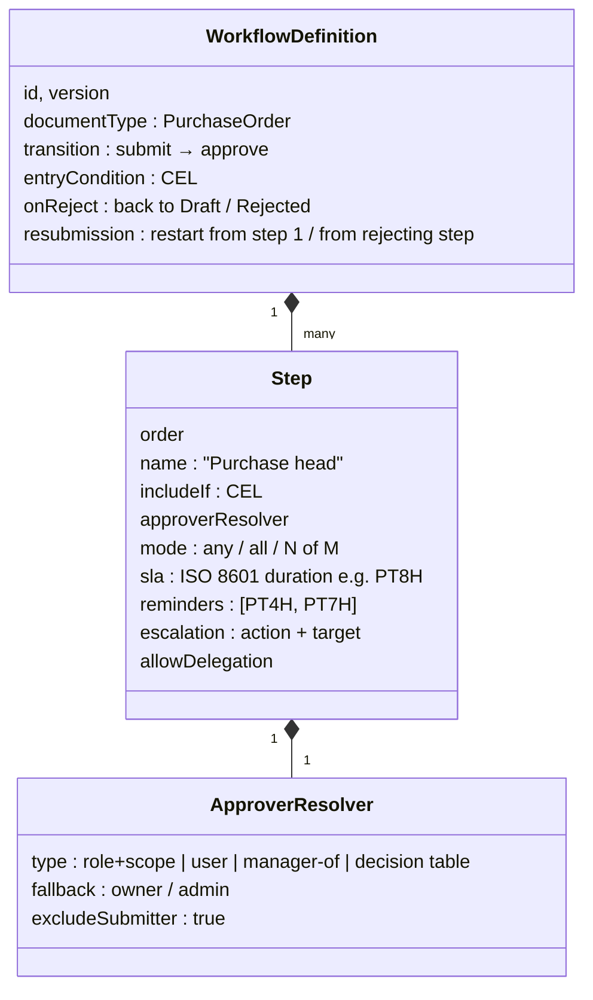
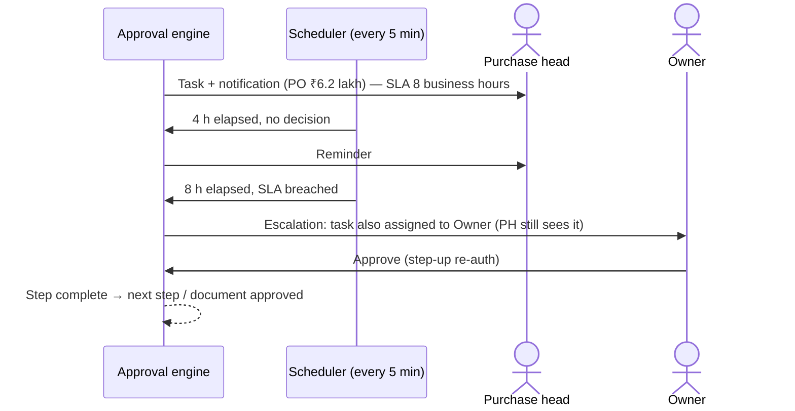
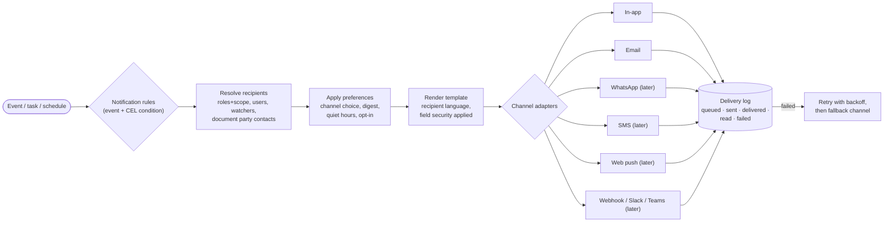

# Step 7A — Approval Workflow Engine and Notification Engine

> **Status:** In review · **Last updated:** 2026-10-04
> **Part of:** [Step 7 — Event Architecture and Automation](STEP-07-EVENTS-AND-AUTOMATION.md)
> **Answers:** How are approval levels, hierarchies, conditions, parallel and sequential approvals, escalations, delegation, rejection, resubmission, timeouts and SLAs configured and run (brief §8)? How do notifications reach the right people on the right channel, with templates, timing and escalation (brief §10)?

## TL;DR

- **We build a small approval engine of our own.** We do not embed a general BPM engine (Camunda, Flowable, Temporal): our need is approvals, tasks and timers, not arbitrary process orchestration. The concepts follow **BPMN** (user task, exclusive and parallel gateway, timer) so formal export stays possible.
- **A workflow definition is versioned and attached to a document transition** (e.g. PO *submit → approve*). It is made of steps, and each step has:
  - an **approver resolver**: role + scope of the document, a named user, the document owner's manager, or a decision table
  - a **mode**: any one / all / N of M
  - an inclusion condition in CEL
  - an **SLA** with reminders and an **escalation** action
- **Fixed safety rules:**
  - an approver is never missing: there is always a fallback approver, and no approver never means auto-approve
  - a submitter cannot approve their own document beyond their limit; SoD rules apply ([ADR-0034](../adr/ADR-0034-APPROVAL-AUTHORITY-AND-SOD.md))
  - changing the amount after approval needs re-approval
  - GMP mode forbids auto-approval
- **Approvals come from one inbox** (web and phone). A notification deep link opens the approval screen after login or step-up. **No blind "reply YES" approvals** over WhatsApp or SMS in the MVP.
- **The notification engine is a pipeline:**
  1. event
  2. notification rule (CEL)
  3. recipients
  4. preferences and quiet hours
  5. template (in the recipient's language)
  6. channel adapter
  7. delivery tracking, retries and fallback
- **MVP channels:** in-app and email. **Later:** WhatsApp (Meta pre-approved templates, opt-in, per-message cost passed on to the tenant), SMS (**TRAI DLT registration** required in India), web push, Slack/Teams via webhook.
- Email deliverability follows **SPF, DKIM and DMARC**.

---

## Part 1 — Approval workflow engine

### 1. Build or embed?

| Option | Pros | Cons |
| --- | --- | --- |
| Embed a BPMN engine (Camunda, Flowable) | Full BPMN, visual modeller | Heavy (usually Java), separate runtime and data store, most features unused, steep learning curve |
| Durable-execution platform (Temporal) | Very robust long-running workflows | Extra cluster to run; built for developers writing workflow code, not admins configuring approvals |
| Cloud step functions | Managed | Lock-in, cost, outside the database transaction |
| **Own small approval engine** on our tables | Runs inside our transactions; exactly the features needed; configured via packages and admin screens ([ADR-0024](../adr/ADR-0024-CONFIGURATION-LAYERS-AND-STORES.md)) | We maintain it. Scope must stay limited to approvals and tasks |

**Recommendation:** own small engine ([ADR-0044](../adr/ADR-0044-APPROVAL-WORKFLOW-ENGINE.md)). This is not the same as "process orchestration": document flows are handled by document links and process definitions ([ADR-0006](../adr/ADR-0006-PROCESS-AS-DOCUMENT-FLOW.md)). The engine only decides **when a guarded transition may happen**.

### 2. Workflow definition

**Example (default Printing package, PO approval):**

| Step | Include if (CEL) | Approver | Mode | SLA | Escalation |
| --- | --- | --- | --- | --- | --- |
| 1 Purchase head | `doc.totals.net > 50000` | Role *Purchase head* with scope covering `doc.site` | any one | 8 business hours | Remind at 4 h; at 8 h escalate to Owner |
| 2 Owner | `doc.totals.net > 500000 \|\| doc.category == "Capital"` | Role *Owner* | any one | 24 h | Remind at 12 h; at 24 h notify Owner again + Admin |
| 3 Finance + Production (parallel) | `doc.category == "Capital"` | Accountant **and** Production head | **all** | 24 h | Remind; escalate to Owner |

### 3. Running an approval (instance lifecycle)

```mermaid
stateDiagram-v2
    [*] --> Running : document submitted, definition chosen (version pinned)
    state Running {
        [*] --> StepActive
        StepActive --> StepActive : next step (conditions evaluated)
        StepActive --> Escalated : SLA breached
        Escalated --> StepActive : escalation target acts
    }
    Running --> Approved : last step approved → document transition fires
    Running --> Rejected : any approver rejects (reason required)
    Running --> SentBack : approver requests changes (reason required)
    Running --> Recalled : submitter withdraws before decision
    Running --> Cancelled : document cancelled
    SentBack --> [*] : document back to Draft; resubmission starts a new instance
    Approved --> [*]
    Rejected --> [*]
    Recalled --> [*]
    Cancelled --> [*]
```

| Rule (fixed) | Why |
| --- | --- |
| The instance keeps the **definition version** it started with | Rule changes don't affect in-flight approvals |
| **No approver found → fallback approver** (owner/admin), never auto-approve | Prevents silent bypass when someone leaves the company |
| The submitter is excluded as approver beyond their own authority; SoD rules apply | [ADR-0034](../adr/ADR-0034-APPROVAL-AUTHORITY-AND-SOD.md) |
| **Material change after approval** (amount ↑, vendor, items) → re-approval | An approval covers what was approved. Amendments create a new revision ([ADR-0007](../adr/ADR-0007-IMMUTABLE-POSTED-DOCUMENTS.md)) |
| Approve/reject happens in the same transaction as the document transition | No "approved workflow, unapproved document" states |
| Every decision recorded with who, when, reason, on-behalf-of, and (pharma) the signature meaning | Audit and e-signature ([ADR-0036](../adr/ADR-0036-AUDIT-AND-LOGGING.md)) |
| **GMP mode: no auto-approve** escalation actions | Part 11 / Annex 11 |

### 4. SLA, reminders and escalation

| Escalation action | Allowed |
| --- | --- |
| Remind the same approver | ✅ |
| Add an escalation approver (keep the original) | ✅ default |
| Reassign to the escalation approver | ✅ |
| Auto-reject | ✅ (e.g. quotation approvals that expire) |
| **Auto-approve** | ⚠️ Only for low-risk, low-value steps explicitly configured; **never** in GMP mode; always audited |

**Business hours and holidays** come from the company's working calendar (Foundation fiscal calendar + holidays). SLAs pause outside working time when configured.

### 5. Delegation and out-of-office

During a delegation period ([Step 6 §6](STEP-06-SECURITY-ARCHITECTURE.md#6-approval-authority-and-delegation)), new tasks go to the delegate, shown as *"on behalf of Owner"*. Existing tasks can be reassigned in bulk. Delegation never exceeds the delegator's own authority, and the delegate cannot delegate further.

### 6. The approval inbox

| Feature | Detail |
| --- | --- |
| One inbox for all approval tasks | Web and phone; badge counts |
| Decision screen | Document summary, **what changed since the last approval**, attachments, approval history, the approver's remaining authority |
| Actions | Approve · Reject (reason) · Send back for changes (reason) · Delegate (if allowed) · Comment |
| Bulk approve | For low values only; above a threshold each approval needs individual review and step-up |
| **From a notification** | The email or WhatsApp message carries a **deep link**. It opens the decision screen after login or step-up re-auth. **No approvals by replying "YES"** in the MVP: no step-up, and spoofing risk |

---

## Part 2 — Notification engine

### 7. The pipeline

### 8. Notification rules

| Element | Example |
| --- | --- |
| Trigger | `sales.invoice.overdue` |
| Condition (CEL) | `event.data.daysOverdue in [7, 15, 30]` |
| Recipients | Sales owner of the customer (internal) · customer's accounts contact (external) |
| Channels | Internal: in-app + email · External: email (WhatsApp later) |
| Template | `invoice-overdue-reminder` (English / Hindi) |
| Timing | Immediate · delayed · **daily digest** · quiet hours respected |
| Escalation | If still unpaid at 30 days → notify Owner |

Defaults come from the Printing package ([Step 4 §4.5](STEP-04-PROCESS-ARCHITECTURE.md#45-events-and-notifications-defaults)). Admins change recipients and channels in a screen ([Step 5 §5](STEP-05-CONFIGURATION-ARCHITECTURE.md#5-the-configuration-catalogue)).

**Rules (fixed):**

1. **Approval and security notifications can't be fully switched off.** At least the in-app notification always remains.
2. **Field security applies inside messages.** A store keeper's notification never shows prices ([Step 6 §5.5](STEP-06-SECURITY-ARCHITECTURE.md#55-field-level-security)).
3. **Notifications are sent only after commit** (outbox, [Step 7 §4](STEP-07-EVENTS-AND-AUTOMATION.md#4-reliable-delivery-outbox-dispatcher-idempotent-consumers)). A message is never sent for a change that was rolled back.
4. **Each notification is sent once per recipient per event** (idempotent), even if the event is delivered twice.

### 9. Channels

| Channel | When | Indian / industry requirements | MVP? |
| --- | --- | --- | --- |
| **In-app** | Always available; the notification centre | — | ✅ |
| **Email** | Internal alerts; documents to customers/vendors (PO PDF, invoice, reminders) | Deliverability needs **SPF, DKIM, DMARC**. MVP sends from our domain with *reply-to* the tenant; the tenant's own domain later | ✅ |
| **WhatsApp** | High-attention alerts; customer reminders | Meta WhatsApp Business: **pre-approved templates** (registry tracks approval status, [Step 5 §10](STEP-05-CONFIGURATION-ARCHITECTURE.md#10-output-templates-print-email-whatsapp)), **recipient opt-in**, messaging-window rules, **per-message charges** → tenant add-on with cost caps | Later (add-on) |
| **SMS** | OTP fallback; critical alerts | India: **TRAI DLT** registration of the sender (entity), header (sender ID) and every template, or messages are blocked | Later |
| Web push (PWA) | Phone alerts without WhatsApp cost | Web Push standards | Later |
| Slack / Teams / webhooks | Tenants who live in those tools | Via webhook adapter ([Step 7 §9.3](STEP-07-EVENTS-AND-AUTOMATION.md#93-webhooks-we-send)) | Later |

**Fallback and retries:** each channel adapter retries temporary failures. A failed WhatsApp message can fall back to email, and a failed email to in-app only.

**Quiet hours** (default 21:00–08:00 for WhatsApp/SMS to people) apply except to urgent categories (security alerts).

**Cost control:** per-tenant monthly caps for paid channels, and usage shown to the tenant admin.

**Delivery log retention:** 1 year, then deleted. It is operational data with personal details (DPDP, [ADR-0037](../adr/ADR-0037-PRIVACY-AND-ENCRYPTION.md)).

### 10. Proposed decisions

| ADR | Decision | Status |
| --- | --- | --- |
| [ADR-0044](../adr/ADR-0044-APPROVAL-WORKFLOW-ENGINE.md) | Own small approval engine (BPMN-aligned concepts); versioned definitions on transitions; steps with resolvers, modes, conditions, SLA, reminders, escalation; fixed safety rules; inbox with deep-link approvals | **Proposed** |
| [ADR-0045](../adr/ADR-0045-NOTIFICATION-ENGINE.md) | Notification pipeline; rules; preferences and quiet hours; field security in messages; MVP in-app + email; WhatsApp/SMS later with Meta templates and TRAI DLT; delivery log, retries, fallback, cost caps | **Proposed** |

## 11. Pharma design test

- QA release approvals with **electronic-signature meaning** ("Released by QA") and re-authentication.
- Sequential approvals with **no auto-approve**.
- The full decision history is audited.

The design test passes.

## 12. Configurable vs fixed

| Fixed | Configurable |
| --- | --- |
| Fallback approver; never auto-approve when no approver is found | Workflow definitions: steps, conditions, resolvers, modes, SLAs, escalations |
| Re-approval on material change; SoD; version pinning | Which changes count as "material" (beyond defaults) |
| Deep-link approvals only (no reply-to-approve) in the MVP | Bulk-approve threshold |
| Approval/security notifications always reach in-app | Notification rules, recipients, channels, digests, quiet hours |
| Send-after-commit, once per recipient per event | Templates (within statutory locks) |

## 13. Risks

| Risk | Mitigation |
| --- | --- |
| Approvals stuck (approver left, on leave) | Fallback approver, escalation, delegation, admin reassign screen, "stuck approvals" report |
| Notification fatigue → people ignore everything | Digests, preferences, sensible defaults, no duplicate messages |
| WhatsApp/SMS costs surprise the tenant | Add-on with caps and usage display |
| Approval engine grows into a BPM suite (inner-platform) | Scope limited to approvals/tasks/timers ([ADR-0044](../adr/ADR-0044-APPROVAL-WORKFLOW-ENGINE.md)) |

## Open questions raised

[Q-42](../tracking/OPEN-QUESTIONS.md#q-42) approval engine ·
[Q-43](../tracking/OPEN-QUESTIONS.md#q-43) notification engine and channels

## Related documents

- [Step 7 — Event Architecture and Automation](STEP-07-EVENTS-AND-AUTOMATION.md)
- [Step 6 — Security (authority, SoD, delegation)](STEP-06-SECURITY-ARCHITECTURE.md)
- [Step 5 — Configuration (CEL, decision tables, templates)](STEP-05-CONFIGURATION-ARCHITECTURE.md)
