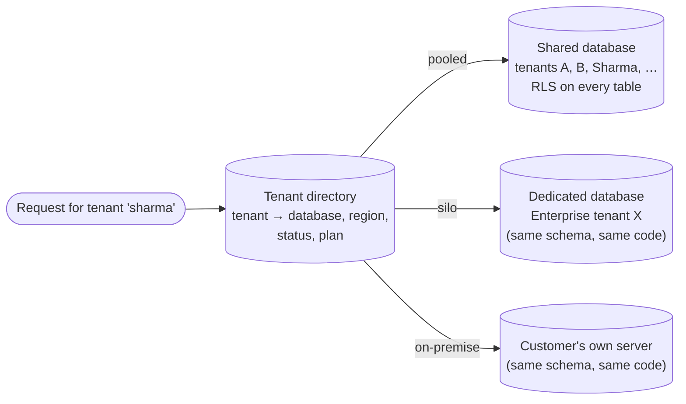
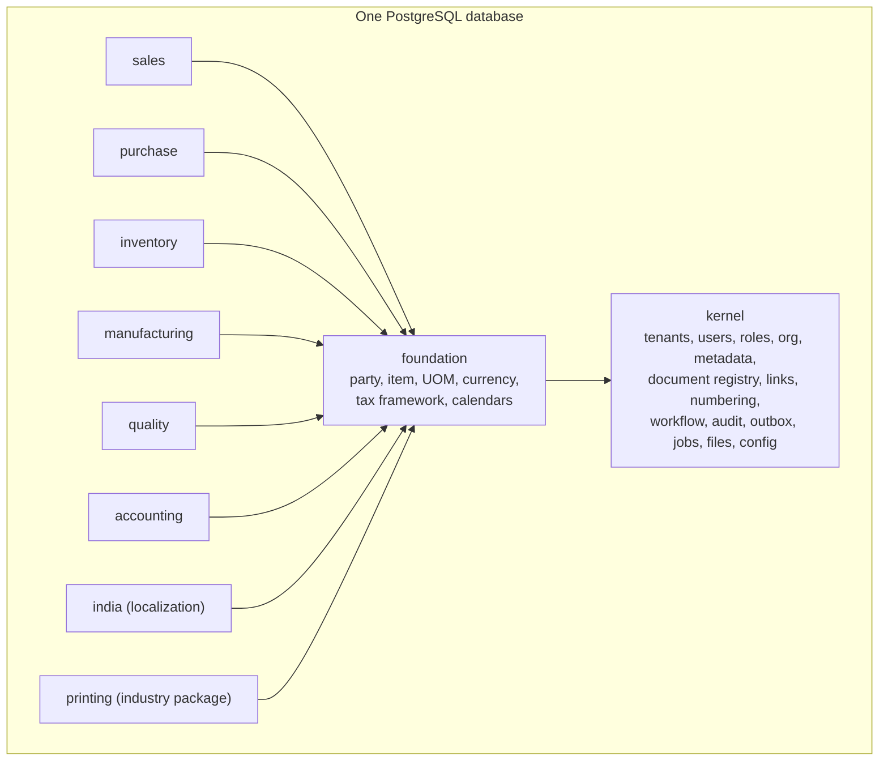
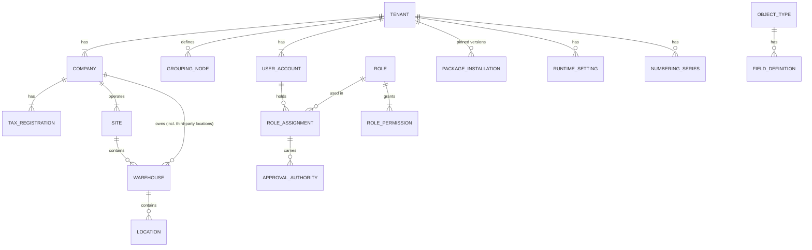
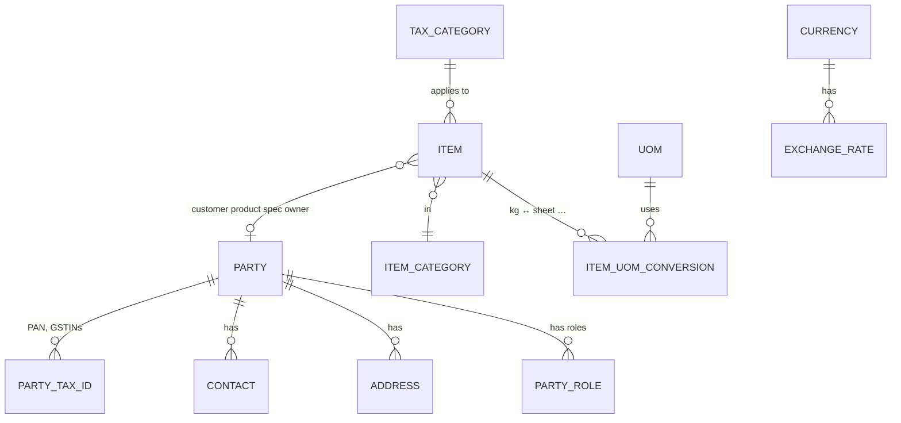
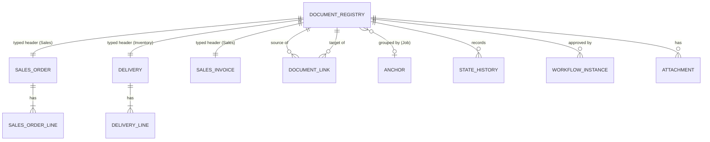
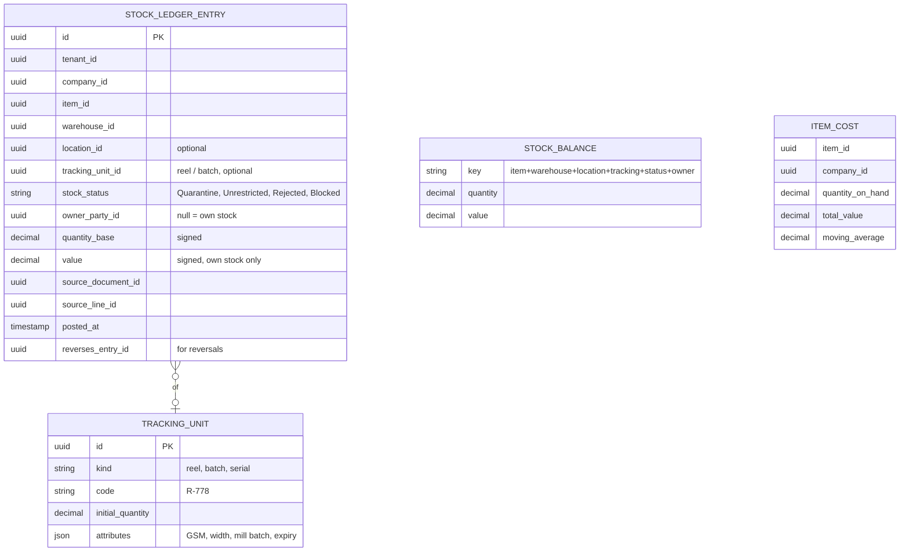
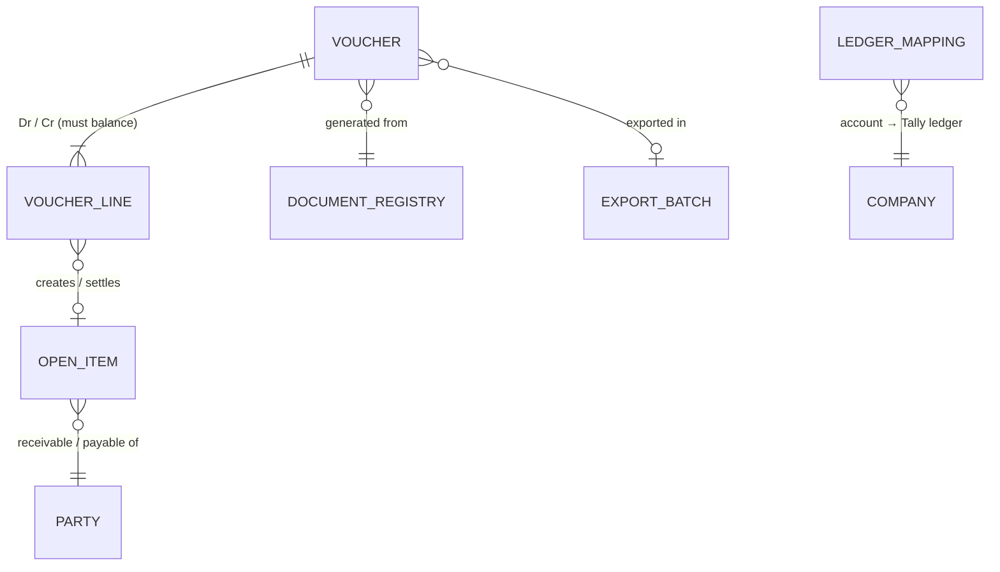
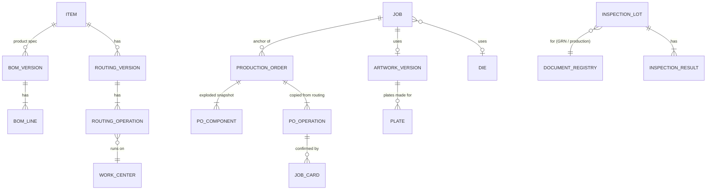

# Step 8 — Data Architecture

> **Status:** In review · **Last updated:** 2026-10-04
> **Answers:** Where and how is the data stored? How are tenants laid out? Which conventions does every table follow? What does the logical model of documents, ledgers and masters look like? How do we keep stock and money consistent when many people work at once? (Brief §14, §30, §31, §32 and Step 8.) Reporting, search, retention and migrations are in [Step 8A](STEP-08A-REPORTING-SEARCH-AND-DATA-LIFECYCLE.md).
> **Level:** *logical* design — entities, relationships, rules. Physical scripts (tables, columns, indexes) are written in the implementation phase.

## TL;DR

- **The system of record is PostgreSQL**, a relational database. It gives us ACID transactions, **Row-Level Security** (needed for tenant isolation), **JSONB** (for extension fields), full-text search and partitioning. It is free, standard, and available as a managed service in Indian regions.
- **Tenants share one database and one set of tables** ("pool" model), with `tenant_id` on every row and Row-Level Security. A **dedicated database ("silo")** is an option for enterprise, on-premise or very large tenants, using the same schema and code. A tenant directory tells the platform where each tenant lives.
- **Database schemas are per module, not per tenant** (kernel, foundation, sales, inventory…).
  - **Foreign keys only point downward** (to kernel and foundation) or within a module. Peer modules reference each other by id and check through contracts.
  - This mirrors the dependency rules ([ADR-0002](../adr/ADR-0002-LAYERED-PRODUCT-MODEL.md), [ADR-0015](../adr/ADR-0015-INTER-MODULE-COMMUNICATION.md)).
- **Conventions on every table:**
  - **UUIDv7** ids (RFC 9562)
  - `tenant_id`, plus `company_id` on business data
  - UTC timestamps
  - **exact decimals for money and quantities, never floating point**
  - a `version` column for optimistic locking
  - created/updated by and at
  - an `ext` JSONB column for extension fields
- **Documents** use a kernel **document registry**: one row per document with type, number, company, state, party, totals and anchor. Each module also has its own **typed tables**. **Document links** connect registry entries, so flows work across modules without peer foreign keys.
- **Ledgers:**
  - stock ledger, reservations and vouchers are **append-only**
  - **balances are derived**, updated in the same transaction under short row locks, and can be rebuilt
  - negative stock is **off by default**
  - valuation is a **perpetual moving average without retroactive recalculation**: a back-dated receipt books a small variance instead of rewriting history, and the books-locked date protects closed months
- **Concurrency:** optimistic locking for editing documents (two people editing the same PO → the second is told to reload); short pessimistic locks only for counters, balances and cost rows.
- **Volume sanity check:** about 250,000 stock entries per tenant per year, or ~25 million rows a year for 100 tenants. That is comfortable for PostgreSQL with indexes and yearly partitioning.

---

## 1. What this step must answer

| Brief asked | Answered in |
| --- | --- |
| Database choice (§28 candidates, decided here at the data level) | §2 |
| Multi-tenancy: shared DB / schema / DB per tenant / hybrid (§14) | §3 |
| Schema, entities, relationships (Step 8) | §4–§6 |
| Transactions, ledgers, source of truth vs derived (§30, §31) | §7 |
| Concurrency, locking, idempotency (§30) | §8 |
| Extension fields and audit storage (Steps 5, 6) | §9, §10 |
| Reporting, search, retention, migrations, master data quality (§22, §23, §32) | [Step 8A](STEP-08A-REPORTING-SEARCH-AND-DATA-LIFECYCLE.md) |

---

## 2. Database: why PostgreSQL

| Option | Pros | Cons |
| --- | --- | --- |
| **PostgreSQL** | ACID; **Row-Level Security**; **JSONB** with indexes; full-text and trigram search; table partitioning; strong numeric type; free; managed offerings in Indian regions | Needs care at very large scale (not our problem for years) |
| MySQL / MariaDB | Popular, cheap | No native row-level security; weaker JSON indexing and partitioning |
| SQL Server / Oracle | Enterprise features | Licence cost; against the near-zero budget |
| MongoDB (document database) | Flexible documents | ERP data is deeply relational; multi-document ACID and reporting are harder; double-entry and stock ledgers fit relational tables naturally |

**Recommendation: PostgreSQL** as the single system of record ([ADR-0047](../adr/ADR-0047-POSTGRESQL-SYSTEM-OF-RECORD.md)). It satisfies earlier decisions directly: RLS ([ADR-0035](../adr/ADR-0035-TENANT-ISOLATION.md)), JSONB extension fields ([ADR-0026](../adr/ADR-0026-EXTENSION-FIELDS-STORAGE.md)), and the outbox and job queue in the database ([ADR-0041](../adr/ADR-0041-OUTBOX-AND-DELIVERY.md)). Version and hosting are chosen in Step 9.

---

## 3. Multi-tenancy layout

### 3.1 Options

| Option | How | Cost | Isolation | Upgrades | Per-tenant restore | Fit |
| --- | --- | --- | --- | --- | --- | --- |
| **A. Pool**: shared database, shared tables, `tenant_id` + RLS | One database for many tenants | **Lowest** | Good with RLS + tests | One migration for all | Needs a tenant-scoped export/restore tool | ✅ Default |
| B. Schema per tenant | Same database, one schema per tenant | Low | Better | Migration × number of tenants | Easier | Painful beyond ~100 tenants; connection and catalog bloat |
| **C. Silo**: database per tenant | Separate database (or server) | Higher | Strongest | Migration × number of databases | Easy | ✅ Option for enterprise, on-premise, very large tenants |
| D. Hybrid (pool + silo) | Most tenants pooled; selected tenants siloed | Low overall | Fits each tenant | Same code and schema | — | ✅ **Chosen shape** |

### 3.2 Chosen shape: pool by default, silo when needed

| Rule | Detail |
| --- | --- |
| Same schema everywhere | One code base and one migration set, whatever the placement |
| `tenant_id` + RLS even in silo databases | One code path; moving a tenant between pool and silo is a data copy, not a redesign |
| **Tenant directory** | Small platform database: tenant → placement, region, status (active, suspended), plan |
| Moving a tenant | Tenant-scoped export → import into the target → switch the directory entry (maintenance window) |
| **Per-tenant restore** | (1) Point-in-time restore of the whole database into a temporary instance; (2) extract that tenant's rows; (3) import. Tooled and drilled ([ADR-0038](../adr/ADR-0038-SECURITY-BASELINE-AND-OPERATIONS.md)) |

([ADR-0048](../adr/ADR-0048-MULTI-TENANCY-LAYOUT.md))

---

## 4. How the data is organised

### 4.1 Schemas follow modules, not tenants

### 4.2 Reference rules (mirroring the dependency rules)

| Reference from → to | Database foreign key? | Why |
| --- | --- | --- |
| Inside one module (sales order → its lines) | ✅ Yes | Integrity inside the owner |
| Any module → **kernel / foundation** (lower layers) | ✅ Yes | Downward dependency is allowed ([ADR-0002](../adr/ADR-0002-LAYERED-PRODUCT-MODEL.md)) |
| Module → **peer module** (delivery → sales order line) | ❌ No, an **id reference** checked through the owner's contract | Keeps modules independent and switchable ([ADR-0016](../adr/ADR-0016-DEPENDENCY-TYPES-AND-MANIFESTS.md)) |
| Document → document across modules | Through **document links** in the kernel registry (§6.2) | One generic, integrity-checked mechanism |
| Industry / localization package → modules | ID references; never the reverse | Packages sit above modules |

### 4.3 Conventions on every table

| Convention | Rule | Standard / reason |
| --- | --- | --- |
| Primary key | **UUIDv7** (time-ordered UUID) | RFC 9562. Globally unique, safe to generate anywhere (offline phones, imports), index-friendly |
| Tenant | `tenant_id` on every row (except global reference data such as currency codes) | [ADR-0035](../adr/ADR-0035-TENANT-ISOLATION.md) |
| Company | `company_id` on every business row | Every document belongs to one company ([ADR-0004](../adr/ADR-0004-ORGANIZATION-MODEL.md)) |
| Human number | Separate from the id (`PO/25-26/0042`) | Numbering rules ([ADR-0029](../adr/ADR-0029-NUMBERING.md)) |
| Money | **Exact decimal** (e.g. 18 digits, 4 decimals for rates and 2 for amounts) + **ISO 4217** currency | Never floating point; GST rounding to the paisa; invoice round-off configurable |
| Quantity | Exact decimal + UOM; stored in the item's **base UOM**, with the entered UOM and factor kept | Paper: kg ↔ sheets |
| Time | UTC timestamps; dates as dates; tenant time zone for display | ISO 8601 |
| Audit columns | created at/by, updated at/by | Fast "who/when" without reading the audit trail |
| **Optimistic lock** | `version` integer, incremented on every update | §8 |
| Extension fields | `ext` JSONB, validated against metadata | [ADR-0026](../adr/ADR-0026-EXTENSION-FIELDS-STORAGE.md) |
| Deletion | Drafts: hard delete (audited). Posted documents and ledgers: **never**. Masters: **archive** via status | [ADR-0007](../adr/ADR-0007-IMMUTABLE-POSTED-DOCUMENTS.md) |
| Naming | `snake_case`, singular nouns, module schema prefix | Readability |

([ADR-0049](../adr/ADR-0049-DATA-MODEL-CONVENTIONS.md))

---

## 5. Logical model — kernel and foundation

### 5.1 Kernel (identity, organization, configuration)

### 5.2 Foundation (shared masters with module facets)

**Facets** ([Step 3 §6](STEP-03-MODULE-BOUNDARIES.md#6-master-data-ownership--shared-core-owned-facets)) are **separate tables owned by each module**, keyed by the master's id. For example, the inventory item facet holds tracking type, reorder level and shelf life. A facet exists only when its module is active.

---

## 6. Logical model — documents and links

### 6.1 Options for storing documents

| Option | Pros | Cons |
| --- | --- | --- |
| One generic "document" table for every type | Simple cross-type queries | Typed fields become JSON; weak integrity; poor performance; inner-platform risk |
| Fully separate tables per type, nothing shared | Strong typing | Cross-type search, links, numbering, approvals and audit reinvented per type |
| **Registry + typed tables** | Shared behaviour (number, state, links, approvals, search) in one place; typed, owned tables per module | Two rows per document (registry + typed header) |

**Recommendation: registry + typed tables** ([ADR-0049](../adr/ADR-0049-DATA-MODEL-CONVENTIONS.md)).

### 6.2 Shape

| Entity | Holds |
| --- | --- |
| **Document registry** (kernel) | id, type, number, company, site, date, party, currency, totals, core state, sub-status, anchor, revision, version |
| **Typed header and lines** (owner module) | Everything specific: prices, taxes, delivery terms, snapshots ([ADR-0008](../adr/ADR-0008-REFERENCE-VS-SNAPSHOT.md)), extension fields |
| **Document link** (kernel) | source document/line, target document/line, link type (created-from / fulfils / settles / references), quantity, amount |
| **Open quantity / amount** | **Derived** from links (ordered − Σ fulfilling links), stored per line for speed and kept in step in the same transaction |
| State history | Every transition: from, to, action, user, time, reason |

The registry is what makes it possible to search "PO-2026-00123" and see the whole chain: PO → GRN → inspection → bill → payment ([Step 8A §2](STEP-08A-REPORTING-SEARCH-AND-DATA-LIFECYCLE.md#2-global-search)).

---

## 7. Ledgers: source of truth and derived balances

### 7.1 Stock ledger

| Rule | Detail |
| --- | --- |
| **Append-only** | Entries are never updated or deleted; corrections are reversing entries ([ADR-0007](../adr/ADR-0007-IMMUTABLE-POSTED-DOCUMENTS.md)) |
| **Ownership dimension** | `owner_party_id` empty = our stock; set = customer-owned (conversion jobs, [Q-16](../tracking/OPEN-QUESTIONS.md#q-16)). Customer-owned stock never carries value |
| Status is part of the key | A QC release = one entry out of Quarantine + one into Unrestricted (same transaction) |
| **Balances are derived** | `stock_balance` and `item_cost` are updated **in the same transaction** as the entries, for fast reads. A rebuild job can recompute them from the ledger at any time; a nightly check compares them |
| **Negative stock** | **Not allowed by default** (setting `allowNegativeStock`, off). Posting checks the locked balance row |

### 7.2 Reservation ledger

Same append-only pattern: reserve, release, consume. Balance = reserved quantity per item/warehouse/job. Available-to-use = unrestricted on hand − reserved.

### 7.3 Accounting bridge

| Rule | Detail |
| --- | --- |
| Every voucher balances (Σ Dr = Σ Cr) | Checked before commit; never configurable ([Step 5 §13](STEP-05-CONFIGURATION-ARCHITECTURE.md#13-guardrails--what-is-never-configurable)) |
| Append-only | Reversals for corrections |
| Open items | Receivables/payables per party; settlements link receipts to invoices ([ADR-0006](../adr/ADR-0006-PROCESS-AS-DOCUMENT-FLOW.md)) |
| Export lock | Voucher's `export_batch` set when acknowledged → source document locked ([ADR-0022](../adr/ADR-0022-TALLY-EXPORT-GRANULARITY.md)) |
| **Books-locked date** | No posting with a date on or before it |

### 7.4 Valuation policy (moving average, no retroactive recalculation)

**The problem:** a GRN dated 3 October is entered on 10 October, but material was already issued on 5 October at the old average. Should the 5 October issue be revalued?

| Option | Pros | Cons |
| --- | --- | --- |
| Full retroactive recalculation of later issues | Most precise | Rewrites values of posted entries (or creates many correction entries); complex; slow; confusing |
| **Perpetual moving average at posting time + variance entry** | Simple, predictable, never rewrites history; standard in many ERPs | Small timing differences go to a variance (adjustment) account instead of exact job costs |

**Recommendation:** perpetual moving average computed **at posting time**.

- A back-dated receipt updates the average **from now on**. Any difference in the value of goods already issued goes to a **valuation variance** entry, visible in a report.
- Back-dating is limited to the **open period** (after the books-locked date).
- A **month-end valuation check** report lists variances for the accountant.

### 7.5 Manufacturing, quality and the printing package

- `JOB`, `ARTWORK_VERSION`, `DIE` and `PLATE` belong to the **printing** package schema.
- `JOB_CARD` holds input / good / waste / in-process quantities with unit, times and operator ([ADR-0019](../adr/ADR-0019-WIP-BY-JOB-OPERATION.md)).

---

## 8. Concurrency: many people, one truth

| Situation | Technique | User experience |
| --- | --- | --- |
| Two people edit the same draft PO | **Optimistic locking** (`version` must match on save) | Second saver: *"This PO was changed by Ramesh at 10:42. Reload to see changes."* |
| Two store keepers issue the last 500 kg at the same time | **Short row lock** on the stock balance row during posting | One succeeds; the other gets "insufficient stock" |
| Two invoices posted at the same moment | **Row lock** on the numbering series counter ([ADR-0029](../adr/ADR-0029-NUMBERING.md)) | Both get consecutive numbers; no gap |
| Moving-average update | Row lock on `item_cost` per item/company | — |
| Repeated API call (network retry) | Idempotency key ([ADR-0041](../adr/ADR-0041-OUTBOX-AND-DELIVERY.md)) | Same result returned |
| Deadlock risk | Locks always taken in a fixed order (by key); short transactions; automatic retry of the transaction once | Invisible to users |

Default isolation is PostgreSQL *read committed*, plus explicit locks where listed. Transactions stay short: no waiting for users, emails or external systems inside a transaction ([Step 7 §3](STEP-07-EVENTS-AND-AUTOMATION.md#3-in-transaction-vs-after-commit-the-deciding-rule)).

([ADR-0050](../adr/ADR-0050-LEDGERS-VALUATION-AND-CONCURRENCY.md))

---

## 9. Extension fields — physical direction

| Need | Approach |
| --- | --- |
| Store | `ext` JSONB column on every extensible table ([ADR-0026](../adr/ADR-0026-EXTENSION-FIELDS-STORAGE.md)) |
| Validate | On every write, against field definitions (type, required, range, CEL) |
| Search and filter | Expression indexes for frequently filtered fields (e.g. GSM on items); a general JSONB index where useful |
| Report | Report datasets expose extension fields by metadata ([8A §1](STEP-08A-REPORTING-SEARCH-AND-DATA-LIFECYCLE.md#1-reporting-architecture)) |
| Promote | If a field becomes universal, a platform release moves it to a real column with a data migration |

## 10. Audit trail storage

| Need | Approach |
| --- | --- |
| Volume | Every change of every books-relevant record. Probably the largest table |
| **Partitioning** | By month. Old partitions compressed and moved to cheaper storage after 2 years, still exportable for auditors |
| **Hash chain** | Each entry stores the hash of the previous entry for the same tenant ([ADR-0036](../adr/ADR-0036-AUDIT-AND-LOGGING.md)). A nightly verification job checks the chain |
| No update or delete | Database permissions of the application role allow insert and select only on audit tables |
| Retention | ≥ 8 years (books-relevant); tenant may choose longer |

## 11. Volume sanity check

| Per typical printing tenant per year | Rows |
| --- | --- |
| Sales + purchase documents (headers + lines) | ~30,000 |
| Job cards | ~25,000 |
| **Stock ledger entries** | **~250,000** |
| Vouchers + lines | ~40,000 |
| Audit entries | ~1,000,000 |

**100 tenants ≈ 25 million stock entries and ~100 million audit entries per year.** That is routine for PostgreSQL with sensible indexes and partitioning by year (stock ledger) and month (audit). It needs no special database technology for years.

## 12. Configurable vs fixed

| Fixed | Configurable |
| --- | --- |
| PostgreSQL; pool by default; same schema in silos | Tenant placement (pool / silo / on-premise) |
| Conventions (§4.3); append-only ledgers; derived balances | Negative stock allowed (off by default) |
| Balanced vouchers; books-locked date enforcement | Books-locked date value |
| Optimistic locking; ordered locks | — |
| Moving average without retro-recalculation | Variance account mapping |

## 13. Risks

| Risk | Mitigation |
| --- | --- |
| A query forgets `tenant_id` | RLS second lock + cross-tenant tests ([ADR-0035](../adr/ADR-0035-TENANT-ISOLATION.md)) |
| Balances drift from ledgers | Same-transaction updates + nightly comparison + rebuild job |
| Lock contention on hot items at month end | Short transactions; lock ordering; measure before optimising |
| Audit table growth | Monthly partitions, compression, archiving |
| Back-dated entries distort costs | Variance entries, open-period limit, month-end valuation check |

## 14. Proposed decisions

| ADR | Decision | Status |
| --- | --- | --- |
| [ADR-0047](../adr/ADR-0047-POSTGRESQL-SYSTEM-OF-RECORD.md) | PostgreSQL as the single system of record | **Proposed** |
| [ADR-0048](../adr/ADR-0048-MULTI-TENANCY-LAYOUT.md) | Pool (shared schema + RLS) by default; silo / on-premise option with the same schema; tenant directory; per-tenant restore | **Proposed** |
| [ADR-0049](../adr/ADR-0049-DATA-MODEL-CONVENTIONS.md) | Module schemas; downward-only foreign keys; UUIDv7; exact decimals; UTC; version column; `ext` JSONB; document registry + typed tables + links | **Proposed** |
| [ADR-0050](../adr/ADR-0050-LEDGERS-VALUATION-AND-CONCURRENCY.md) | Append-only ledgers with ownership/status dimensions; derived balances in-transaction; negative stock off; moving average without retro-recalc; optimistic + ordered pessimistic locking | **Proposed** |

ADR-0051 and ADR-0052 are in [Step 8A](STEP-08A-REPORTING-SEARCH-AND-DATA-LIFECYCLE.md#7-proposed-decisions).

## Open questions raised

[Q-45](../tracking/OPEN-QUESTIONS.md#q-45) PostgreSQL ·
[Q-46](../tracking/OPEN-QUESTIONS.md#q-46) multi-tenancy layout ·
[Q-47](../tracking/OPEN-QUESTIONS.md#q-47) data conventions and document registry ·
[Q-48](../tracking/OPEN-QUESTIONS.md#q-48) ledgers, valuation and concurrency

## Related documents

- [Step 8A — Reporting, Search and Data Lifecycle](STEP-08A-REPORTING-SEARCH-AND-DATA-LIFECYCLE.md)
- [Step 2 — Domain Model (ledgers, documents)](STEP-02-DOMAIN-MODEL.md)
- [Step 4D — Inventory (valuation, reels)](STEP-04D-INVENTORY-AND-QUALITY.md)
