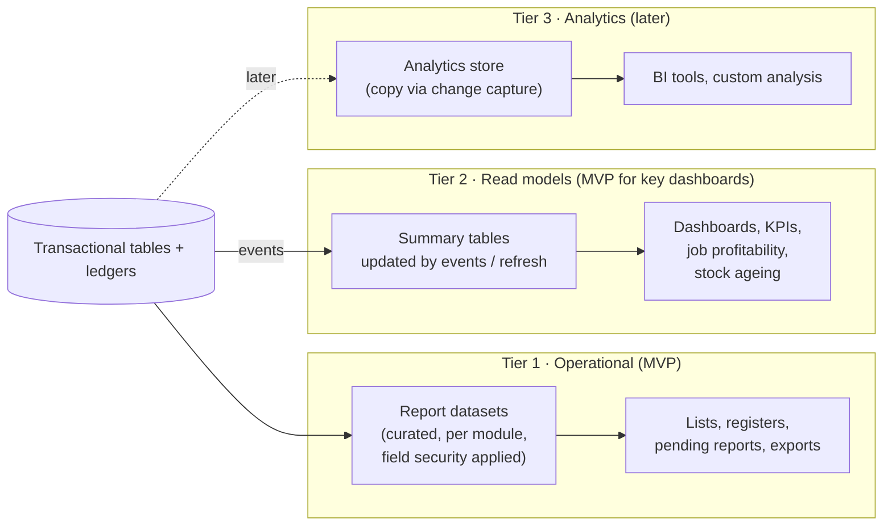
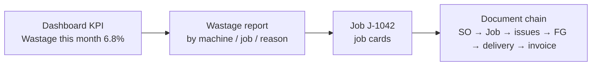
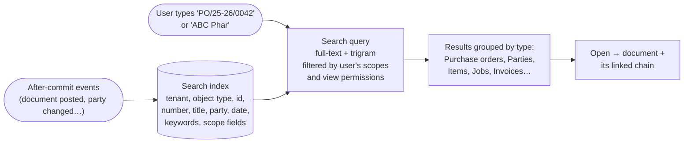
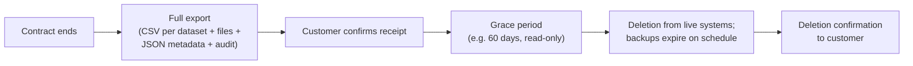
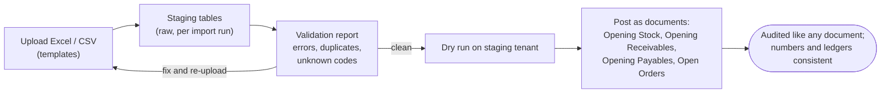

# Step 8A — Reporting, Search, Files and Data Lifecycle

> **Status:** In review · **Last updated:** 2026-10-04
> **Part of:** [Step 8 — Data Architecture](STEP-08-DATA-ARCHITECTURE.md)
> **Answers:** How do reports and dashboards get correct numbers without slowing down daily work (brief §23, §31)? How does global search work (brief §22)? How are files stored? How do we keep master data clean (brief §32)? How long is data kept, how is it archived, and how do schemas and data evolve (brief §27)?

## TL;DR

- **Reporting in three tiers:**
  1. **Operational reports** read curated **report datasets** (meaningful, permission-aware views per module), not random table joins.
  2. **Read models** (summary tables kept up to date by events) power dashboards and heavy reports such as job profitability and stock ageing.
  3. **Analytics later:** copy to a separate analytics store when customers need BI tools.
- Every report drills down: KPI → report → document → linked chain.
- **Global search:** one permission-filtered **search index** in PostgreSQL. It uses full-text search plus trigram matching, so "ABC Phar" and "PO/25-26/00" both work. It is filled after commit by events. Opening a result shows the **whole document chain**. OpenSearch only when volumes demand it.
- **Files:** S3-compatible object storage, plus a metadata table (checksum, type, classification, version, malware-scan status). The **PDF of every issued statutory document is stored once, unchangeable**, as legal evidence.
- **Master data quality:**
  - Uniqueness rules: one party per PAN/GSTIN; unique item codes.
  - **Duplicate warnings** on create.
  - Optional **approval for new vendors and bank-detail changes**.
  - Lifecycle Draft → Active → Blocked → Archived.
  - **Merge** marks the duplicate "merged into" the survivor; posted history is never rewritten.
- **Retention:**
  - books, ledgers and audit: **≥ 8 years**
  - security log: ≥ 180 days in India (1 year recommended)
  - notification logs: 1 year
  - processed jobs: 30 days
  - personal data anonymised when no longer needed
  - **Tenant exit:** full export, then deletion.
- **Migrations:** schema changes are versioned and forward-only, using the *expand → migrate → contract* pattern, and run across every database in the tenant directory. Onboarding imports go through staging tables and validation. **Opening balances are posted as real documents**, so they are audited like everything else.

---

## 1. Reporting architecture

### 1.1 Three tiers

### 1.2 Report datasets — the reporting contract

The brief warns: *"Do not build reports by randomly joining transactional tables without understanding accounting and inventory semantics."* A **report dataset** solves this. It is a named, documented view owned by a module, which already encodes the business meaning.

| Dataset (owner) | Meaning built in | Used by |
| --- | --- | --- |
| `sales.pending_order_lines` | Open quantity = ordered − Σ fulfilling deliveries; short-closed lines excluded | Pending orders report, dashboard |
| `inventory.stock_on_hand` | From balances; status, owner and tracking unit; **own stock value only** | Stock summary, reel register |
| `inventory.stock_ledger` | Movements with source documents | Stock ledger report, audits |
| `manufacturing.job_cost_vs_estimate` | Actual cost elements vs estimate snapshot per job | Job profitability |
| `accounting.open_items` | Receivables / payables with ageing buckets | Outstanding, ageing, credit control |
| `purchase.pending_receipts` | PO open quantity vs GRNs | Pending POs |
| `india.gst_outward` | Invoice and note lines with tax splits per GSTIN | GSTR-1 data for the accountant |

| Rule | Detail |
| --- | --- |
| Reports, exports, scheduled reports and (later) AI questions read **datasets only** | Business semantics in one place |
| Datasets apply **scope and field security** of the viewer ([Step 6 §5](STEP-06-SECURITY-ARCHITECTURE.md#5-authorization--deciding-what-you-may-do)) | A sales user's report never shows cost columns |
| Datasets expose extension fields through metadata | Custom fields are reportable ([ADR-0026](../adr/ADR-0026-EXTENSION-FIELDS-STORAGE.md)) |
| Report definitions (columns, filters, grouping, drill-down) live in **packages** | Industry-specific reports ship with the Printing package ([Step 5A §3](STEP-05A-PACKAGES-UPGRADES-AND-ONBOARDING.md#3-the-printing--packaging-package--inventory)) |
| Heavy reports run as **background jobs** producing a file | Daily work never slows down |
| Exports: Excel (xlsx) and CSV (RFC 4180) | Under the `export` permission, watermarked and audited ([6A §5](STEP-06A-ISOLATION-AUDIT-PRIVACY-AND-OPERATIONS.md#5-application-security-baseline-owasp-asvs-level-2)) |

### 1.3 Drill-down

### 1.4 Natural-language questions (AI, later)

When the AI layer arrives (brief §24), *"show me delayed POs from last month"* is translated into a query **against report datasets only**, with the user's permissions. The AI cannot reach raw tables, and the ERP stays the authority.

---

## 2. Global search

### 2.1 How it works

| Rule | Detail |
| --- | --- |
| Index contents | Only text the viewer could see anyway. No prices, costs or Restricted data in searchable text |
| **Permission filtering** | The index carries scope fields (company, site, owner/assigned). Results never reveal the *existence* of records outside the user's scope |
| Matching | PostgreSQL full-text for words; **trigram** for partial and fuzzy text and document numbers |
| Freshness | Updated after commit via events; typically seconds behind |
| **Related objects** | Searching "PO-2026-00123" opens the PO with its document links: GRNs, inspection, bill, payment ([Step 8 §6](STEP-08-DATA-ARCHITECTURE.md#6-logical-model--documents-and-links)) |
| Languages | English first; Hindi/transliteration later |
| Graduation | Move to OpenSearch/Elasticsearch only if index size or relevance needs exceed PostgreSQL (e.g. tens of millions of entries per tenant) |

---

## 3. Files and attachments

| Item | Design |
| --- | --- |
| Storage | S3-compatible object storage, tenant-prefixed paths, signed URLs ([ADR-0035](../adr/ADR-0035-TENANT-ISOLATION.md)) |
| Metadata (database) | Tenant, owner object, name, **content-sniffed type**, size, **SHA-256 checksum**, data class, version, uploaded by/at, malware-scan status |
| Versions | New upload = new version; previous versions kept (artwork history) |
| **Issued statutory documents** | The PDF of each tax invoice, credit/debit note and challan is **stored once at first issue, unchangeable**, with the template version used. Reprints serve the stored PDF |
| Generated reports | Stored temporarily (e.g. 30 days), then deleted |
| Limits | Size limits per type; scanned before availability ([6A §5](STEP-06A-ISOLATION-AUDIT-PRIVACY-AND-OPERATIONS.md#5-application-security-baseline-owasp-asvs-level-2)) |

---

## 4. Master data quality

| Concern | Rule |
| --- | --- |
| **Uniqueness** | One party per PAN (and per GSTIN) in a tenant; unique item code; unique warehouse code per company |
| **Duplicate detection** | On create: match by GSTIN/PAN/phone/email, plus **name similarity** (trigram). The user sees "Possible duplicate: ABC Pharma Pvt Ltd (Ahmedabad)" and must confirm |
| Validation | GSTIN format and checksum, PAN format, HSN validity (India pack) |
| **Approval (optional)** | New vendor, and any **bank-detail change**, can require approval (SoD, [ADR-0034](../adr/ADR-0034-APPROVAL-AUTHORITY-AND-SOD.md)) |
| Lifecycle | Draft → Active → Blocked (no new documents) → Archived (hidden, history intact) |
| **Merge duplicates** | Duplicate marked *merged into* the survivor and blocked. **Open** drafts are re-pointed; **posted** documents keep their original reference. Reports roll up via the merge map |
| Effective dating | BOM and routing versions, price lists, rate tables, organization structure ([ADR-0004](../adr/ADR-0004-ORGANIZATION-MODEL.md)) carry valid-from/to |
| Ownership | Core owned by Foundation; facets by modules ([Step 3 §6](STEP-03-MODULE-BOUNDARIES.md#6-master-data-ownership--shared-core-owned-facets)) |
| History | Every master change is in the audit trail |

---

## 5. Data lifecycle and retention

### 5.1 Retention schedule (defaults)

| Data | Keep | Reason |
| --- | --- | --- |
| Posted documents, ledgers, vouchers | **≥ 8 years** after the financial year | Companies Act books retention; also covers the GST record-keeping period |
| Business audit trail | **≥ 8 years** | [ADR-0036](../adr/ADR-0036-AUDIT-AND-LOGGING.md) |
| Issued statutory PDFs | With their documents | Evidence |
| Security log | ≥ 180 days in India (1 year recommended) | CERT-In |
| Notification delivery log | 1 year | Operational; contains personal data |
| Processed outbox events and jobs | 30 days after success | Debugging only |
| Dead-letter items | Until resolved + 90 days | Investigation |
| Abandoned drafts | Reminder at 90 days; deletion at 180 days (configurable; audited) | Clutter, personal data |
| Contact persons, departed users' profiles | Anonymised when no longer needed, unless inside statutory records | DPDP minimisation ([ADR-0037](../adr/ADR-0037-PRIVACY-AND-ENCRYPTION.md)) |
| Backups | Up to 12 months (monthly snapshots) | [ADR-0038](../adr/ADR-0038-SECURITY-BASELINE-AND-OPERATIONS.md) |

### 5.2 Archiving

Large append-only tables (stock ledger, vouchers, audit) are **partitioned by period**. Partitions older than the "hot" window (e.g. 2 financial years) are compressed and moved to cheaper storage. They remain available through archive exports and slower queries.

### 5.3 Tenant exit

The customer, as Data Fiduciary, keeps the export for their own legal retention. We, as Processor, delete ([ADR-0037](../adr/ADR-0037-PRIVACY-AND-ENCRYPTION.md)).

---

## 6. Migrations

### 6.1 Schema migrations (platform releases)

| Rule | Why |
| --- | --- |
| Versioned, **forward-only** migration scripts in the code repository | Reproducible; no manual database edits |
| **Expand → migrate → contract** (add new structure, copy and backfill, switch code, remove old structure in a later release) | Minimal downtime; safe rollback of application code |
| Run on **every database** listed in the tenant directory (pool, silos, staging); on-premise customers get the same scripts in their release | One schema everywhere ([ADR-0048](../adr/ADR-0048-MULTI-TENANCY-LAYOUT.md)) |
| Tested on an anonymised copy of production first | No surprises |

### 6.2 Package migrations

Configuration and data changes between package versions ([Step 5A §6](STEP-05A-PACKAGES-UPGRADES-AND-ONBOARDING.md#6-upgrading-a-tenant-to-a-new-package-version)).

### 6.3 Onboarding imports and opening balances

**Rule: opening balances are documents**, never raw database inserts. They go through the same posting rules, ledgers, audit and approvals as any other transaction ([ADR-0031](../adr/ADR-0031-GO-LIVE-WITH-OPENING-BALANCES.md)).

---

## 7. Proposed decisions

| ADR | Decision | Status |
| --- | --- | --- |
| [ADR-0051](../adr/ADR-0051-REPORTING-AND-SEARCH.md) | Reporting via curated, permission-aware report datasets; read models for dashboards; analytics store later; permission-filtered PostgreSQL search index (full-text + trigram); OpenSearch only on graduation | **Proposed** |
| [ADR-0052](../adr/ADR-0052-DATA-LIFECYCLE-MDM-AND-MIGRATIONS.md) | Retention schedule; partitioning and archiving; tenant exit; stored statutory PDFs; master-data uniqueness, duplicate detection, approval and merge; expand-contract migrations; staged imports with opening balances as documents | **Proposed** |

## Open questions raised

[Q-49](../tracking/OPEN-QUESTIONS.md#q-49) reporting and search ·
[Q-50](../tracking/OPEN-QUESTIONS.md#q-50) data lifecycle, master data and migrations

## Related documents

- [Step 8 — Data Architecture](STEP-08-DATA-ARCHITECTURE.md)
- [Step 6A — Privacy and retention](STEP-06A-ISOLATION-AUDIT-PRIVACY-AND-OPERATIONS.md)
- [Industry Standards Register](../00-context/STANDARDS.md)
