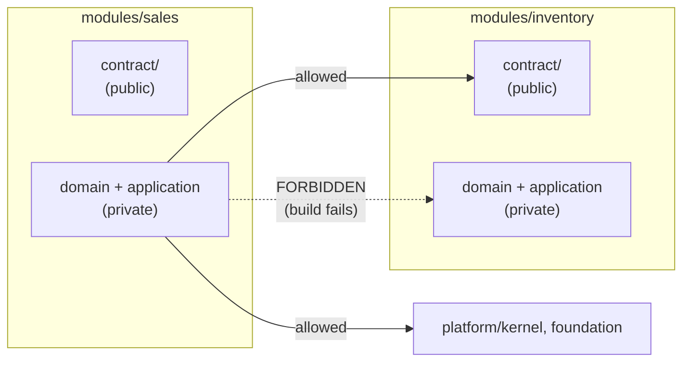
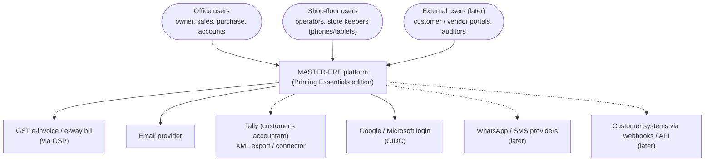
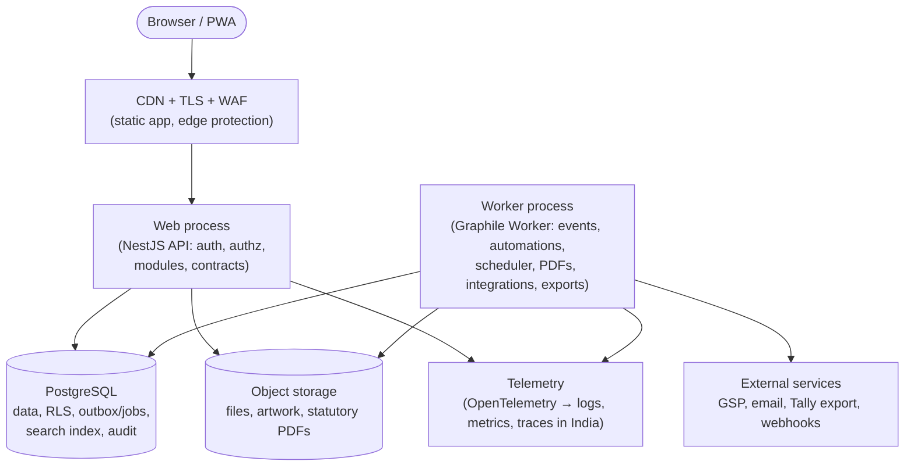
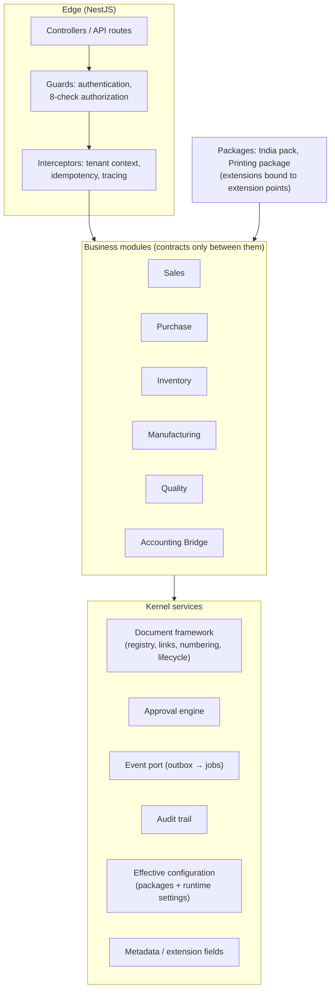

# Step 9 — Technical Architecture: the software stack

> **Status:** Accepted (founder, 2026-10-04) · **Last updated:** 2026-10-04
> **Answers:** Which technologies do we actually use, and why? We evaluate the brief's candidate stack (§28) against every decision taken in Steps 1–8, and re-validate modular monolith vs microservices (§29). Hosting, deployment, CI/CD, testing, observability and costs are in the companion file [Step 9A](STEP-09A-INFRASTRUCTURE-DEVOPS-AND-COSTS.md).

## TL;DR

- **Selection criteria, in order:**
  1. fits the decisions already taken
  2. one solo developer can master and run it
  3. free and open-source
  4. mature, with a large community (and well understood by AI coding assistants)
  5. portable (no lock-in)
- **Modular monolith confirmed** after a full comparison. ADR-0003 moves from "in principle" to accepted.
- **One language end to end: TypeScript.** The backend runs on Node.js (current LTS) and the frontend is React. The one real weakness of JavaScript for an ERP is **decimal arithmetic**. It is handled by strict rules: a Money/Quantity type built on a decimal library everywhere, numbers travelling as strings, and a lint rule banning plain `number` for money.
- **Backend:**
  - **NestJS** for structure (modules, dependency injection, guards for authorization, interceptors for tenant context), with **business logic kept framework-free** (ports and adapters).
  - **One repository** (pnpm workspaces), with **module boundaries enforced by tooling** (dependency-cruiser rules + architecture tests).
- **Data access:** **Kysely**, a type-safe SQL query builder, with **plain SQL migrations**. This gives full control of transactions, row locks, Row-Level Security settings and JSONB. No heavy ORM magic.
- **Jobs, outbox and scheduler:** **Graphile Worker**, PostgreSQL-backed. Jobs can be added **inside the same database transaction**, which is the outbox in practice. It also has cron-style schedules.
- **Contracts and validation:**
  - **JSON Schema** is the single contract language, for configuration packages, API payloads and events. Schemas are authored with **TypeBox** and validated with **Ajv**.
  - **OpenAPI 3.1** is generated from those schemas.
- **Rules (CEL):** a JavaScript CEL library, **chosen after a short technical spike** (maturity check). A fallback is defined.
- **Templates and PDFs:** **LiquidJS** templates (safe, logic-limited, editable for branding), rendered to PDF by **headless Chromium in the worker process**.
- **Authentication:** **Better Auth** (TypeScript, self-hosted, free) covering passwords, TOTP, passkeys and Google/Microsoft OIDC, **after a spike**. The fallback is composing standard libraries (Argon2id, TOTP, WebAuthn, openid-client).
- **Frontend:**
  - **React + Vite as a single-page app and installable PWA.** **Not Next.js**: no SEO need, simpler hosting, no server-rendering complexity.
  - UI: **Tailwind CSS + shadcn/ui** (Radix primitives, accessible).
  - Data and routing: **TanStack Query / Router / Table**; React Hook Form.
  - Formatting: **i18next + the browser's Intl API** (lakh/crore formatting built in).
- **Explicitly not now:** microservices, Kafka/RabbitMQ/Redis, Kubernetes, GraphQL, a separate search engine, a BPM engine, native mobile apps.

---

## 1. Selection criteria

| # | Criterion | Why it matters here |
| --- | --- | --- |
| 1 | **Fits decisions already taken** | RLS, JSONB, transactional outbox, CEL, JSON Schema packages, OIDC, PDF statutory documents |
| 2 | **One solo developer can master and run it** | [R-03](../tracking/RISK-REGISTER.md) burnout; few moving parts |
| 3 | **Free and open-source** | Near-zero budget; no per-user licence fees |
| 4 | **Mature, large community, well known to AI assistants** | Faster development with AI help; easier to hire later |
| 5 | **Portable** | SaaS, private cloud and on-premise ([ADR-0048](../adr/ADR-0048-MULTI-TENANCY-LAYOUT.md)) |
| 6 | Standards-based | [ADR-0023](../adr/ADR-0023-STANDARDS-FIRST.md) |

---

## 2. Modular monolith vs microservices — final validation

| Criterion (brief §29) | Microservices | **Modular monolith** | Hybrid (monolith + a few services) |
| --- | --- | --- | --- |
| Development complexity | High: distributed calls, versioning, local setup | **Low**: one codebase, one run command | Medium |
| Deployment cost | Many services, orchestration (usually Kubernetes) | **One container image, two process types** | A few services |
| Team size fit | Many teams | **1–5 developers** | Small teams |
| Performance | Network hops between services | In-process calls | Mixed |
| **Transactions** (stock + voucher + audit in one commit) | Distributed transactions or sagas | **Single ACID transaction** ([ADR-0041](../adr/ADR-0041-OUTBOX-AND-DELIVERY.md)) | Same as monolith for the core |
| Data consistency | Eventual between services | **Strong where needed** | Strong in the core |
| Scaling | Per service | Scale the web and worker processes horizontally; database vertically | Extract hot spots |
| Module independence | Enforced by the network | **Enforced by tooling** (§4) | — |
| Future migration | — | Clean contracts allow extraction ([Step 3 §14.3](STEP-03-MODULE-BOUNDARIES.md#143-future-scalability)) | Natural next step |

**Decision:** modular monolith; extract a service only when measured. ADR-0003 is upgraded from "accepted in principle" to **accepted**, with this comparison as evidence ([ADR-0053](../adr/ADR-0053-LANGUAGE-AND-RUNTIME.md) records the stack built on it).

---

## 3. Language and runtime

| Option | Pros | Cons for us |
| --- | --- | --- |
| **TypeScript on Node.js** (frontend React) | **One language for frontend, backend, configuration tooling and tests**; huge ecosystem; very well known to AI coding assistants; matches the brief's candidate stack | **No native decimal type** (must be handled with discipline); single-threaded CPU (offload PDF rendering and heavy reports to workers) |
| Python (Django) + TypeScript frontend | Native `Decimal`; proven ERP heritage (Odoo, ERPNext); great admin tooling | **Two languages** to master and context-switch between; slower runtime |
| C# (.NET) + TypeScript frontend | Excellent `decimal`, performance, enterprise acceptance | Two languages; heavier toolchain |
| Java/Kotlin (Spring) + TypeScript frontend | Enterprise standard, strong typing | Two languages; verbose; heavier |
| Go + TypeScript frontend | Fast, simple deployment | Two languages; less ergonomic for rich business domain modelling |

**Recommendation: TypeScript end to end, on Node.js (current LTS)** ([ADR-0053](../adr/ADR-0053-LANGUAGE-AND-RUNTIME.md)).

**The decimal rule, which is non-negotiable:**

| Rule | How |
| --- | --- |
| Money, quantities, rates, percentages use a **decimal type**, never JavaScript `number` | A shared `Money` / `Quantity` / `Rate` value type built on a decimal library |
| The database returns NUMERIC as **strings**, converted straight into the decimal type | Data-access configuration |
| APIs and events carry decimals as **strings** (`"12345.50"`) | JSON Schema `pattern` for decimal strings |
| Rounding is explicit and named (GST paisa rounding, invoice round-off) | Rounding functions with tests |
| Enforcement | Lint rule plus code review checklist; property-based tests on ledger invariants ([9A §4](STEP-09A-INFRASTRUCTURE-DEVOPS-AND-COSTS.md#4-testing-strategy)) |

---

## 4. Backend structure and module boundaries

### 4.1 Framework

| Option | Pros | Cons |
| --- | --- | --- |
| **NestJS** | Built-in **modules**, dependency injection, **guards** (authorization), **interceptors** (tenant context, idempotency), OpenAPI tooling; widely used | Opinionated; some boilerplate |
| Express / Fastify alone | Minimal, fast | We would hand-build structure, dependency injection and conventions |
| Hono / tRPC-style stacks | Light, modern | Less structure for a large modular codebase |

**Recommendation: NestJS** (on its Fastify adapter for speed). The framework stays at the **edges**: HTTP controllers, guards, wiring. Business logic lives in plain TypeScript modules (ports and adapters), so the framework could be replaced without rewriting the domain.

### 4.2 Repository layout (illustrative)

```text
master-erp/                      (one Git repository, pnpm workspaces)
├── apps/
│   ├── server/                  web process + worker process (same image, two start commands)
│   └── web/                     React SPA / PWA
├── platform/
│   ├── kernel/                  tenancy, identity, authz, metadata, documents, workflow, events, audit, numbering…
│   └── foundation/              party, item, UOM, currency, tax framework
├── modules/
│   ├── sales/   purchase/   inventory/   manufacturing/   quality/   accounting/
│   │     each: contract/ (public API, events, schemas)  domain/  application/  infrastructure/
├── packages-config/
│   ├── india/                   localization pack (config + extensions)
│   └── printing-packaging/      industry package (config + extensions)
├── tenants/                     tenant baseline packages (configuration only)
├── tools/                       package validator, import tools, architecture tests
└── docs/                        this documentation
```

### 4.3 Enforcing module boundaries in code



| Rule (from Steps 2–3, 8) | Enforced by |
| --- | --- |
| A module imports only other modules' **contract** folders | **dependency-cruiser** rules → build fails on violation |
| No upward imports (modules → packages; kernel → modules) | Same rules ([ADR-0002](../adr/ADR-0002-LAYERED-PRODUCT-MODEL.md)) |
| No cross-module table access | Each module's data-access code only knows its own schema; **architecture test** scans SQL for other modules' schemas |
| Foreign keys only within a module or downward | Migration review + automated check on the database catalogue ([ADR-0049](../adr/ADR-0049-DATA-MODEL-CONVENTIONS.md)) |
| Every module has a manifest | Build step validates manifests against their JSON Schema |

This directly mitigates [R-08](../tracking/RISK-REGISTER.md) (module boundaries erode inside the monolith).

([ADR-0054](../adr/ADR-0054-BACKEND-STRUCTURE-AND-BOUNDARIES.md))

---

## 5. Data access, jobs and the outbox

### 5.1 Database access

| Option | Fit for our needs (RLS session setting per transaction, `SELECT … FOR UPDATE`, NUMERIC as strings, JSONB, raw SQL, explicit transactions, SQL migrations) |
| --- | --- |
| Prisma | Good developer experience, but RLS and session settings need workarounds; heavy generated client; less control over SQL |
| TypeORM | Mature, but decorator-heavy; known pitfalls with transactions |
| Drizzle | SQL-like, type-safe, good migrations; acceptable alternative |
| **Kysely** | **Type-safe SQL query builder**; full control of transactions, locks, JSONB and raw SQL; no hidden behaviour |

**Recommendation: Kysely** with **plain SQL migration files** (forward-only, expand → migrate → contract, [ADR-0052](../adr/ADR-0052-DATA-LIFECYCLE-MDM-AND-MIGRATIONS.md)).

**Tenant context per transaction:** every transaction starts by setting the tenant (`SET LOCAL` of a session setting) that the RLS policies read ([ADR-0035](../adr/ADR-0035-TENANT-ISOLATION.md)). A connection can never carry one tenant's context into another request.

### 5.2 Jobs, outbox and scheduler

| Option | Notes |
| --- | --- |
| **Graphile Worker** | PostgreSQL-backed; **jobs can be added with a SQL call inside the business transaction**, so the outbox and the job are one row; wakes instantly via database notifications; built-in cron-style schedules; retries with backoff |
| pg-boss | Also PostgreSQL-backed and mature; acceptable alternative |
| BullMQ | Needs Redis, which we decided not to run ([ADR-0041](../adr/ADR-0041-OUTBOX-AND-DELIVERY.md)) |

**Recommendation: Graphile Worker**, behind the kernel's event/job port, so it could be swapped later.

([ADR-0055](../adr/ADR-0055-DATA-ACCESS-AND-JOBS.md))

---

## 6. Contracts, validation, rules, templates and PDFs

| Need | Choice | Why |
| --- | --- | --- |
| **One contract language** for configuration packages, API payloads, events and manifests | **JSON Schema 2020-12**, authored with **TypeBox** (TypeScript types that *are* JSON Schemas) and validated with **Ajv** | One source of truth; the same schemas validate packages ([ADR-0025](../adr/ADR-0025-PACKAGE-FORMAT.md)) and APIs |
| API description | **OpenAPI 3.1** generated from the same schemas | Public API (brief §18), client generation |
| Errors | RFC 9457 problem responses | Standard |
| **CEL** expressions ([ADR-0028](../adr/ADR-0028-CEL-AND-DECISION-TABLES.md)) | A JavaScript CEL implementation, **selected after a 2–3 day spike** (correctness against the CEL conformance tests, sandbox limits, maintenance activity) | CEL libraries for JavaScript are younger than the Go/Java ones. **Fallback:** run the reference CEL implementation compiled to WebAssembly, or a restricted CEL subset implemented by us with the same syntax |
| Decision tables | Our own small evaluator over CEL cells | Simple; DMN concepts |
| **Templates** (print, email, notifications) | **LiquidJS** | Logic-limited and **safe for tenant-editable branding**; widely known syntax |
| **PDF rendering** | HTML/CSS templates → PDF by **headless Chromium** in the **worker** process | Best layout fidelity (Indian invoice layouts, QR codes, multi-copy); keeps the web process light. Typst is a possible later alternative for speed |
| QR codes (e-invoice) | Standard QR library | ISO/IEC 18004 |

([ADR-0057](../adr/ADR-0057-CONTRACTS-RULES-TEMPLATES-PDF.md))

---

## 7. Authentication library

| Option | Notes |
| --- | --- |
| **Better Auth** | TypeScript, self-hosted, free. Email/password, **TOTP two-factor**, **passkeys**, social/OIDC login, sessions, organizations. Fits [ADR-0032](../adr/ADR-0032-AUTHENTICATION.md). Relatively young, so **verify with a spike** |
| Auth.js | Popular, but oriented to framework-specific web apps; less complete for our needs |
| Lucia | Deprecated as a library (now a learning resource) |
| Keycloak (identity server) | Complete but heavy to operate ([Step 6 §4.1](STEP-06-SECURITY-ARCHITECTURE.md#41-options)) |
| **Compose standard libraries** (Argon2id hashing, TOTP, WebAuthn server library, openid-client) | Full control; more work; **fallback** |

**Recommendation:** Better Auth after a spike that checks Argon2id support, TOTP, passkeys, OIDC, session controls, step-up re-authentication, and the shop-floor device + PIN mode (likely a small custom addition). Fallback: composed standard libraries. Authorization (the eight checks) is **our own kernel service** in either case ([ADR-0033](../adr/ADR-0033-AUTHORIZATION-MODEL.md)) ([ADR-0058](../adr/ADR-0058-AUTHENTICATION-LIBRARY.md)).

---

## 8. Frontend

| Decision | Choice | Why |
| --- | --- | --- |
| Framework | **React + TypeScript** | Largest ecosystem; brief candidate |
| App type | **Vite single-page app, installable PWA** | Logged-in business app: no SEO need. Simple static hosting behind a CDN; no server-side rendering to operate |
| Why not Next.js | Server components and SSR add complexity and hosting coupling with no benefit for an authenticated ERP | Simplicity ([R-03](../tracking/RISK-REGISTER.md)) |
| UI components | **Tailwind CSS + shadcn/ui** (built on Radix primitives) | Modern look, accessible (WCAG 2.2 AA target), we own the component code |
| Data grids | **TanStack Table** (AG Grid Community if very large editable grids are needed) | Dense, information-rich lists |
| Server data | **TanStack Query** | Caching, retries, background refresh |
| Routing | **TanStack Router** | Type-safe routes |
| Forms | **React Hook Form** + JSON Schema validation | Same schemas as the backend; metadata slots ([ADR-0027](../adr/ADR-0027-HYBRID-UI-AND-TERMINOLOGY.md)) |
| Generated screens | Our own **metadata form/list renderer** on the same components | Hybrid UI |
| Languages and formats | **i18next** (ICU messages) + browser **Intl** (en-IN lakh/crore, dates, currency) | Terminology overrides via translation keys ([Step 5 §7.2](STEP-05-CONFIGURATION-ARCHITECTURE.md#72-terminology-is-configuration)) |
| Phones and shop floor | Responsive, touch-first screens for job card, GRN, issue; PWA install; camera for barcodes/QR later | [R-11](../tracking/RISK-REGISTER.md) adoption |
| Offline | **Not in the MVP** (online with retries and idempotency keys). Offline job cards later, using local storage and sync | Complexity control |
| Native mobile | Later, possibly React Native reusing TypeScript and contracts | Brief guidance: PWA first |

([ADR-0056](../adr/ADR-0056-FRONTEND-STACK.md))

---

## 9. Architecture diagrams (C4 model)

### 9.1 Level 1 — System context



### 9.2 Level 2 — Containers



**One container image, two process types:** `web` and `worker`. Each scales independently: more web processes for users, more workers for PDFs and integrations. They share the database and object storage (Twelve-Factor).

### 9.3 Level 3 — Components inside the web process



---

## 10. What we deliberately do not use (yet)

| Not now | Why | Revisit when |
| --- | --- | --- |
| Microservices, Kubernetes | Cost and complexity without benefit ([§2](#2-modular-monolith-vs-microservices--final-validation)) | A module needs independent scaling |
| Kafka / RabbitMQ / Redis | PostgreSQL queue suffices ([ADR-0041](../adr/ADR-0041-OUTBOX-AND-DELIVERY.md)) | Graduation triggers met |
| GraphQL | REST + OpenAPI is simpler, cacheable and standard for integrators | A partner ecosystem demands it |
| Elasticsearch / OpenSearch | PostgreSQL search suffices ([ADR-0051](../adr/ADR-0051-REPORTING-AND-SEARCH.md)) | Volume or relevance needs |
| BPM engine | Own approval engine ([ADR-0044](../adr/ADR-0044-APPROVAL-WORKFLOW-ENGINE.md)) | — |
| Next.js / server-side rendering | No SEO need | Public marketing site (separate, static) |
| Native mobile apps | PWA first | Proven need (offline, device features) |

## 11. Spikes to run before implementation starts

Short, time-boxed experiments (2–3 days each) that turn the remaining technical uncertainties into facts:

| Spike | Question it answers | Fallback if it fails |
| --- | --- | --- |
| **S1 CEL library** | Does a JavaScript CEL library pass the conformance tests we need, with sandbox limits? | CEL via WebAssembly, or our own restricted CEL subset |
| **S2 Better Auth** | TOTP, passkeys, OIDC, step-up, device + PIN mode, Argon2id? | Composed standard libraries |
| **S3 RLS + Kysely + Graphile Worker** | Tenant context per transaction, RLS policies, jobs added inside the transaction, row-lock posting under concurrency | Adjust connection handling; pg-boss |
| **S4 Decimal discipline** | Money/Quantity types end to end (database ↔ API ↔ UI) with GST rounding tests | — (mandatory) |
| **S5 PDF** | Indian tax-invoice layout with QR, 3 copies, under 2 seconds and acceptable memory in the worker | Typst or a lighter PDF library |

## 12. Proposed decisions

| ADR | Decision | Status |
| --- | --- | --- |
| [ADR-0003](../adr/ADR-0003-MODULAR-MONOLITH-DIRECTION.md) | Modular monolith (re-validated, §2) | **Accepted** (2026-10-04) |
| [ADR-0053](../adr/ADR-0053-LANGUAGE-AND-RUNTIME.md) | TypeScript end to end on Node.js LTS, with the decimal rule | **Accepted** (2026-10-04) |
| [ADR-0054](../adr/ADR-0054-BACKEND-STRUCTURE-AND-BOUNDARIES.md) | NestJS at the edges, framework-free domain; pnpm monorepo; boundaries enforced by dependency-cruiser and architecture tests | **Accepted** (2026-10-04) |
| [ADR-0055](../adr/ADR-0055-DATA-ACCESS-AND-JOBS.md) | Kysely + SQL migrations; tenant context per transaction; Graphile Worker for jobs, outbox and schedules | **Accepted** (2026-10-04) |
| [ADR-0056](../adr/ADR-0056-FRONTEND-STACK.md) | React + Vite SPA/PWA; Tailwind + shadcn/ui; TanStack; React Hook Form; i18next + Intl | **Accepted** (2026-10-04) |
| [ADR-0057](../adr/ADR-0057-CONTRACTS-RULES-TEMPLATES-PDF.md) | JSON Schema (TypeBox + Ajv) as contract language; OpenAPI 3.1; CEL library after spike; LiquidJS; Chromium PDF in worker | **Accepted** (2026-10-04) |
| [ADR-0058](../adr/ADR-0058-AUTHENTICATION-LIBRARY.md) | Better Auth after spike; fallback composed standard libraries | **Accepted** (2026-10-04) |

ADR-0059 (hosting and deployment) and ADR-0060 (engineering practice) are in [Step 9A](STEP-09A-INFRASTRUCTURE-DEVOPS-AND-COSTS.md#10-proposed-decisions).

## Open questions raised

[Q-51](../tracking/OPEN-QUESTIONS.md#q-51) modular monolith final ·
[Q-52](../tracking/OPEN-QUESTIONS.md#q-52) TypeScript end to end ·
[Q-53](../tracking/OPEN-QUESTIONS.md#q-53) backend structure ·
[Q-54](../tracking/OPEN-QUESTIONS.md#q-54) data access and jobs ·
[Q-55](../tracking/OPEN-QUESTIONS.md#q-55) frontend stack ·
[Q-56](../tracking/OPEN-QUESTIONS.md#q-56) contracts, rules, templates, PDF ·
[Q-57](../tracking/OPEN-QUESTIONS.md#q-57) authentication library

## Related documents

- [Step 9A — Infrastructure, DevOps and Costs](STEP-09A-INFRASTRUCTURE-DEVOPS-AND-COSTS.md)
- [Project Brief §5 — candidate stack](../00-context/PROJECT-BRIEF.md#5-candidate-technology-not-yet-decided--evaluated-in-step-9)
- [Industry Standards Register](../00-context/STANDARDS.md)
