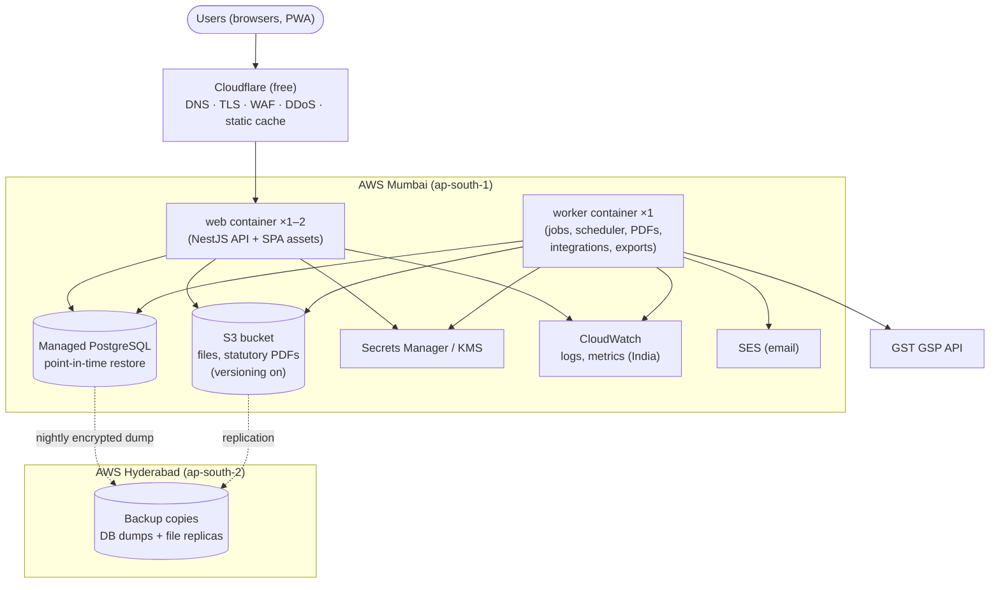
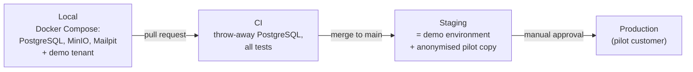
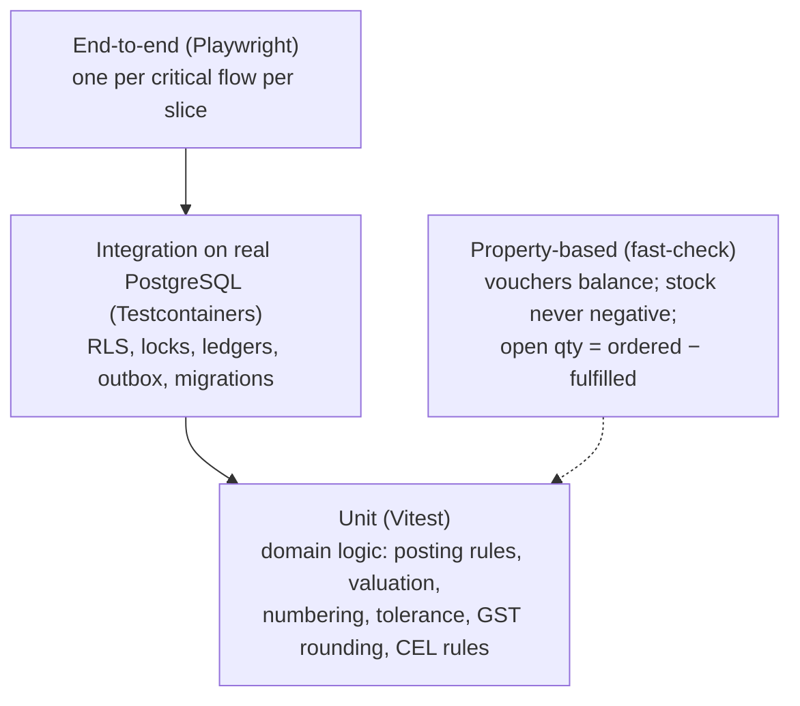
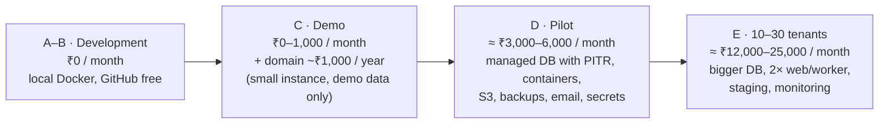

# Step 9A — Infrastructure, DevOps and Costs

> **Status:** In review · **Last updated:** 2026-10-04
> **Part of:** [Step 9 — Technical Architecture](STEP-09-TECHNICAL-ARCHITECTURE.md)
> **Answers:** Where does the system run (in India, with backups and point-in-time recovery)? How is it deployed, tested and monitored? What does each stage cost (brief §27, cost guidance §19)? How do private-cloud and on-premise deployments work?
> **Prices** below are **indicative** (late 2026, ₹ at roughly ₹85–88 per US$). Verify current prices before buying anything.

## TL;DR

- **Hosting recommendation: AWS Mumbai region, started simply.**
  - **Lightsail** containers + **managed PostgreSQL with point-in-time restore** for the pilot.
  - **S3** (files), **SES** (email), **KMS/Secrets Manager** (keys and secrets) and **CloudWatch** (logs kept in India).
  - Backup copies in **AWS Hyderabad**, a second Indian region.
  - Growth path to RDS/ECS without changing code.
- **Alternative:** DigitalOcean Bangalore (simple and predictable). It has only one Indian region, so off-site backups would go to another provider.
- **Excluded for production:** providers without Indian data residency or point-in-time recovery.
- **Everything is portable:**
  - **one Docker image** (web + worker)
  - standard PostgreSQL
  - the S3 API
  - OpenTelemetry

  The same image runs on any cloud or on a customer's server (Docker Compose).
- **Cloudflare (free plan)** in front: DNS, TLS, basic WAF and DDoS protection, and caching of the static app.
- **Environments:** local (Docker Compose) → CI (throw-away database) → **staging** (doubles as the demo) → **production**. Promotion is by tested container image; **database migrations run first** (expand → contract).
- **Testing:**
  - Unit tests (Vitest).
  - Integration tests on **real PostgreSQL** (Testcontainers), covering RLS, locks and ledgers.
  - **Property-based tests** for ledger rules: vouchers always balance, stock never goes negative.
  - Contract, **cross-tenant** and **authorization-matrix** suites.
  - Package tests, Playwright end-to-end tests per slice, k6 load test before the pilot, OWASP ZAP scan.
- **CI/CD:** GitHub Actions (free tier). Every pull request runs lint, types, **boundary checks**, tests, package validation, **secret and dependency scanning** and the image build. Staging deploys automatically; production on approval.
- **Observability:** OpenTelemetry. Logs and metrics in **CloudWatch Mumbai** (logs stay in India). Optional error tracking with personal data scrubbed. Uptime checks and alerts to the founder.
- **Cost per stage:**

  | Stage | Monthly cost |
  | --- | --- |
  | Development | **₹0** |
  | Demo | **₹0–1,000** + domain |
  | **Pilot** | **≈ ₹3,000–6,000** (covered by the implementation fee) |
  | 10–30 tenants | ≈ ₹12,000–25,000 (well under 15% of revenue) |

---

## 1. Hosting options

| Requirement | Source |
| --- | --- |
| Data, backups and logs **in India**; backup copy in a **second Indian region** | [ADR-0037](../adr/ADR-0037-PRIVACY-AND-ENCRYPTION.md), [ADR-0038](../adr/ADR-0038-SECURITY-BASELINE-AND-OPERATIONS.md), CERT-In |
| **Managed PostgreSQL with point-in-time recovery** | RPO ≤ 15 min ([ADR-0038](../adr/ADR-0038-SECURITY-BASELINE-AND-OPERATIONS.md)) |
| S3-compatible object storage with versioning | [ADR-0052](../adr/ADR-0052-DATA-LIFECYCLE-MDM-AND-MIGRATIONS.md) |
| Key management for field-level encryption; secret store | [ADR-0037](../adr/ADR-0037-PRIVACY-AND-ENCRYPTION.md) |
| Runs Docker containers simply; predictable cost; solo-operable | [R-03](../tracking/RISK-REGISTER.md) |

| Provider | Indian regions | Managed PostgreSQL + PITR | Storage / email / keys | Simplicity | Fit |
| --- | --- | --- | --- | --- | --- |
| **AWS** (Lightsail → RDS/ECS) | **Mumbai + Hyderabad** | Lightsail managed DB (point-in-time restore); RDS later | **S3, SES, KMS, Secrets Manager**, CloudWatch | Lightsail is simple; full AWS available when needed | ✅ **Recommended** |
| DigitalOcean | Bangalore only | Managed PostgreSQL with PITR | Spaces (S3 API); email and KMS from elsewhere | Very simple, predictable | ✅ Alternative (off-site backups to another provider) |
| Google Cloud | Mumbai + Delhi | Cloud SQL | GCS, Secret Manager, KMS | Moderate | Possible |
| Microsoft Azure | Central + South India | Azure Database for PostgreSQL | Blob, Key Vault | Moderate | Possible |
| Indian clouds (e.g. E2E Networks) | India | Verify managed PostgreSQL + PITR | Verify | Varies | Evaluate for price |
| Render / Vercel / Supabase free tiers | No Indian data residency, or sleep/pause, or PITR only as an expensive add-on | — | — | Easy | ❌ Not for customer data (OK for experiments) |

**Recommendation:** **AWS Mumbai**, starting with **Lightsail** (container service + managed PostgreSQL), plus S3, SES, KMS/Secrets Manager and CloudWatch, with backup copies to S3 in **Hyderabad**. Because of the portability rules (§2), switching providers later is a migration, not a rewrite. Final provider confirmed with a price check at implementation ([ADR-0059](../adr/ADR-0059-HOSTING-AND-DEPLOYMENT.md)).

---

## 2. Deployment topology

| Portability rule | Effect |
| --- | --- |
| **One Docker image**, two start commands (`web`, `worker`) | Runs anywhere containers run |
| Standard PostgreSQL only (no proprietary database features) | Any managed PostgreSQL or self-hosted |
| S3 API for files | AWS S3, DigitalOcean Spaces, MinIO (on-premise) |
| Configuration via environment variables (Twelve-Factor) | Same image in every environment |
| OpenTelemetry for telemetry | Any monitoring backend |
| Email, SMS, WhatsApp, GSP behind provider ports ([Step 1 §9](STEP-01-PLATFORM-DEFINITION.md#9-integrations-the-side-axis)) | Switch vendors by configuration |

---

## 3. Environments and local development

| Environment | Purpose | Data |
| --- | --- | --- |
| **Local** | Daily development on the founder's PC | Demo tenant from the Printing package's demo data ([Step 5A §10](STEP-05A-PACKAGES-UPGRADES-AND-ONBOARDING.md#10-demo-tenant--a-sales-asset)) |
| **CI** | Automated checks on every change | Created and destroyed per run |
| **Staging** | Demos to prospects; upgrade dry-runs ([ADR-0030](../adr/ADR-0030-PACKAGE-UPGRADES.md)); user acceptance tests | Demo data + anonymised copies of customer tenants |
| **Production** | Real customers | Real data (paid managed database from this point) |

Local tools: Node.js LTS, pnpm, Docker, VS Code, and **Mailpit** (catches emails locally). AI-assisted development with Claude Code follows the repository's `CLAUDE.md` conventions.

---

## 4. Testing strategy

| Suite | What it proves | When |
| --- | --- | --- |
| Unit | Business rules are correct | Every change |
| **Integration on real PostgreSQL** | RLS works; locks prevent double issue; ledgers and balances agree; jobs added in the transaction | Every change |
| **Property-based** | Ledger invariants hold for thousands of random sequences | Every change |
| **Cross-tenant suite** | No endpoint leaks data across tenants ([ADR-0035](../adr/ADR-0035-TENANT-ISOLATION.md)) | Every change |
| **Authorization matrix** | Each role can do exactly what the matrix says ([Step 6 §9](STEP-06-SECURITY-ARCHITECTURE.md#9-default-roles-printing-package--permission-summary)) | Every change |
| Contract tests | Module contracts, events and JSON Schemas stay compatible | Every change |
| **Package tests** | Estimates, approval routing and rules give expected results ([Step 5 §14](STEP-05-CONFIGURATION-ARCHITECTURE.md#14-governance-from-change-to-active-configuration)) | Every package change |
| Migration tests | Migrations apply cleanly to a copy of production | Before each release |
| End-to-end (Playwright) | Real user flows: PO → GRN → QC → stock; estimate → job → dispatch → invoice | Merge to main |
| Load (k6) | Expected pilot load plus 5× headroom | Before go-live |
| Security (OWASP ZAP baseline) | No common web vulnerabilities | On staging, each release |
| **Restore drill** | Backups actually restore, including single-tenant restore | Monthly ([ADR-0038](../adr/ADR-0038-SECURITY-BASELINE-AND-OPERATIONS.md)) |

Coverage goal: very high on ledgers, posting, numbering, tax and authorization; pragmatic elsewhere.

---

## 5. CI/CD and security scanning

```mermaid
flowchart LR
    PR(["Pull request"]) --> C1["Lint + typecheck"]
    C1 --> C2["Boundary check<br/>(dependency-cruiser,<br/>architecture tests)"]
    C2 --> C3["Unit + integration +<br/>property + tenant + authz tests"]
    C3 --> C4["Package & schema validation"]
    C4 --> C5["Security scans:<br/>secrets, dependencies,<br/>static analysis"]
    C5 --> C6["Build image"]
    C6 --> M(["Merge to main"])
    M --> S1["Deploy staging:<br/>migrations (expand) →<br/>new image → smoke + E2E + ZAP"]
    S1 --> AP{"Manual approval"}
    AP --> P1["Production:<br/>migrations (expand) →<br/>new image → smoke"]
    P1 --> P2["Later release:<br/>contract migration"]
```

| Practice | Tool (free) |
| --- | --- |
| Pipelines | GitHub Actions (free minutes are enough early) |
| Dependency updates | Dependabot or Renovate |
| Secret scanning | gitleaks + GitHub secret scanning |
| Dependency vulnerabilities | OSV-Scanner / npm audit |
| Static analysis | Semgrep Community rules |
| Container image scan | Trivy |
| Release notes | Conventional Commits + Keep a Changelog; SemVer tags |
| Image registry | GitHub Container Registry |

([ADR-0060](../adr/ADR-0060-ENGINEERING-PRACTICE.md))

---

## 6. Observability

| Signal | Implementation |
| --- | --- |
| Logs | Structured JSON, **no personal or Restricted data**, tagged with tenant id and trace id → CloudWatch Logs (Mumbai), at least 180 days ([ADR-0036](../adr/ADR-0036-AUDIT-AND-LOGGING.md)) |
| Traces | OpenTelemetry across web → database → jobs → external calls (W3C Trace Context, [ADR-0040](../adr/ADR-0040-EVENT-MODEL.md)) |
| Metrics | Request rate and latency, error rate, **outbox lag**, queue depth, failed jobs, database connections, PDF render time |
| Error tracking | Optional hosted error tracker **with personal data scrubbed** (supplementary; authoritative logs stay in India) |
| Uptime | External uptime checks (free tier) on login and health endpoints |
| Alerts | To the founder's phone/email: downtime, error spikes, dead-letter jobs, GST queue stuck, backup failure, security alerts ([6A §6.2](STEP-06A-ISOLATION-AUDIT-PRIVACY-AND-OPERATIONS.md#62-monitoring-and-alerts)) |
| Service target (pilot) | 99.5% monthly availability; RPO ≤ 15 min; RTO ≤ 4 h |

---

## 7. External services

| Service | Choice | Cost model | Notes |
| --- | --- | --- | --- |
| **Email** | Amazon SES (Mumbai) | Very low per 1,000 emails | SPF, DKIM, DMARC set up on our domain ([ADR-0045](../adr/ADR-0045-NOTIFICATION-ENGINE.md)) |
| **GST e-invoice / e-way bill** | A **GST Suvidha Provider (GSP)** API, chosen among 2–3 candidates at implementation (sandbox, reliability, price) | Per IRN/e-way bill or subscription, **passed through to the customer** | Behind the India pack's port; integration jobs ([ADR-0046](../adr/ADR-0046-INTEGRATION-JOBS-AND-WEBHOOKS.md)) |
| **Tally** | MVP: **Tally XML voucher file** generated by the ERP and imported by the accountant. Later: a small **local connector** posting to Tally's XML interface on the customer's network | Free | [ADR-0022](../adr/ADR-0022-TALLY-EXPORT-GRANULARITY.md) |
| DNS, TLS, WAF, CDN | Cloudflare free plan | Free | — |
| Domain | `.in` or `.com` once a demo exists | ~₹700–1,500 per year | Cost guidance §18 |
| Code and CI | GitHub (free plan) | Free | — |
| WhatsApp / SMS | Later add-ons (Meta Cloud API or a provider; DLT-registered SMS provider) | Per message, passed through with caps | [ADR-0045](../adr/ADR-0045-NOTIFICATION-ENGINE.md) |

---

## 8. Cost per stage (indicative)

| Pilot line item | Indicative monthly |
| --- | --- |
| Managed PostgreSQL with point-in-time restore (small) | ₹1,300–2,600 |
| Containers (web + worker) | ₹900–2,200 |
| S3 storage + Hyderabad backup copies | ₹200–500 |
| Email (SES), secrets/KMS, logs | ₹200–600 |
| **Total** | **≈ ₹3,000–6,000** |
| GST GSP charges | Passed through to the customer |
| One-off: professional penetration test | ₹50,000–2,00,000 when revenue allows ([ADR-0038](../adr/ADR-0038-SECURITY-BASELINE-AND-OPERATIONS.md)) |

This is slightly above the brief's ₹1,000–5,000 pilot estimate, because it includes the backup, PITR and security baseline you accepted in Step 6. It is **covered by the pilot's implementation fee**, and the paid database starts only when real customer data arrives ([ADR-0038](../adr/ADR-0038-SECURITY-BASELINE-AND-OPERATIONS.md)).

At 10–30 tenants paying, for example, ₹3,000–5,000 per month each, infrastructure stays **well under 15% of revenue**.

---

## 9. Private cloud and on-premise deployments

| Item | Approach |
| --- | --- |
| Package | The same image + a Docker Compose bundle (web, worker, PostgreSQL, MinIO) |
| Placement | Silo tenant ([ADR-0048](../adr/ADR-0048-MULTI-TENANCY-LAYOUT.md)): same schema, same code |
| Updates | Signed release bundles; migrations run by an update command |
| Entitlements | Signed licence file for modules and users ([ADR-0016](../adr/ADR-0016-DEPENDENCY-TYPES-AND-MANIFESTS.md)) |
| Responsibility | Backups, OS patching and uptime are the customer's unless a managed contract says otherwise ([6A §7](STEP-06A-ISOLATION-AUDIT-PRIVACY-AND-OPERATIONS.md#7-shared-responsibility)) |
| Timing | **Not in the MVP.** Possible later without redesign |

---

## 10. Proposed decisions

| ADR | Decision | Status |
| --- | --- | --- |
| [ADR-0059](../adr/ADR-0059-HOSTING-AND-DEPLOYMENT.md) | AWS Mumbai (Lightsail → RDS/ECS path) with Hyderabad backup copies; DigitalOcean Bangalore as alternative; one Docker image (web + worker); Cloudflare in front; portability rules; Docker Compose for on-premise later | **Proposed** |
| [ADR-0060](../adr/ADR-0060-ENGINEERING-PRACTICE.md) | Environments (local → CI → staging/demo → production); testing strategy incl. real-PostgreSQL, property-based, cross-tenant, authorization-matrix tests; GitHub Actions CI/CD with boundary and security scanning; OpenTelemetry with logs in India | **Proposed** |

## Open questions raised

[Q-58](../tracking/OPEN-QUESTIONS.md#q-58) hosting and deployment ·
[Q-59](../tracking/OPEN-QUESTIONS.md#q-59) engineering practice

## Related documents

- [Step 9 — Technical Architecture](STEP-09-TECHNICAL-ARCHITECTURE.md)
- [Project Brief §4.1 — cost stages](../00-context/PROJECT-BRIEF.md#41-solo-developer-operating-guidance-from-the-founders-cost-guidance-20-points)
- [Step 6A — Security operations](STEP-06A-ISOLATION-AUDIT-PRIVACY-AND-OPERATIONS.md)
