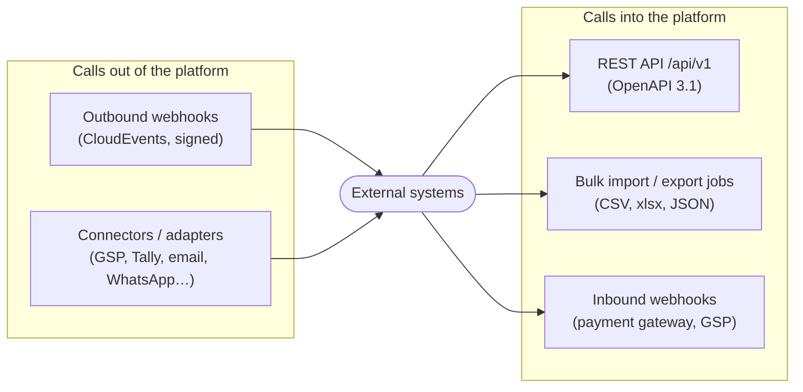

# API and Integration Architecture

> **Status:** Accepted (founder, 2026-10-04) · **Last updated:** 2026-10-04
> **Blueprint parts:** #13 Integration Architecture · #14 API Architecture (brief §17, §18)
> **Builds on:** ports and adapters ([Step 1 §9](../01-discovery/STEP-01-PLATFORM-DEFINITION.md#9-integrations-the-side-axis)), events and webhooks ([Step 7](../01-discovery/STEP-07-EVENTS-AND-AUTOMATION.md)), contracts ([ADR-0057](../adr/ADR-0057-CONTRACTS-RULES-TEMPLATES-PDF.md)), API authentication ([Step 6 §4.5](../01-discovery/STEP-06-SECURITY-ARCHITECTURE.md#45-system-to-system-authentication))

## TL;DR

- **One API style: REST over HTTPS with JSON, described in OpenAPI 3.1** and generated from the same JSON Schemas the platform uses internally. **No GraphQL** for now.
- **Our own web app uses the same API** as partners ("API-first"). Anything the UI can do, an integration can do, under the same permissions.
- **Conventions:**
  - **versioned URLs** (`/api/v1/…`) with a 12-month deprecation window
  - cursor pagination, filters and sorting
  - **Idempotency-Key** on create/post
  - RFC 9457 errors
  - ETags for optimistic locking
  - rate limits per client
- **Access:** OAuth 2 client credentials or scoped, expiring API keys. **Scopes map to permissions, and field security applies.** API clients are users of type "integration", and everything they do is audited.
- **Push and bulk:** webhooks (CloudEvents + Standard Webhooks) for push; bulk import and export jobs for large data.
- **Connector catalogue:**
  - **MVP:** GST e-invoice/e-way bill (GSP), Tally export, email.
  - **Later:** WhatsApp/SMS, payment gateways/UPI, bank statement import, e-commerce, shipping, machine counters (IoT), Google/Microsoft 365, analytics export.

---

## 1. Three ways systems talk to the platform

## 2. API conventions

| Topic | Convention | Standard |
| --- | --- | --- |
| Style | Resource-oriented REST, JSON, HTTPS only | OpenAPI 3.1 |
| Resources | `/api/v1/purchase-orders`, `/api/v1/purchase-orders/{id}`, nested lines | — |
| **Actions** (lifecycle transitions) | `POST /api/v1/purchase-orders/{id}/actions/submit` (also approve, release, cancel, short-close) | Lifecycle rules ([ADR-0005](../adr/ADR-0005-LIFECYCLE-VS-WORKFLOW.md)) |
| IDs | UUIDv7 in URLs; human document numbers searchable via filters | RFC 9562 |
| Dates, money | ISO 8601 UTC; decimals as strings with currency codes | ISO 8601, ISO 4217 |
| Pagination | Cursor-based (`?limit=50&cursor=…`) | — |
| Filtering and sorting | `?filter[status]=Released&filter[site]=…&sort=-date` | — |
| Partial responses | `?fields=number,status,totals` | — |
| **Optimistic locking** | `ETag` / `If-Match` on updates (the version column) | HTTP standard |
| **Idempotency** | `Idempotency-Key` header on POST | IETF draft ([ADR-0041](../adr/ADR-0041-OUTBOX-AND-DELIVERY.md)) |
| Errors | Problem Details (`type`, `title`, `detail`, `errors[]`) | RFC 9457 |
| Rate limits | Per client and per tenant; `429` + `Retry-After` | — |
| Extension fields | Returned under `ext`, described by a per-tenant metadata endpoint | [ADR-0026](../adr/ADR-0026-EXTENSION-FIELDS-STORAGE.md) |
| Long operations | `202 Accepted` + job resource to poll (reports, imports, exports) | — |

### 2.1 Versioning policy

| Change | Allowed in the same version? |
| --- | --- |
| Add an optional field, a new endpoint, a new event type | ✅ Yes (clients must ignore unknown fields) |
| Remove or rename a field, change a meaning or type, make a field required | ❌ New major version (`/api/v2`) |
| Deprecation | Announced in the changelog and response headers; **old version supported ≥ 12 months** |

## 3. Who can call the API

| Client | Authentication | Authorization |
| --- | --- | --- |
| Our web app / PWA | User session (cookie) | The user's permissions ([ADR-0033](../adr/ADR-0033-AUTHORIZATION-MODEL.md)) |
| Customer's own scripts / integrations | **OAuth 2 client credentials** or **scoped API key** (hashed, expiring, optional IP allow-list) | An **integration user** with a role and scopes; field security applies |
| Partner apps (later) | OAuth 2 authorization code with tenant consent | Requested scopes, approved by the tenant admin |
| Connectors we run (GSP, Tally) | Internal; credentials in the secret store | System user per tenant |

**Scopes** are coarse groups mapped onto permissions (for example `inventory:read`, `sales:write`, `reports:read`). Every call is audited with the client identity ([ADR-0036](../adr/ADR-0036-AUDIT-AND-LOGGING.md)).

## 4. Bulk data

| Need | Mechanism |
| --- | --- |
| Go-live imports, mass master updates | Upload → staging tables → validation report → post as documents ([Step 8A §6.3](../01-discovery/STEP-08A-REPORTING-SEARCH-AND-DATA-LIFECYCLE.md#63-onboarding-imports-and-opening-balances)) |
| Large exports, analytics feeds | Export job over a report dataset → file (CSV/xlsx/JSON) → signed download link; export controls apply |
| Continuous feed to a warehouse (later) | Change data capture or incremental export by `updated_at` cursor |

## 5. Connector catalogue

| Connector | Category | Port defined by | Phase |
| --- | --- | --- | --- |
| **GST e-invoice + e-way bill (via GSP)** | Statutory | India pack | **MVP** |
| **Tally export** (XML vouchers; later a local connector) | Accounting | Accounting Bridge | **MVP** |
| **Email** (SES) | Communication | Notification engine | **MVP** |
| Google / Microsoft login (OIDC) | Identity | Kernel | MVP (optional per tenant) |
| WhatsApp, SMS (DLT) | Communication | Notification engine | Phase 4–5 (add-on) |
| Payment gateway / UPI payment links | Financial | Accounting | Phase 5 |
| Bank statement import (CSV/Excel per bank) | Financial | Accounting | Phase 5 |
| E-commerce stores | Commerce | Sales | On demand |
| Shipping / courier providers | Logistics | Inventory | On demand |
| Machine counters / IoT (impressions, OEE) | Shop floor | Manufacturing | Phase 5+ |
| Microsoft 365 / Google Workspace (calendar, files) | Productivity | Kernel | On demand |
| Analytics / BI export | Data | Reporting | Phase 5 |
| Slack / Teams | Communication | Notifications (webhook adapter) | On demand |

**Every connector:**

- is an **adapter behind a port**, never called directly by module code
- runs as **integration jobs** with visible status, retries and manual resolution ([ADR-0046](../adr/ADR-0046-INTEGRATION-JOBS-AND-WEBHOOKS.md))
- keeps its credentials in the **secret store**
- is versioned and can be sold as an **add-on package**

## 6. Developer experience (later, for partners)

- Published OpenAPI documentation per version, with examples.
- Generated client SDKs (TypeScript first).
- A sandbox tenant with demo data.
- A webhook test console and delivery logs.
- A public changelog.

## 7. Decisions

| ADR | Decision | Status |
| --- | --- | --- |
| [ADR-0062](../adr/ADR-0062-API-ARCHITECTURE.md) | REST + OpenAPI 3.1, API-first, versioned URLs with 12-month deprecation, conventions above, OAuth client credentials / scoped API keys mapped to permissions, bulk jobs, webhooks; connectors as adapters; no GraphQL now | **Accepted** (2026-10-04) |

## Open questions raised

[Q-60](../tracking/OPEN-QUESTIONS.md#q-60) API and integration architecture

## Related documents

[Blueprint](BLUEPRINT.md) · [Step 7 §9 — integration jobs and webhooks](../01-discovery/STEP-07-EVENTS-AND-AUTOMATION.md#9-integrations-calls-out-and-calls-in) · [Standards](../00-context/STANDARDS.md)
