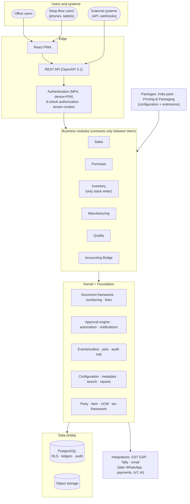

# MASTER-ERP — Master Blueprint

> **Status:** Accepted (founder, 2026-10-04) · **Last updated:** 2026-10-04
> **What this is:** the single entry point to the whole architecture. It covers the **27 blueprint parts** requested in brief §43 (Step 10). Each part is summarised here and links to the document and decision records (ADRs) where it is worked out in detail.

## TL;DR

- **Product:**
  - **One configurable ERP platform** (kernel + shared foundation + modules + India pack + industry packages + tenant configuration).
  - Starts as **"Printing Essentials" for Indian printing and packaging SMEs**, sold with implementation services, with Tally as the books.
- **Architecture:**
  - A **modular monolith** in **TypeScript** on **PostgreSQL**.
  - Documents flow through fixed lifecycles and configurable approvals, and post to **append-only ledgers**.
  - Events are delivered reliably through an **outbox**. Tenants are isolated by **Row-Level Security**.
  - Everything is configured through **version-controlled packages** plus audited admin settings.
- **Security and compliance by design:**
  - MFA for privileged roles; eight-check authorization; segregation of duties.
  - A statutory audit trail that cannot be disabled; DPDP-aligned privacy; hosting in India.
  - OWASP ASVS Level 2; GST e-invoicing.
- **Delivery:**
  - Phase 1 (foundations + 5 spikes), then **five vertical slices**.
  - The first customer goes live **slice by slice**.
  - Roughly 36–51 developer-weeks to the full MVP.
- **Decisions:** **67 ADRs**. Steps 1–8 accepted; **Steps 9–10 proposed**, waiting for your review. Every question and decision is in the [decision log sheet](../tracking/DECISION-LOG.csv).

---

## 1. The platform on one page

## 2. Governing principles

| # | Principle | Source |
| --- | --- | --- |
| 1 | **One platform, many industries:** industry and country are configuration + extensions, never forks | [ADR-0002](../adr/ADR-0002-LAYERED-PRODUCT-MODEL.md) |
| 2 | **Dependencies point downward; modules talk only through contracts** | [ADR-0014](../adr/ADR-0014-MODULE-OWNERSHIP.md), [ADR-0015](../adr/ADR-0015-INTER-MODULE-COMMUNICATION.md) |
| 3 | **Documents snapshot, masters reference; posted means immutable** | [ADR-0007](../adr/ADR-0007-IMMUTABLE-POSTED-DOCUMENTS.md), [ADR-0008](../adr/ADR-0008-REFERENCE-VS-SNAPSHOT.md) |
| 4 | **Ledgers are the truth; balances are derived** | [ADR-0050](../adr/ADR-0050-LEDGERS-VALUATION-AND-CONCURRENCY.md) |
| 5 | **Fixed core lifecycles; configurable approvals and sub-statuses** | [ADR-0005](../adr/ADR-0005-LIFECYCLE-VS-WORKFLOW.md) |
| 6 | **Stock and money in one transaction; everything else after commit via the outbox** | [ADR-0041](../adr/ADR-0041-OUTBOX-AND-DELIVERY.md) |
| 7 | **Tenant isolation in two independent locks** | [ADR-0035](../adr/ADR-0035-TENANT-ISOLATION.md) |
| 8 | **Deny by default; enforce on the server; hidden fields are really hidden** | [ADR-0033](../adr/ADR-0033-AUTHORIZATION-MODEL.md) |
| 9 | **Configuration-first, but never a programming language** | [ADR-0024](../adr/ADR-0024-CONFIGURATION-LAYERS-AND-STORES.md), [ADR-0028](../adr/ADR-0028-CEL-AND-DECISION-TABLES.md) |
| 10 | **Standards-first** | [ADR-0023](../adr/ADR-0023-STANDARDS-FIRST.md), [STANDARDS](../00-context/STANDARDS.md) |
| 11 | **Simple enough to build, strong enough to scale; no complexity without business value** | Brief §40, [ADR-0003](../adr/ADR-0003-MODULAR-MONOLITH-DIRECTION.md) |
| 12 | **Build for 100 customers, deploy for 1; infrastructure grows with revenue** | Brief cost guidance, [ADR-0059](../adr/ADR-0059-HOSTING-AND-DEPLOYMENT.md) |

## 3. The 27 blueprint parts

| # | Part | In one line | Where it is designed | Key ADRs | Status |
| --- | --- | --- | --- | --- | --- |
| 1 | **Product Architecture** | Seven layers (kernel → foundation → modules → localization → industry → tenant config → customization) + integration axis; positioned on industry depth and fast go-live | [Step 1](../01-discovery/STEP-01-PLATFORM-DEFINITION.md) | 0002, 0009, 0017 | Accepted |
| 2 | **Domain Model** | Documents, lines, links, anchors, ledgers, masters; two-level states; snapshot vs reference | [Step 2](../01-discovery/STEP-02-DOMAIN-MODEL.md) | 0005–0008 | Accepted |
| 3 | **Organization Model** | Separate legal, physical, people and financial structures + grouping tree; Tenant = Organization; multi-company | [Step 2 §2](../01-discovery/STEP-02-DOMAIN-MODEL.md#2-organization-model) | 0004 | Accepted |
| 4 | **RBAC Model** | Scoped roles + record conditions + field security; approval authority; SoD; support access | [Step 6](../01-discovery/STEP-06-SECURITY-ARCHITECTURE.md) | 0032–0034, 0039 | Accepted |
| 5 | **Module Architecture** | Modules by ownership; Inventory the only stock writer; manifests; without-modes; one edition in year 1 | [Step 3](../01-discovery/STEP-03-MODULE-BOUNDARIES.md) | 0014–0017 | Accepted |
| 6 | **Process Architecture** | Seven processes for printing (O2C, P2P, plan-to-produce incl. job work, inventory, quality, returns, Tally bridge) | [Step 4](../01-discovery/STEP-04-PROCESS-ARCHITECTURE.md) + 04A–04E | 0018–0022, 0061 | Accepted (standard-practice baseline) |
| 7 | **Workflow Architecture** | Own small approval engine: steps, resolvers, SLA, escalation, delegation, inbox | [Step 7A Part 1](../01-discovery/STEP-07A-WORKFLOW-AND-NOTIFICATIONS.md#part-1--approval-workflow-engine) | 0044 | Accepted |
| 8 | **Rules Architecture** | CEL conditions + decision tables; five rule kinds; fixed automation action catalogue | [Step 5 §8](../01-discovery/STEP-05-CONFIGURATION-ARCHITECTURE.md#8-rules-and-the-condition-language), [Step 7 §7](../01-discovery/STEP-07-EVENTS-AND-AUTOMATION.md#7-automation-rules) | 0028, 0043 | Accepted |
| 9 | **Event Architecture** | Domain + integration events (CloudEvents); in-transaction vs after-commit; outbox; no broker; no event sourcing | [Step 7](../01-discovery/STEP-07-EVENTS-AND-AUTOMATION.md) | 0040–0042 | Accepted |
| 10 | **Notification Architecture** | Pipeline with rules, preferences, templates, delivery log; in-app + email first | [Step 7A Part 2](../01-discovery/STEP-07A-WORKFLOW-AND-NOTIFICATIONS.md#part-2--notification-engine) | 0045 | Accepted |
| 11 | **Configuration Architecture** | Layers (override/extend/lock); Git packages + audited runtime settings; extension fields; hybrid UI; numbering | [Step 5](../01-discovery/STEP-05-CONFIGURATION-ARCHITECTURE.md) | 0024–0029 | Accepted |
| 12 | **Industry Architecture** | Industry packages = configuration + extensions at extension points; Printing package inventory; versioned upgrades | [Step 1 §7](../01-discovery/STEP-01-PLATFORM-DEFINITION.md#7-l4-industry-packages), [Step 5A](../01-discovery/STEP-05A-PACKAGES-UPGRADES-AND-ONBOARDING.md) | 0002, 0011, 0025, 0030 | Accepted |
| 13 | **Integration Architecture** | Ports and adapters; integration jobs; webhooks; connector catalogue | [API & Integration](API-AND-INTEGRATION-ARCHITECTURE.md), [Step 7 §9](../01-discovery/STEP-07-EVENTS-AND-AUTOMATION.md#9-integrations-calls-out-and-calls-in) | 0046, 0062 | Accepted |
| 14 | **API Architecture** | REST + OpenAPI 3.1, API-first, versioning, conventions, scopes | [API & Integration](API-AND-INTEGRATION-ARCHITECTURE.md) | 0057, 0062 | Accepted |
| 15 | **Data Architecture** | PostgreSQL; pool/silo tenancy; conventions; document registry; ledgers; concurrency | [Step 8](../01-discovery/STEP-08-DATA-ARCHITECTURE.md), [8A](../01-discovery/STEP-08A-REPORTING-SEARCH-AND-DATA-LIFECYCLE.md) | 0047–0052 | Accepted |
| 16 | **Security Architecture** | Threat model, authentication, authorization, isolation, audit, privacy, ASVS L2, operations | [Step 6](../01-discovery/STEP-06-SECURITY-ARCHITECTURE.md), [6A](../01-discovery/STEP-06A-ISOLATION-AUDIT-PRIVACY-AND-OPERATIONS.md) | 0032–0039 | Accepted |
| 17 | **Deployment Architecture** | One image (web + worker), AWS Mumbai with Hyderabad backups, Cloudflare, on-premise later | [Step 9A](../01-discovery/STEP-09A-INFRASTRUCTURE-DEVOPS-AND-COSTS.md) | 0048, 0059 | Accepted |
| 18 | **SaaS Architecture** | Tenant lifecycle, editions/add-ons/limits, metering, operations console | [SaaS, Billing & AI](SAAS-BILLING-AND-AI-ARCHITECTURE.md) | 0063 | Accepted |
| 19 | **Billing Architecture** | Manual year 1; e-mandate subscriptions later; data never held hostage | [SaaS, Billing & AI](SAAS-BILLING-AND-AI-ARCHITECTURE.md#part-2--billing-architecture) | 0063 | Accepted |
| 20 | **Reporting Architecture** | Report datasets, read models, analytics later; drill-down; exports | [Step 8A §1](../01-discovery/STEP-08A-REPORTING-SEARCH-AND-DATA-LIFECYCLE.md#1-reporting-architecture) | 0051 | Accepted |
| 21 | **AI Architecture** | Assistant only; dataset reads with user permissions; drafts only; opt-in; Phase 5 | [SaaS, Billing & AI Part 3](SAAS-BILLING-AND-AI-ARCHITECTURE.md#part-3--ai-architecture) | 0064 | Accepted |
| 22 | **Development Roadmap** | Phase 1 foundations + spikes → slices 0–4 → first customer → customers 2–5 → expansion → second vertical | [Roadmap & MVP](ROADMAP-AND-MVP.md) | 0012, 0065 | Accepted |
| 23 | **MVP Definition** | "Printing Essentials": in/out of scope, non-functional targets | [Roadmap & MVP §3](ROADMAP-AND-MVP.md#3-mvp-definition--printing-essentials) | 0017, 0065 | Accepted |
| 24 | **Phase-wise Feature Breakdown** | Features and exit criteria per slice; effort ranges | [Roadmap & MVP §4](ROADMAP-AND-MVP.md#4-phase-wise-feature-breakdown-slices-with-exit-criteria) | 0065 | Accepted |
| 25 | **Architecture Decision Records** | 67 ADRs with status and history | [ADR index](../adr/README.md), [decision log sheet](../tracking/DECISION-LOG.csv) | all | Maintained |
| 26 | **Major Risks** | Top 10 risks with early warning signs; full register of 33 | [Risks & Tech Debt §1](RISKS-AND-TECH-DEBT.md#1-top-10-risks), [Risk Register](../tracking/RISK-REGISTER.md) | — | Maintained |
| 27 | **Technical Debt Strategy** | Allowed vs forbidden shortcuts; register; 20% slice budget; review triggers | [Risks & Tech Debt §2](RISKS-AND-TECH-DEBT.md#2-technical-debt-strategy), [Tech-Debt Register](../tracking/TECH-DEBT-REGISTER.md) | 0066 | Accepted |
| + | UX Architecture (brief §19) | Role dashboards, archetypes, document anatomy, touch-first shop floor, budgets | [UX Architecture](UX-ARCHITECTURE.md) | 0067 | Accepted |
| + | Technical stack (brief §28–§29) | TypeScript, NestJS, Kysely, Graphile Worker, React, PostgreSQL | [Step 9](../01-discovery/STEP-09-TECHNICAL-ARCHITECTURE.md) | 0003, 0053–0058, 0060 | Accepted |

## 4. Implementation readiness checklist

| # | Item | Status |
| --- | --- | --- |
| 1 | Steps 1–8 accepted | ✅ |
| 2 | Process baseline decided (standard practice; customise with first customer) | ✅ [ADR-0061](../adr/ADR-0061-STANDARD-PRACTICE-BASELINE.md) |
| 3 | Step 9 accepted (Q-51 … Q-59) | ⏳ Waiting for founder |
| 4 | Step 10 accepted (Q-60 … Q-66) | ⏳ Waiting for founder |
| 5 | Founder's weekly hours and target dates known ([Q-66](../tracking/OPEN-QUESTIONS.md#q-66)) | ⏳ |
| 6 | Founder declares **"implementation phase starts"** (CLAUDE.md phase changes) | ⏳ |
| 7 | Phase 1: spikes S1–S5 run and recorded as ADR updates | After 6 |
| 8 | Recommended: informal printer conversation before Slice 2 | Optional |

## 5. How to keep this blueprint alive

- **Change a decision:** write a new ADR that supersedes the old one, update the row here, update the [decision log sheet](../tracking/DECISION-LOG.csv).
- **After each slice:** update the roadmap (actual vs estimated), the risk and tech-debt registers, and [STORY-SO-FAR](../00-context/STORY-SO-FAR.md).
- **New industry or country:** extend the Industry Architecture (part 12) with a package inventory like the Printing one ([Step 5A §3](../01-discovery/STEP-05A-PACKAGES-UPGRADES-AND-ONBOARDING.md#3-the-printing--packaging-package--inventory)).

## Open questions raised

[Q-60](../tracking/OPEN-QUESTIONS.md#q-60) API · [Q-61](../tracking/OPEN-QUESTIONS.md#q-61) SaaS & billing · [Q-62](../tracking/OPEN-QUESTIONS.md#q-62) AI · [Q-63](../tracking/OPEN-QUESTIONS.md#q-63) MVP & roadmap · [Q-64](../tracking/OPEN-QUESTIONS.md#q-64) tech debt · [Q-65](../tracking/OPEN-QUESTIONS.md#q-65) UX · [Q-66](../tracking/OPEN-QUESTIONS.md#q-66) your hours and dates

## Related documents

[Project Brief](../00-context/PROJECT-BRIEF.md) · [Story So Far](../00-context/STORY-SO-FAR.md) · [Coverage Matrix](../tracking/COVERAGE-MATRIX.md) · [Glossary](../00-context/GLOSSARY.md)
