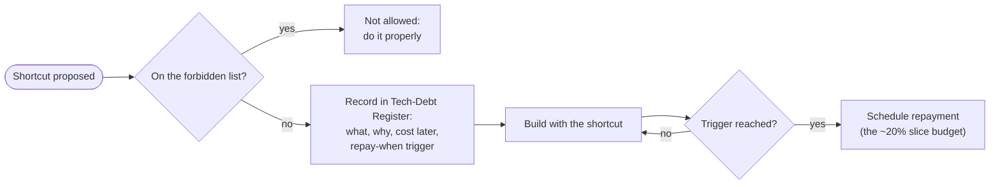

# Major Risks and Technical-Debt Strategy

> **Status:** In review · **Last updated:** 2026-10-04
> **Blueprint parts:** #26 Major Risks · #27 Technical Debt Strategy
> **Detail:** full list in the [Risk Register](../tracking/RISK-REGISTER.md) (33 risks); deliberate shortcuts in the [Tech-Debt Register](../tracking/TECH-DEBT-REGISTER.md).

## TL;DR

- **The ten risks that matter most are mostly business and focus risks, not technology:**
  - building breadth before a customer
  - the inner-platform trap
  - solo-developer burnout
  - processes not yet seen in a real company
  - wrong GST/accounting behaviour
  - tenant data leaks
  - data loss
  - shop-floor adoption
  - young libraries
  - decimal errors
- **Technical debt is managed, not avoided:**
  - **Allowed shortcuts** are listed up front (manual billing, Tally file export, no offline mode, limited admin screens…). Each is recorded with a "repay when" trigger.
  - **Forbidden shortcuts** are never taken, because they corrupt data or trust: floating-point money, bypassing ledgers, editing posted documents, skipping tenant isolation, disabling audit, cross-module table access, industry logic in the core, hand-written cryptography.
  - **About 20% of each slice is reserved for repaying debt**, and every ADR has review triggers.

---

## 1. Top 10 risks

| # | Risk | Register | Likelihood / impact | Main mitigation | Early warning sign |
| --- | --- | --- | --- | --- | --- |
| 1 | **Building breadth before a paying customer** | R-01 | High / Critical | One edition, vertical slices, slice-by-slice go-live ([Roadmap](ROADMAP-AND-MVP.md)) | Starting a module outside the MVP list |
| 2 | **Inner-platform effect** (configuration becomes a programming language) | R-02, R-19 | Medium / Critical | No scripting; CEL limited; builders only after ≥ 3 customers | Requests for "just one more rule type" |
| 3 | **Solo-developer burnout / bandwidth** | R-03 | High / Critical | Narrow MVP, proven libraries, automation, AI assistance, realistic plan ([Q-66](../tracking/OPEN-QUESTIONS.md#q-66)) | Slices slipping more than 50% |
| 4 | **Processes differ from real customers** | R-10, R-15 | Medium / High | Standard-practice baseline + configuration + slice-by-slice go-live ([ADR-0061](../adr/ADR-0061-STANDARD-PRACTICE-BASELINE.md)) | First customer needs core changes, not configuration |
| 5 | **Wrong GST / accounting behaviour** | R-05 | Medium / High | India pack tests from real invoices; CA review before go-live; Tally reconciliation | GSP validation errors; accountant corrections |
| 6 | **Tenant data leak** | R-06 | Low / Critical | RLS + tenant context + cross-tenant suite ([ADR-0035](../adr/ADR-0035-TENANT-ISOLATION.md)) | Any failing cross-tenant test |
| 7 | **Data loss** | R-04, R-30 | Low / Critical | PITR, Hyderabad copies, monthly restore drills ([ADR-0059](../adr/ADR-0059-HOSTING-AND-DEPLOYMENT.md)) | A failed or skipped restore drill |
| 8 | **Shop-floor users don't adopt** | R-11, R-24 | Medium / High | Touch-first job cards ≤ 30 s, device + PIN ([UX](UX-ARCHITECTURE.md)) | Job cards filled at end of day by supervisors |
| 9 | **Young libraries** (CEL, Better Auth) | R-32 | Medium / Medium | Spikes with fallbacks; libraries behind ports | Spike fails its checks |
| 10 | **Decimal / rounding errors** | R-31 | Medium / High | Decimal types, lint rule, property tests, spike S4 | Any `number` used for money in review |

## 2. Technical-debt strategy

### 2.1 What "technical debt" means here

A **shortcut taken now** that will cost extra work later. Some debt is **deliberate and healthy**: it gets the first customer live sooner. Debt becomes dangerous when it is **hidden**, **unbounded**, or **corrupts data or trust**.

### 2.2 Allowed (deliberate) shortcuts in the MVP

| Shortcut | Why it is acceptable now | Repay when |
| --- | --- | --- |
| Manual SaaS billing ([ADR-0063](../adr/ADR-0063-SAAS-LIFECYCLE-AND-BILLING.md)) | Few customers | > 10 paying tenants |
| Tally **file** export instead of a live connector | Works for every Tally setup | Customers ask for automatic sync |
| Admin screens only for frequent settings; the rest via packages ([ADR-0011](../adr/ADR-0011-CONFIGURATION-AS-PACKAGES.md)) | Implementer-led year 1 | ≥ 3 customers ask for the same self-service |
| No offline mode on phones | Online PWA with retries | Real shop floors with poor connectivity |
| Single region, single production database (pooled) | Cost; RTO ≤ 4 h is acceptable | Enterprise customer or SLA > 99.5% |
| Simple machine queue instead of scheduling | Planners schedule by experience | Customers with > 10 machines ask |
| One package level (no inheritance) | One vertical | Second vertical starts |
| Email from our domain with reply-to | Simplicity | Customers ask for their own domain |
| Error tracking optional; CloudWatch only | Cost | > 5 tenants |

### 2.3 Forbidden shortcuts (never)

| Never | Because |
| --- | --- |
| JavaScript `number` / floating point for money or quantities | Silent rounding errors in books ([ADR-0053](../adr/ADR-0053-LANGUAGE-AND-RUNTIME.md)) |
| Writing stock or vouchers outside the ledger services | Breaks the single source of truth ([ADR-0014](../adr/ADR-0014-MODULE-OWNERSHIP.md), [ADR-0050](../adr/ADR-0050-LEDGERS-VALUATION-AND-CONCURRENCY.md)) |
| Editing posted documents or ledger entries | Law and auditors ([ADR-0007](../adr/ADR-0007-IMMUTABLE-POSTED-DOCUMENTS.md)) |
| Skipping tenant context, RLS or cross-tenant tests | One leak ends the business ([ADR-0035](../adr/ADR-0035-TENANT-ISOLATION.md)) |
| Disabling or bypassing the audit trail | Law ([ADR-0036](../adr/ADR-0036-AUDIT-AND-LOGGING.md)) |
| Reading or writing another module's tables | Boundary erosion ([ADR-0015](../adr/ADR-0015-INTER-MODULE-COMMUNICATION.md)) |
| `if industry == "printing"` in core or modules | Kills multi-industry ([ADR-0002](../adr/ADR-0002-LAYERED-PRODUCT-MODEL.md)) |
| Customer-specific code in the core | Upgrade nightmare ([Step 1 §8](../01-discovery/STEP-01-PLATFORM-DEFINITION.md#8-l5--l6--customer-configuration-and-customization)) |
| Hand-written cryptography or password handling | Security ([ADR-0032](../adr/ADR-0032-AUTHENTICATION.md)) |
| Secrets in Git, packages or logs | Security ([ADR-0037](../adr/ADR-0037-PRIVACY-AND-ENCRYPTION.md)) |
| Real customer data on free or unbacked databases | Data loss ([ADR-0038](../adr/ADR-0038-SECURITY-BASELINE-AND-OPERATIONS.md)) |

### 2.4 Routines

| Routine | Rule |
| --- | --- |
| **Debt budget** | About **20% of each slice** for repayment and refactoring |
| Register review | At the end of every slice: re-check triggers, re-prioritise |
| **ADR review triggers** | Each ADR is revisited when its stated graduation trigger occurs (e.g. broker, OpenSearch, silo database, visual builders) |
| Dependency hygiene | Weekly updates; critical security fixes within 72 hours ([ADR-0038](../adr/ADR-0038-SECURITY-BASELINE-AND-OPERATIONS.md)) |
| Quality gates | CI blocks: boundary violations, failing tenant or authorization tests, ledger property failures, secrets, critical vulnerabilities ([ADR-0060](../adr/ADR-0060-ENGINEERING-PRACTICE.md)) |

## Decisions

| ADR | Decision | Status |
| --- | --- | --- |
| [ADR-0066](../adr/ADR-0066-TECH-DEBT-POLICY.md) | Allowed vs forbidden shortcuts; Tech-Debt Register with repay-when triggers; ~20% slice budget; ADR review triggers; CI quality gates | **Proposed** |

## Open questions raised

[Q-64](../tracking/OPEN-QUESTIONS.md#q-64) technical-debt policy

## Related documents

[Blueprint](BLUEPRINT.md) · [Risk Register](../tracking/RISK-REGISTER.md) · [Tech-Debt Register](../tracking/TECH-DEBT-REGISTER.md)
