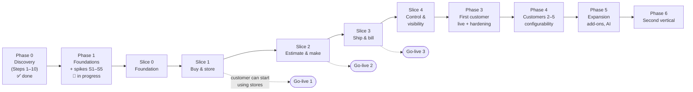

# Roadmap, MVP Definition and Phase-wise Feature Breakdown

> **Status:** Accepted (founder, 2026-10-04) · **Last updated:** 2026-10-04
> **Blueprint parts:** #22 Development Roadmap · #23 MVP Definition · #24 Phase-wise Feature Breakdown
> **Builds on:** [ADR-0012](../adr/ADR-0012-VERTICAL-SLICE-ROADMAP.md) (vertical slices), [ADR-0017](../adr/ADR-0017-SINGLE-EDITION-YEAR-ONE.md) (one edition), [ADR-0061](../adr/ADR-0061-STANDARD-PRACTICE-BASELINE.md) (standard-practice baseline)

## TL;DR

- **MVP = the "Printing Essentials" edition**, built as **five vertical slices** on a minimal platform foundation:
  - **Slice 0 Foundation**
  - **Slice 1 Buy & store**
  - **Slice 2 Estimate & make**
  - **Slice 3 Ship & bill**
  - **Slice 4 Control & visibility**
- **Phase 1 comes first:** foundations and five spikes (S1–S5) prove the risky technical choices.
- **The first customer can go live slice by slice:** stores first (Slice 1), then production (Slice 2), then dispatch and invoicing (Slice 3). Value and feedback arrive months earlier than a "big bang" go-live.
- **Effort (rough, AI-assisted, one developer):** about **36–51 focused developer-weeks** to the full MVP. That is ≈ 9–12 months full-time, or ≈ 18–24 months half-time. A first customer can start using Slice 1 after roughly **4–6 months full-time**. The calendar depends on your weekly hours ([Q-66](../tracking/OPEN-QUESTIONS.md#q-66)).
- Each slice has **exit criteria**: working flows, automated tests green, documentation, a demo script.
- **Out of the MVP (deliberately):** CRM, full accounting, HR/payroll, maintenance, projects, service, portals, WhatsApp/SMS, offline mode, native apps, AI, visual builders, package inheritance, multi-edition selling.

---

## 1. The roadmap at a glance

| Phase | Goal | Ends when |
| --- | --- | --- |
| **0 Discovery** | Architecture and decisions documented | Step 10 accepted |
| **1 Foundations + spikes** | Prove risky choices; create the skeleton everything else stands on | Spikes S1–S5 pass (or fallbacks chosen); CI green; kernel minimum works |
| **Slices 0–4 (MVP)** | "Printing Essentials" usable end to end | All slice exit criteria met |
| **3 First customer** | Real use; corrections; reliability | 2 months of stable use; customer would recommend |
| **4 Customers 2–5** | Repeatable onboarding; admin screens where customers asked; configuration hardening | Onboarding in ≤ 2 weeks per customer |
| **5 Expansion** | Add-ons: WhatsApp, full accounting, CRM, maintenance, portals, AI features | Driven by customer demand and revenue |
| **6 Second vertical** | Adjacent industry package (corrugation, labels, flexible packaging, or food) | First customer of the second vertical live |

---

## 2. Phase 1 — Foundations and spikes

**Progress (2026-10-04):**

- Implementation started.
- ✅ Spikes S1–S5 done: all passed; the CEL library choice is waiting for [Q-67](../tracking/OPEN-QUESTIONS.md#q-67). See the [results](../03-implementation/PHASE-1-SPIKE-RESULTS.md).
- ✅ Repository and pipeline done: monorepo, boundary rules, CI.
- ⏳ Kernel minimum is next.

| Item | Content | Rough effort |
| --- | --- | --- |
| Spikes S1–S5 | CEL library · Better Auth · RLS + Kysely + Graphile Worker · decimal discipline · PDF ([Step 9 §11](../01-discovery/STEP-09-TECHNICAL-ARCHITECTURE.md#11-spikes-to-run-before-implementation-starts)) | 2–3 weeks |
| Repository and pipeline | Monorepo, boundary rules, CI with tests and scans, Docker Compose, staging | 1–2 weeks |
| Kernel minimum | Tenancy + RLS · identity (login, MFA) · authorization (roles, scopes, field groups) · audit trail · numbering · document registry + links + lifecycle · events/outbox/jobs · configuration loader (packages + runtime settings) · metadata/extension fields · files · PDF output | 5–7 weeks |

---

## 3. MVP definition — "Printing Essentials"

### 3.1 In scope

| Area | MVP content |
| --- | --- |
| Platform | Everything in Phase 1 + approval engine + notification engine (in-app + email) + search + report datasets + imports |
| Foundation | Party with roles, Item + printing attributes, UOM + kg↔sheet, currency (INR + foreign for exports), tax framework, fiscal calendar, employee directory |
| Sales | Enquiry, **Estimate** (printing calculator), Quotation, Sales Order, Sales Invoice, credit/debit notes, price lists |
| Purchase | Requisition, PO (approvals), purchase invoice (three-way match), debit notes, job-work PO |
| Inventory | Warehouses, **reels**, stock ledger, reservations, GRN, quarantine, issues/returns, transfers, conversion (sheeting), adjustments, counts, deliveries, job-work challans, **customer-owned stock** (switchable) |
| Manufacturing | Product spec (BOM/routing versions), Job (anchor), production orders, **job cards (phone)**, material requisition, job work, FG/scrap receipts, **job costing (estimate vs actual)**, machine queue board |
| Quality | Incoming inspection, OK sheet, final inspection; accept / reject / deviation / split |
| Accounting Bridge | Posting rules, vouchers, receipts/payments, open items, ageing, **Tally export**, books-locked date |
| India pack | GST, HSN/SAC/UQC, GSTIN validation, **e-invoice and e-way bill via GSP**, numbering locks, invoice copies, TDS basics, MSME 45-day alerts |
| Printing package | Attribute sets, operations, work-center types, Artwork/Die/Plate, Job sub-statuses, templates, reports, demo data |
| Security | MFA for privileged roles, shop-floor device + PIN, eight-check authorization, SoD report, support access, audit views |

### 3.2 Out of scope (and why)

| Not in MVP | Why / when |
| --- | --- |
| CRM (leads, opportunities) | Low pain for printers; enquiries exist in Sales → Phase 5 |
| Full accounting (GL, bank reconciliation, GST returns filing) | Tally-first ([ADR-0010](../adr/ADR-0010-ACCOUNTING-VIA-TALLY-FIRST.md)) → Phase 5 |
| HR & payroll, Projects, Service, Maintenance & Assets | Outside the first vertical → Phase 5+ |
| Customer / vendor portals | Channel add-ons → Phase 5 |
| WhatsApp / SMS | Paid add-ons ([ADR-0045](../adr/ADR-0045-NOTIFICATION-ENGINE.md)) → Phase 4–5 |
| Offline mode, native mobile apps | PWA online first → when proven needed |
| AI features | After product-market fit ([SaaS, Billing & AI](SAAS-BILLING-AND-AI-ARCHITECTURE.md)) |
| Visual builders (forms, workflows, rules, custom objects by tenants) | After ≥ 3 customers ([ADR-0011](../adr/ADR-0011-CONFIGURATION-AS-PACKAGES.md)) |
| Gang runs, MRP, finite scheduling | Complexity; validate need first |
| Multiple editions, self-service sign-up, automated subscription billing | One edition, implementer-led onboarding in year 1 |
| COA certificates | Only if the first customer is a pharma-packaging printer ([Q-21](../tracking/OPEN-QUESTIONS.md#q-21)) |

### 3.3 Non-functional requirements for the MVP (ISO/IEC 25010 checklist)

| Quality | MVP target |
| --- | --- |
| Performance | p95 < 300 ms for common reads; < 1 s for posting a document; invoice PDF < 3 s; lists paginated |
| Reliability | 99.5% monthly availability; RPO ≤ 15 min; RTO ≤ 4 h ([ADR-0038](../adr/ADR-0038-SECURITY-BASELINE-AND-OPERATIONS.md)) |
| Security | OWASP ASVS Level 2 items for MVP features; cross-tenant and authorization suites green |
| Usability | Role home dashboards; **job card entry ≤ 30 seconds on a phone**; GRN with reel weights on a phone |
| Accessibility | WCAG 2.2 AA target on core screens |
| Compatibility | Latest two versions of Chrome and Edge (desktop and Android); Safari on iOS |
| Maintainability | Boundary rules enforced; high test coverage on ledgers, posting, numbering, tax and authorization |
| Portability | Single Docker image; runs on any PostgreSQL + S3-compatible storage |
| Localisation | English UI; en-IN number and date formats; text translatable |

---

## 4. Phase-wise feature breakdown (slices) with exit criteria

### Slice 0 — Foundation (≈ 3–4 weeks)

| Layer | Features |
| --- | --- |
| Kernel | Tenant onboarding checklist, company/site/warehouse setup, users and roles (templates), runtime settings screens, numbering admin |
| Foundation | Party (roles, GSTIN/PAN, addresses), Item (+ printing attribute sets), UOM + conversions, currency, tax categories |
| Packages | Printing package v0.1 (attributes, categories, roles, terminology), India pack v0.1 (GSTIN validation, HSN/UQC lists) |

**Exit criteria:**

- A demo tenant is created from the packages.
- Masters are imported from Excel templates.
- MFA works for the owner.
- A store keeper on a registered tablet sees only their screens.
- Cross-tenant and authorization tests are green.

### Slice 1 — Buy & store (≈ 6–8 weeks) → **Go-live 1 possible**

| Module | Features |
| --- | --- |
| Purchase | Requisition (optional), PO with approval workflow, PO PDF by email, amendments, short-close, purchase invoice with three-way match, debit note |
| Inventory | GRN with **reels and weights**, quarantine, issue/return, transfer, conversion (sheeting), adjustment with approval, stock count, reservations, reorder suggestions, stock ledger and reel register |
| Quality | Incoming inspection; accept / reject / deviation / split |
| Accounting | Purchase vouchers, payments, payables ageing (MSME alerts), Tally export (purchase side) |

**Exit criteria:**

- PO → approval → GRN (reels) → QC → stock → issue → count reconciles with the stock ledger.
- The purchase bill matches PO and GRN; the voucher exports to Tally.
- Concurrency test: two simultaneous issues of the last stock, only one succeeds.
- Demo script and user guide pages are written.

### Slice 2 — Estimate & make (≈ 8–12 weeks) → **Go-live 2 possible**

| Module | Features |
| --- | --- |
| Sales | Enquiry, **Estimate** (printing calculator, quantity slabs, versions, approval), Quotation PDF, Sales Order (tolerance, credit check), repeat orders from product spec |
| Manufacturing | Product spec (BOM/routing versions), **Job** with sub-statuses, artwork versions and approval, dies/plates, production orders, material requisition, **job cards on phone** (good/waste/time, OK sheet), job work out/in, FG and scrap receipts, **estimate vs actual**, machine queue board |
| Inventory | Job-bound reservations, job-work challans, third-party locations, customer-owned stock (switchable) |

**Exit criteria:**

- Estimate → quotation → SO → job → artwork approved → production with job cards (including one job-work operation) → FG in stock.
- Job costing shows estimate vs actual per element.
- Wastage report by job, machine and reason.

> **Recommended (non-blocking):** a 1–2 hour conversation with any printer before this slice ([ADR-0061](../adr/ADR-0061-STANDARD-PRACTICE-BASELINE.md)).

### Slice 3 — Ship & bill (≈ 6–8 weeks) → **Go-live 3 possible**

| Module | Features |
| --- | --- |
| Inventory | Delivery (partial, tolerance), packing details, vehicle/transporter |
| Sales | Sales invoice from delivery, credit/debit notes, scrap sale, customer returns |
| India pack | **E-invoice (IRN, QR) and e-way bill via GSP** with integration jobs and outage handling; statutory numbering; invoice copies; stored statutory PDFs |
| Accounting | Sales vouchers, receipts with TDS and short-payment reasons, advances, receivables ageing, credit exposure, **full Tally export**, books-locked date, monthly reconciliation report |

**Exit criteria:**

- SO → partial deliveries → invoices with IRN and e-way bill (GSP sandbox) → receipt settling two invoices → Tally import succeeds.
- A GSP outage queues invoices visibly and recovers.
- A credit note after the cancellation window works.

### Slice 4 — Control & visibility (≈ 5–7 weeks)

| Area | Features |
| --- | --- |
| Workflow | Full approval engine: decision tables, parallel steps, SLA, escalation, delegation, stuck-approval report |
| Notifications | Rules, preferences, digests, in-app centre, email templates |
| Insight | Role dashboards (read models), report datasets for all MVP reports, scheduled reports, global search |
| Control | SoD exceptions report, access review report, audit views and export, support-access flow |
| Readiness | Import templates for go-live (opening stock, open orders, open items), load test, ZAP scan, restore drill, penetration-test preparation |

**Exit criteria:**

- A full go-live dress rehearsal on staging, from import to first invoice.
- All non-functional targets (§3.3) are met.
- The owner dashboard shows pending orders, job status, wastage, receivables and payables.

---

## 5. Effort summary (rough)

| Block | Focused developer-weeks (AI-assisted) |
| --- | --- |
| Phase 1: spikes + repository + kernel minimum | 8–12 |
| Slice 0 | 3–4 |
| Slice 1 | 6–8 |
| Slice 2 | 8–12 |
| Slice 3 | 6–8 |
| Slice 4 | 5–7 |
| **Total to full MVP** | **≈ 36–51** |

| Weekly time available | Full MVP | First customer can start (after Slice 1) |
| --- | --- | --- |
| Full-time (~40 h) | ≈ 9–12 months | ≈ 4–6 months |
| Half-time (~20 h) | ≈ 18–24 months | ≈ 8–12 months |

These are **ranges, not promises**. Discovery-level estimates are typically off by ±30–50%. They will be re-estimated after Phase 1, when the spikes have removed the biggest unknowns.

---

## 6. Definition of done (every feature)

1. Works end to end in the demo tenant.
2. Unit + integration tests, including the tenant-isolation and authorization suites, are green.
3. Ledger invariants (property tests) are green where stock or money is touched.
4. Boundary checks pass; no new forbidden shortcuts ([Risks & Tech Debt](RISKS-AND-TECH-DEBT.md)).
5. Audit entries and events are emitted as designed.
6. User-guide page and demo-script step are written.
7. Decision log and documentation are updated if anything changed.

---

## Open questions raised

[Q-63](../tracking/OPEN-QUESTIONS.md#q-63) MVP scope and slice order ·
[Q-66](../tracking/OPEN-QUESTIONS.md#q-66) founder's weekly hours and target dates

## Related documents

[Blueprint](BLUEPRINT.md) · [Preliminary roadmap critique](../01-discovery/PRELIM-ROADMAP-CRITIQUE.md) · [Step 9 spikes](../01-discovery/STEP-09-TECHNICAL-ARCHITECTURE.md#11-spikes-to-run-before-implementation-starts) · [Risks & Tech Debt](RISKS-AND-TECH-DEBT.md)
