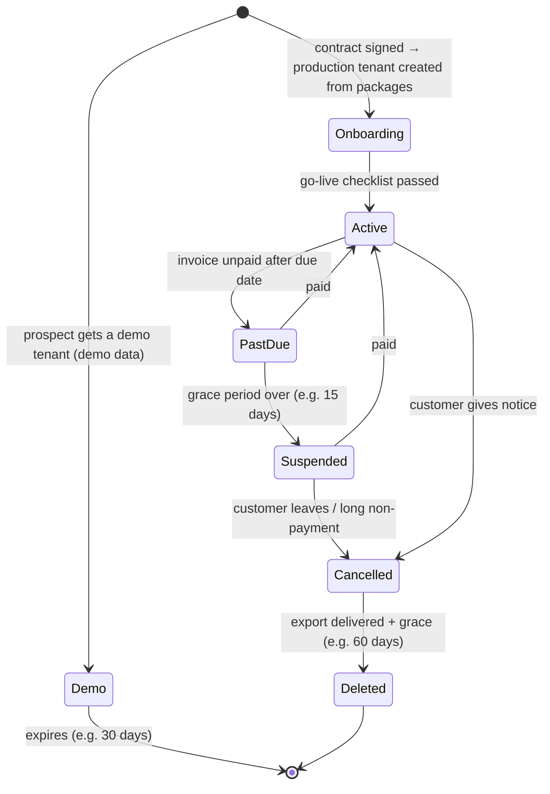
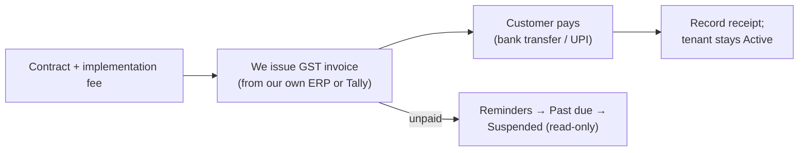
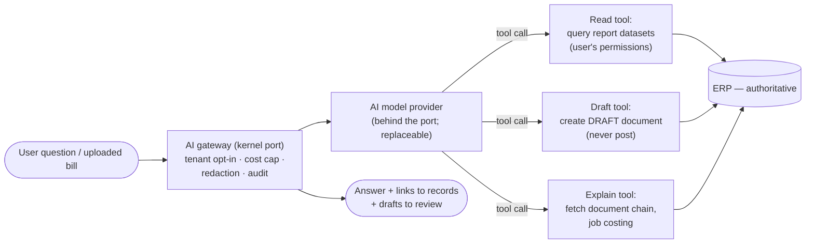

# SaaS, Billing and AI Architecture

> **Status:** In review · **Last updated:** 2026-10-04
> **Blueprint parts:** #18 SaaS Architecture · #19 Billing Architecture · #21 AI Architecture (brief §24, §26)

## TL;DR

- **SaaS:**
  - Every tenant has a lifecycle: Trial/Demo → Onboarding → Active → Past due → **Suspended (read-only)** → Cancelled → Deleted.
  - Plans are **editions + add-ons + limits**, enforced by the entitlement service ([ADR-0016](../adr/ADR-0016-DEPENDENCY-TYPES-AND-MANIFESTS.md)).
  - Usage is metered for limits and add-ons: users, companies, storage, paid messages, GSP calls.
  - A small, audited **platform operations console** is for us.
- **Billing:**
  - **Year 1 is deliberately manual.** Implementation fee + monthly or annual subscription, invoiced by us with GST and paid by bank transfer or UPI. We invoice from our own ERP instance ("eat our own cooking") or from Tally.
  - **Later:** a subscription-billing provider with RBI-compliant e-mandates (UPI AutoPay / card mandates), behind a billing port.
  - **A customer's data is never held hostage:** suspension is read-only, and export is always available.
  - Prices need market research ([Q-61](../tracking/OPEN-QUESTIONS.md#q-61)). An illustrative structure is given.
- **AI:**
  - It is **never the foundation**. The ERP stays deterministic and authoritative.
  - AI **reads only through report datasets with the user's permissions** and **can only create drafts**. A human always reviews and posts.
  - It is opt-in per tenant; providers do not train on customer data; prompts and actions are audited; there are cost caps.
  - **First candidate:** vendor-invoice reading (photo/PDF → draft purchase invoice). **Then:** natural-language questions over reports, wastage/stock anomaly alerts, reorder suggestions.
  - **Timing:** after product-market fit (Phase 5).

---

## Part 1 — SaaS architecture

### 1. Tenant lifecycle

| State | Users can | Notes |
| --- | --- | --- |
| Demo | Everything, on demo data only | Never converted to production. Production starts clean ([ADR-0031](../adr/ADR-0031-GO-LIVE-WITH-OPENING-BALANCES.md)) |
| Onboarding | Implementer and admins configure and import | Staging dress rehearsal ([Step 5A §9](../01-discovery/STEP-05A-PACKAGES-UPGRADES-AND-ONBOARDING.md#9-data-migration-and-go-live)) |
| Active | Everything licensed | — |
| Past due | Everything; banner and reminders | Dunning reminders on due date, +7 and +15 days |
| **Suspended** | **View, print, export only** — no new postings | **Data never deleted or hidden while suspended** |
| Cancelled | Export only | Full export delivered ([Step 8A §5.3](../01-discovery/STEP-08A-REPORTING-SEARCH-AND-DATA-LIFECYCLE.md#53-tenant-exit)) |
| Deleted | — | Deletion confirmation sent; backups expire on schedule |

### 2. Plans, entitlements and limits

| Element | Year 1 | Later |
| --- | --- | --- |
| **Edition** | Printing Essentials ([ADR-0017](../adr/ADR-0017-SINGLE-EDITION-YEAR-ONE.md)) | Smaller and larger editions |
| **Add-ons** | — | WhatsApp/SMS credits, extra companies, Full Accounting, CRM, portals, connectors, AI features |
| **Limits** | Users (office + shop-floor devices), companies, storage | Same, plus paid-message credits |
| Enforcement | Entitlement service checks module activation and limits; friendly warnings at 80% and 100% | Same |
| Metering | Usage events (active users, storage, IRNs generated, messages sent) recorded per tenant per day | Feeds automated billing |

### 3. Platform operations console (for us)

| Function | Notes |
| --- | --- |
| Tenant directory: placement, region, status, plan, package versions ([ADR-0048](../adr/ADR-0048-MULTI-TENANCY-LAYOUT.md)) | No access to business data |
| Create tenant from packages; schedule upgrades ([ADR-0030](../adr/ADR-0030-PACKAGE-UPGRADES.md)) | Audited |
| Usage, health, integration-job status per tenant | Aggregates only |
| Support-access requests ([ADR-0039](../adr/ADR-0039-SUPPORT-ACCESS.md)) | Tenant approval required |
| Suspend / reactivate / export / delete | Two-step confirmation; audited |

---

## Part 2 — Billing architecture

### 4. Year 1: manual and simple

| Component | Approach |
| --- | --- |
| Our invoices | GST-compliant tax invoices for software services and implementation (our own company is a normal Indian supplier) |
| Collection | Bank transfer / UPI; annual prepayment encouraged |
| Subscription state | Updated manually in the operations console |

### 5. Later: automated subscription billing

| Component | Approach |
| --- | --- |
| Provider | An Indian payment gateway with subscription support, behind a **billing port** |
| Recurring payments | **RBI-compliant e-mandates** (UPI AutoPay, card mandates), including pre-debit notifications |
| Proration | Upgrades take effect immediately (prorated); downgrades at the end of the period |
| Dunning | Automated reminders; state changes per §1 |
| Usage-based add-ons | From metering (§2) |

### 6. Pricing structure (illustrative — needs market research)

| Component | Illustrative structure |
| --- | --- |
| **Implementation fee** (one-time) | Covers configuration, data import, training, go-live support. Funds early development ([ADR-0009](../adr/ADR-0009-MARKET-AND-FIRST-VERTICAL.md)) |
| **Subscription** | Per company per month, including N office users; extra office users per month; shop-floor device logins priced low to encourage use |
| **Add-ons** | WhatsApp/SMS credits at cost + margin; GSP charges passed through; extra companies; future modules |
| **Annual plan** | Discount for prepayment |
| Support | Included basic support; premium support optional |

Prices must be set after talking to printers and checking competitors (Tally add-ons, local ERPs, Odoo/ERPNext partners). They are **not decided here** ([Q-61](../tracking/OPEN-QUESTIONS.md#q-61)).

([ADR-0063](../adr/ADR-0063-SAAS-LIFECYCLE-AND-BILLING.md))

---

## Part 3 — AI architecture

### 7. Principles (fixed)

| # | Principle | Why |
| --- | --- | --- |
| 1 | **The ERP is authoritative; AI is an assistant** | Brief §24 |
| 2 | **AI reads only through report datasets, with the user's own permissions and field security** | It can never see more than the user ([ADR-0051](../adr/ADR-0051-REPORTING-AND-SEARCH.md)) |
| 3 | **AI can only create drafts or suggestions.** A human reviews, then posts | Ledgers stay deterministic and audited |
| 4 | **Opt-in per tenant**, with the AI provider listed as a sub-processor | DPDP transparency ([ADR-0037](../adr/ADR-0037-PRIVACY-AND-ENCRYPTION.md)) |
| 5 | Providers must contractually **not train on customer data**, with limited retention | Customer trust |
| 6 | Minimise personal data sent; redact where possible | DPDP minimisation |
| 7 | Every AI interaction (question, tools used, drafts created) is **audited**; cost is capped per tenant | Accountability, cost control |
| 8 | Quality is measured with an **evaluation suite** before release | No silent regressions |

### 8. Architecture

### 9. Use cases, prioritised

| Use case | Value | Risk | Phase |
| --- | --- | --- | --- |
| **Vendor-invoice reading** (photo/PDF → draft purchase invoice matched to PO/GRN) | High: saves accountant time | Low: human reviews the draft | Phase 5 (first) |
| **Natural-language questions** ("delayed POs last month", "jobs below 10% margin") | High | Low: read-only, permission-scoped | Phase 5 |
| **Anomaly alerts** (unusual wastage, stock variance, price jumps) | Medium–high | Low: suggestions only | Phase 5 |
| Reorder and demand suggestions | Medium | Low | Phase 5+ |
| Explain a number ("why is job J-1042 loss-making?") | Medium | Low | Phase 5+ |
| Email/WhatsApp summaries and drafting replies | Medium | Medium (external messages need human send) | Later |
| Autonomous actions (posting, paying) | — | **High** | **Never** (principle 3) |

([ADR-0064](../adr/ADR-0064-AI-ARCHITECTURE.md))

## Decisions

| ADR | Decision | Status |
| --- | --- | --- |
| [ADR-0063](../adr/ADR-0063-SAAS-LIFECYCLE-AND-BILLING.md) | Tenant lifecycle with read-only suspension; editions/add-ons/limits/metering; operations console; manual billing in year 1, e-mandate subscription billing later; data never held hostage | **Proposed** |
| [ADR-0064](../adr/ADR-0064-AI-ARCHITECTURE.md) | AI principles (assistant only, dataset reads with user permissions, drafts only, opt-in, no training, audit, cost caps, evaluation); AI gateway port; prioritised use cases from Phase 5 | **Proposed** |

## Open questions raised

[Q-61](../tracking/OPEN-QUESTIONS.md#q-61) SaaS lifecycle, billing and pricing ·
[Q-62](../tracking/OPEN-QUESTIONS.md#q-62) AI architecture and timing

## Related documents

[Blueprint](BLUEPRINT.md) · [Roadmap & MVP](ROADMAP-AND-MVP.md) · [Step 6A — privacy](../01-discovery/STEP-06A-ISOLATION-AUDIT-PRIVACY-AND-OPERATIONS.md)
