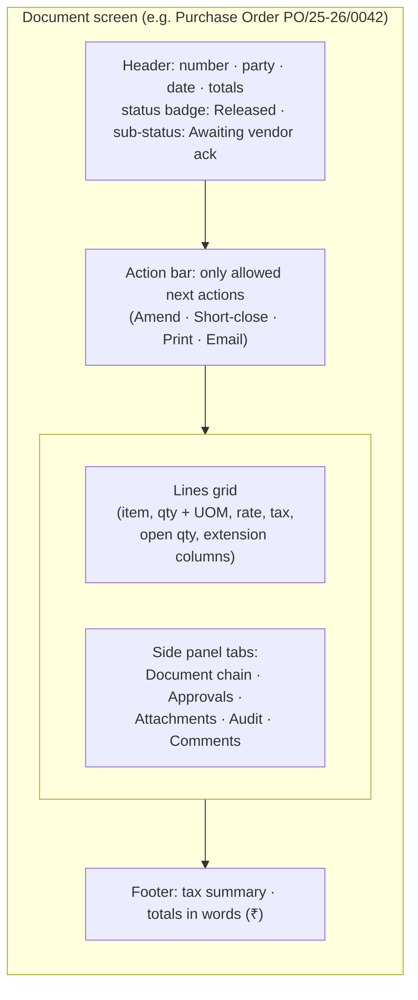

# UX Architecture

> **Status:** Accepted (founder, 2026-10-04) · **Last updated:** 2026-10-04
> **Covers:** brief §19 (modern, fast, responsive, clean, information-dense, configurable, role-aware UI). Supports blueprint parts #1 Product Architecture and #5 Module Architecture.
> **Builds on:** role-aware navigation ([Step 3 §9.3](../01-discovery/STEP-03-MODULE-BOUNDARIES.md#93-role-aware-navigation)), hybrid UI ([ADR-0027](../adr/ADR-0027-HYBRID-UI-AND-TERMINOLOGY.md)), frontend stack ([ADR-0056](../adr/ADR-0056-FRONTEND-STACK.md)), personas ([Step 4 §3](../01-discovery/STEP-04-PROCESS-ARCHITECTURE.md#3-the-people-personas-in-a-printing-sme))

## TL;DR

- **Two kinds of user, two interaction styles:**
  - **office users:** dense, keyboard-friendly screens
  - **shop-floor users:** big, touch-first, one-task phone screens ("job card in 30 seconds")
- **Each role lands on its own home dashboard.** Menus show only what the role may use. A warehouse user never sees 50 finance menus.
- **Seven screen archetypes** keep everything consistent, and generated screens use the same archetypes: list, document, master, dashboard, inbox, mobile task, wizard.
- **Every document screen has the same anatomy:**
  - a header with **status and sub-status badges**
  - the next allowed actions
  - lines
  - a side panel with links (document chain), approvals, attachments, audit and comments
- **Global search (Ctrl+K)**, a notification centre, Indian formats (₹, lakh/crore, DD-MM-YYYY), accessibility (WCAG 2.2 AA target) and performance budgets.

---

## 1. Principles

| # | Principle | In practice |
| --- | --- | --- |
| 1 | **Role first** | Home dashboard and menus per role; terminology per industry ("Job") |
| 2 | **Information-dense for office users** | Compact tables, inline totals, keyboard shortcuts, saved filters, bulk actions |
| 3 | **Touch-first for the shop floor** | Large controls, one task per screen, scan/select instead of typing, works on a ₹10,000 Android phone |
| 4 | **Status is always visible** | Badges for core state + sub-status; "what's next" actions only when allowed |
| 5 | **Never lose work** | Drafts autosave; idempotent submits; clear conflict messages ("changed by Ramesh — reload") |
| 6 | **Explain, don't block silently** | Validation messages say what and why; approvals show who is pending |
| 7 | **Consistency through archetypes** | Crafted and generated screens share one design system |
| 8 | **Local by default** | ₹, lakh/crore, DD-MM-YYYY, Indian financial year, GSTIN formats |
| 9 | **Accessible** | WCAG 2.2 AA target: contrast, keyboard navigation, labels, focus |
| 10 | **Fast** | Budgets in §5 |

## 2. Screen archetypes

| Archetype | Used for | Key elements |
| --- | --- | --- |
| **List** | All documents and masters | Filters, saved views, column chooser (personal), bulk actions, export (if permitted), totals row |
| **Document** | PO, GRN, SO, invoice, job… | Header, lines grid, side panel, action bar, status badges |
| **Master** | Party, item, die… | Tabs per facet (only active modules), history, related documents |
| **Dashboard** | Role home pages | KPI tiles with drill-down, "my tasks", alerts |
| **Inbox** | Approvals and tasks | Queue, decision screen with "what changed", bulk approve within limits |
| **Mobile task** | Job card, GRN with reels, issue, count | Single task, big buttons, scan/select, offline-tolerant retries |
| **Wizard** | Onboarding, imports, period tasks | Steps, validation report, confirm |

## 3. Document screen anatomy

## 4. Role home dashboards (Printing package defaults)

| Role | Home shows |
| --- | --- |
| Owner | Today's dispatches, pending approvals, receivables/payables ageing, wastage %, job profitability, cash position (from open items) |
| Sales | My enquiries/quotations, pending orders, customer overdue |
| Planner | Job board by status, machine queue, material shortages, job work pending |
| Store keeper | Today's expected receipts, pending issues, quarantine items, reel register |
| Operator (device) | My machine's queue → tap a job → job card |
| QC | Inspections pending (incoming / final) |
| Dispatch | Ready-for-dispatch jobs, e-invoice/e-way queue status |
| Accountant | Bills to book, receipts to record, Tally export status, GST summaries |

## 5. Performance budgets

| Interaction | Budget |
| --- | --- |
| First load (cached app shell) on 4G | < 3 s |
| Screen navigation | < 1 s |
| Search results (Ctrl+K) | < 500 ms |
| Save / post a document | < 1 s (server) |
| Job card submit on phone | < 1 s; queued retry if the network drops |

## 6. Cross-cutting UI features

- **Global search (Ctrl+K)** across documents, parties, items and jobs ([ADR-0051](../adr/ADR-0051-REPORTING-AND-SEARCH.md)).
- **Notification centre** with deep links ([ADR-0045](../adr/ADR-0045-NOTIFICATION-ENGINE.md)).
- **Print preview** with copy selection (original/duplicate/triplicate).
- **Keyboard shortcuts** for office screens (new line, save, submit, next field).
- **Help links** from each screen to the user-guide page.
- **Empty states** that teach ("No GRNs yet — receive goods against a PO").

## Decisions

| ADR | Decision | Status |
| --- | --- | --- |
| [ADR-0067](../adr/ADR-0067-UX-ARCHITECTURE.md) | UX principles; seven archetypes; document screen anatomy; role home dashboards; performance budgets; touch-first shop floor | **Accepted** (2026-10-04) |

## Open questions raised

[Q-65](../tracking/OPEN-QUESTIONS.md#q-65) UX architecture

## Related documents

[Blueprint](BLUEPRINT.md) · [Step 9 §8 — frontend stack](../01-discovery/STEP-09-TECHNICAL-ARCHITECTURE.md#8-frontend)
