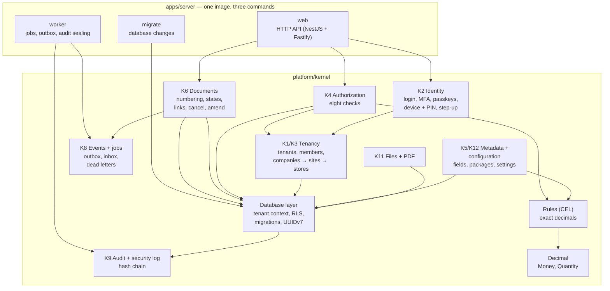
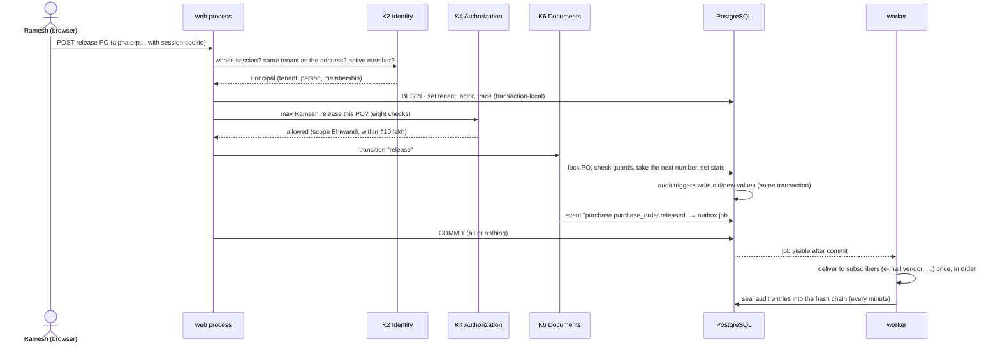
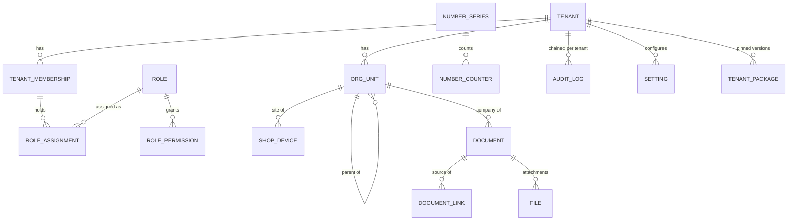

# Kernel Minimum — what is built and how it works

> **Status:** Built and tested (Phase 1, part 3) · **Last updated:** 2026-10-04
> **Plan:** [Roadmap §2](../02-blueprint/ROADMAP-AND-MVP.md#2-phase-1--foundations-and-spikes) · **Code:** `platform/kernel/`, `apps/server/` · **Guide:** [Developer Guide](DEVELOPER-GUIDE.md)

## TL;DR

- The **kernel** is the set of platform services every screen and module relies on (Step 1 §3, K1–K12). The minimum needed before Slice 0 is now **built, tested on real PostgreSQL 16, and running as a server**.
- **What exists:**
  - customer accounts (tenancy), companies, sites and warehouses
  - login with two-factor codes, passkeys, company SSO and a **shop-floor tablet + PIN**
  - permissions (the **eight checks**)
  - a tamper-evident **audit trail**
  - **gapless GST numbering**
  - the **document framework** (states, posting, cancel, amend, links, open quantities)
  - **events and background jobs**
  - the **rules language** with exact money
  - **extension fields**, **configuration packages**, runtime settings
  - **files**, **PDF output**
  - the **server** (web, worker, migrate)
- **154 kernel and server tests** pass (211 including the spikes). They include:
  - 16 authorization cases
  - 25 concurrent invoice postings without number gaps
  - tamper detection of the audit trail
  - a full HTTP sign-in
- **Not yet built:**
  - the approval workflow engine
  - notifications
  - the cloud file-storage adapter
  - the Docker image

  These come with Slice 0, which needs them first. See §5.

---

## 1. The kernel on one page

## 2. The life of one request

Example: Ramesh, the purchase manager at Bhiwandi, releases a purchase order.

If anything fails before COMMIT (a guard, a validation, a database error), **nothing** happens:
- no state change
- no number used
- no audit entry
- no event

## 3. The services, one by one

### 3.1 Database layer and tenant isolation (ADR-0035, 0047–0049, 0052)

| What | How |
| --- | --- |
| **Tenant context** | `withTenant(db, ctx, work)` runs `work` in one transaction after setting tenant, person, actor and trace id as **transaction-local** settings. They vanish at commit, so a pooled connection can never carry one company's context into another request. |
| **Row-Level Security** | Every tenant table has a policy `tenant_id = current tenant`. No tenant set means **no rows** (fails closed). Writing a row for another tenant is rejected by the database. |
| **Application role** | The app connects as a member of `erp_app`, which owns nothing and cannot bypass RLS. **The server refuses to start** if its database role is a superuser, an owner or able to bypass RLS. |
| **Suspended tenants** | Read-only (`mode: "read"` opens a READ ONLY transaction); cancelled tenants have no access (ADR-0063). |
| **Migrations** | Plain SQL files, applied once, in order, inside a transaction, with a checksum. Changing an applied file is an error. |
| **IDs** | UUIDv7: time-ordered, unique, generated in the application (and in SQL for defaults). |
| **Optimistic locking** | Every editable row has a `version`; a stale edit is refused with "changed by someone else — reload". |

### 3.2 Tenancy and organisation (K1/K3, ADR-0004, ADR-0069)

- **Tenant** = the customer account (also the sub-domain, e.g. `sharma.erp…`). Statuses: demo, onboarding, active, past due, suspended, cancelled, deleted.
- **Membership** links a person to a tenant. One person can belong to several tenants (a CA serving three printers), with **one login**.
- **Organisation units** form a typed tree: grouping → company → site → warehouse → location (plus work centres, departments, cost centres). Wrong placements are refused, e.g. a warehouse directly under a company.

### 3.3 Identity (K2, ADR-0032, ADR-0058, ADR-0069)

| Feature | Rule |
| --- | --- |
| Sign-in | Only on the tenant's own address, and only for active members. A cookie from one tenant is useless on another's address. |
| Who creates accounts | An admin invites people. **There is no public sign-up.** |
| Passwords | At least **15 characters** (a short sentence), or 8 with two-factor login. Common passwords are refused. Stored with **Argon2id**. |
| Two-factor login | Authenticator app (TOTP) with backup codes. **Required for privileged roles**: until enrolled, they can only reach the enrolment page. |
| Passkeys | Registration is available. The full browser ceremony is tested in Slice 0. |
| Company SSO | OIDC (e.g. Microsoft Entra ID, Google Workspace), configured per customer. |
| **Shop-floor tablet** | Registered device (token stored hashed) + employee code + **6-digit PIN**. Locked for 15 minutes after 5 wrong PINs. The session only works for shop-floor roles at **that site**. |
| **Step-up** | Before sensitive actions the person re-enters their password; the time is stamped on the session (valid 5 minutes). |
| Logging | Every sign-in, failure, device sign-in and step-up goes to the **security log**. |

### 3.4 Authorization — the eight checks (K4, ADR-0033, ADR-0034)

| # | Check | Example refusal |
| --- | --- | --- |
| 1 | Tenant and active membership | Session from another company |
| 2 | Module in the subscription | "Accounting is not part of this subscription" |
| 3 | Role permission (`module.object.action`, wildcards) | Purchase manager opening invoices |
| 4 | Scope: tenant / company / site / warehouse (inherited downwards) / own / assigned / party | Bhiwandi buyer approving a Vapi PO |
| 5 | Record condition (CEL) | Editing a quotation that is no longer a draft |
| 6 | Field security | Store keeper never receives prices; `redactFields` removes them from every response |
| 7 | Approval authority | ₹12 lakh PO above a ₹10 lakh limit → "route to the next approver" |
| 8 | Segregation of duties (block / warn / allow) | The person who submitted a PO cannot approve it |

- Everything is **denied unless allowed**, and refusals go to the security log.
- **Limits:** an approval limit is set on the exact permission. A wildcard permission without a limit (the owner's `*`) means unlimited authority.

### 3.5 Document framework (K6, ADR-0005, 0006, 0007, 0029)

| Capability | Behaviour |
| --- | --- |
| **Core lifecycle in code** | Each document type declares its states and transitions. Configuration may add **sub-statuses** and **extra guards** (from packages), never remove core ones. |
| **Numbering** | Series per document type, company and optional site; tokens `{FY}`, `{SEQ:n}`, …; yearly reset (Indian April–March FY). **Statutory numbers are allocated inside the posting transaction**, so a failed posting never uses up a number. Tested with 25 simultaneous postings, every fifth failing: numbers 1–20, no gaps. The India pack's **16-character GST rule** is enforced. Numbering can continue from a legacy system's last number. |
| **Immutability** | Once a document leaves its editable state, the **database** refuses edits and deletion. Module line tables get the same guard. |
| **Cancel** | Needs a reason. It is refused while a non-cancelled follow-on document exists ("cancel GRN/26-27/0001 first"). |
| **Amend** | Creates a new revision with the same number; the old revision is kept unchanged. |
| **Links** | `created_from`, `fulfils`, `settles`, `references`. **Open quantity = ordered − fulfilled by posted, not cancelled documents.** |
| **Events** | Every creation and transition raises `<module>.<object>.<past tense>`. |

### 3.6 Audit trail and security log (K9, ADR-0036)

- **Database triggers** record every change, so code cannot forget or skip it. For each change they store:
  - field-level old → new values
  - the person and actor (user, device, automation, support)
  - the reason
  - the trace id
- The record is written **in the same transaction** as the change. Secrets such as PIN hashes are never recorded.
- The application cannot write, change or delete audit entries; a database guard blocks changes even by the owner.
- Every minute the worker **seals** new entries into a per-tenant **SHA-256 hash chain**. If someone disables the guard and edits an entry, verification reports the exact position.
- The **security log** is separate and append-only, and the application cannot read it back.

### 3.7 Events and background jobs (K8, ADR-0040, 0041, 0043)

- **Envelope:** CloudEvents with tenant, W3C trace, causation and actor.
- **In-transaction subscribers** run inside the business transaction, for reactions required for a valid state.
- **After-commit subscribers** become jobs **in the same transaction** (the transactional outbox), so a rolled-back change sends nothing.
- **Delivery:**
  - at least once
  - **in order per document**
  - exactly-once processing per consumer, through the **inbox**
- Failing jobs retry with back-off, then go to the **dead-letter list**; they can be replayed once the cause is fixed.
- **Loop protection:** an automation chain stops after 5 hops.

### 3.8 Rules language (ADR-0028, ADR-0068)

- CEL expressions such as `doc.total > 50000 && party.msme` use an **exact `decimal` type**, so money never becomes floating point.
- Rules are checked **when configuration is saved**: syntax, types, size and depth limits.
- A condition must return true or false; anything else is an error, never a silent "false".
- About 4 µs per evaluation.

### 3.9 Extension fields, packages and settings (K5/K12, ADR-0011, 0024–0026, 0030)

| Part | What it does |
| --- | --- |
| **Extension fields** | E.g. "GSM" on paper items. Typed (decimal with precision, picklist, money, quantity, reference, computed, …). Conditions say when a field applies or is required. Messages are clear ("must be at most 600"). |
| **Packages** | YAML folders (India, Printing & Packaging, tenant baseline), validated by JSON Schema, versioned with SemVer, with dependency and platform checks. |
| **Merge rules** | **Override** (terminology, settings, numbering patterns), **extend** (fields, sub-statuses, guards), **lock**: the India pack locks the GST numbering rules and invoice round-off, and a tenant package trying to change them is rejected at load time. |
| **Runtime settings** | Resolved site → company → tenant → package → module default; validated, lock-aware, audited, logged. The package versions a tenant runs are **pinned**. |

### 3.10 Files and PDF (K11, ADR-0057)

- Files are stored under tenant-prefixed keys and served only through **signed links that expire**.
- On upload, files are checked by type, real content (magic bytes), extension, size and name.
- Integrity is verified on every read.
- **Statutory outputs** (e.g. tax-invoice PDFs) are marked *retained* and can never be deleted. Stored files are never altered.
- **PDF:** LiquidJS templates (auto-escaped; a tenant can override e.g. branding) are rendered by Chromium with JavaScript disabled.

### 3.11 Server (ADR-0054, ADR-0059)

| Command | Purpose |
| --- | --- |
| `web` | HTTP API. Provides `/health/live`, `/health/ready`, `/api/auth/*` (sign-in, two-factor, passkeys, device PIN, step-up) and `/api/v1/me`. Errors are **RFC 9457 problem details**; cookies are never logged. |
| `worker` | Delivers outbox jobs, seals the audit chain, runs scheduled tasks. |
| `migrate` | Applies kernel and identity migrations with the owner role. |

Configuration comes from environment variables and is checked at start: missing or weak secrets stop the server. The compiled build was smoke-tested end to end: migrate → web → health → me; worker start-up.

## 4. Kernel data model

All tables live in the `kernel` schema (global identities in `identity`), and every tenant table is protected by RLS. Modules will add their own schemas, such as `purchase` and `inventory`, with typed header and line tables keyed by the kernel document id.

## 5. Deliberately not built yet (and when)

| Item | Why not now | When |
| --- | --- | --- |
| Approval workflow engine (K7) | Needs real approval rules from Slice 1 documents | Start of Slice 1 (moved, IMPL-03) |
| Notification engine (K10: in-app + e-mail) | First notifications come with purchase orders | Slice 1 |
| Cloud file storage adapter (S3-compatible) | Needs the hosting account; local storage covers development | Before the pilot ([TD-12](../tracking/TECH-DEBT-REGISTER.md)) |
| Sweep of orphaned files after rolled-back uploads | Rare; harmless until storage costs matter | Slice 1 ([TD-13](../tracking/TECH-DEBT-REGISTER.md)) |
| Shared rate-limit store (now in memory, per process) | One web process in the pilot | Before running 2 web containers ([TD-14](../tracking/TECH-DEBT-REGISTER.md)) |
| Docker image (Node + Chromium) and staging deployment | Deployment comes with the demo | Image ✅ Slice 0; Chromium in it (TD-18) and staging ([TD-15](../tracking/TECH-DEBT-REGISTER.md)) later |
| List filtering by scope (authorization for queries) | Slice 0 lists are tenant-wide masters; needs the first site-scoped documents | Slice 1 |
| OpenAPI generation, Idempotency-Key header | Needs the first business endpoints | OpenAPI ✅ Slice 0; Idempotency-Key Slice 1 (TD-16) |
| Breached-password check against the online list | Network policy of the hosting; an offline list of the most common passwords is in place | Pilot |

## 6. Bugs found and fixed while building

The tests caught these before anything depended on them:

| Found | Fix |
| --- | --- |
| Number assignment at release was blocked by the immutability guard | The guard allows the number to be set once, only when none exists |
| A job running its last attempt was listed as "dead" | Dead letters exclude running jobs and require a recorded error |
| Forcing RLS on the owner would break provisioning and audit sealing in production | RLS applies to the app role; start-up guard refuses privileged roles |
| Two databases migrating at once raced to create the shared role (seen in CI) | Role creation tolerates a concurrent creation |

## Open questions raised

[Q-68](../tracking/OPEN-QUESTIONS.md#q-68) — one login per person across tenants (built as recommended; can still change).

## Related documents

[Phase 1 Spike Results](PHASE-1-SPIKE-RESULTS.md) · [Developer Guide](DEVELOPER-GUIDE.md) · [Step 6 Security](../01-discovery/STEP-06-SECURITY-ARCHITECTURE.md) · [Step 8 Data](../01-discovery/STEP-08-DATA-ARCHITECTURE.md) · [Roadmap](../02-blueprint/ROADMAP-AND-MVP.md)
