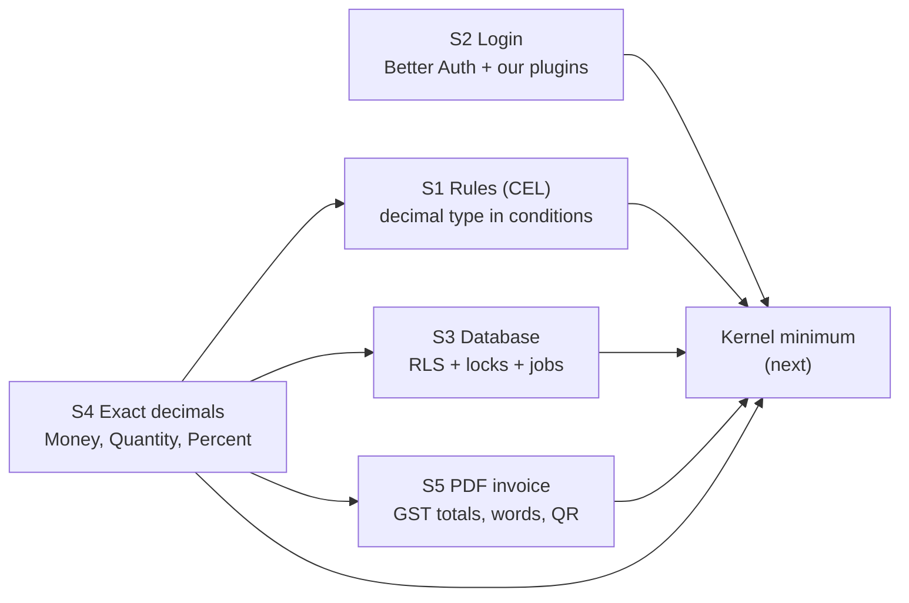
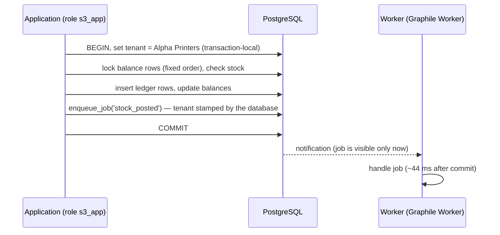
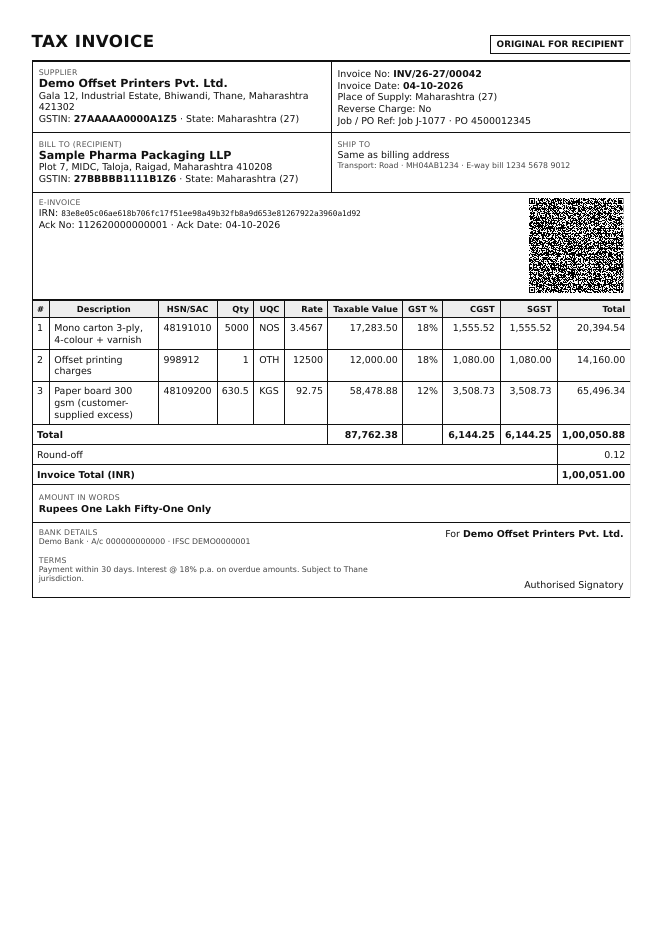

# Phase 1 — Spike Results (S1–S5)

> **Status:** Complete; one choice waiting for the founder ([Q-67](../tracking/OPEN-QUESTIONS.md#q-67)) · **Last updated:** 2026-10-04
> **Plan:** [Step 9 §11](../01-discovery/STEP-09-TECHNICAL-ARCHITECTURE.md#11-spikes-to-run-before-implementation-starts) · [Roadmap Phase 1](../02-blueprint/ROADMAP-AND-MVP.md#2-phase-1--foundations-and-spikes)
> **Code:** `spikes/` (experiments) and `platform/kernel/src/decimal/` (S4 result, now production code)

## TL;DR

- A **spike** is a short experiment that turns a technical "we think so" into "we measured it". All five spikes ran on real software: PostgreSQL 16, headless Chromium, and the actual libraries.
- **All five passed.** No fallback plan was needed.

  | Spike | Question | Answer |
  | --- | --- | --- |
  | **S1** Rules language (CEL) | Is there a good JavaScript CEL library? | **Yes, with a trade-off.** Recommended: `@marcbachmann/cel-js`, because it can do **exact money arithmetic** (87% of the official core tests). Fallback: `@bufbuild/cel` (99%, but money only as floating point). **Founder decision [Q-67](../tracking/OPEN-QUESTIONS.md#q-67).** |
  | **S2** Login library | Does Better Auth cover our security requirements? | **Yes.** Argon2id, two-factor codes, passkeys, company login (OIDC), rate limiting work out of the box. Shop-floor PIN login and step-up re-authentication are possible as small plugins of our own. |
  | **S3** Tenant isolation + jobs | Do database security, transactions and background jobs work together? | **Yes.** Company A can never see company B's data, even through programming mistakes. A job is created only if the business transaction commits, and it starts within ~44 ms. Stock never goes negative under 50 simultaneous users. |
  | **S4** Exact money | Can TypeScript handle money and quantities exactly? | **Yes**, with our own `Decimal` / `Money` / `Quantity` types. More than 20,000 random checks show no rounding errors. GST rounding is correct. This is now production code in the kernel. |
  | **S5** PDF invoices | Can we produce Indian tax invoices fast enough? | **Yes.** A 3-copy GST invoice with e-invoice QR takes **~0.2 s** (target 2 s). The worker needs about **1 GB of memory** because of the browser engine. |

- **One founder decision:** the CEL library ([Q-67](../tracking/OPEN-QUESTIONS.md#q-67)). Everything else confirms decisions already accepted.
- **Next:** the **kernel minimum** (Phase 1, part 3): tenancy, identity, authorization, audit, numbering, documents, events/jobs, configuration loader.

---

## 1. How the spikes fit together

S4 came first because every other spike handles money. The CEL, database and PDF spikes all use the same kernel decimal types.

## 2. S4 — Exact money and quantities (mandatory)

**Problem in plain words:** computers normally store numbers like 0.1 approximately. In JavaScript, `0.1 + 0.2` gives `0.30000000000000004`, and `(1.005).toFixed(2)` gives `"1.00"` instead of `"1.01"`. In accounting, such errors add up and make books not balance.

**What we built** (`platform/kernel/src/decimal/`, now production code):

| Type | Example | Rules |
| --- | --- | --- |
| `Decimal` | `"58478.875"` | Created only from text (or whole numbers), never from a JavaScript number. Adding, subtracting and multiplying are exact. Dividing and rounding always state **how many digits** and **which rounding rule**. |
| `Money` | ₹1,234.50 | Amount + ISO 4217 currency; refuses to add rupees to dollars; prints `"1234.50"` but **never rounds silently**. |
| `Quantity` | 630.5 KGM | Value + unit; refuses to add kg to sheets; converts with an explicit factor (1 ream = 500 sheets). |
| `Percent` | 18 % | Exact share; `half()` gives CGST/SGST rates. |
| `allocate()` | ₹100 → 33.34 + 33.33 + 33.33 | Splits freight or discounts so the parts always add up to the total. |

**How it was proven:**

- 44 kernel tests plus 5 GST tests. They include **property-based tests**: thousands of random numbers checked against rules such as "a + b − b = a" and "allocated parts always sum to the total".
- Division is checked in all **six rounding modes** against an independent calculator built from whole-number arithmetic, with 18,000 random cases.
- **These tests found a real bug in the first version**, a wrong comparison when deciding to round up. It was fixed before anything depended on it. This is exactly why the spike demanded property tests.
- **Database leg** (in S3): PostgreSQL `NUMERIC` values of 18 digits + 6 decimals come back as text, exactly.
- **API leg:** JSON Schema 2020-12 rejects `12345.5` sent as a JSON number and accepts `"12345.50"` as text.
- **Screen leg:** `formatMoney` prints ₹9,99,99,99,99,99,99,99,999.99 with lakh/crore grouping, without converting to a binary number.

**GST rounding (spike folder; moves to the India pack in Slice 3):**

| Case | Result |
| --- | --- |
| 5,000 cartons × ₹3.4567, 18%, within Maharashtra | Taxable ₹17,283.50; CGST ₹1,555.52 + SGST ₹1,555.52 (each 9%, rounded per line); total ₹20,394.54 → **₹20,395.00**, round-off +0.46 |
| Same job to Gujarat (IGST 18%) | IGST ₹3,111.03. That is one paisa less than CGST + SGST, which is legal and expected because each tax is rounded separately. |
| Credit note | Exactly mirrors the invoice (negative amounts round symmetrically) |
| 1,000 random invoices | Lines always add up to totals; round-off always within ±₹0.50 |

**Enforcement:**

- The linter blocks `parseFloat` and `toFixed` in business code.
- The decimal library can only be imported inside the kernel's decimal folder.
- The boundary checker also guards this.

## 3. S3 — Tenant isolation, transactions and background jobs

**Problem in plain words:** many companies share one database. A single programming mistake must never show company A's stock to company B. Also, when a goods receipt is saved, follow-up work (notifications, Tally export) must happen **if and only if** the save succeeded.

**What we built (spike):**

- A PostgreSQL schema with an append-only **stock ledger** and a derived **stock balance**, both protected by **Row-Level Security (RLS)**.
- The application connects as an **unprivileged database role**, exactly like production.
- Every unit of work runs in a transaction that first sets the tenant; the setting disappears at commit.

**Results (10 tests on PostgreSQL 16, repeated 3× with the same result):**

| Check | Result |
| --- | --- |
| Each tenant sees only its own rows | ✅ |
| No tenant set → **zero rows** (fails closed) | ✅ |
| Writing a row "for another tenant" | ✅ Rejected by the database |
| Tenant setting leaking to the next request on a reused connection | ✅ Never |
| Application role updating or deleting posted ledger rows | ✅ "Permission denied" (immutability, ADR-0007) |
| Transaction rolled back → its job disappears too | ✅ |
| Job payload pretending to be another tenant | ✅ Overwritten with the real tenant |
| Commit → job handler latency | **44 ms** |
| 50 people issuing the last 30 printing plates at the same moment | ✅ Exactly 30 succeed, 20 get "insufficient stock", balance ends at 0 |
| 40 multi-item documents in random order at once | ✅ No deadlocks (rows are locked in a fixed order) |

**Design improvement found by the spike:**

- Graphile Worker's own "add job" function runs with the caller's rights.
- So we wrap it in a small database function, `enqueue_job`, that runs with the owner's rights and **takes the tenant from the transaction**.
- Application code therefore cannot create a job for another company, and needs no access to the job tables at all.

## 4. S1 — The rules language (CEL)

**Problem in plain words:** configuration contains conditions written by implementers, such as:

- "a purchase order above ₹50,000 needs the owner's approval"
- "a store keeper sees only their own sites"

Step 5 chose **CEL**, a small and safe language for this (ADR-0028). JavaScript CEL libraries are young, so we measured them.

**How:** we ran the **official CEL conformance tests** (Google's cel-spec, 1,400 tests that need no protobuf messages) against three libraries. We then ran our own ERP expressions.

| Library | Core language tests (1,025) | All applicable (1,400) | Exact decimal type | Parse-time limits | Maintainer |
| --- | --- | --- | --- | --- | --- |
| `@bufbuild/cel` | **1,018 (99.3%)** | 1,045 | ❌ No custom types without protobuf; money must be a floating-point number | ❌ (we would add our own) | Buf (company) |
| `@marcbachmann/cel-js` | 891 (86.9%) | 975 | ✅ **Our `Decimal` as a CEL type with exact `+ − × < > ==`** | ✅ size, depth, list limits | One maintainer, very active |
| `cel-js` | — | 462 (33%) | ❌ | ❌ | Older; no integer type |

**Where `@marcbachmann/cel-js` falls short:**

- Mostly edge cases our configuration does not use: lists mixing types (`[1, 'a']`), byte strings, and cross-type numeric equality (`1.0 == 1`).
- It handles all 13 of our ERP expressions, including `doc.total > 50000` with exact decimals and `doc.lines.all(l, l.qty > decimal('0'))`.

**Speed:**

- 3.7 µs per evaluation of a parsed rule, i.e. 270,000 rows per second for record rules on list screens.
- A 40,000-step nested condition takes 26 ms.

**Recommendation ([ADR-0068](../adr/ADR-0068-CEL-LIBRARY.md), Proposed, [Q-67](../tracking/OPEN-QUESTIONS.md#q-67)):**

- Use **`@marcbachmann/cel-js`** behind a kernel `RuleEngine` port, with the exact `decimal` type and parse limits.
- Keep `@bufbuild/cel` as the documented fallback.
- Run the ERP suite and the conformance gate (≥ 85% core) in CI on every library upgrade.

## 5. S2 — Login (Better Auth)

**Problem in plain words:** login security is easy to get wrong and expensive to build. We checked whether Better Auth gives us what Step 6 decided.

| Requirement (Step 6 / ADR-0032) | Result | How |
| --- | --- | --- |
| Password hashing: Argon2id (OWASP parameters) | ✅ | Custom hash hook with `@node-rs/argon2`; stored as `$argon2id$v=19$m=19456,t=2,p=1$…` |
| NIST 800-63B: minimum length, no composition rules | ✅ | Minimum 8, maximum 128 |
| Two-factor codes (TOTP, authenticator app) + backup codes | ✅ | Enrolment, then sign-in stops at "enter code"; a wrong code is rejected |
| Passkeys (WebAuthn) | ✅ registration API | Full browser ceremony to be tested in Slice 0 with Chromium's virtual authenticator |
| Login with a customer's identity provider (OIDC) | ✅ | Authorization code + PKCE (S256), `openid` scope, `state` |
| Brute-force protection | ✅ | 5 attempts per minute, then HTTP 429 |
| **Shop-floor tablet: device + employee code + PIN** | ✅ **custom plugin** | Registered device token (stored hashed) + Argon2id PIN; same error for every failure; session marked `device-pin` with its site |
| **Step-up re-authentication** before sensitive actions | ✅ **custom plugin** | Re-enter password → `stepUpAt` stamped on the session; our authorization checks it is under 5 minutes old |
| No data leaves India | ✅ | Telemetry is opt-in in Better Auth; we also switch it off explicitly |

**Finding:**

- Better Auth's built-in "fresh session" only looks at when the user logged in, so it cannot serve as step-up.
- A small plugin of ours covers it. Both custom plugins were easy to write, which shows that extending Better Auth is practical.

**Conclusion:** keep Better Auth (ADR-0058). The fallback (composed libraries) is not needed.

## 6. S5 — PDF tax invoices

**Problem in plain words:** an invoice must look exactly right on paper, follow GST rules, and print quickly even for long jobs.

**What we built:**

- HTML template (LiquidJS) → headless Chromium → PDF.
- The invoice contains the details CGST **Rule 46** asks for: supplier and recipient GSTIN, invoice number ≤ 16 characters, place of supply, HSN, UQC, taxable value, CGST/SGST or IGST, and reverse-charge flag.
- It has **three copies (Rule 48)**: original for recipient, duplicate for transporter, triplicate for supplier.
- It includes the e-invoice IRN and QR code, plus the amount in words in lakh/crore.

Full PDF: [sample-tax-invoice.pdf](assets/sample-tax-invoice.pdf). It uses fictional parties, and the QR is simulated: in production it is the signed QR returned by the government's IRP through the GSP.

| Measure | Result | Target |
| --- | --- | --- |
| 3-copy invoice, warm worker | **median ~200 ms, p95 < 400 ms** | < 2 s |
| 150-line job invoice (21 pages, headers repeat on each page) | ~1.1 s | — |
| PDF size | 145 KB (3 pages) | — |
| Browser memory | ~230 MB idle, ~270 MB peak after 30 documents (no growth) | — |
| Data like `<script>` in a customer name | Printed as text; JavaScript is also switched off in documents | Safe |

**Consequences:**

- The **worker container needs about 1 GB of memory** (Node.js + Chromium). This fits the pilot budget in [Step 9A §9](../01-discovery/STEP-09A-INFRASTRUCTURE-DEVOPS-AND-COSTS.md) ("containers ₹900–2,200").
- An option for later: start the browser on demand and close it when idle.
- Typst (the fallback) is not needed.

## 7. What moves into production code, and when

| Result | Where it goes | When |
| --- | --- | --- |
| Decimal / Money / Quantity / Percent | `platform/kernel/src/decimal` | **Done** |
| `withTenant`, `enqueue_job`, unprivileged app role, ordered locks | `platform/kernel` (tenancy, events/jobs) and the inventory module | Kernel minimum |
| Better Auth configuration + device-PIN + step-up plugins | `platform/kernel` (identity) | Kernel minimum |
| CEL `RuleEngine` port with the `decimal` type | `platform/kernel` (rules) | Kernel minimum, after Q-67 |
| Invoice PDF renderer, amount in words | `platform/kernel` (documents/PDF) + India pack template | Kernel minimum / Slice 3 |
| GST rounding | `packages-config/india` | Slice 3 |

## 8. Follow-ups found by the spikes

| Follow-up | Where tracked |
| --- | --- |
| Test the full passkey ceremony with Chromium's virtual authenticator | Slice 0 exit criteria |
| CI has no browser for S5 yet (the test skips there) | [TD-10](../tracking/TECH-DEBT-REGISTER.md) |
| TypeScript 6.0 pinned until the lint tooling supports TypeScript 7 | [TD-11](../tracking/TECH-DEBT-REGISTER.md) |
| Confirm the e-invoice (IRP) rounding tolerances against the official schema | Slice 3 (with the GSP sandbox) |
| CEL library has one maintainer | [R-32](../tracking/RISK-REGISTER.md) updated |

## Decisions

| ADR | Decision | Status |
| --- | --- | --- |
| [ADR-0068](../adr/ADR-0068-CEL-LIBRARY.md) | CEL library: `@marcbachmann/cel-js` with an exact `decimal` type behind a `RuleEngine` port; fallback `@bufbuild/cel` | **Proposed** |
| ADR-0053, 0055, 0057, 0058, 0059 | Confirmed by the spikes; implementation notes added | Accepted |

## Open questions raised

[Q-67](../tracking/OPEN-QUESTIONS.md#q-67) — which CEL library.

## Related documents

[Developer Guide](DEVELOPER-GUIDE.md) · [Step 9](../01-discovery/STEP-09-TECHNICAL-ARCHITECTURE.md) · [Roadmap & MVP](../02-blueprint/ROADMAP-AND-MVP.md) · [Tech-Debt Register](../tracking/TECH-DEBT-REGISTER.md)
