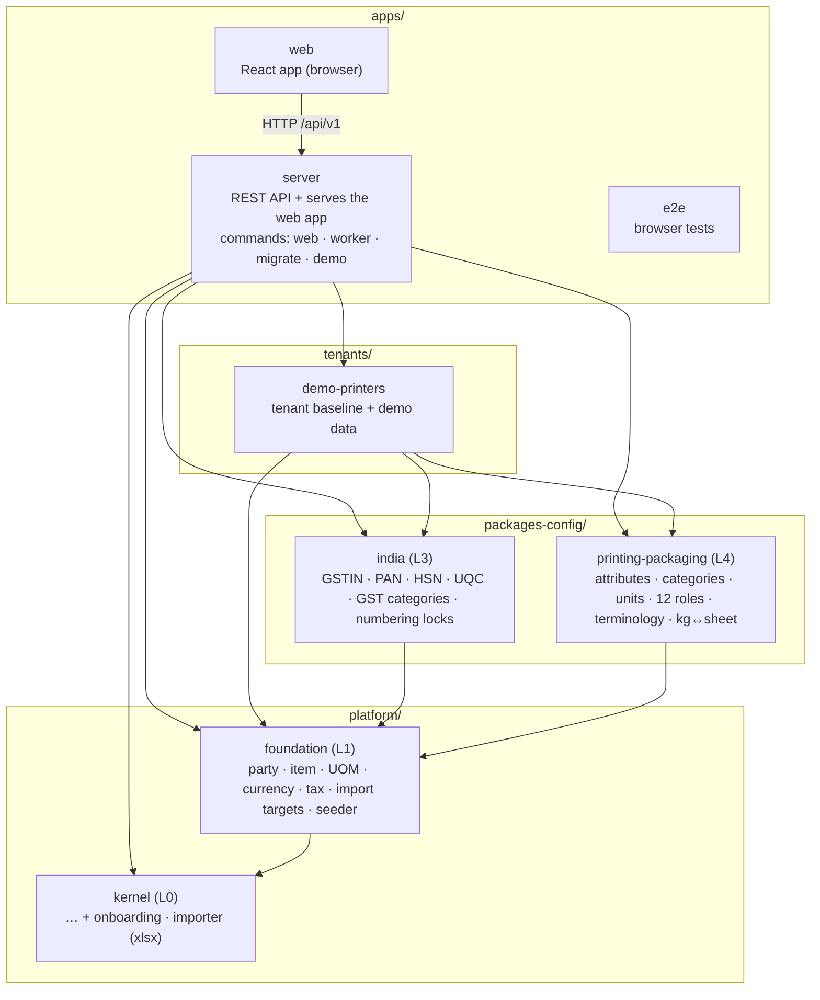
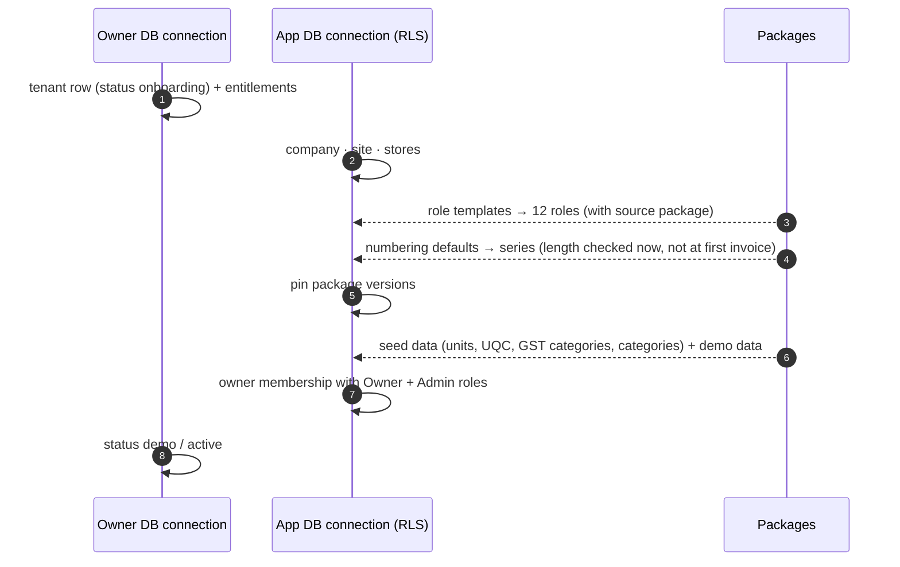
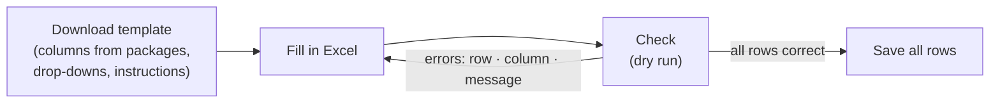

# Slice 0 — Foundation: what is built and how it works

> **Status:** Built (2026-10-04) · **Last updated:** 2026-10-04
> **Scope:** [Roadmap §4, Slice 0](../02-blueprint/ROADMAP-AND-MVP.md#4-phase-wise-feature-breakdown-slices-with-exit-criteria) · decision [IMPL-03](../tracking/DECISION-LOG.csv)
> **Builds on:** [Kernel Minimum](KERNEL-MINIMUM.md) · [Step 5A](../01-discovery/STEP-05A-PACKAGES-UPGRADES-AND-ONBOARDING.md) (packages, onboarding) · [UX Architecture](../02-blueprint/UX-ARCHITECTURE.md) · [API Architecture](../02-blueprint/API-AND-INTEGRATION-ARCHITECTURE.md)

## TL;DR

- **All five Slice 0 exit criteria pass**, three of them as end-to-end tests in a real browser against the built server:

  | Exit criterion | Proof |
  | --- | --- |
  | A demo tenant is created from packages | `node main.js demo`; tests in `tenants/demo-printers` and the e2e global setup |
  | Masters are imported from Excel | e2e "masters are imported from Excel" + import tests (kernel, foundation, tenant) |
  | MFA works for the owner | e2e "the owner must set up two-step sign-in …" and "next time …" |
  | A store keeper on a tablet sees only their screens | e2e "a store keeper on a tablet sees only their screens" |
  | Cross-tenant and authorization tests are green | kernel, server and API tests (RLS, sub-domain binding, eight checks) |

- **What exists now:**
  - the **foundation layer**: parties, items, units of measure, currencies, tax categories
  - the **India pack** v0.1 and the **Printing & Packaging package** v0.1
  - a **demo tenant baseline** ("Demo Printers Pvt Ltd")
  - **onboarding**: a tenant from packages, people and roles, a checklist
  - **Excel import**
  - a **REST API** with OpenAPI 3.1
  - the **web app**
  - **one Docker image**
- **Tests:**
  - `pnpm check` runs **285 tests** (unit, property-based, PostgreSQL).
  - `pnpm --filter @master-erp/e2e e2e` runs **6 browser tests**.
  - CI runs both and builds the image.
- **Deliberately moved:** the approval and notification engines go to the start of Slice 1, where they are first used (IMPL-03).

---

## 1. The layers, as built

Arrows mean "may import". These boundary rules are new and the build enforces them (`pnpm boundaries`):

- **Packages never import each other.** The industry package stays country-neutral, and the India pack stays industry-neutral (ADR-0002).
- **A tenant baseline combines them.** Nothing in `platform/`, `modules/` or `packages-config/` may import `tenants/`.

**Example.** The Printing package knows that board has a **GSM** (grams per square metre). It does not know that board's HSN code is 4810 or that its GST rate is 18%. That combination belongs to the business, so it lives in `tenants/demo-printers`.

## 2. The foundation layer (L1)

| Master | What it holds | Notable rules |
| --- | --- | --- |
| **Currency** | ISO 4217 reference (global, 19 codes) | Minor units (OMR has 3) |
| **Unit of measure** | Code, dimension, decimals, UN/ECE Rec 20 code, GST UQC | Conversions are general ("1 ream = 500 sheet") or **item-specific** ("1 kg = 4.76 sheet for this board"); found by path search up to 3 steps |
| **Tax category** | GST 0/5/18/40 %, exempt, non-GST; **effective-dated rates** | A rate change keeps history (the 22 Sep 2025 change) |
| **Item category** | Item type, default unit, HSN, tax category | Items inherit the defaults |
| **Party** | One master with **roles** (customer, vendor, transporter, job worker), tax ids, addresses, contacts | All problems reported at once; duplicate GSTIN refused with "already belongs to X"; GSTIN state must match an address |
| **Item** | Code (auto per category: `BOARD-0001`), category, type, unit, HSN/SAC, owner customer, **attribute set** (extension fields) | Attributes follow the category; computed fields shown, never stored |

Country rules plug in through `LocalizationRules`: tax-id schemes, the HSN/SAC check, postal codes, region names and region parsing. The foundation itself contains no Indian logic.

## 3. The packages

### 3.1 India pack v0.1 (`packages-config/india`)

- **Identifiers**
  - PAN: format and holder type.
  - GSTIN: format, mod-36 check character, PAN inside the GSTIN, state code.
  - PIN code; HSN (4, 6 or 8 digits) and SAC (6 digits, starting 99).
  - A property test shows that **every single-character typo in a GSTIN is caught**.
- **States:** GST state codes ↔ ISO 3166-2:IN codes. People can type "Maharashtra", "27" or "IN-MH".
- **Tax categories:** GST rates from 22 Sep 2025, plus UQC codes for the units.
- **Locks:** invoice numbering is at most 16 characters, uses only letters, digits, `/` and `-`, has no gaps and resets each financial year (CGST Rule 46). Invoice round-off is also locked.

### 3.2 Printing & Packaging package v0.1 (`packages-config/printing-packaging`)

- **Attribute sets** (Step 5A §3):
  - board and paper: GSM, size, grain, caliper, board type, reel width
  - ink: colour and Pantone reference (required when the colour is "pantone")
  - lamination film: type and thickness
- **Computed sheet weight:** `GSM × L × W / 1,000,000` grams.
- **Categories and units:** 11 categories, plus sheet, ream (500 sheets), packet, reel and thousand.
- **Roles:** 12 role templates (Step 6 §9) — Owner, Sales, Estimator, Pre-press, Planner, Operator (tablet), Store keeper (tablet), QC, Dispatch, Purchase, Accountant, plus Admin.
- **Terminology:** "Job" (Hindi: जॉब) and Job sub-statuses.

**The kg ↔ sheet calculator.** Paper is bought by weight and used by the sheet. One sheet of 300 GSM board, 700 × 1000 mm, weighs 210 g, so 1 kg = 4.7619047619 sheets. The calculator stores this as the item's own unit conversion, so stock and costing use the normal unit engine. A property test checks that sheets-per-kg × sheet weight = 1000 g for any size.

### 3.3 How layers combine (seed data)

A seed record with the same `code` in a higher layer is **merged over** the lower one ("override", ADR-0025). The demo tenant uses this to add `defaultHsnSac: "4810"` and `defaultTaxCategory: gst_18` to the Printing package's `board` category without copying it.

## 4. A tenant is born

Everything inside the tenant happens in **one transaction** (`provisionFromPackages`). If it fails, nothing is left half-made.

**The onboarding checklist** is derived from data:

- Are there sites?
- Are people invited?
- Do privileged people use two-step sign-in?
- Do customers, vendors and items exist?

Review steps ("numbering looks right") are confirmed by a person. Each layer contributes its own items.

## 5. Excel import

- **Exactly the real rules.** Every row is saved inside a database **savepoint** through the normal service. A dry run therefore reports exactly what a real import would, then rolls everything back.
- **All or nothing.** A commit saves only when every row is correct.
- **One row per party or item**, Tally-style:
  - The state can be typed in any form, or taken from the GSTIN.
  - Code columns are formatted as text, so HSN `0401` keeps its zero.
- **Limits:** 2 MB and 5,000 rows per file.
- **Library:** exceljs, wrapped in one adapter file so it can be replaced.

## 6. The REST API

| Convention ([API Architecture §2](../02-blueprint/API-AND-INTEGRATION-ARCHITECTURE.md)) | As built |
| --- | --- |
| OpenAPI 3.1 | `/api/v1/openapi.json`, generated from the same `@Api(...)` specs that validate requests, so it cannot drift |
| Validation | TypeBox / JSON Schema; **422** with every field error at once |
| Errors | RFC 9457 problem details (401, 403 with the failed check, 404, 409, 412, 422, 428, step-up) |
| Optimistic locking | `ETag: "v3"`; updates need `If-Match` (**428** without it, **412** when stale) |
| Pagination, filters | `?limit=50&cursor=…&search=…&filter[role]=vendor` |
| Authorization | Every endpoint declares a permission. The eight checks run in the request's transaction. Denials are written to the security log **outside** that transaction, so they survive the rollback |
| Step-up | Adding people or changing roles needs the password again (ADR-0032) |

**Endpoints:**

- `/me`
- parties and items (list, create, get, replace, block/unblock/archive)
- lookups: units, categories, tax categories, form fields per category and language
- imports
- admin: members, roles, organisation, tablets, PINs, settings, numbering, checklist

## 7. The web app

- **Stack:** React with Vite, Tailwind and shadcn-style components, TanStack Router and Query, React Hook Form, i18next (English and Hindi). It is an installable web app with no offline mode (ADR-0056).
- **Office screens:**
  - dense lists with search, filters and "load more"
  - master forms that show the server's field errors next to each field
  - item attributes that follow the category (a generated form renderer, ADR-0027)
  - the import wizard
  - admin screens
- **Shop-floor screens:**
  - one-time tablet setup with a device code
  - employee code + 6-digit PIN on a big keypad
  - big tiles on the home screen, no office menu
- **Menus** show only what the roles allow. The server still checks every request: in the e2e test, typing `/parties` on the store keeper's tablet shows "Not allowed".
- **Hosting:** the server serves the built app on the tenant's sub-domain (one origin, no CORS). Hashed assets are cached for a year.

## 8. One image, and how it is tested

- **Dockerfile:** one image with the commands `web`, `worker`, `migrate` and `demo` (ADR-0059).
  - It runs as a non-root user and has a health check.
  - It keeps the monorepo layout, because Node strips TypeScript types only outside `node_modules`.
  - Verified locally: migrate → demo → web, health check "healthy".
- **CI jobs:** `check` (lint, types, boundaries, 285 tests), `e2e` (browser tests), `image` (Docker build), `security` (gitleaks, audit).

## 9. Decisions taken within accepted ADRs

| ID | Decision | Why |
| --- | --- | --- |
| IMPL-04 | Demo tenant as a **tenant baseline** in `tenants/`; packages independent (boundary rules); seed records merge by `code` | Keeps the industry package country-neutral (ADR-0002) |
| IMPL-05 | kg ↔ sheet as computed sheet weight + an item-specific unit conversion | Stock and costing reuse the unit engine; no special cases |
| IMPL-06 | Excel import: exceljs behind an adapter; savepoint-per-row dry run; all-or-nothing commit | One set of rules; no half-imported masters |
| IMPL-07 | OpenAPI built from our own `@Api` decorator (TypeBox), not `@nestjs/swagger` | One schema for validation and docs; no class-based DTOs |
| IMPL-08 | The server serves the web app (same origin) | One image, no CORS, simpler hosting |
| IMPL-09 | "Installable PWA" = web manifest only, no service worker | No offline mode in the MVP (ADR-0056); avoids caching bugs |
| IMPL-10 | Until invitation e-mails exist (Slice 1), an admin may set a person's first password | No e-mail engine yet; still audited and behind step-up |

## 10. Bugs found and fixed while building

- **Unit codes collided with an index name.** An index named `item_category` clashed with the table of the same name. It was renamed.
- **Tax-id links went missing.** A tax id was not linked to an address without a key. It is now linked by region.
- **Tablet sign-in failed in a real browser.** Better Auth trusted only the base origin, so sign-in from `demo.erp…` would have failed. Tenant sub-domains are now trusted explicitly (found by the browser smoke test).
- **Denied requests vanished from the security log.** They were written inside a transaction that then rolled back. Fixed with `AuthorizationService.decide()` plus logging outside the transaction.
- **PIN length disagreed.** The API schema said 4–8 digits, but the kernel policy is exactly 6. They are now aligned.
- **CEL rejected a ternary that returned "decimal or null".** Computed fields now return null when an input is missing.
- **An idle database connection closed by the server could crash the process.** CI showed this once, as an unhandled error while a test database was dropped. Every pool now has an error listener, and test databases wait for other sessions to disconnect before they are dropped.

## 11. Deliberately not built yet

| Item | When |
| --- | --- |
| Approval engine (K7), notification engine (K10, in-app + e-mail), invitation e-mails | Start of Slice 1 |
| `Idempotency-Key` on create, API rate limits | Slice 1 (first documents) — [TD-16](../tracking/TECH-DEBT-REGISTER.md) |
| List scope filtering by site/store | With the first site-scoped documents (Slice 1) |
| Chromium in the image (PDF printing), smaller image | Slice 1 (first printed document) — TD-18 |
| Staging deployment | Before the pilot — TD-15 |

## Open questions raised

None new. Validation items are in the [decision log](../tracking/DECISION-LOG.csv):

- **IMPL-04:** demo GST rates and HSN codes, to be checked by a chartered accountant.
- **IMPL-05:** sheets by nominal GSM, to be confirmed with a pilot.

## Related documents

- [Kernel Minimum](KERNEL-MINIMUM.md) · [Developer Guide](DEVELOPER-GUIDE.md)
- [Roadmap](../02-blueprint/ROADMAP-AND-MVP.md) · [Step 5A](../01-discovery/STEP-05A-PACKAGES-UPGRADES-AND-ONBOARDING.md) · [Step 6 §9](../01-discovery/STEP-06-SECURITY-ARCHITECTURE.md)
- [UX Architecture](../02-blueprint/UX-ARCHITECTURE.md) · [API Architecture](../02-blueprint/API-AND-INTEGRATION-ARCHITECTURE.md)
