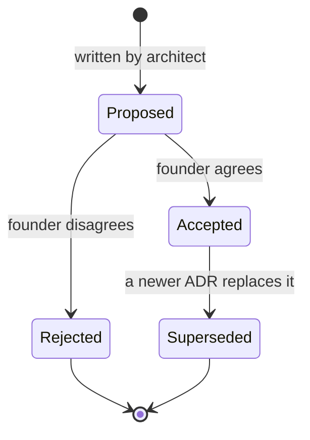

# Architecture Decision Records (ADRs)

> **Status:** Living index · **Last updated:** 2026-10-03

## TL;DR

An ADR records **one** important decision: why it was needed, which options were compared,
what we chose and what it costs us. ADRs are never deleted — a changed decision gets a new ADR
that supersedes the old one. Only the founder moves an ADR from **Proposed** to **Accepted**.

## Index

| ADR | Title | Status | From |
| --- | --- | --- | --- |
| [0001](ADR-0001-DOCUMENTATION-FIRST.md) | Documentation-first, Markdown + Mermaid in the repository | Accepted | Founder request |
| [0002](ADR-0002-LAYERED-PRODUCT-MODEL.md) | Seven-layer product model with integration axis | Proposed | Step 1 |
| [0003](ADR-0003-MODULAR-MONOLITH-DIRECTION.md) | Modular monolith as architectural direction | Accepted in principle | Brief; revalidate in Step 9 |
| [0004](ADR-0004-ORGANIZATION-MODEL.md) | Organization = separate typed structures + configurable grouping | Proposed | Step 2 |
| [0005](ADR-0005-LIFECYCLE-VS-WORKFLOW.md) | Fixed core lifecycle + configurable sub-status and approval workflow | Proposed | Step 2 |
| [0006](ADR-0006-PROCESS-AS-DOCUMENT-FLOW.md) | Process = document flow with typed links + optional anchors | Proposed | Step 2 |
| [0007](ADR-0007-IMMUTABLE-POSTED-DOCUMENTS.md) | Posted documents and ledger entries are immutable | Proposed | Step 2 |
| [0008](ADR-0008-REFERENCE-VS-SNAPSHOT.md) | Masters referenced, contractual data snapshotted | Proposed | Step 2 |

## Lifecycle of an ADR



## Template

```markdown
# ADR-NNNN: Title

- **Status:** Proposed | Accepted | Rejected | Superseded by ADR-XXXX
- **Date:** YYYY-MM-DD
- **Discovery step:** Step N (link)

## Context
What problem forces a decision? What constraints apply?

## Options considered
| Option | Pros | Cons |

## Decision
What we choose, in one or two sentences.

## Consequences
What becomes easier, what becomes harder, what we must now do.

## What is configurable / what stays fixed
```
