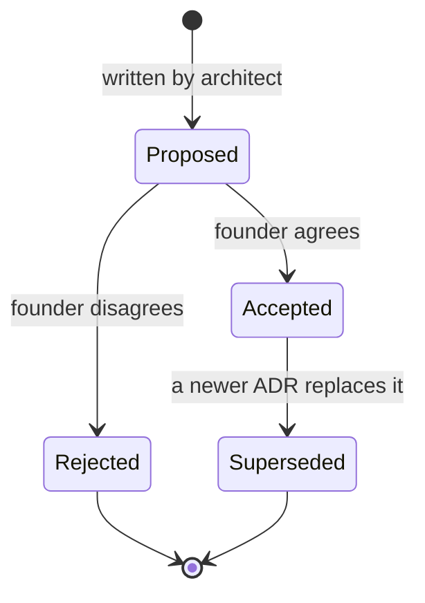

# Architecture Decision Records (ADRs)

> **Status:** Living index · **Last updated:** 2026-10-04

## TL;DR

An ADR records **one** important decision: why it was needed, which options were compared,
what we chose and what it costs us. ADRs are never deleted — a changed decision gets a new ADR
that supersedes the old one. Only the founder moves an ADR from **Proposed** to **Accepted**.

## Index

| ADR | Title | Status | From |
| --- | --- | --- | --- |
| [0001](ADR-0001-DOCUMENTATION-FIRST.md) | Documentation-first, Markdown + Mermaid in the repository | Accepted | Founder request |
| [0002](ADR-0002-LAYERED-PRODUCT-MODEL.md) | Seven-layer product model with integration axis | Accepted | Step 1 |
| [0003](ADR-0003-MODULAR-MONOLITH-DIRECTION.md) | Modular monolith as architectural direction | Accepted | Brief; Step 9 |
| [0004](ADR-0004-ORGANIZATION-MODEL.md) | Organization = separate typed structures + configurable grouping (Tenant = Organization; multi-company model) | Accepted | Step 2 |
| [0005](ADR-0005-LIFECYCLE-VS-WORKFLOW.md) | Fixed core lifecycle + configurable sub-status and approval workflow | Accepted | Step 2 |
| [0006](ADR-0006-PROCESS-AS-DOCUMENT-FLOW.md) | Process = document flow with typed links + optional anchors | Accepted | Step 2 |
| [0007](ADR-0007-IMMUTABLE-POSTED-DOCUMENTS.md) | Posted documents and ledger entries are immutable | Accepted | Step 2 |
| [0008](ADR-0008-REFERENCE-VS-SNAPSHOT.md) | Masters referenced, contractual data snapshotted | Accepted | Step 2 |
| [0009](ADR-0009-MARKET-AND-FIRST-VERTICAL.md) | Market, positioning and first vertical (Printing & Packaging, India) | Accepted | Q-01, Q-02, Q-05 |
| [0010](ADR-0010-ACCOUNTING-VIA-TALLY-FIRST.md) | GST-correct invoicing + Tally export first; native GL later | Accepted | Q-03 |
| [0011](ADR-0011-CONFIGURATION-AS-PACKAGES.md) | Year-1 configuration as version-controlled packages | Accepted | Q-04 |
| [0012](ADR-0012-VERTICAL-SLICE-ROADMAP.md) | Vertical-slice roadmap | Accepted | Q-11 |
| [0013](ADR-0013-PARTY-WITH-ROLES.md) | One Party master with roles | Accepted | Q-07 |
| [0014](ADR-0014-MODULE-OWNERSHIP.md) | Module boundaries by ownership | Accepted | Step 3 |
| [0015](ADR-0015-INTER-MODULE-COMMUNICATION.md) | Four inter-module communication patterns; contracts only | Accepted | Step 3 |
| [0016](ADR-0016-DEPENDENCY-TYPES-AND-MANIFESTS.md) | Dependency types, without-modes, module manifests | Accepted | Step 3 |
| [0017](ADR-0017-SINGLE-EDITION-YEAR-ONE.md) | Year 1 sells one edition; entitlements from day one | Accepted | Step 3 |
| [0018](ADR-0018-CUSTOMER-PRODUCT-SPECIFICATION.md) | Customer-specific product specification reused across repeat orders | Accepted | Step 4 |
| [0019](ADR-0019-WIP-BY-JOB-OPERATION.md) | WIP tracked per job operation | Accepted | Step 4 |
| [0020](ADR-0020-TOLERANCE-AND-SHORT-CLOSE.md) | Tolerance and short-close in the core lifecycle | Accepted | Step 4 |
| [0021](ADR-0021-WEIGHTED-AVERAGE-VALUATION.md) | Moving weighted-average valuation (MVP) | Accepted | Step 4 |
| [0022](ADR-0022-TALLY-EXPORT-GRANULARITY.md) | Voucher-level Tally export, export locks, books-locked date | Accepted | Step 4 |
| [0023](ADR-0023-STANDARDS-FIRST.md) | Standards-first: follow recognised industry standards | Accepted | Founder instruction |
| [0024](ADR-0024-CONFIGURATION-LAYERS-AND-STORES.md) | Layered configuration (override / extend / lock); packages + runtime settings | Accepted | Step 5 |
| [0025](ADR-0025-PACKAGE-FORMAT.md) | Package format: YAML + JSON Schema, manifest, SemVer, migrations, tests | Accepted | Step 5 |
| [0026](ADR-0026-EXTENSION-FIELDS-STORAGE.md) | Extension fields as metadata-validated JSON data | Accepted | Step 5 |
| [0027](ADR-0027-HYBRID-UI-AND-TERMINOLOGY.md) | Hybrid UI and configurable terminology | Accepted | Step 5 |
| [0028](ADR-0028-CEL-AND-DECISION-TABLES.md) | CEL conditions + decision tables; no scripting in MVP | Accepted | Step 5 |
| [0029](ADR-0029-NUMBERING.md) | Numbering series; statutory numbers gapless at posting | Accepted | Step 5 |
| [0030](ADR-0030-PACKAGE-UPGRADES.md) | Pinned package versions; staging dry-run; three-way merge | Accepted | Step 5 |
| [0031](ADR-0031-GO-LIVE-WITH-OPENING-BALANCES.md) | Go live with opening balances and open items, not history | Accepted | Step 5 |
| [0032](ADR-0032-AUTHENTICATION.md) | Authentication: library, OIDC-compatible, NIST passwords, MFA for privileged roles, shop-floor PIN | Accepted | Step 6 |
| [0033](ADR-0033-AUTHORIZATION-MODEL.md) | Authorization: scoped RBAC + CEL conditions + field security, deny by default | Accepted | Step 6 |
| [0034](ADR-0034-APPROVAL-AUTHORITY-AND-SOD.md) | Approval authority, delegation, segregation of duties | Accepted | Step 6 |
| [0035](ADR-0035-TENANT-ISOLATION.md) | Layered tenant isolation with Row-Level Security | Accepted | Step 6 |
| [0036](ADR-0036-AUDIT-AND-LOGGING.md) | Business audit trail + security log | Accepted | Step 6 |
| [0037](ADR-0037-PRIVACY-AND-ENCRYPTION.md) | Privacy (DPDP), classification, India hosting, encryption, secrets | Accepted | Step 6 |
| [0038](ADR-0038-SECURITY-BASELINE-AND-OPERATIONS.md) | OWASP ASVS L2, backups, RPO/RTO, incident response | Accepted | Step 6 |
| [0039](ADR-0039-SUPPORT-ACCESS.md) | No standing operator access; approved support access | Accepted | Step 6 |
| [0040](ADR-0040-EVENT-MODEL.md) | Event model: domain vs integration events, CloudEvents, trace correlation | Accepted | Step 7 |
| [0041](ADR-0041-OUTBOX-AND-DELIVERY.md) | Transactional outbox + Postgres job queue; idempotent consumers; no broker yet | Accepted | Step 7 |
| [0042](ADR-0042-NO-EVENT-SOURCING.md) | No event sourcing; ledgers + audit + outbox | Accepted | Step 7 |
| [0043](ADR-0043-AUTOMATION-RULES.md) | Automation rules with fixed action catalogue and loop protection | Accepted | Step 7 |
| [0044](ADR-0044-APPROVAL-WORKFLOW-ENGINE.md) | Own small approval workflow engine | Accepted | Step 7 |
| [0045](ADR-0045-NOTIFICATION-ENGINE.md) | Notification engine; MVP in-app + email; WhatsApp/SMS later | Accepted | Step 7 |
| [0046](ADR-0046-INTEGRATION-JOBS-AND-WEBHOOKS.md) | Integration jobs, circuit breaker, Standard Webhooks | Accepted | Step 7 |
| [0047](ADR-0047-POSTGRESQL-SYSTEM-OF-RECORD.md) | PostgreSQL as the single system of record | Accepted | Step 8 |
| [0048](ADR-0048-MULTI-TENANCY-LAYOUT.md) | Pooled multi-tenancy with silo / on-premise option on the same schema | Accepted | Step 8 |
| [0049](ADR-0049-DATA-MODEL-CONVENTIONS.md) | Data model conventions; document registry + typed tables | Accepted | Step 8 |
| [0050](ADR-0050-LEDGERS-VALUATION-AND-CONCURRENCY.md) | Append-only ledgers, derived balances, valuation policy, locking | Accepted | Step 8 |
| [0051](ADR-0051-REPORTING-AND-SEARCH.md) | Report datasets, read models, permission-filtered search | Accepted | Step 8 |
| [0052](ADR-0052-DATA-LIFECYCLE-MDM-AND-MIGRATIONS.md) | Retention, archiving, master-data quality, migrations, imports | Accepted | Step 8 |
| [0053](ADR-0053-LANGUAGE-AND-RUNTIME.md) | TypeScript end to end on Node.js LTS; decimal rule | Accepted | Step 9 |
| [0054](ADR-0054-BACKEND-STRUCTURE-AND-BOUNDARIES.md) | NestJS edges, framework-free domain, monorepo, enforced boundaries | Accepted | Step 9 |
| [0055](ADR-0055-DATA-ACCESS-AND-JOBS.md) | Kysely + SQL migrations; Graphile Worker | Accepted | Step 9 |
| [0056](ADR-0056-FRONTEND-STACK.md) | React + Vite PWA; Tailwind + shadcn/ui; TanStack | Accepted | Step 9 |
| [0057](ADR-0057-CONTRACTS-RULES-TEMPLATES-PDF.md) | JSON Schema contracts; OpenAPI; CEL library; LiquidJS; Chromium PDF | Accepted | Step 9 |
| [0058](ADR-0058-AUTHENTICATION-LIBRARY.md) | Better Auth (after spike) | Accepted | Step 9 |
| [0059](ADR-0059-HOSTING-AND-DEPLOYMENT.md) | AWS Mumbai (Lightsail first), Hyderabad backups, portable image, Cloudflare | Accepted | Step 9 |
| [0060](ADR-0060-ENGINEERING-PRACTICE.md) | Environments, testing, CI/CD, observability | Accepted | Step 9 |
| [0061](ADR-0061-STANDARD-PRACTICE-BASELINE.md) | Build on standard industry practice now; customise with the first customer | Accepted | Q-10 (founder decision) |
| [0062](ADR-0062-API-ARCHITECTURE.md) | REST + OpenAPI 3.1, API-first, versioning, scopes; connectors as adapters | Accepted | Step 10 |
| [0063](ADR-0063-SAAS-LIFECYCLE-AND-BILLING.md) | Tenant lifecycle, editions/add-ons/limits, manual billing first | Accepted | Step 10 |
| [0064](ADR-0064-AI-ARCHITECTURE.md) | AI as permission-scoped assistant, drafts only, from Phase 5 | Accepted | Step 10 |
| [0065](ADR-0065-ROADMAP-AND-MVP.md) | Roadmap phases, MVP scope, slice exit criteria | Accepted | Step 10 |
| [0066](ADR-0066-TECH-DEBT-POLICY.md) | Technical-debt policy | Accepted | Step 10 |
| [0067](ADR-0067-UX-ARCHITECTURE.md) | UX architecture | Accepted | Step 10 |
| [0068](ADR-0068-CEL-LIBRARY.md) | CEL library: @marcbachmann/cel-js with exact decimal type behind a RuleEngine port; fallback @bufbuild/cel | Proposed | Spike S1 |

## Lifecycle of an ADR



## Template

```markdown
# ADR-NNNN: Title

- **Status:** Proposed | Accepted | Rejected | Superseded by ADR-XXXX
- **Date:** YYYY-MM-DD
- **Discovery step:** Step N (link)

## Context
What problem forces a decision? What constraints apply?

## Options considered
| Option | Pros | Cons |

## Decision
What we choose, in one or two sentences.

## Consequences
What becomes easier, what becomes harder, what we must now do.

## What is configurable / what stays fixed
```
