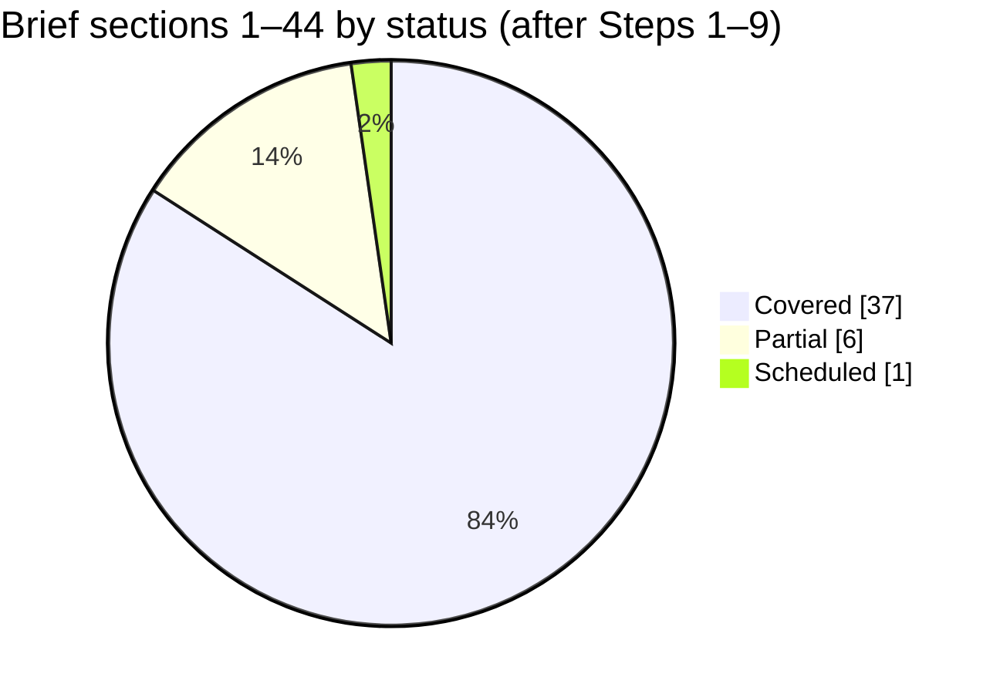

# Coverage Matrix — every part of the brief, and where it is handled

> **Status:** Living document · **Last updated:** 2026-10-03

## TL;DR

- This file maps **every section of the founder's brief** (44 sections, the 20-point solo-developer guidance and the documentation instruction) to where it is covered.
- Status meanings: ✅ **Covered** = analysed, with a recommendation · 🟡 **Partial** = concepts defined, full design pending · ⏳ **Scheduled** = not analysed yet, with the step that will do it.
- **Nothing in the brief is dropped.** Anything not yet analysed is listed with the step that owns it.
- Update this file at the end of each step.

## Summary

## A. The 44 sections of the brief

| § | Topic | Status | Where | Still to do |
| --- | --- | --- | --- | --- |
| 1 | Project vision | ✅ | [Brief §1](../00-context/PROJECT-BRIEF.md#1-vision), [Step 1 §1](../01-discovery/STEP-01-PLATFORM-DEFINITION.md#1-what-exactly-are-we-building) | — |
| 2 | Development rule: no code; list of 31 architecture areas | ✅ | [CLAUDE.md](../../CLAUDE.md); the areas are mapped to steps in this table | — |
| 3 | Core product principle (standard core + configurable behaviour) | ✅ | [Step 1 §2](../01-discovery/STEP-01-PLATFORM-DEFINITION.md#2-the-layered-product-model), ADR-0002 | — |
| 4 | Product model — module list | ✅ | [Step 3 §3–§4](../01-discovery/STEP-03-MODULE-BOUNDARIES.md#3-the-module-map) (module map, catalogue, what is not a module) | — |
| 5 | Module purchasing model (single, bundles, complete) | ✅ | [Step 3 §7, §11](../01-discovery/STEP-03-MODULE-BOUNDARIES.md#11-editions-and-the-module-purchasing-model), ADR-0016, ADR-0017 | Pricing in blueprint (billing) |
| 6 | Interconnected application architecture | ✅ | Step 2 §5; Step 3 §8; [Step 4](../01-discovery/STEP-04-PROCESS-ARCHITECTURE.md) (end-to-end flows across modules, cross-module sequences) | Validate with pilot |
| 7 | Process objects + 17 questions | ✅ | [Step 2 §5.7](../01-discovery/STEP-02-DOMAIN-MODEL.md#57-answers-to-the-briefs-7-questions) answers each question; ADR-0006 | — |
| 8 | Workflow engine (levels, parallel, delegation, escalation, SLA…) | ✅ | [Step 7A Part 1](../01-discovery/STEP-07A-WORKFLOW-AND-NOTIFICATIONS.md#part-1--approval-workflow-engine), ADR-0044 | — |
| 9 | Rule engine | ✅ | Step 2 §7.2 (rule kinds); [Step 5 §8](../01-discovery/STEP-05-CONFIGURATION-ARCHITECTURE.md#8-rules-and-the-condition-language) (CEL + decision tables), ADR-0028 | Step 7: execution engine |
| 10 | Notification engine (channels, recipients, templates, timing, escalation) | ✅ | [Step 7A Part 2](../01-discovery/STEP-07A-WORKFLOW-AND-NOTIFICATIONS.md#part-2--notification-engine), ADR-0045 | — |
| 11 | Event-driven architecture (domain events, bus, queue, webhooks, outbox, event sourcing?) | ✅ | [Step 7](../01-discovery/STEP-07-EVENTS-AND-AUTOMATION.md) — ADR-0040 … 0043, 0046 | — |
| 12 | RBAC + authorization (module/object/action/field/record/org/approval level) | ✅ | Step 2 §3; [Step 6 §5–§9](../01-discovery/STEP-06-SECURITY-ARCHITECTURE.md#5-authorization--deciding-what-you-may-do), ADR-0033, ADR-0034 | — |
| 13 | Organization structure (legal vs operational vs security vs reporting) | ✅ | [Step 2 §2](../01-discovery/STEP-02-DOMAIN-MODEL.md#2-organization-model), ADR-0004 | — |
| 14 | Multi-tenancy (shared DB / schema / DB per tenant / hybrid) | ✅ | Step 6A §2; [Step 8 §3](../01-discovery/STEP-08-DATA-ARCHITECTURE.md#3-multi-tenancy-layout), ADR-0048 | — |
| 15 | Industry configuration engine (metadata UI, template inheritance, packages) | ✅ | Step 1 §7; [Step 5](../01-discovery/STEP-05-CONFIGURATION-ARCHITECTURE.md) (layers, catalogue, metadata), [Step 5A](../01-discovery/STEP-05A-PACKAGES-UPGRADES-AND-ONBOARDING.md) (packages, Printing inventory) | Package inheritance later |
| 16 | Custom objects | ✅ | [Step 5 §12](../01-discovery/STEP-05-CONFIGURATION-ARCHITECTURE.md#12-custom-objects) (package-defined in MVP; tenant-defined later) | — |
| 17 | Integration platform | 🟡 | Step 1 §9 (ports/adapters); [Step 7 §9](../01-discovery/STEP-07-EVENTS-AND-AUTOMATION.md#9-integrations-calls-out-and-calls-in) (integration jobs, webhooks) | Blueprint: connector catalogue |
| 18 | Public API | 🟡 | REST + OpenAPI 3.1 from JSON Schemas, RFC 9457 errors, OAuth client credentials/API keys ([Step 9 §6](../01-discovery/STEP-09-TECHNICAL-ARCHITECTURE.md#6-contracts-validation-rules-templates-and-pdfs), Step 6 §4.5, Step 7 §9) | Blueprint: API catalogue, versioning policy |
| 19 | UI/UX (modern, role-aware navigation) | 🟡 | [Step 3 §9.3](../01-discovery/STEP-03-MODULE-BOUNDARIES.md#93-role-aware-navigation) (role-aware navigation = active modules ∩ permissions); risk R-11 | Dedicated UX step (to add after Step 5) |
| 20 | Document system (templates, logos, numbering, PDF layouts) | ✅ | Step 1 K6/K11, Step 2 §8; [Step 5 §9–§10](../01-discovery/STEP-05-CONFIGURATION-ARCHITECTURE.md#10-output-templates-print-email-whatsapp) (numbering, templates, branding) | Template engine choice in Step 9 |
| 21 | Auditability | ✅ | Step 2 §7.3, §10; [Step 6A §3](../01-discovery/STEP-06A-ISOLATION-AUDIT-PRIVACY-AND-OPERATIONS.md#3-audit-two-logs) (statutory audit trail, hash chain, security log), ADR-0036 | Step 8: storage/partitioning |
| 22 | Search (global, related objects) | ✅ | [Step 8A §2](../01-discovery/STEP-08A-REPORTING-SEARCH-AND-DATA-LIFECYCLE.md#2-global-search), ADR-0051 | — |
| 23 | Reporting | ✅ | [Step 8A §1](../01-discovery/STEP-08A-REPORTING-SEARCH-AND-DATA-LIFECYCLE.md#1-reporting-architecture), ADR-0051 | Analytics store later |
| 24 | AI layer (not the foundation) | ⏳ | Brief only; roadmap critique agrees "last" | Blueprint: AI architecture |
| 25 | Configuration vs customization vs extension vs core modification | ✅ | [Step 1 §8](../01-discovery/STEP-01-PLATFORM-DEFINITION.md#8-l5--l6--customer-configuration-and-customization) (5 tiers) | — |
| 26 | Billing / SaaS (trials, per-user, per-module, suspension…) | 🟡 | Step 3 §9 (entitlements, activation), §11 (editions) | Blueprint: pricing, subscriptions, suspension |
| 27 | Deployment model (SaaS, private cloud, on-prem, hybrid) | ✅ | [Step 9A §1–§2, §9](../01-discovery/STEP-09A-INFRASTRUCTURE-DEVOPS-AND-COSTS.md#1-hosting-options), ADR-0048, ADR-0059 | — |
| 28 | Initial technology direction | ✅ | [Step 9](../01-discovery/STEP-09-TECHNICAL-ARCHITECTURE.md) evaluated every candidate; ADR-0053 … 0058 | Spikes S1–S5 before implementation |
| 29 | Modular monolith vs microservices vs hybrid | ✅ | [Step 9 §2](../01-discovery/STEP-09-TECHNICAL-ARCHITECTURE.md#2-modular-monolith-vs-microservices--final-validation), ADR-0003 | — |
| 30 | Data consistency (ACID, eventual, idempotency, locking) | ✅ | Step 7 §3–§4; [Step 8 §7–§8](../01-discovery/STEP-08-DATA-ARCHITECTURE.md#8-concurrency-many-people-one-truth), ADR-0050 | — |
| 31 | Ledger concept (source of truth vs derived) | ✅ | Step 2 §11; [Step 8 §7](../01-discovery/STEP-08-DATA-ARCHITECTURE.md#7-ledgers-source-of-truth-and-derived-balances) | — |
| 32 | Master data management (ownership, versioning, approval, duplicates, lifecycle) | ✅ | Step 3 §6; [Step 8A §4](../01-discovery/STEP-08A-REPORTING-SEARCH-AND-DATA-LIFECYCLE.md#4-master-data-quality), ADR-0052 | — |
| 33 | Numbering system | ✅ | [Step 5 §9](../01-discovery/STEP-05-CONFIGURATION-ARCHITECTURE.md#9-numbering), ADR-0029 (GST rules) | — |
| 34 | Localization | ✅ | [Step 1 §6](../01-discovery/STEP-01-PLATFORM-DEFINITION.md#6-l3-localization-packs) (packs per company) | — |
| 35 | Security (MFA, encryption, secrets, rate limiting, backup, DR, OWASP) | ✅ | [Step 6](../01-discovery/STEP-06-SECURITY-ARCHITECTURE.md) + [Step 6A](../01-discovery/STEP-06A-ISOLATION-AUDIT-PRIVACY-AND-OPERATIONS.md); ADR-0032 … 0039 | — |
| 36 | Configuration-first | ✅ | Step 1 | — |
| 37 | Implementation phases — **critique and redesign** | 🟡 | [Preliminary roadmap critique](../01-discovery/PRELIM-ROADMAP-CRITIQUE.md) | Step 10: final roadmap |
| 38 | How Claude should work (roles; no code; no early framework choice) | ✅ | CLAUDE.md | — |
| 39 | Discovery method (10 points per domain + ADRs) | ✅ | [DOC-CONVENTIONS](../00-context/DOC-CONVENTIONS.md), Brief §6, ADR index | Apply to every step |
| 40 | Don't over-engineer | ✅ | CLAUDE.md, ADR-0003, Step 1 C4 | — |
| 41 | Model real business processes (event → … → audit) | ✅ | [Step 1 §1.2](../01-discovery/STEP-01-PLATFORM-DEFINITION.md#12-the-mental-model-in-one-picture) | Step 4 |
| 42 | Long-term vision: "build your company's operating system" onboarding | ✅ | [Step 5A §8–§10](../01-discovery/STEP-05A-PACKAGES-UPGRADES-AND-ONBOARDING.md#8-tenant-onboarding) (onboarding flow, go-live data, demo tenant) | Self-service wizard later |
| 43 | First task: Steps 1–10 | 🟡 | Steps 1–9 done; Step 10 (master blueprint) pending | Step 10 |
| 44 | Challenge assumptions | ✅ | [Step 1 §12](../01-discovery/STEP-01-PLATFORM-DEFINITION.md#12-assumptions-challenged) (C1–C10), Step 2 §2.1, §6.1, roadmap critique | Continue in every step |

## B. The 20-point solo-developer guidance

All 20 points are recorded one-to-one in
[Project Brief §4.1](../00-context/PROJECT-BRIEF.md#41-solo-developer-operating-guidance-from-the-founders-cost-guidance-20-points),
with the cost stages A–E.

**Where we disagree or add caution:**

| Point | Caution |
| --- | --- |
| 2 / 17 — free tiers; separate frontend host (e.g., Vercel) and backend host (e.g., Render) | Fine for development and demos. Free databases can expire or have no point-in-time backup, which is unacceptable for a paying customer's stock and invoices (Step 1 C10). Free app hosts that "sleep" give 30–60 s first loads, which is bad in a demo. Two hosts also mean two deployments plus cross-origin setup. Step 9 will check whether one host serving both is simpler. |
| 4 — "Manufacturing: CRM → Sales → … → Finance" as the first vertical | We agree with one vertical. But CRM is low-pain for printing SMEs, and native Finance fights Tally. See the [roadmap critique](../01-discovery/PRELIM-ROADMAP-CRITIQUE.md) and [Q-03](OPEN-QUESTIONS.md#q-03). |
| 20 — "capable of becoming an Odoo competitor" | Agreed, and we go further: price is not the position at all (Step 1 C1). |

## C. The documentation instruction

> "Keep documenting everything … multiple MD files to keep the context alive … less context-eating development … diagrams, flowcharts … I need to explain each and everything."

| Requirement | How it is met |
| --- | --- |
| Multiple MD files | One topic per file; see [INDEX](../INDEX.md) |
| Keep context alive | [CURRENT-STATE](../00-context/CURRENT-STATE.md) hand-off; [PROJECT-BRIEF](../00-context/PROJECT-BRIEF.md); this matrix |
| Less context-eating | TL;DR at the top of every file; CLAUDE.md tells sessions to read summaries first |
| Diagrams and flowcharts | Mermaid in every analysis document, each one checked with the Mermaid renderer |
| Able to explain everything | [GLOSSARY](../00-context/GLOSSARY.md); plain-language definitions with printing/pharma examples |

## D. Founder instructions during discovery

| Instruction | How it is met |
| --- | --- |
| "Follow the best industry standards" (2026-10-03) | [STANDARDS.md](../00-context/STANDARDS.md) register + [ADR-0023](../adr/ADR-0023-STANDARDS-FIRST.md); rule in CLAUDE.md |
| "Keep a sheet with all questions and the decisions taken" (2026-10-03) | [DECISION-LOG.csv](DECISION-LOG.csv), updated every session (rule in CLAUDE.md) |
| "Put all open questions with recommendations" (2026-10-03) | [OPEN-QUESTIONS.md](OPEN-QUESTIONS.md) + the sheet |
