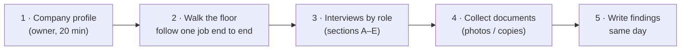

# Pilot Interview Guide — validating Step 4 with a real printing company

> **Status:** Ready to use — **during the first customer's onboarding** ([ADR-0061](../adr/ADR-0061-STANDARD-PRACTICE-BASELINE.md)) · **Last updated:** 2026-10-04
> **Purpose:** Step 4 was written without a real company ([Q-10](OPEN-QUESTIONS.md#q-10)). This guide turns its hypotheses into questions. One or two visits with a printer can confirm or correct the process design before anything is built.

## TL;DR

- Visit **one or two printing/packaging companies**. Talk to the **owner**, the **production manager**, the **store keeper** and the **accountant**, about 30–45 minutes each.
- **Collect real paper:**
  - an estimate sheet
  - a job card / job ticket
  - a PO
  - a GRN or inward register
  - a job-work challan
  - a delivery challan
  - an invoice
  - a stock register
- Ask the questions below. Each one says **what changes in our design** if the answer differs from our assumption.
- Record answers in a new file, `docs/tracking/PILOT-FINDINGS-<company>.md`. Then update Step 4 and the open questions.

---

## 0. How to run the visit

**Tip:** ask them to **show** you, not tell you. "Show me the last job you delivered — all its papers." Real documents reveal steps people forget to mention.

## Company profile

| Question | Why |
| --- | --- |
| What do you make? (cartons, labels, books, commercial print, flexible packaging) and the share of each | Confirms the product types and routes in 04C |
| How many employees, machines, shifts, sites? | Sizing; multi-site needs |
| Turnover band; how many invoices / jobs per month? | Volume; e-invoice applicability |
| Who are your customers? (pharma, FMCG, publishers…) | Tests [Q-21](OPEN-QUESTIONS.md#q-21) (pharma-packaging segment) |
| What software do you use today? (Tally, Excel, WhatsApp, an ERP?) What do you hate about it? | Pain points = our selling points |
| Who would use the system daily, and on what devices? | Phone-first scope |

## A. Order-to-Cash

| # | Question | Our assumption | If different, we change… |
| --- | --- | --- | --- |
| A1 | How do you calculate an estimate today? Can we see a sheet? | Ups, sheets + make-ready + waste %, board ₹/kg, plates, impressions, finishing, overhead | The estimate calculator (04A §3) |
| A2 | Do you quote several quantity slabs? | Yes | Estimate structure |
| A3 | What % of orders are **repeat orders**? | Majority | Product spec importance ([ADR-0018](../adr/ADR-0018-CUSTOMER-PRODUCT-SPECIFICATION.md)) |
| A4 | Do customers send a PO? Do you work against rate contracts? | PO per order; some rate contracts | SO entry, price lists |
| A5 | How does artwork approval work? How often does artwork change? | Proof → customer approval; frequent for pharma | Artwork versioning gate |
| A6 | What quantity tolerance do customers accept? | ±5–10% | Tolerance defaults ([ADR-0020](../adr/ADR-0020-TOLERANCE-AND-SHORT-CLOSE.md)) |
| A7 | Do you dispatch in parts? Invoice per dispatch? | Yes, yes | Delivery → invoice flow |
| A8 | Do you do **conversion jobs on customer-supplied board**? How often? | Sometimes | Stock ownership ([Q-16](OPEN-QUESTIONS.md#q-16)) |
| A9 | Do customers deduct TDS? Pay in advance? Typical credit days? | TDS often; advances sometimes; 30–90 days | Receipt and settlement (04A §8) |
| A10 | Do you check credit limits before accepting orders? | Informally | Credit-control approval |
| A11 | Do your pharma customers want a **COA** with each dispatch? | Pharma: yes | COA in MVP ([Q-21](OPEN-QUESTIONS.md#q-21)) |

## B. Procure-to-Pay

| # | Question | Our assumption | If different, we change… |
| --- | --- | --- | --- |
| B1 | Do you buy board **for a specific job** or for stock? | Both; mostly job-specific for special boards | PO with Job anchor |
| B2 | Reels or sheets? Do you sheet reels in-house? | Both; some sheeting in-house | Reel tracking; conversion (04D §5) |
| B3 | Who approves purchases? Is there a value limit? | Owner above a limit | PO approval defaults |
| B4 | Do you ask several vendors for rates? Formally? | Phone/WhatsApp; informal | RFQ optional |
| B5 | Do you weigh incoming reels? What if the weight differs from the invoice? | Weighbridge; debit note if short | Receiving tolerance and debit note |
| B6 | Do you test GSM / caliper on receipt? What happens to bad material? | Sometimes; return or rate cut | Incoming QC, accept-with-deviation |
| B7 | Is there a **gate entry** register? | Larger units only | Gate entry option ([Q-20](OPEN-QUESTIONS.md#q-20)) |
| B8 | Do you know which vendors are MSME? Do you track the 45-day rule? | Increasingly yes | MSME alerts |

## C. Plan-to-Produce

| # | Question | Our assumption | If different, we change… |
| --- | --- | --- | --- |
| C1 | Walk us through the operations of a typical carton / label job | Sheeting → print → coat/laminate → die-cut → fold-glue → inspect → pack | Routing templates |
| C2 | Is there a printed **job card / job ticket** that travels with the job? What's on it? | Yes | Job card design and print |
| C3 | Do operators record good / waste quantities and times today? On paper? | Paper, inconsistently | Phone job-card UX; validation strictness |
| C4 | How do you track printed sheets waiting between operations? | They don't; "the job is at lamination" | WIP by job operation ([ADR-0019](../adr/ADR-0019-WIP-BY-JOB-OPERATION.md), [Q-19](OPEN-QUESTIONS.md#q-19)) |
| C5 | Which operations do you send to **job workers**? How do you track the material? | Lamination, UV, foil, die-cut; via challan book | Job-work flow ([Q-13](OPEN-QUESTIONS.md#q-13)) |
| C6 | Do you **gang-run** several jobs on one sheet? | Labels/commercial: yes; cartons: rarely | Gang runs in or out of the MVP |
| C7 | How do you plan which job runs on which machine? | Whiteboard + experience | Simple queue board is enough |
| C8 | Do you know each job's **actual cost and profit**? Would you want to? | No, and yes | Estimate-vs-actual as the headline feature |
| C9 | What do you do with waste paper? | Sold as scrap by kg | Scrap stock and sale |
| C10 | How are plates and dies stored and reused? | Numbered racks; reused for repeats | Plate/die objects |

## D. Inventory and Quality

| # | Question | Our assumption | If different, we change… |
| --- | --- | --- | --- |
| D1 | Which stores do you have? Who issues material? | Board, ink, consumables, FG, scrap; store keeper issues | Warehouse setup |
| D2 | Do you track reels individually (number, weight)? | Yes, in a register | Reel tracking |
| D3 | How often do you count stock? How big are the differences? | Yearly; large differences | Cycle count feature priority |
| D4 | How do you value stock for your accountant? | Average or last purchase rate | Valuation ([Q-17](OPEN-QUESTIONS.md#q-17)) |
| D5 | What quality checks happen: incoming, OK sheet, final? Any written specs? | OK sheet always; others informal | Quality module scope |
| D6 | Do customers audit you? Which certifications (ISO, FSSC, pharma audits)? | Pharma-packaging: yes | Audit trail and COA importance |

## E. Returns, Corrections and Accounting

| # | Question | Our assumption | If different, we change… |
| --- | --- | --- | --- |
| E1 | How often do customers reject or return goods? What happens next? | Occasionally; credit note, reprint | Return flow |
| E2 | Who does accounting? In-house or an outside CA? Which Tally version? | Tally Prime, in-house or a CA | Export format / connector |
| E3 | Does Tally have **items and stock**, or only ledgers? | Mostly ledgers, sometimes items | Export granularity ([Q-18](OPEN-QUESTIONS.md#q-18)) |
| E4 | Would the accountant accept receipts/payments being entered in the ERP and exported? | Probably, if it saves work | [Q-14](OPEN-QUESTIONS.md#q-14) fallback |
| E5 | Do you generate e-invoices / e-way bills today? How (portal, GSP, Tally)? | Yes, via portal or Tally | India pack integration route |

## Documents to collect (checklist)

- [ ] Estimate / costing sheet
- [ ] Quotation
- [ ] Customer PO
- [ ] Job card / job ticket
- [ ] Artwork approval record
- [ ] Material requisition / issue slip
- [ ] Purchase order
- [ ] Inward register / GRN
- [ ] QC report
- [ ] Job-work challan
- [ ] Delivery challan
- [ ] Tax invoice (with e-invoice QR)
- [ ] E-way bill
- [ ] Credit note
- [ ] Stock register / reel register
- [ ] Machine-wise production log
- [ ] Any Excel the owner uses to "run the business"

**Privacy:** ask permission before taking copies or photos, and mask customer names and prices if requested. Store findings without sensitive data in the repository.
